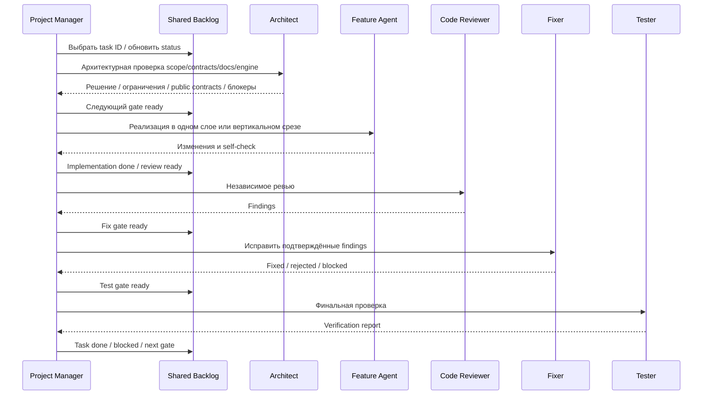

# Codex Agents — Иерархия ролей Project Wisp

Этот каталог описывает специализированные Codex-роли для Project Wisp. Цель системы ролей — не создавать бюрократию, а удерживать малый контекст каждого агента: каждый читает только релевантные документы, работает в своём слое и не тянет в задачу чужие детали.

---

## 1. Главная иерархия

Project Wisp использует простую цепочку ролей:

1. `project-manager` принимает задачу, ограничивает scope, сверяет `ROADMAP.md` и общий backlog в [.agents/tasks/README.md](../tasks/README.md), затем назначает нужного агента.
2. `architect` подключается до реализации, если меняются слои, IPC, ports, `docs/engine/*`, public contracts или provider/render/behavior boundaries.
3. Профильный агент реализует свой слой:
   - `ui-specialist` — Renderer UI, Render Engine, настройки, debug UI.
   - `electron-platform` — Main/Preload, окна, platform adapters, OS-интеграции.
   - `domain-behavior` — Character Engine, Behavior FSM, Animation FSM, quiet/sleep mode.
   - `data-memory` — SQLite, repositories, migrations, memory/settings persistence.
   - `mock-ai-provider` — `MockAIProvider`, provider DTO handling, future `ExternalAIProviderClient` boundary.
4. `code-reviewer` проводит независимое ревью изменений и не правит код.
5. `fixer` исправляет только подтверждённые замечания reviewer.
6. `tester` запускает/проектирует проверки перед закрытием задачи.

Короткое правило: **Project Manager маршрутизирует, Architect владеет контрактами, профильный агент реализует, Reviewer проверяет, Fixer чинит, Tester подтверждает.**

---

## 2. Роли и рекомендуемые модели

Названия моделей указаны как рекомендации для Codex. Если конкретная модель недоступна, выбирается ближайшая по уровню: для архитектуры и сложного ревью — самая сильная доступная, для локальных точечных правок — сбалансированная, для простых проверок документации — быстрая.

| Роль | Файл | Основная модель | Reasoning | Пишет код | Запускает тесты |
|---|---|---|---|---|---|
| Project Manager / Orchestrator | [project-manager/agent.md](project-manager/agent.md) | `gpt-5.6-terra` | `high` | Нет | Нет |
| Architect | [architect/agent.md](architect/agent.md) | `gpt-5.6-sol` | `xhigh` / `max` | Обычно нет | Обычно нет |
| UI Specialist | [ui-specialist/agent.md](ui-specialist/agent.md) | `gpt-5.6-terra` | `high` | Да, только Renderer/UI | Локально по необходимости |
| Electron Platform | [electron-platform/agent.md](electron-platform/agent.md) | `gpt-5.6-sol` | `high` / `xhigh` | Да, только Main/Preload/platform | Да |
| Domain Behavior | [domain-behavior/agent.md](domain-behavior/agent.md) | `gpt-5.6-terra` | `high` | Да, Domain/Application behavior | Да |
| Data & Memory | [data-memory/agent.md](data-memory/agent.md) | `gpt-5.6-terra` | `high` | Да, persistence only | Да |
| Mock AI Provider | [mock-ai-provider/agent.md](mock-ai-provider/agent.md) | `gpt-5.6-terra` | `medium` / `high` | Да, `MockAIProvider` / provider client boundary only | Да |
| Code Reviewer | [code-reviewer/agent.md](code-reviewer/agent.md) | `gpt-5.6-sol` | `xhigh` | Нет | Может читать результаты, не обязан запускать |
| Fixer | [fixer/agent.md](fixer/agent.md) | `gpt-5.6-terra` | `medium` / `high` | Да, только замечания reviewer | Да |
| Tester | [tester/agent.md](tester/agent.md) | `gpt-5.6-terra` | `medium` | Только тесты/тестовые данные при явной задаче | Да |

---

## 3. Правило выбора агента

1. **Новая задача или изменение roadmap/docs:** начинает `project-manager`.
2. **Новая граница между слоями, IPC contract, порт, engine contract, платформенный контракт:** сначала `architect`.
3. **Renderer-компоненты, Render Engine, SVG/sprite sheet rendering, CSS, чат, настройки UI:** `ui-specialist`.
4. **Electron Main/Preload, окна, tray, autostart, X11/Wayland, OS adapters:** `electron-platform`.
5. **Character Engine, Behavior FSM, Animation FSM, эмоции, autonomous life, quiet/sleep mode:** `domain-behavior`.
6. **SQLite, repositories, migrations, persisted settings/memory:** `data-memory`.
7. **`IAIProvider`, `MockAIProvider`, `ExternalAIProviderClient` boundary, provider DTO handling:** `mock-ai-provider`, после архитектурного контракта от `architect`.
8. **`docs/engine/*` и public engine contracts:** `architect`; implementer-агенты не меняют их без Architect review.
9. **После реализации:** `code-reviewer`.
10. **После ревью с замечаниями:** `fixer`.
11. **Перед закрытием фичи:** `tester`.

---

## 4. Границы контекста

- Агент читает `AGENTS.md`, `ARCHITECTURE.md`, актуальный фрагмент `ROADMAP.md` и только релевантные правила из `.agents/rules/`.
- Агент читает актуальную задачу и зависимости в [.agents/tasks/README.md](../tasks/README.md), если работает по roadmap/task breakdown.
- Агент не читает весь проект “на всякий случай”. Он расширяет контекст только при реальной зависимости.
- Если изменение пересекает два слоя, агент фиксирует контракт и передаёт решение `architect`, вместо того чтобы самостоятельно менять соседний слой.
- Любой агент обязан отклонять задачи, которые добавляют backend/proxy/server implementation, dev gateway в этом репозитории, прямые LLM SDK в desktop-клиенте или хранение пользовательских AI API-ключей.
- Auth/billing допускаются только как будущие client-side контракты к отдельному backend-проекту после Architect review; server-side auth/billing logic не реализуется в `project_wisp`.
- `docs/engine/*` являются источником правды для engine contracts. Implementer-агенты читают их и следуют им, но не меняют без Architect review.

---

## 5. Цикл качества

---

## 6. Review Strategy

Project Wisp использует одного общего `code-reviewer` со специализированными режимами проверки, а не отдельных постоянных reviewer-агентов для каждого feature-агента.

Specialist review modes:
- **`ui`:** Renderer isolation, Render Engine, visual state, no business logic in React.
- **`platform`:** Electron security, Preload, IPC, OS adapters, Linux X11/Wayland constraints.
- **`domain`:** Character Engine, `BehaviorIntent`, `AnimationIntent`, FSM transitions, quiet/sleep mode.
- **`data`:** SQLite, repositories, migrations, memory privacy, settings persistence.
- **`provider`:** `IAIProvider`, `ProviderResponseIntentMapper`, `MockAIProvider`, future `ExternalAIProviderClient` boundary.
- **`docs`:** `AGENTS.md`, `ROADMAP.md`, `ARCHITECTURE.md`, `.agents/**`, `docs/engine/*` consistency.

Architect review is required when public contracts, `docs/engine/*`, IPC, ports, provider boundaries, render/animation/behavior boundaries, or layer ownership change.

Tester remains separate from reviewer: reviewer identifies risks and missing coverage; tester verifies commands, scenarios and acceptance criteria.
