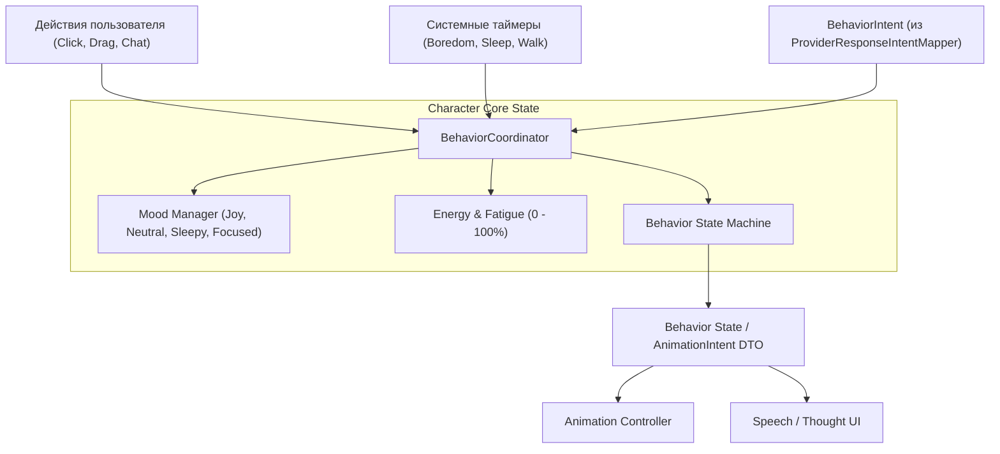

# SKILL: character-behavior — Система поведения и состояний компаньона

Руководство по моделированию поведения, эмоциональных состояний и автономных циклов персонажа.

---

## 1. Концепция поведения компаньона

Поведение персонажа строится как автономный агент со своим внутренним состоянием, на которое влияют различные источники стимулов (Inputs):

---

## 2. Эмоциональная модель (Moods & Traits)

Персонаж обладает характеристиками:
- **Базовые настроения (`Mood`):** `neutral` (нейтральное), `happy` (радостное), `curious` (любопытное), `sleepy` (сонное), `mischievous` (озорное), `confused` (озадаченное).
- **Уровень энергии (`Energy`):** От 0% до 100%. Расходуется при ходьбе и активных играх, восстанавливается во сне.
- **Внимание (`Focus`):** Направлено ли внимание компаньона на пользователя или он занят своими делами.

---

## 3. Стейт-машина поведения (Behavior State Machine)

Состояния поведения персонажа:
1. `IDLE` — спокойное присутствие на экране, фоновое дыхание, редкие моргания.
2. `WANDERING` — автономное перемещение по рабочей области экрана в поисках интересной точки.
3. `OBSERVING` — поворот головы в сторону курсора мыши пользователя.
4. `THINKING` — процесс формулирования мысли или генерации ответа на вопрос.
5. `TALKING` — отображение реплики в облачке диалога с соответствующей мимикой.
6. `DRAGGED` — персонаж удерживается курсором мыши.
7. `FALLING` — свободное падение под действием гравитации до приземления на «пол».
8. `SLEEPING` — глубокий сон при долгом отсутствии активности.

---

## 4. AI как один из источников ввода
- AI provider не управляет поведением и UI напрямую. `MockAIProvider` или будущий `ExternalAIProviderClient` возвращает semantic provider DTO по контракту `IAIProvider`.
- Application-level `ProviderResponseIntentMapper` переводит provider DTO во внутренний `BehaviorIntent`.
- `BehaviorCoordinator` принимает `BehaviorIntent` наряду с физическими событиями мыши, внутренними таймерами и memory signals.
- Если provider возвращает ошибку или отвечает с задержкой, стейт-машина поведения сохраняет целостность и переводит персонажа в безопасное состояние вроде `IDLE`, `THINKING`, `CONFUSED` или `SLEEPING` согласно `docs/engine/BEHAVIOR_INTENTS.md`.

---

## 5. Границы поведения

- Behavior layer не видит raw provider DTO.
- Behavior layer не выбирает конкретные SVG/sprite assets, frame sizes, rows/columns или renderer coordinates.
- Props вроде подушки для сна выражаются как behavior/animation intent одного Wisp, а не как новая система персонажей.
- Quiet/sleep mode и cooldown/no-spam rules принадлежат behavior layer и должны тестироваться как чистая логика.
