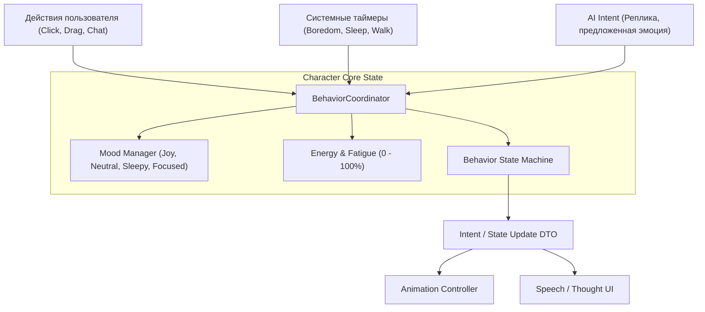

# SKILL: character-behavior — Система поведения и состояний компаньона

Руководство по моделированию поведения, эмоциональных состояний и автономных циклов персонажа.

---

## 1. Концепция поведения компаньона

Поведение персонажа строится как автономный агент со своим внутренним состоянием, на которое влияют различные источники стимулов (Inputs):

---

## 2. Эмоциональная модель (Moods & Traits)

Персонаж обладает характеристиками:
- **Базовые настроения (`Mood`):** `neutral` (нейтральное), `happy` (радостное), `curious` (любопытное), `sleepy` (сонное), `mischievous` (озорное), `confused` (озадаченное).
- **Уровень энергии (`Energy`):** От 0% до 100%. Расходуется при ходьбе и активных играх, восстанавливается во сне.
- **Внимание (`Focus`):** Направлено ли внимание компаньона на пользователя или он занят своими делами.

---

## 3. Стейт-машина поведения (Behavior State Machine)

Состояния поведения персонажа:
1. `IDLE` — спокойное присутствие на экране, фоновое дыхание, редкие моргания.
2. `WANDERING` — автономное перемещение по рабочей области экрана в поисках интересной точки.
3. `OBSERVING` — поворот головы в сторону курсора мыши пользователя.
4. `THINKING` — процесс формулирования мысли или генерации ответа на вопрос.
5. `TALKING` — отображение реплики в облачке диалога с соответствующей мимикой.
6. `DRAGGED` — персонаж удерживается курсором мыши.
7. `FALLING` — свободное падение под действием гравитации до приземления на «пол».
8. `SLEEPING` — глубокий сон при долгом отсутствии активности.

---

## 4. AI как один из источников ввода
- AI (LLM / `MockAIProvider`) выступает **лишь одним из поставщиков намерений (Intent Provider)**, наряду с физическими событиями мыши и внутренними таймерами.
- Если AI возвращает ошибку или отвечает с задержкой, стейт-машина поведения сохраняет целостность и переводит персонажа в состояние `IDLE` или `CONFUSED`.
