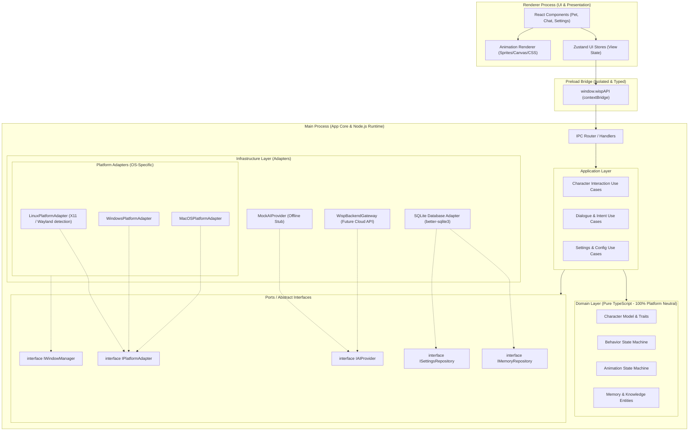

# ARCHITECTURE.md — Архитектурное руководство Project Wisp

Документ описывает структуру, компоненты, границы ответственности, потоки данных и технические стандарты настольного приложения **Project Wisp**.

---

## 1. Продуктовое видение (Product Vision)

**Project Wisp** — это интерактивный desktop AI-компаньон («shimeji нового поколения»), который:
- Постоянно или по вызову присутствует на рабочем столе в прозрачном окне без рамок (borderless, transparent, always-on-top).
- Обладает физическим поведением: ходит по панели задач/окнам, сидит, летает, спит, реагирует на курсор мыши и перетаскивание.
- Выражает эмоциональные состояния через плавную систему спрайтовых или векторных анимаций.
- Ведёт контекстные диалоги с пользователем через минималистичное всплывающее окно чата/мыслей.
- Обладает локальной памятью (факты о пользователе, предпочтения, история взаимодействий).
- Работает по принципу «готовый продукт из коробки»: нулевая настройка со стороны пользователя (никаких API-ключей, регистрации у AI-провайдеров или сложных конфигураций).
- **Кроссплатформенный:** одинаково надёжно работает в Linux (Ubuntu), Windows и macOS.

---

## 2. Текущий скоуп разработки (Current Development Scope)

На данном этапе проект разрабатывается в режиме **Desktop-First & Offline-First**:
- Полнофункциональное Electron-приложение.
- **Основная среда разработки:** Ubuntu Linux.
- Прозрачный оверлей с персонажем и плавающим окном диалога.
- Локальный стейт-машин поведения и анимаций.
- Локальная база данных SQLite для сохранения состояния, настроек и памяти.
- Интеграция AI через заглушку `MockAIProvider`, эмулирующую генерацию реплик, эмоциональных реакций и размышлений персонажа без подключения к сети.

---

## 3. Что находится вне скоупа текущего этапа (Current Non-Goals)

- ❌ Серверный бэкенд на Python / FastAPI.
- ❌ Аутентификация, учетные записи и регистрация пользователей.
- ❌ Облачная синхронизация памяти и настроек.
- ❌ Реальные сетевые вызовы к LLM (OpenAI, Anthropic, Gemini, OpenRouter).
- ❌ Подписки, платёжные шлюзы, биллинг и лицензирование.
- ❌ Автоматические облачные обновления (OTA / auto-updater пока не настроен).

---

## 4. Высокоуровневая архитектура (High-Level Architecture)

Архитектура системы строится по модульному принципу с инверсией зависимостей на границах инфраструктуры:



---

## 5. Кроссплатформенная архитектура и платформа-адаптеры

> [!IMPORTANT]
> **Принцип платформенной нейтральности:**
> Ни один слой бизнес-логики (Domain, Application) не содержит вызовов `process.platform` или специфичных ОС-флагов. Все платформенные различия вынесены в `infrastructure/platform/`.

### 5.1. Потенциально платформозависимые области
| Область | Linux (Ubuntu) | Windows | macOS |
|---|---|---|---|
| **Окна и прозрачность** | Зависит от композитора (X11 vs Wayland). `transparent: true` требует композитинга. | Нативный DWM, поддержка alpha channel. | Нативный композитор Cocoa, поддержка прозрачности. |
| **Always-On-Top** | `setAlwaysOnTop(true, 'screen-saver')` или `'floating'`. На Wayland контролируется WM. | `setAlwaysOnTop(true, 'screen-saver')`. | `setAlwaysOnTop(true, 'floating')`. |
| **Click-Through** | `setIgnoreMouseEvents(true, { forward: true })` работает стабильно в X11; в Wayland требует осторожности. | Полная поддержка `forward: true`. | Полная поддержка `forward: true`. |
| **Автозапуск** | Создание `.desktop` файла в `~/.config/autostart/`. | Запись в реестр / `app.setLoginItemSettings`. | LaunchAgents / `app.setLoginItemSettings`. |
| **Системный трей** | `libappindicator` / StatusNotifierItem (требует совместимости в GNOME). | Нативный трей в панели задач. | Меню-бар (NSStatusItem). |
| **Рабочая область экранов** | `screen.getDisplayNearestPoint`, учёт Dock/TopBar GNOME. | Учёт Taskbar (снизу/сбоку). | Учёт MenuBar и Dock. |

### 5.2. Абстракция `IPlatformAdapter`
```typescript
export interface ScreenBounds {
  x: number;
  y: number;
  width: number;
  height: number;
}

export interface IPlatformAdapter {
  getPlatformName(): 'linux' | 'win32' | 'darwin';
  getDisplayWorkArea(point: { x: number; y: number }): ScreenBounds;
  configureWindowForPlatform(window: Electron.BrowserWindow): void;
  setClickThrough(window: Electron.BrowserWindow, ignore: boolean): void;
  setAutostart(enable: boolean): Promise<void>;
  isAutostartEnabled(): Promise<boolean>;
  getAppUserDataPath(): string;
}
```

### 5.3. Специфика Linux: X11 vs Wayland
- В Linux-окружении (в частности, современных версиях Ubuntu) приложение может запускаться под **X11** или под **Wayland**.
- **Wayland-особенности:** Wayland по соображениям безопасности ограничивает абсолютное глобальное позиционирование окон и глобальный захват координат мыши.
- **Стратегия адаптации:** 
  1. `LinuxPlatformAdapter` детектирует сессию (`XDG_SESSION_TYPE === 'wayland'`).
  2. При запуске под Wayland включаются соответствующие флаги Electron/Chromium (или fallback-режимы оверлея).
  3. Не предполагается абсолютно идентичное низкоуровневое поведение без учёта возможностей используемого оконного менеджера.

---

## 6. Модель процессов Electron (Process Model)

### 6.1. Main Process (Основной процесс)
- Единый источник правды для состояния приложения, хранения данных и системных ресурсов.
- Управляет окнами через `IPlatformAdapter` и `IWindowManager`.
- Содержит бизнес-логику (Domain & Application Layers), стейт-машину персонажа, доступ к файловой системе и SQLite.
- Выполняет фоновые таймеры поведения персонажа (автономные действия, скука, сон).

### 6.2. Preload Script (Изолирующий мост)
- Запускается в изолированном контексте с `contextIsolation: true` и `nodeIntegration: false`.
- Раскрывает строго типизированный `window.wispAPI` через `contextBridge`.
- Никаких «сырых» методов `ipcRenderer.send` в Renderer не пробрасывается.

### 6.3. Renderer Process (Слой отображения)
- Среда выполнения React.
- Отвечает **только за отрисовку и визуализацию**.
- Полная изоляция от Node.js и различий операционных систем.

---

## 7. Принципы IPC (Inter-Process Communication)

1. **Типизация контрактов:** Все IPC каналы, аргументы и ответы определяются в общем модуле `shared/ipc-contracts.ts`.
2. **Request-Response через `ipcRenderer.invoke` / `ipcMain.handle`:** Для запросов с ответом.
3. **Event-Stream через `webContents.send`:** Для отправки событий от Main к Renderer.
4. **Минимализм и платформонезависимость:** Передаются плоские сериализуемые DTO. Никаких платформозависимых путей или хэндлов ОС.

---

## 8. Слои архитектуры и границы ответственности

### 8.1. UI Layer (Renderer)
- Компоненты: `PetOverlay`, `ChatBubble`, `SettingsModal`, `ContextMenu`.
- Хранилища Zustand: только визуальное состояние.

### 8.2. Application Layer (Main)
- Use Cases: `ProcessUserMessageUseCase`, `TriggerAutonomousActionUseCase`, `UpdatePetPositionUseCase`.

### 8.3. Domain Layer (Main / Pure TypeScript)
- 100% чистая логика, одинаковая для всех платформ:
  - `CharacterState`: настроение (`mood`), энергия (`energy`), активность (`activity`), фокус (`focus`).
  - `BehaviorStateMachine`: переходы состояний (`idle`, `walking`, `sitting`, `dragging`, `talking`, `thinking`, `sleeping`).
  - `AnimationStateMachine`: связка логики с анимациями.
  - `MemoryEntry`: сущности памяти.

### 8.4. Ports & Adapters (Infrastructure)
- **Порты:** `IAIProvider`, `IMemoryRepository`, `ISettingsRepository`, `IPlatformAdapter`.
- **Адаптеры:** `MockAIProvider`, `SQLiteMemoryRepository`, `LinuxPlatformAdapter`, `WindowsPlatformAdapter`, `MacOSPlatformAdapter`.

---

## 9. Система поведения и анимаций (Behavior & Animation Systems)

$$\text{Стимулы (AI / Пользователь / Таймер)} \longrightarrow \text{Behavior State Machine} \longrightarrow \text{Character State} \longrightarrow \text{Animation Controller} \longrightarrow \text{Renderer}$$

- Система анимаций полностью абстрагирована от графического API ОС.
- Рендерер отображает спрайты через стандартный HTML5 Canvas / CSS WebGL.

---

## 10. Абстракция AI: MockAIProvider $\rightarrow$ WispBackendGateway

- Интерфейс `IAIProvider` изолирован в `application/ports/`.
- Текущая реализация: `MockAIProvider` (100% автономный офлайн-режим).
- Будущая замена: `WispBackendGateway` (единая точка входа к облачному сервису).
- **Результат:** Замена провайдера не затронет ни одной строчки UI, персонажа, памяти или платформенных адаптеров.

---

## 11. Хранилище данных и пути (SQLite & Storage)

1. **Движок:** Локальный SQLite в Main-процессе (`better-sqlite3`).
2. **Кроссплатформенное разрешение путей:**
   - Путь к базе данных: `path.join(app.getPath('userData'), 'wisp_data.db')`.
   - В Linux: `~/.config/project_wisp/wisp_data.db` (или по стандарту XDG).
   - В Windows: `%APPDATA%/project_wisp/wisp_data.db`.
   - В macOS: `~/Library/Application Support/project_wisp/wisp_data.db`.
3. **Миграции:** `PRAGMA user_version`.

---

## 12. Безопасность (Security Baseline)

- `nodeIntegration: false`, `contextIsolation: true`, `sandbox: true`, `webSecurity: true`.
- Безопасное открытие URL через системный браузер (`shell.openExternal` с валидацией `https:`).
- Параметризованные SQL-запросы в SQLite.

---

## 13. Матрица изоляции зависимостей

| Модуль | Разрешённые зависимости | Запрещённые зависимости |
|---|---|---|
| **Domain** | Pure TypeScript, Math | Electron, React, SQLite, Node.js, `process.platform` |
| **Application** | Domain, Ports (интерфейсы) | React, прямое знание о конкретной ОС |
| **Renderer (UI)** | React, CSS, Zustand, `window.wispAPI` | Node.js (`fs`, `path`), Electron Main, SQLite |
| **Preload** | `electron/renderer`, `shared/` | Внутренняя бизнес-логика, утечка сырого IPC |
| **Platform Adapters** | Electron APIs, Node.js OS modules | Прямой вызов React/UI, загрязнение Domain слоя |
