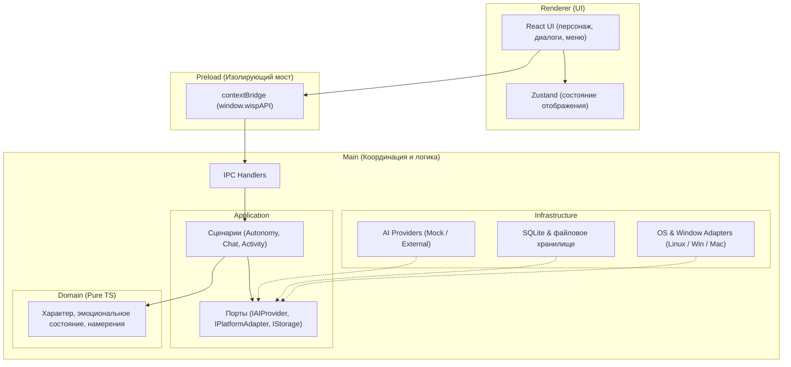

# Архитектурная карта Project Wisp

Высокоуровневый обзор архитектуры настольного AI-компаньона Project Wisp. Документ фиксирует границы ответственности подсистем и поток данных между ними.

Целевая архитектура включает desktop-клиент и backend. Runtime персонажа работает локально; сетевые функции используют сервер через адаптеры в Main. Backend владеет своими API, интеграциями и серверным хранением. Конкретные серверные функции, стек и размещение определяются в задачах интеграции.

Windows-first: первая приёмка desktop проходит на Windows; OS-specific код остаётся в platform adapters. Linux/macOS используют доступные capabilities и screen-floor fallback. Первый backend API и бюджет определены в [AI Provider contract](docs/engine/AI_PROVIDER_CONTRACT.md#desktop--backend-v1); расширенная локальная игра с курсором — в [Perception](docs/engine/PERCEPTION_ENGINE.md#61-cursor-game-v1-ограниченное-преследование) и [Activity](docs/engine/ACTIVITY_ENGINE.md#17-cursor-game-v1).

> **Единый источник правды:** обязательные инженерные правила и ограничения зафиксированы в [AGENTS.md](AGENTS.md), предметные спецификации движков — в [docs/engine/](docs/engine/README.md), текущий статус задач — в [GitHub Issues](https://github.com/zyzycode/project_wisp/issues).

---

## 1. Модель процессов Electron и IPC

Приложение разделено на изолированные процессы выполнения согласно модели безопасности Electron:



### Принципы взаимодействия
- **Renderer $\to$ Main:** через строгий типизированный мост `window.wispAPI` (`ipcRenderer.invoke` $\to$ `ipcMain.handle`). У Renderer нет прямого доступа к Node.js и системным API.
- **Main $\to$ Renderer:** доставка изменений состояния и push-событий через `webContents.send` и типизированные подписки в Renderer.
- **Контракты IPC:** DTO и интерфейсы сообщений централизованы в [`src/shared/ipc-contracts.ts`](src/shared/ipc-contracts.ts).

### Граница backend

Поток сетевого запроса: Renderer → typed preload/IPC → Main/Application use case → Application port → Infrastructure adapter в Main → backend API. Ответ проверяется и преобразуется адаптером в клиентский DTO; Renderer получает только presentation state через IPC. Серверный API имеет собственный wire contract и не определяется автоматически формой локального порта.

AI-интеграция использует `IAIProvider` как для backend, так и для прямого LLM-вызова. Backend не управляет локальными FSM, физикой и анимацией: семантические предложения проходят существующие Domain gates. При потере связи локальный runtime и ввод продолжают работать; поведение сетевой функции задаёт её контракт. Общие требования к API, данным и безопасности — в [AGENTS.md](AGENTS.md#2-архитектура-и-контракты).

---

## 2. Карта слоев (Clean Architecture)

Логика приложения разделена по принципу инверсии зависимостей: внутренние слои независимы от внешних механизмов доставки, оконных систем и библиотек.

```
[ Domain ] <--- [ Application ] <--- [ Infrastructure / Presentation ]
 (Чистый TS)     (Сценарии/Порты)      (Адаптеры ОС/БД, Electron, React)
```

1. **Domain Layer (`src/domain/`)**
   - Чистый TypeScript без внешних зависимостей.
   - Моделирует персонажа: витальные потребности (энергия, голод), настроение, эмоциональный отклик, намерения поведения (`BehaviorIntent`) и правила переходов состояний.

2. **Application Layer (`src/application/`)**
   - Прикладные сценарии: цикл автономного поведения (Autonomy Loop), обработка диалогов, реакция на события окружения.
   - Объявляет интерфейсы (**порты**) для внешних систем (`IAIProvider`, `IPlatformAdapter`, `IStorageAdapter`), не завися от их конкретной реализации.

3. **Infrastructure Layer (`src/infrastructure/`)**
   - Реализации портов: оконные адаптеры ОС (позиционирование, прозрачность, click-through, трей под Linux X11/Wayland, Windows, macOS).
   - AI-провайдеры (`MockAIProvider`, REST/LLM-клиенты).
   - Персистентность (миграции схемы, долгосрочная память, настройки в SQLite).

4. **Presentation & Runtime (`src/renderer/`, `src/preload/`, `src/main/`)**
   - `src/renderer/`: React-интерфейс, оверлей персонажа, диалоговые окна и меню.
   - `src/preload/`: безопасная проброска методов API в браузерное окно через `contextBridge`.
   - `src/main/`: управление жизненным циклом приложения Electron, окнами `BrowserWindow` и маршрутизацией IPC.

---

## 3. Навигация по спецификациям

| Область | Назначение | Документ |
| :--- | :--- | :--- |
| **Правила разработки** | Границы слоев, изоляция зависимостей, безопасность | [AGENTS.md](AGENTS.md) |
| **Character Engine** | Модель состояний, эмоции и потребности | [CHARACTER_ENGINE.md](docs/engine/CHARACTER_ENGINE.md) |
| **Autonomy & Behavior** | Выбор действий, намерения, логика циклов | [AUTONOMY_ENGINE.md](docs/engine/AUTONOMY_ENGINE.md), [BEHAVIOR_INTENTS.md](docs/engine/BEHAVIOR_INTENTS.md) |
| **Render & Animation** | Визуализация, спрайты, переходы кадров | [RENDER_ENGINE.md](docs/engine/RENDER_ENGINE.md), [ANIMATION_ENGINE.md](docs/engine/ANIMATION_ENGINE.md) |
| **AI Provider** | Контракты обмена данными с моделями и моки | [AI_PROVIDER_CONTRACT.md](docs/engine/AI_PROVIDER_CONTRACT.md) |
| **Memory & Storage** | Долгосрочная память и схема SQLite | [MEMORY_ENGINE.md](docs/engine/MEMORY_ENGINE.md) |
| **UI Spec** | Спецификация компонентов интерфейса | [UI_SPEC.md](docs/engine/UI_SPEC.md) |
| **Решения (ADR)** | Реестр принятых архитектурных решений | [docs/adr/README.md](docs/adr/README.md) |
