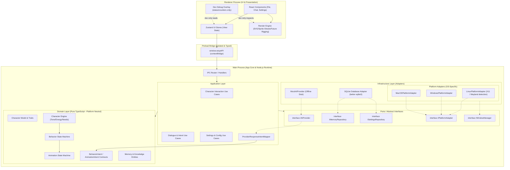

# ARCHITECTURE.md — Архитектурное руководство Project Wisp

Документ описывает структуру, компоненты, границы ответственности, потоки данных и технические стандарты настольного приложения **Project Wisp**.

---

## 1. Продуктовое видение (Product Vision)

**Project Wisp** — это интерактивный desktop AI-компаньон («shimeji нового поколения»), который:
- Постоянно или по вызову присутствует на рабочем столе в прозрачном окне без рамок (borderless, transparent, always-on-top).
- Обладает физическим поведением: ходит по панели задач/окнам, сидит, летает, спит, реагирует на курсор мыши и перетаскивание.
- На MVP является одним основным персонажем Wisp. Props (например, подушка для сна, маленькие idle-предметы и визуальные эмоции) являются частью поведения и анимаций Wisp, а не отдельной системой персонажей.
- Выражает эмоциональные состояния через плавную систему SVG/vector, sprite sheet или будущих rigged-анимаций за единым render contract.
- Ведёт контекстные диалоги с пользователем через минималистичное всплывающее окно чата/мыслей.
- Обладает локальной памятью (факты о пользователе, предпочтения, история взаимодействий).
- Работает по принципу «готовый продукт из коробки»: нулевая настройка со стороны пользователя (никаких API-ключей, регистрации у AI-провайдеров или сложных конфигураций).
- **Кроссплатформенный:** одинаково надёжно работает в Linux (Ubuntu), Windows и macOS.

---

## 2. Текущий скоуп разработки (Current Development Scope)

Репозиторий `project_wisp` разрабатывается в режиме **Desktop-First & Offline-First**:
- Полнофункциональное Electron-приложение.
- **Основная среда разработки:** Ubuntu Linux.
- Прозрачный оверлей с персонажем и плавающим окном диалога.
- Локальный стейт-машин поведения и анимаций.
- Main-owned persistence для состояния и настроек; полноценная SQLite-память реализуется отдельной фазой.
- Интеграция AI через заглушку `MockAIProvider`, эмулирующую генерацию реплик, эмоциональных реакций и размышлений персонажа без подключения к сети.
- Будущая реальная AI-интеграция может выполняться через отдельный dev/prod backend-проект, но в этом репозитории находится только desktop-клиент и его client-side контракты/адаптеры.

---

## 3. Что находится вне скоупа репозитория (Repository Non-Goals)

- ❌ Серверный backend внутри `project_wisp`: Python / FastAPI, Node-сервисы, Docker-сервисы, proxy-серверы, облачные API-шлюзы.
- ❌ Серверная auth/billing-логика: OAuth/JWT-серверы, платёжные шлюзы, тарифы, подписки, управление пользователями.
- ❌ Облачная синхронизация памяти и настроек.
- ❌ Прямые сетевые вызовы из desktop-клиента к LLM-провайдерам (OpenAI, Anthropic, Gemini, OpenRouter) и хранение пользовательских AI API-ключей.
- ❌ Dev proxy/backend в этом репозитории. Такой сервис, если понадобится, живёт в отдельном проекте и реализуется отдельно.
- ❌ Автоматические облачные обновления (OTA / auto-updater пока не настроен).

---

## 4. Высокоуровневая архитектура (High-Level Architecture)

Архитектура системы строится по модульному принципу с инверсией зависимостей на границах инфраструктуры:



---

## 5. Кроссплатформенная архитектура и платформа-адаптеры

> [!IMPORTANT]
> **Принцип платформенной нейтральности:**
> Ни один слой бизнес-логики (Domain, Application) не содержит вызовов `process.platform` или специфичных ОС-флагов. Все платформенные различия вынесены в `infrastructure/platform/`.

### 5.1. Потенциально платформозависимые области
| Область | Linux (Ubuntu) | Windows | macOS |
|---|---|---|---|
| **Окна и прозрачность** | Зависит от композитора (X11 vs Wayland). `transparent: true` требует композитинга. | Нативный DWM, поддержка alpha channel. | Нативный композитор Cocoa, поддержка прозрачности. |
| **Always-On-Top** | `setAlwaysOnTop(true, 'screen-saver')` или `'floating'`. На Wayland контролируется WM. | `setAlwaysOnTop(true, 'screen-saver')`. | `setAlwaysOnTop(true, 'floating')`. |
| **Click-Through** | `setIgnoreMouseEvents(true, { forward: true })` работает стабильно в X11; в Wayland требует осторожности. | Полная поддержка `forward: true`. | Полная поддержка `forward: true`. |
| **Автозапуск** | Создание `.desktop` файла в `~/.config/autostart/`. | Запись в реестр / `app.setLoginItemSettings`. | LaunchAgents / `app.setLoginItemSettings`. |
| **Системный трей** | `libappindicator` / StatusNotifierItem (требует совместимости в GNOME). | Нативный трей в панели задач. | Меню-бар (NSStatusItem). |
| **Рабочая область экранов** | `screen.getDisplayNearestPoint`, учёт Dock/TopBar GNOME. | Учёт Taskbar (снизу/сбоку). | Учёт MenuBar и Dock. |

### 5.2. Абстракция `IPlatformAdapter`
```typescript
export interface ScreenBounds {
  x: number;
  y: number;
  width: number;
  height: number;
}

export interface IPlatformAdapter {
  getPlatformName(): 'linux' | 'win32' | 'darwin';
  getDisplayWorkArea(point: { x: number; y: number }): ScreenBounds;
  configureWindowForPlatform(window: Electron.BrowserWindow): void;
  setClickThrough(window: Electron.BrowserWindow, ignore: boolean): void;
  setAutostart(enable: boolean): Promise<void>;
  isAutostartEnabled(): Promise<boolean>;
  getAppUserDataPath(): string;
}
```

### 5.3. Специфика Linux: X11 vs Wayland
- В Linux-окружении (в частности, современных версиях Ubuntu) приложение может запускаться под **X11** или под **Wayland**.
- **Wayland-особенности:** Wayland по соображениям безопасности ограничивает абсолютное глобальное позиционирование окон и глобальный захват координат мыши.
- **Стратегия адаптации:**
  1. `LinuxPlatformAdapter` детектирует сессию (`XDG_SESSION_TYPE === 'wayland'`).
  2. При запуске под Wayland включаются соответствующие флаги Electron/Chromium (или fallback-режимы оверлея).
  3. Не предполагается абсолютно идентичное низкоуровневое поведение без учёта возможностей используемого оконного менеджера.

---

## 6. Модель процессов Electron (Process Model)

### 6.1. Main Process (Основной процесс)
- Единый источник правды для состояния приложения, хранения данных и системных ресурсов.
- Управляет окнами через `IPlatformAdapter` и `IWindowManager`.
- Содержит бизнес-логику (Domain & Application Layers), стейт-машину персонажа, доступ к файловой системе и SQLite.
- Выполняет фоновые таймеры поведения персонажа (автономные действия, скука, сон).

### 6.2. Preload Script (Изолирующий мост)
- Запускается в изолированном контексте с `contextIsolation: true` и `nodeIntegration: false`.
- Раскрывает строго типизированный `window.wispAPI` через `contextBridge`.
- Никаких «сырых» методов `ipcRenderer.send` в Renderer не пробрасывается.

### 6.3. Renderer Process (Слой отображения)
- Среда выполнения React.
- Отвечает **только за отрисовку и визуализацию**.
- Полная изоляция от Node.js и различий операционных систем.

---

## 7. Принципы IPC (Inter-Process Communication)

1. **Типизация контрактов:** Все IPC каналы, аргументы и ответы определяются в общем модуле `shared/ipc-contracts.ts`.
2. **Request-Response через `ipcRenderer.invoke` / `ipcMain.handle`:** Для запросов с ответом.
3. **Event-Stream через `webContents.send`:** Для отправки событий от Main к Renderer.
4. **Минимализм и платформонезависимость:** Передаются плоские сериализуемые DTO. Никаких платформозависимых путей или хэндлов ОС.

### 7.1. Семейства IPC-каналов
- **User input commands:** отправка сообщения, drag/click/double-click/right-click intent, команды открытия/закрытия UI.
- **Character state stream:** synthesized emotional tone, energy, activity, focus, needs, relationship summary, текущий behavior state.
- **Presentation state stream:** animation intent, render props, speech/thought bubble state, scale/theme, prop visibility.
- **Settings commands:** чтение/обновление настроек поведения, внешности, quiet/sleep mode и dev/debug toggles.
- **Memory commands:** очистка памяти, получение краткого статуса памяти. Ручное редактирование отдельных memory entries не предоставляется.
- **Debug-only commands:** доступны только в dev-режиме и возвращают counters/status, а не приватные факты памяти целиком.

---

## 8. Слои архитектуры и границы ответственности

### 8.1. UI Layer (Renderer)
- Компоненты: `PetOverlay`, `SpeechBubble`, `ChatInput`, `SettingsModal`, `ContextMenu`, dev-only `DebugOverlay`.
- Хранилища Zustand: только визуальное состояние.
- Render Engine отображает presentation-ready состояние персонажа: SVG pose, sprite sheet frame, future rig pose, props, scale, theme, hitbox/debug bounds.
- Render Engine **не является game engine**: он не считает физику, потребности, приоритеты поведения, cooldowns, quiet/sleep rules или AI-ответы.
- Renderer не вычисляет `SynthesizedEmotionalTone`, поведение, потребности, память или AI-ответы.

### 8.2. Application Layer (Main)
- Use Cases: `ProcessUserMessageUseCase`, `TriggerAutonomousActionUseCase`, `UpdatePetPositionUseCase`, `UpdateSettingsUseCase`.
- Маппинг provider-ответа в `BehaviorIntent` выполняется в Application layer. Сырые DTO `MockAIProvider` или будущего `ExternalAIProviderClient` не попадают в Domain.
- `ProviderResponseIntentMapper` — обязательный Application component, а не отдельный архитектурный слой. Он переводит provider/backend/mock response DTO во внутренний `BehaviorIntent`.
- Mapper не принимает окончательное решение о поведении персонажа: cooldowns, quiet/sleep mode, drag priority, energy и возможность выполнить действие решает `CharacterEngine`.
- Application слой оркестрирует порты (`IAIProvider`, repositories, platform adapters), не раскрывая конкретные adapters в UI.
- Application передаёт в Domain только внутренние типы проекта: `BehaviorIntent`, `AnimationIntent`, `CharacterState`, `MemoryEntry`, settings DTO.

### 8.3. Domain Layer (Main / Pure TypeScript)
- Полностью чистая логика, одинаковая для всех платформ:
  - `CharacterState`: синтезированный эмоциональный тон (`synthesizedTone`), энергия (`energy`), активность (`activity`), фокус (`focus`), потребности (`needs`), черты (`traits`).
  - `CharacterEngine`: правила характера, внутренних стимулов, quiet/sleep mode и выбора автономных действий.
  - `BehaviorStateMachine`: переходы состояний (`idle`, `walking`, `sitting`, `dragging`, `talking`, `thinking`, `sleeping`).
  - `BehaviorIntent`: семантические намерения поведения (`respond`, `think`, `react_happy`, `react_confused`, `play`, `sleep`, `wake`, `drag`, `land`, `wander`, `idle`, `quiet`). Generic `react` не является public intent kind.
  - `AnimationStateMachine`: связка поведения с анимационными намерениями.
  - `AnimationIntent`: семантические визуальные запросы (`idle_blink`, `thinking_loop`, `talking`, `happy_reaction`, `confused_reaction`, `sleep_start`, `sleep_loop`, `wake_up`, `dragged`, `land`, `walk`, `settle`).
  - `MemoryEntry`: сущности памяти.
- Domain может знать, что Wisp использует prop вроде `pillow`, но не знает путь к asset-файлу, sprite sheet layout или CSS.

### 8.4. Ports & Adapters (Infrastructure)
- **Порты:** `IAIProvider`, `IMemoryRepository`, `ISettingsRepository`, `IPlatformAdapter`.
- **Адаптеры текущего репозитория:** `MockAIProvider`, `SQLiteMemoryRepository`, `LinuxPlatformAdapter`, `WindowsPlatformAdapter`, `MacOSPlatformAdapter`.
- **Будущие client-side адаптеры:** допускаются только как потребители внешнего backend-контракта. Рекомендуемое нейтральное имя: `ExternalAIProviderClient`. Backend/proxy/server implementation не создаётся в `project_wisp`.

### 8.5. Settings Ownership
- UI настроек живёт в Renderer и отправляет только typed commands через `window.wispAPI`.
- Источник правды для настроек живёт в Main/Application.
- Персистентность настроек реализуется через `ISettingsRepository`.
- Настройки поведения и внешности реализуются первыми.
- OS-интеграции (`autostart`, `always-on-top`, `click-through`) идут через `IPlatformAdapter` / `IWindowManager` и не попадают в Domain или Renderer напрямую.

---

## 9. Система поведения и анимаций (Behavior & Animation Systems)

$$\text{Стимулы (Provider / Пользователь / Таймер / Память)} \longrightarrow \text{BehaviorIntent} \longrightarrow \text{Character Engine} \longrightarrow \text{AnimationIntent} \longrightarrow \text{Animation Controller} \longrightarrow \text{Render Engine}$$

- `IAIProvider` или будущий внешний provider-клиент возвращает семантический результат: текст, suggested tone, confidence, suggested behavior intent. Он не управляет React, DOM, CSS, asset paths или sprite sheet frames.
- `ProviderResponseIntentMapper` переводит provider response DTO во внутренний `BehaviorIntent`.
- `CharacterEngine` принимает стимулы и решает, что делает один основной Wisp: отвечает, гуляет, спит, достаёт prop, реагирует, уходит в quiet/sleep mode.
- `AnimationStateMachine` переводит поведение в `AnimationIntent` с requested/default metadata для приоритета, прерываемости и loop mode; resolved policy применяет Animation Controller.
- `Render Engine` отображает `AnimationIntent` через общий render contract. SVG остаётся текущим рабочим форматом, sprite sheets — целевой ближайший формат для богатых анимаций, future rigging допускается позже без изменения Domain.
- Подробности sprite sheet нарезки, frame sizes, rows/columns, concrete asset names и geometry принадлежат будущему `docs/engine/RENDER_ENGINE.md`; до его создания агенты ориентируются на текущий renderer-код и явно назначенную задачу. `docs/engine/ANIMATION_ENGINE.md` описывает semantic animation intents, priority/interrupt policy и clip-level expectations без frame-level asset details.

---

## 10. Абстракция AI и внешний backend-контракт

- Интерфейс `IAIProvider` изолирован в `application/ports/`.
- Текущая реализация: `MockAIProvider` (полностью автономный офлайн-режим).
- Текущая задача клиента — делать вид, что AI уже доступен: thinking-состояния, локальные ответы, эмоции, behavior intents.
- Будущий dev/prod backend живёт в отдельном репозитории и реализуется другой командой/людьми.
- В `project_wisp` позже допускается только client-side adapter к готовому внешнему контракту. Рекомендуемое имя такого адаптера: `ExternalAIProviderClient`. Такой adapter не хранит пользовательские AI API-ключи и не содержит backend/proxy/server implementation.
- Прямые SDK OpenAI/Anthropic/Gemini/OpenRouter в desktop-клиенте запрещены.
- **Результат:** Замена `MockAIProvider` на client-side adapter к внешнему backend-контракту не затронет UI, character engine, memory и platform adapters.

---

## 10.1. Документы движков

Подробные спецификации движков живут в `docs/engine/` и создаются отдельными задачами Architect перед реализацией соответствующих фаз:
- `docs/engine/AI_PROVIDER_CONTRACT.md` — DTO provider-ответов, errors, latency/thinking, streaming/non-streaming и запрет auth/billing fields в desktop provider DTO.
- `docs/engine/CHARACTER_ENGINE.md` — traits, `SynthesizedEmotionalTone`, energy, needs, behavior intents, quiet/sleep mode.
- `docs/engine/ANIMATION_ENGINE.md` — animation intents, requested/default priority metadata, interrupt rules, fallback и clip-level expectations без sprite sheet slicing details.
- `docs/engine/RENDER_ENGINE.md` — planned contract для sprite sheet layout, render props, layers, props, hitboxes, anchors, themes, debug overlay.
- Engine contracts изменяет Architect. Implementer-агенты не меняют `docs/engine/*` и связанные public contracts без Architect review.

---

## 11. Хранилище данных и пути (SQLite & Storage)

Этот раздел описывает target architecture для persistence и памяти. Полноценная SQLite-память (`chat history`, user facts, relationship state, clear memory) запланирована для Phase 14; до этого задачи используют только явно реализованные Main-owned persistence pieces.

1. **Движок:** Локальный SQLite в Main-процессе (`better-sqlite3`).
2. **Кроссплатформенное разрешение путей:**
   - Путь к базе данных: `path.join(app.getPath('userData'), 'wisp_data.db')`.
   - В Linux: `~/.config/project_wisp/wisp_data.db` (или по стандарту XDG).
   - В Windows: `%APPDATA%/project_wisp/wisp_data.db`.
   - В macOS: `~/Library/Application Support/project_wisp/wisp_data.db`.
3. **Миграции:** `PRAGMA user_version`.
4. **Память персонажа:** история сообщений, факты о пользователе, relationship state, настройки поведения и внешности.
5. **Контроль пользователя:** обязательна возможность очистить память. Ручное редактирование отдельных memory entries не является целью `project_wisp`, потому что память считается внутренним состоянием агента.
6. **Приватность памяти:** память хранится локально, не синхронизируется с облаком и не отправляется во внешний backend без отдельного будущего контракта и явного продуктового решения.

---

## 12. Безопасность (Security Baseline)

- `nodeIntegration: false`, `contextIsolation: true`, `sandbox: true`, `webSecurity: true`.
- Безопасное открытие URL через системный браузер (`shell.openExternal` с валидацией `https:`).
- Параметризованные SQL-запросы в SQLite.
- Пользовательские AI API-ключи не хранятся в desktop-клиенте.
- Серверная auth/billing логика не реализуется в `project_wisp`. В будущем desktop-клиент может только потреблять готовый auth/billing-контракт внешнего backend-проекта через типизированный client-side adapter.
- Dev/debug overlay по умолчанию показывает только counters/status: текущий behavior state, animation state, provider status, memory counts, fps/perf counters. Приватные memory facts не отображаются в production и не раскрываются debug UI без отдельного dev-only решения.

---

## 13. Матрица изоляции зависимостей

| Модуль | Разрешённые зависимости | Запрещённые зависимости |
|---|---|---|
| **Domain** | Pure TypeScript, Math | Electron, React, SQLite, Node.js, `process.platform` |
| **Application** | Domain, Ports (интерфейсы) | React, прямое знание о конкретной ОС |
| **Renderer (UI)** | React, CSS, Zustand, `window.wispAPI` | Node.js (`fs`, `path`), Electron Main, SQLite |
| **Render Engine** | Render props, sprite sheets, SVG fallback, CSS/Canvas/Web APIs | Behavior rules, provider-specific payloads, SQLite, Node.js |
| **Preload** | `electron/renderer`, `shared/` | Внутренняя бизнес-логика, утечка сырого IPC |
| **Platform Adapters** | Electron APIs, Node.js OS modules | Прямой вызов React/UI, загрязнение Domain слоя |
| **AI Provider Adapters** | `IAIProvider` DTO, local mock data, future external backend client contract | React/DOM control, asset selection, direct LLM SDKs in desktop, backend/proxy/server implementation |
