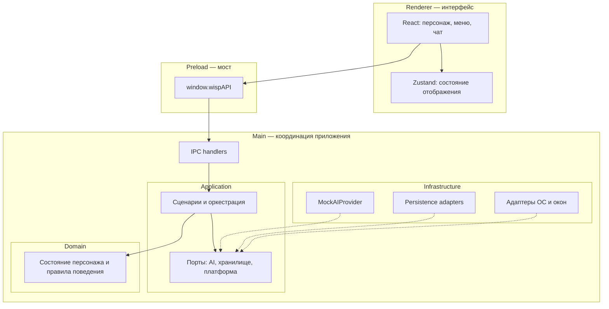

# ARCHITECTURE.md — Как устроен Project Wisp

Это обзор для человека, который знакомится с устройством приложения: зачем нужны слои, как взаимодействуют процессы Electron и где искать технические подробности. Схемы упрощают устройство системы и не заменяют контракты или описание текущей реализации.

Обязательные инженерные правила находятся в [.agents/rules/](.agents/rules/), предметные контракты — в [docs/engine/](docs/engine/README.md). Этот обзор не вводит дополнительных требований и не переопределяет эти источники. Если объяснение расходится с ними, исправляется обзор; противоречия между самими техническими источниками рассматривает архитектор.

Агенты не читают этот файл по умолчанию: для работы достаточно инструкции роли, назначенной карточки, правил затронутого слоя и нужных разделов контракта. Обзор нужен агенту только при явно поставленной задаче прочитать, проверить или изменить сам обзор.

Общий навигатор — [docs/README.md](docs/README.md). Статусы реализации и последовательность работ — в [ROADMAP.md](ROADMAP.md) и [GitHub Issues](https://github.com/zyzycode/project_wisp/issues); наличие компонента на схеме не означает, что соответствующая фаза уже завершена.

## 1. Продуктовое видение (Product Vision)

Project Wisp — desktop AI-компаньон: один персонаж живёт на рабочем столе, двигается, реагирует на пользователя и общается. Его видимое поведение складывается из нескольких частей: внутреннего состояния, выбора действия, движения, анимации и интерфейса.

Архитектура помогает развивать эти части независимо. Изменение меню не должно требовать переписывания характера персонажа, а новый способ рисовать Wisp — изменения модели его памяти. Продуктовые ограничения и обещание работы без настройки AI пользователем зафиксированы в [AGENTS.md](AGENTS.md).

## 2. Текущий скоуп разработки (Current Development Scope)

Проект развивается как desktop-first и offline-first приложение для Linux, Windows и macOS. Базовая среда разработки — Ubuntu. Electron предоставляет настольное окружение, React — интерфейс, а чистый TypeScript используется для правил поведения.

Локальный `MockAIProvider` позволяет развивать диалоговый цикл без внешнего сервиса. Память и настройки развиваются отдельными этапами: их целевой контракт и фактическая готовность — разные вещи. Актуальный объём ближайшей работы определяется [roadmap](ROADMAP.md) и конкретной карточкой, а не этим обзором.

## 3. Что находится вне скоупа репозитория (Repository Non-Goals)

Этот репозиторий посвящён настольному клиенту. Возможная внешняя AI-интеграция рассматривается со стороны клиентского контракта; устройство серверного продукта здесь не проектируется.

Полный список ограничений — в [AGENTS.md](AGENTS.md). Возможности вроде облачной синхронизации или автоматического обновления приложения нельзя считать реализованными по общей архитектурной схеме; планы выпуска и развития находятся в [ROADMAP.md](ROADMAP.md).

## 4. Высокоуровневая архитектура (High-Level Architecture)

Clean Architecture здесь разделяет правила персонажа и механизмы их выполнения. Domain описывает поведение, Application связывает действия в сценарии, а порты позволяют подключать инфраструктуру через согласованные интерфейсы.

На схеме сплошные стрелки показывают путь вызова из интерфейса, пунктир — реализацию портов адаптерами. Обратная доставка состояния в UI описана ниже, в разделе IPC. Это не схема разрешённых импортов: точные границы определяют [архитектурные правила](.agents/rules/10-architecture.md).

## 5. Кроссплатформенная архитектура и платформа-адаптеры

Для пользователя перемещение Wisp выглядит одинаковой задачей на разных ОС. Для приложения оно зависит от оконной системы, рабочей области экрана и доступных возможностей. Адаптеры отделяют эти различия от решения персонажа двигаться.

### 5.1. Потенциально платформозависимые области

Прозрачность окна, положение поверх других окон, прокликивание, трей, автозапуск и определение рабочей области зависят от окружения. Поэтому общее описание поведения не обещает одинакового низкоуровневого результата на всех платформах.

Технические требования к этим областям собраны в [70-cross-platform.md](.agents/rules/70-cross-platform.md); требования безопасности окна — в [30-electron.md](.agents/rules/30-electron.md).

### 5.2. Абстракция `IPlatformAdapter`

Порт описывает доступную приложению операцию, адаптер выполняет её средствами окружения. Такой подход позволяет обсуждать сценарий на уровне приложения, не перечисляя в нём особенности каждой ОС.

Правило размещения интерфейсов находится в [10-architecture.md](.agents/rules/10-architecture.md). Текущий интерфейс платформы доступен в [коде порта](src/application/ports/platform-adapter.interface.ts); его сигнатуры здесь не копируются.

### 5.3. Специфика Linux: X11 vs Wayland

На Linux имеет значение не только название ОС, но и тип графической сессии. Возможности глобального позиционирования и наблюдения за курсором могут различаться. Это объясняет наличие адаптеров и fallback-поведения; конкретные требования к X11 и Wayland приведены в [платформенных правилах](.agents/rules/70-cross-platform.md).

## 6. Модель процессов Electron (Process Model)

Процессы и архитектурные слои — разные способы описать приложение. Процесс задаёт окружение выполнения, слой — ответственность кода. Например, Main объединяет Application, Domain и инфраструктуру, но это не делает их одним слоем.

### 6.1. Main Process (Основной процесс)

Main координирует приложение: принимает ввод из UI, запускает сценарии и связывает состояние персонажа с окнами и хранением данных. Благодаря этому интерфейс получает результат работы приложения, а не собирает его самостоятельно из платформенных и доменных деталей.

### 6.2. Preload Script (Изолирующий мост)

Preload предоставляет интерфейсу небольшой набор методов `window.wispAPI`. Для React-компонента это точка обращения к приложению; детали доставки запроса остаются за мостом. Требования к изоляции и экспорту методов находятся в [Electron rules](.agents/rules/30-electron.md), реализация — в [preload](src/preload/index.ts).

### 6.3. Renderer Process (Слой отображения)

Renderer превращает полученное состояние в видимого персонажа, меню и диалоговые элементы. Здесь также живут локальные состояния интерфейса: например, введённый текст или раскрытое меню. Разделение UI-состояния и состояния приложения описано в [50-state-and-data.md](.agents/rules/50-state-and-data.md), особенности компонентов — в [40-react-ui.md](.agents/rules/40-react-ui.md).

## 7. Принципы IPC (Inter-Process Communication)

IPC связывает процессы сообщениями. В одном направлении пользовательский ввод превращается в запрос к Main; в другом обновлённое состояние возвращается в Renderer. Запрос с ответом и подписка на изменения решают разные задачи: первый завершает конкретную операцию, вторая поддерживает отображение в актуальном состоянии.

В Electron для запросов используются пары `invoke` / `handle`, для событий из Main — `webContents.send`. Это объяснение механизма, а не перечень доступных методов Wisp. Реализованные DTO и мост определены в [src/shared/ipc-contracts.ts](src/shared/ipc-contracts.ts), требования к безопасному preload — в [30-electron.md](.agents/rules/30-electron.md), сериализации — в [50-state-and-data.md](.agents/rules/50-state-and-data.md).

### 7.1. Семейства IPC-каналов

По назначению можно различать пользовательский ввод, обновления состояния отображения и диагностические запросы. Контракты памяти и настроек добавляют свои сценарии по мере реализации. Это группировка для понимания, а не объявление новых каналов: состав доступного API проверяется по общим типам, а целевые сценарии — по профильным контрактам.

## 8. Слои архитектуры и границы ответственности

Следующие описания поясняют роли слоёв. Правила зависимостей, размещения портов и изоляции задаёт [10-architecture.md](.agents/rules/10-architecture.md).

### 8.1. UI Layer (Renderer)

UI отвечает на вопрос «что сейчас показать пользователю». Для него важны состояние отображения и события взаимодействия. Выбор визуального ресурса и композиция персонажа раскрываются в [Render Engine](docs/engine/RENDER_ENGINE.md), приёмы разработки интерфейса — в [React rules](.agents/rules/40-react-ui.md).

### 8.2. Application Layer (Main)

Application связывает части системы в пользовательские сценарии. Например, ответ провайдера проходит через mapper и становится внутренним предложением поведения, которое рассматривается с учётом состояния персонажа. Эта последовательность позволяет отделить получение ответа от решения, как Wisp на него отреагирует. Граница mapper-а описана в [AI Provider contract](docs/engine/AI_PROVIDER_CONTRACT.md).

### 8.3. Domain Layer (Main / Pure TypeScript)

Domain описывает самого персонажа: потребности, отношения, настроение и правила поведения. Семантическое намерение выражает смысл действия; визуальное представление этого смысла рассматривается следующим этапом. Модель состояния находится в [Character Engine](docs/engine/CHARACTER_ENGINE.md), намерения — в [BehaviorIntent](docs/engine/BEHAVIOR_INTENTS.md), а порядок автономного выбора — в [Autonomy Engine](docs/engine/AUTONOMY_ENGINE.md).

### 8.4. Ports & Adapters (Infrastructure)

Порты задают точки взаимодействия сценариев с внешними для них механизмами. Адаптеры предоставляют конкретную реализацию: локальный AI mock, работу с данными или оконной системой. Поэтому обсуждение нового механизма начинается с существующей границы, а не с передачи его деталей через все слои. Точные правила — в [10-architecture.md](.agents/rules/10-architecture.md).

### 8.5. Settings Ownership

Панель настроек и сами настройки выполняют разные роли: панель отображает значения и собирает ввод, Application координирует применение, а persistence сохраняет данные. Настройки, связанные с ОС, затрагивают платформенные адаптеры. План развития этой области находится в [ROADMAP.md](ROADMAP.md), правила состояния — в [50-state-and-data.md](.agents/rules/50-state-and-data.md); этот раздел не определяет DTO настроек.

## 9. Система поведения и анимаций (Behavior & Animation Systems)

Видимая реакция Wisp — результат нескольких решений. Сначала учитывается состояние персонажа и выбирается действие, затем анимационная система определяет его визуальное выражение, после чего ресурсы превращаются в изображение. Движение и взаимодействие с рабочим столом дополняют этот процесс.

Разделение удобно на примере сна: решение отдыхать, переход анимации и выбор доступных кадров относятся к разным частям системы. Точные условия и взаимодействия определяются контрактами, а не этим примером.

Связанные источники: [Character Engine](docs/engine/CHARACTER_ENGINE.md), [BehaviorIntent](docs/engine/BEHAVIOR_INTENTS.md), [Autonomy Engine](docs/engine/AUTONOMY_ENGINE.md), [Activity Engine](docs/engine/ACTIVITY_ENGINE.md), [Motion Engine](docs/engine/MOTION_ENGINE.md), [Perception Engine](docs/engine/PERCEPTION_ENGINE.md), [Animation Engine](docs/engine/ANIMATION_ENGINE.md) и [Render Engine](docs/engine/RENDER_ENGINE.md). Старый путь [SHIMEJI_SPEC.md](docs/engine/SHIMEJI_SPEC.md) сохранён только как compatibility index.

## 10. Абстракция AI и внешний backend-контракт

`IAIProvider` позволяет обсуждать результат диалога отдельно от способа его получения. В текущем offline-сценарии эту роль выполняет `MockAIProvider`. Возможный будущий клиент внешнего сервиса рассматривается за той же границей, чтобы детали сервиса не определяли устройство интерфейса и персонажа.

Состав запросов, ответов и правила их преобразования описаны в [AI_PROVIDER_CONTRACT.md](docs/engine/AI_PROVIDER_CONTRACT.md). Ограничения репозитория находятся в [AGENTS.md](AGENTS.md); обзор не расширяет разрешённый scope интеграции.

## 11. Документы движков

Документы в `docs/engine/` раскрывают отдельные предметные области: состояние персонажа, поведение, движение, анимации, визуализацию, память и AI. Их удобно читать по вопросу, который требуется решить, а не подряд.

Выбрать источник помогает [общий навигатор](docs/README.md); локальный указатель находится в [docs/engine/README.md](docs/engine/README.md), причины решений — в [ADR index](docs/adr/README.md). Принятый контракт UI/Renderer находится в [UI_SPEC.md](docs/engine/UI_SPEC.md). Порядок изменения контрактов установлен [архитектурными правилами](.agents/rules/10-architecture.md).

## 12. Хранилище данных и пути (SQLite & Storage)

Локальная память позволяет сохранять контекст между запусками. При этом UI, модель памяти и механизм хранения решают разные задачи: интерфейс показывает доступные действия, контракт задаёт содержание данных, инфраструктура отвечает за запись и восстановление.

Целевая схема SQLite, миграции, DTO и очистка памяти описаны в [MEMORY_ENGINE.md](docs/engine/MEMORY_ENGINE.md). Общие правила persistence находятся в [50-state-and-data.md](.agents/rules/50-state-and-data.md), системные пути — в [70-cross-platform.md](.agents/rules/70-cross-platform.md). Имя файла базы и конкретные пути не задаются этим обзором. Готовность persistence отслеживается в [ROADMAP.md](ROADMAP.md).

## 13. Безопасность (Security Baseline)

Изоляция процессов позволяет ограничить последствия ошибки в интерфейсе: доступ к системным возможностям проходит через контролируемую границу. Отдельное внимание требуется локальным данным, поскольку удобство отладки не должно превращаться в случайное раскрытие памяти пользователя.

Настройки безопасности окна, preload и навигации определяет [30-electron.md](.agents/rules/30-electron.md). Правила доступа к данным и их очистки находятся в [контракте памяти](docs/engine/MEMORY_ENGINE.md). Флаги безопасности и списки запретов здесь не дублируются.

## 14. Матрица изоляции зависимостей

Актуальные ограничения зависимостей находятся в [10-architecture.md](.agents/rules/10-architecture.md). Для отдельных областей они дополняются [Electron rules](.agents/rules/30-electron.md), [правилами платформы](.agents/rules/70-cross-platform.md) и соответствующим [engine contract](docs/engine/README.md).

Отдельная матрица в человеческом обзоре не поддерживается: её ручная синхронизация создавала бы вторую версию технических правил.
