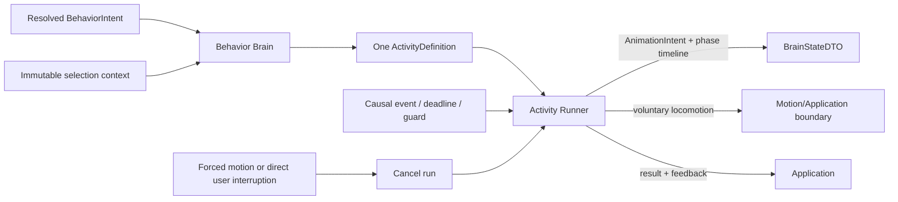

# Контракт Activity Engine

`ACTIVITY_ENGINE.md` — source of truth для Activity definitions, выбора Activity внутри resolved behavior, lifecycle одного run, chains, guards, cooldown и repetition.

Activity Engine не принимает semantic решение. Character Engine передаёт единственный resolved `BehaviorIntent`; Behavior Brain выбирает совместимую Activity только внутри его `kind`; Activity Runner исполняет выбранное определение.

## 1. Владение

- **Behavior Brain (Domain):** взвешенный выбор `ActivityDefinition` строго внутри переданного resolved `BehaviorIntent`. Не принимает решений о смене семантического намерения.
- **Activity Runner (Domain):** жизненный цикл выполнения шагов активного `runId`, проверка гардов, переходы по цепочке шагов, эмиссия `AnimationIntent`, отмена и завершение.
- **Внешние связи:** Application Layer поставляет монотонное время и оркестрирует causal events/deadlines шагов. Полная матрица распределения ответственности зафиксирована в [README.md](./README.md#4-матрица-межмодульных-контрактов-кто-от-кого-зависит).

## 2. Поток Activity



Behavior Brain получает только уже resolved intent и не сравнивает semantic candidates. Если для intent нет compatible Activity, он возвращает отсутствие выбора; fallback остаётся частью semantic/Application flow, а не скрытым созданием нового intent.

## 3. ActivityDefinition

`ActivityDefinition` — конечная направленная chain graph с:

- уникальным Activity id;
- одним `entryStepId`;
- rank для interruption boundary;
- положительным конечным `baseWeight`;
- необязательным `cooldownKey`;
- конечным набором steps с уникальными `ActivityStepId`.

Step имеет ровно один тип: semantic animation request, voluntary locomotion request, explicit delay либо guarded branch. Он может ссылаться только на существующий следующий step или завершать chain. Animation step содержит только `AnimationIntent`-совместимую semantic форму; locomotion step — только voluntary command, а не world-position commit.

Definition не содержит React component, DOM event, asset path/frame, Electron/OS handle, provider DTO, mutable Character state, wall-clock callback или произвольный effect function.

## 4. Валидация definitions

До запуска definition должна удовлетворять всем условиям:

- Activity id, entry и step ids непустые и уникальные в соответствующем scope;
- entry ссылается на существующий step;
- каждый target ссылается на существующий step либо terminal outcome;
- weights и timeouts положительны и конечны;
- cooldown key, если задан, относится к зарегистрированному tuning key;
- безусловный branch cycle запрещён;
- guarded cycle обязан иметь явный bounded exit/timeout;
- step не может одновременно выпускать animation и locomotion request разных типов;
- definition не расширяет public `BehaviorIntentKind` или `AnimationIntentKind` неявно.

Invalid definition не стартует и даёт deterministic failed result `invalid_definition`. Runtime не пытается чинить graph или угадывать target.

## 5. Начальные chains

Существующие канонические последовательности сохраняются:

```text
Explore: walk(target) -> observe -> sit -> look_around -> stand_up
Rest: yawn -> lie_down -> sleep_start -> sleep_loop (complete on stable state)
Zoomies: sprint(target) -> settle
```

Это Activity chains, а не public behavior catalog. Их совместимость с resolved intent задаётся Behavior Brain. Конкретные visual kinds и переходы проверяются по [`ANIMATION_ENGINE.md`](./ANIMATION_ENGINE.md); physical feasibility voluntary command — по [`MOTION_ENGINE.md`](./MOTION_ENGINE.md).

Отдельный behavior catalog в `docs/behaviors/` этой миграцией не создаётся.

## 6. Behavior Brain selection

Selection выполняется только среди definitions, совместимых с resolved intent и текущим immutable context. Hard filters применяются до веса:

- intent compatibility;
- state/guard compatibility;
- истёкший Activity cooldown;
- доступность требуемой environment capability;
- отсутствие несовместимого forced-motion lifecycle;
- специальные существующие eligibility rules Activity.

Существующая compatibility сохраняется: resolved `wander` ограничивает выбор Explore/Run, `idle` — Sit, `sleep` — Rest/Sleep, `play` — Zoomies/Swat. Resolved `quiet` сам по себе не выбирает Rest/Sleep. Zoomies требует достаточных energy/stimulation, низкого overload и истёкшего cooldown; значения и Character semantics здесь не переопределяются.

Вес Activity отличается от Utility score behavior candidate:

```text
finalWeight = baseWeight
            × environment
            × need
            × tone
            × personality
            × repetition

P(activity) = finalWeight(activity) / Σ finalWeight(eligible activities)
```

Character values здесь являются read-only snapshot factors и не переопределяют Needs/tone semantics. P4 Utility уже завершена до Activity selection и не пересчитывается.

Selection использует явно переданный `randomUnit`/seeded source из orchestration boundary. `Math.random()` и wall-clock reads внутри Behavior Brain запрещены. При нулевой сумме положительных weights Activity не выбирается.

## 7. Lifecycle одного run

Структуры ActivityDefinition, Step и рантайм-контракты определены в [src/domain/behavior/activity-runner.ts](../../src/domain/behavior/activity-runner.ts).

- `runId` уникален для каждого запуска.
- Завершение всегда детерминировано одним из статусов: `completed`, `interrupted`, `failed`, `cancelled`.

В каждый момент Activity Runner исполняет не более одной Activity. Terminal run не возобновляется; повторный запуск той же Activity получает новый `runId`.

Runner:

- принимает monotonic `nowMs` аргументом;
- не создаёт timers;
- выпускает не более одного step request за update transition;
- сохраняет `stepStartedAtMs` и вычисленный Brain-owned deadline для time-bounded шага;
- сопоставляет causal guard/locomotion event только с текущим `runId`;
- игнорирует stale/foreign events без изменения runtime;
- возвращает cleanup scope только для завершившегося run.

## 8. Completion и timeouts

Step завершается только своим объявленным completion condition:

- time-bounded animation/pose phase: `nowMs >= phaseEndsAtMs`;
- locomotion target/result event от authoritative Motion/Application boundary;
- explicit delay elapsed по переданному `nowMs`;
- guard outcome;
- bounded timeout.

Timeout не является скрытым scheduler. Application вызывает Runner с Main-monotonic time; Runner сравнивает его с сохранённым start/deadline. Causal event и deadline, попавшие в одну transaction, обрабатываются в стабильном порядке, установленном Application sequence.

Skin clip completion, Renderer visual FSM state, RAF callback и `BodyEventDTO` не входят в completion conditions. Конфигурации `animation_completed` / `state_entered`, external animation request ids и animation timeout из текущей реализации являются migration debt до AUTO-I08; целевой контракт после AUTO-A08 использует Brain-owned duration/deadline для каждой semantic visual phase. Skin может завершить, повторить, сократить или заменить клип fallback-ом, не меняя Activity timeline.

После завершения шага Runner атомарно переходит к target и выпускает следующий request. Terminal step завершает Activity ровно один раз.

## 9. Guards и branches

Guard читает только immutable normalized context и явный event. Он не меняет Character, Motion, Animation или environment state и не вызывает provider.

Guard result выбирает один из definition targets. Отсутствующий outcome, invalid target или exception boundary нормализуется в deterministic failed result; Runner не продолжает произвольную ветку.

Branches не могут создавать semantic intent. Если chain требует другого поведения, текущая Activity завершается/отменяется, а новый candidate проходит Character Engine в следующей decision opportunity.

## 10. Interruption и cancel

Interruption всегда означает cancel текущего run и новый `runId` для последующей Activity. Pause/resume запрещены.

- P0 forced motion отменяет Activity с причиной `forced_motion`.
- P1 direct user flow отменяет Activity с причиной `user_interaction`.
- остальные rank interactions следуют единственной таблице [`AUTONOMY_ENGINE.md`](./AUTONOMY_ENGINE.md#3-safety-order-p0p5).

Cancel прекращает новые step emissions и возвращает точный cleanup scope. Уже доставленный physical fact не откатывается. Body самостоятельно применяет visual interrupt rules только к локальной projection; Activity Runner не подменяет их и не ждёт visual outcome.

## 11. Cooldown

`CooldownEntry { key, nextEligibleAtMs }` — hard eligibility gate. Он отделён от repetition multiplier и сравнивается только с явно переданным monotonic time.

Zoomies, rare actions, Stretch и Swat используют отдельные keys. `sleep_after_wake` может обходиться только P2 согласно Autonomy/Character boundary. Все durations являются tuning data; этот документ не вводит новые значения.

Cooldown устанавливается по определённому lifecycle event Activity, а не по render frame или попытке scoring. Неуспешный candidate, не выбранная Activity и stale causal event не продлевают cooldown неявно.

## 12. Repetition

History bounded: первоначально до 8 Activity entries и до 16 action entries. Старые записи вытесняются, а penalty экспоненциально ослабевает со временем.

Repetition multiplier имеет положительный configured floor, поэтому не запрещает единственную eligible Activity. Это soft weighting factor, а не hard cooldown.

History обновляется только подтверждённым запуском/выполнением соответствующего lifecycle event. Preview, eligibility check и повторная оценка одного snapshot не добавляют entries.

## 13. Feedback boundary

Activity/Motion/user semantic outcomes поступают в Application mapper как `ShimejiFeedbackEvent`, а затем не более одного раза становятся canonical `StimulusDto` Character Engine. Канонические declarations feedback union, mapping context и mapper port находятся в [`src/application/ports/shimeji-feedback-port.ts`](../../src/application/ports/shimeji-feedback-port.ts). Форма `StimulusDto` и изменения Needs/Relationship принадлежат [`CHARACTER_ENGINE.md`](./CHARACTER_ENGINE.md).

| Variant `ShimejiFeedbackEvent` | Поля payload | Назначение и инвариант |
|---|---|---|
| `drag_started` | `eventId`, `atMs` | Ровно один semantic start на drag run. |
| `drag_hold` | `eventId`, `dragRunId`, `heldMs`, `atMs` | Не более одного события после configured hold; `heldMs` конечен и неотрицателен. |
| `drag_ended` | `eventId`, `dragRunId`, `heldMs`, `atMs` | Ровно один terminal outcome для известного run. |
| `landing` | `eventId`, `outcome`, `impactSeverity`, `atMs` | `LandingOutcome`; severity конечна и неотрицательна, soft landing не создаёт stimulus. |
| `petting` | `eventId`, `intensity`, `atMs` | Нормализованная intensity конечна и находится в `[0, 1]`. |
| `swat_cursor_completed` | `eventId`, `activityRunId`, `atMs` | Только подтверждённое завершение текущего Activity run. |

| Mapping contract | Назначение | Инвариант |
|---|---|---|
| `eventId` / `atMs` | Общая identity и Main-monotonic метка события | ID непустой и дедуплицируется; время конечно и неотрицательно. |
| `ShimejiStimulusMappingContext.createdAtIso` | UTC-время создаваемого stimulus | Валидная ISO-8601 строка, формируется Application boundary. |
| `landingThresholds.stumbleMaxSeverity` | Минимальный context для landing mapping | Берётся из текущих `MotionConstraints`, не копируется в Domain event. |
| `IShimejiStimulusMapper.map(...)` | Преобразовать semantic feedback в `StimulusDto` или `null` | Чистое deterministic mapping; не применяет stimulus и не владеет дедупликацией. |

Сохраняется mapping: drag start/hold/end становятся user stimuli; `stumble`/`crash_landing` — system stimuli; petting и completed Swat применяют configured deltas. Soft landing не создаёт дополнительный stimulus. Raw pointer events, physics substeps, bounces и animation frames не размножают feedback.

Application дедуплицирует semantic event id. `drag_hold` создаётся не более одного раза на drag run после configured hold; completed activity feedback связывается с `activityRunId`.

Character Engine clamp-ит собственные шкалы и синтезирует tone. Application публикует новый selection snapshot только после завершения landing `settle`/`recover`, поэтому feedback не запускает arbitration посреди forced-motion lifecycle.

## 14. Изоляция

Behavior Brain и Activity Runner — чистые модули Domain Layer (`src/domain/behavior/`). Общие правила изоляции и запрещённые зависимости зафиксированы в [README.md](./README.md#5-общие-архитектурные-границы-и-изоляция-clean-architecture).
Renderer не выбирает Activity и не управляет её жизненным циклом. Application доставляет нормализованные события/время и оркестрирует завершение шагов.

## 15. Проверяемые свойства

- Activity выбирается только внутри resolved intent;
- одновременно активен не более одного `runId`;
- invalid definitions детерминированно отклоняются;
- stale/foreign causal events не меняют runtime;
- interruption — cancel, никогда pause/resume;
- cooldown является hard gate, repetition — положительным soft factor;
- одинаковые inputs и explicit random source дают одинаковый selection/lifecycle result;
- Activity не принимает semantic, physics или visual priority decisions.
