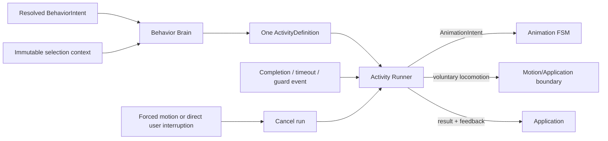

# Контракт Activity Engine

`ACTIVITY_ENGINE.md` — source of truth для Activity definitions, выбора Activity внутри resolved behavior, lifecycle одного run, chains, guards, cooldown и repetition.

Activity Engine не принимает semantic решение. Character Engine передаёт единственный resolved `BehaviorIntent`; Behavior Brain выбирает совместимую Activity только внутри его `kind`; Activity Runner исполняет выбранное определение.

## 1. Владение

| Owner | Владеет | Не владеет |
|---|---|---|
| Character Engine | semantic gating, P4 Utility arbitration, resolved intent | Activity selection/lifecycle |
| Behavior Brain | eligibility и weighted selection Activity внутри resolved intent | выбором intent, physics или frames |
| Activity Runner | lifecycle одного `runId`, chain progress, completion/cancel, emitted requests | выбором intent или Activity |
| Application | monotonic time, snapshot boundaries, доставка external completion events, cleanup | скрытым изменением chain |
| Motion Engine | forced position и physical facts | Activity lifecycle |
| Animation FSM | visual transitions/interrupt policy по `AnimationIntent`/`MotionEvent` | Activity chain |

Public `BehaviorIntent` определён только в [`BEHAVIOR_INTENTS.md`](./BEHAVIOR_INTENTS.md); P0–P5 и P4 Utility — только в [`AUTONOMY_ENGINE.md`](./AUTONOMY_ENGINE.md); visual priorities — только в [`ANIMATION_ENGINE.md`](./ANIMATION_ENGINE.md).

## 2. Поток Activity



Behavior Brain получает только уже resolved intent и не сравнивает semantic candidates. Если для intent нет compatible Activity, он возвращает отсутствие выбора; fallback остаётся частью semantic/Application flow, а не скрытым созданием нового intent.

## 3. ActivityDefinition

`ActivityDefinition` — конечная направленная chain graph с:

- уникальным Activity id;
- одним `entryStepId`;
- rank для interruption boundary;
- положительным конечным `baseWeight`;
- необязательным `cooldownKey`;
- конечным набором steps с уникальными `ActivityStepId`.

Step имеет ровно один тип: semantic animation request, voluntary locomotion request, explicit delay либо guarded branch. Он может ссылаться только на существующий следующий step или завершать chain. Animation step содержит только `AnimationIntent`-совместимую semantic форму; locomotion step — только voluntary command, а не world-position commit.

Definition не содержит React component, DOM event, asset path/frame, Electron/OS handle, provider DTO, mutable Character state, wall-clock callback или произвольный effect function.

## 4. Валидация definitions

До запуска definition должна удовлетворять всем условиям:

- Activity id, entry и step ids непустые и уникальные в соответствующем scope;
- entry ссылается на существующий step;
- каждый target ссылается на существующий step либо terminal outcome;
- weights и timeouts положительны и конечны;
- cooldown key, если задан, относится к зарегистрированному tuning key;
- безусловный branch cycle запрещён;
- guarded cycle обязан иметь явный bounded exit/timeout;
- step не может одновременно выпускать animation и locomotion request разных типов;
- definition не расширяет public `BehaviorIntentKind` или `AnimationIntentKind` неявно.

Invalid definition не стартует и даёт deterministic failed result `invalid_definition`. Runtime не пытается чинить graph или угадывать target.

## 5. Начальные chains

Существующие канонические последовательности сохраняются:

```text
Explore: walk(target) -> observe -> sit -> look_around -> stand_up
Rest: yawn -> lie_down -> sleep_start -> sleep_loop (complete on stable state)
Zoomies: sprint(target) -> settle
```

Это Activity chains, а не public behavior catalog. Их совместимость с resolved intent задаётся Behavior Brain. Конкретные visual kinds и переходы проверяются по [`ANIMATION_ENGINE.md`](./ANIMATION_ENGINE.md); physical feasibility voluntary command — по [`MOTION_ENGINE.md`](./MOTION_ENGINE.md).

Отдельный behavior catalog в `docs/behaviors/` этой миграцией не создаётся.

## 6. Behavior Brain selection

Selection выполняется только среди definitions, совместимых с resolved intent и текущим immutable context. Hard filters применяются до веса:

- intent compatibility;
- state/guard compatibility;
- истёкший Activity cooldown;
- доступность требуемой environment capability;
- отсутствие несовместимого forced-motion lifecycle;
- специальные существующие eligibility rules Activity.

Существующая compatibility сохраняется: resolved `wander` ограничивает выбор Explore/Run, `idle` — Sit, `sleep` — Rest/Sleep, `play` — Zoomies/Swat. Resolved `quiet` сам по себе не выбирает Rest/Sleep. Zoomies требует достаточных energy/stimulation, низкого overload и истёкшего cooldown; значения и Character semantics здесь не переопределяются.

Вес Activity отличается от Utility score behavior candidate:

```text
finalWeight = baseWeight
            × environment
            × need
            × tone
            × personality
            × repetition

P(activity) = finalWeight(activity) / Σ finalWeight(eligible activities)
```

Character values здесь являются read-only snapshot factors и не переопределяют Needs/tone semantics. P4 Utility уже завершена до Activity selection и не пересчитывается.

Selection использует явно переданный `randomUnit`/seeded source из orchestration boundary. `Math.random()` и wall-clock reads внутри Behavior Brain запрещены. При нулевой сумме положительных weights Activity не выбирается.

## 7. Lifecycle одного run

В каждый момент Activity Runner исполняет не более одной Activity. Запуск создаёт новый уникальный `runId`, фиксирует activity/step identity и emits первый request либо terminal result.

Состояния lifecycle концептуально ограничены:

```text
not_started -> running(step) -> completed
                           \-> failed
                           \-> cancelled
```

`completed`, `failed` и `cancelled` terminal. Они не возобновляются. Повторный запуск той же Activity создаёт новый `runId` и не переиспользует external request ids.

Runner:

- принимает monotonic `nowMs` аргументом;
- не создаёт timers;
- выпускает не более одного step request за update transition;
- сопоставляет completion только с текущими `runId` и request id;
- игнорирует stale/foreign completion без изменения runtime;
- возвращает cleanup scope только для завершившегося run.

## 8. Completion и timeouts

Step завершается только своим объявленным completion condition:

- animation completion event;
- locomotion target/result event;
- вход Animation FSM в ожидаемый stable state;
- explicit delay elapsed по переданному `nowMs`;
- guard outcome;
- bounded timeout.

Timeout не является скрытым scheduler. Application вызывает Runner с monotonic time; Runner сравнивает его с сохранённым start/deadline. Completion и timeout, попавшие в одну transaction, обрабатываются в стабильном порядке, установленном Application sequence.

После завершения шага Runner атомарно переходит к target и выпускает следующий request. Terminal step завершает Activity ровно один раз.

## 9. Guards и branches

Guard читает только immutable normalized context и явный event. Он не меняет Character, Motion, Animation или environment state и не вызывает provider.

Guard result выбирает один из definition targets. Отсутствующий outcome, invalid target или exception boundary нормализуется в deterministic failed result; Runner не продолжает произвольную ветку.

Branches не могут создавать semantic intent. Если chain требует другого поведения, текущая Activity завершается/отменяется, а новый candidate проходит Character Engine в следующей decision opportunity.

## 10. Interruption и cancel

Interruption всегда означает cancel текущего run и новый `runId` для последующей Activity. Pause/resume запрещены.

- P0 forced motion отменяет Activity с причиной `forced_motion`.
- P1 direct user flow отменяет Activity с причиной `user_interaction`.
- остальные rank interactions следуют единственной таблице [`AUTONOMY_ENGINE.md`](./AUTONOMY_ENGINE.md#3-safety-order-p0p5).

Cancel прекращает новые step emissions и возвращает точный cleanup scope. Уже доставленный physical fact не откатывается. Animation FSM самостоятельно применяет visual interrupt rules; Activity Runner не подменяет их.

## 11. Cooldown

`CooldownEntry { key, nextEligibleAtMs }` — hard eligibility gate. Он отделён от repetition multiplier и сравнивается только с явно переданным monotonic time.

Zoomies, rare actions, Stretch и Swat используют отдельные keys. `sleep_after_wake` может обходиться только P2 согласно Autonomy/Character boundary. Все durations являются tuning data; этот документ не вводит новые значения.

Cooldown устанавливается по определённому lifecycle event Activity, а не по render frame или попытке scoring. Неуспешный candidate, не выбранная Activity и stale completion не продлевают cooldown неявно.

## 12. Repetition

History bounded: первоначально до 8 Activity entries и до 16 action entries. Старые записи вытесняются, а penalty экспоненциально ослабевает со временем.

Repetition multiplier имеет положительный configured floor, поэтому не запрещает единственную eligible Activity. Это soft weighting factor, а не hard cooldown.

History обновляется только подтверждённым запуском/выполнением соответствующего lifecycle event. Preview, eligibility check и повторная оценка одного snapshot не добавляют entries.

## 13. Feedback boundary

Activity/Motion/user semantic outcomes поступают в Application mapper как `ShimejiFeedbackEvent`, а затем не более одного раза становятся canonical `StimulusDto` Character Engine. Форма `StimulusDto` и изменения Needs/Relationship принадлежат [`CHARACTER_ENGINE.md`](./CHARACTER_ENGINE.md).

```typescript
export type ShimejiFeedbackEvent =
  | { readonly type: 'drag_started'; readonly eventId: string; readonly atMs: MonotonicMs }
  | { readonly type: 'drag_hold'; readonly eventId: string; readonly dragRunId: string; readonly heldMs: number; readonly atMs: MonotonicMs }
  | { readonly type: 'drag_ended'; readonly eventId: string; readonly dragRunId: string; readonly heldMs: number; readonly atMs: MonotonicMs }
  | { readonly type: 'landing'; readonly eventId: string; readonly outcome: LandingOutcome; readonly impactSeverity: number; readonly atMs: MonotonicMs }
  | { readonly type: 'petting'; readonly eventId: string; readonly intensity: number; readonly atMs: MonotonicMs }
  | { readonly type: 'swat_cursor_completed'; readonly eventId: string; readonly activityRunId: string; readonly atMs: MonotonicMs };

export interface ShimejiStimulusMappingContext {
  readonly createdAtIso: string;
  readonly landingThresholds: Pick<MotionConstraints, 'stumbleMaxSeverity'>;
}

export interface IShimejiStimulusMapper {
  map(event: ShimejiFeedbackEvent, context: ShimejiStimulusMappingContext): StimulusDto | null;
}
```

Сохраняется mapping: drag start/hold/end становятся user stimuli; `stumble`/`crash_landing` — system stimuli; petting и completed Swat применяют configured deltas. Soft landing не создаёт дополнительный stimulus. Raw pointer events, physics substeps, bounces и animation frames не размножают feedback.

Application дедуплицирует semantic event id. `drag_hold` создаётся не более одного раза на drag run после configured hold; completed activity feedback связывается с `activityRunId`.

Character Engine clamp-ит собственные шкалы и синтезирует tone. Application публикует новый selection snapshot только после завершения landing `settle`/`recover`, поэтому feedback не запускает arbitration посреди forced-motion lifecycle.

## 14. Изоляция

Behavior Brain и Activity Runner — pure Domain logic. Они не знают Electron, BrowserWindow, IPC, DOM, CSS, Node timers/filesystem, OS/window handles, assets, provider/backend DTO или presentation frames.

Renderer не выбирает Activity и не владеет lifecycle. Application доставляет нормализованные events/time и orchestrates cleanup, но не переписывает definition graph.

## 15. Проверяемые свойства

- Activity выбирается только внутри resolved intent;
- одновременно активен не более одного `runId`;
- invalid definitions детерминированно отклоняются;
- stale/foreign completions не меняют runtime;
- interruption — cancel, никогда pause/resume;
- cooldown является hard gate, repetition — положительным soft factor;
- одинаковые inputs и explicit random source дают одинаковый selection/lifecycle result;
- Activity не принимает semantic, physics или visual priority decisions.
