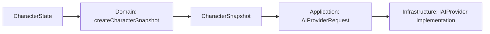

# Контракт AI Provider

`IAIProvider` — boundary между desktop-клиентом Project Wisp и источником semantic responses. Provider отвечает за генерацию текстовых ответов и подсказок поведения, опираясь на богатый психологический контекст персонажа из `CHARACTER_ENGINE.md`, но не принимает финальные behavior decisions и не управляет UI.

Текущая default-реализация: `MockAIProvider`, полностью offline и локальная. Будущий `ExternalAIProviderClient` допускается только как client-side adapter к отдельному backend-проекту, не как backend/proxy/server code внутри `project_wisp`.

## Владение

- Интерфейс `IAIProvider` принадлежит Application layer и живёт в `application/ports/`.
- Реализации provider-а принадлежат Infrastructure layer: текущий `MockAIProvider`, будущий `ExternalAIProviderClient`.
- Renderer, React components и Render Engine не знают конкретный provider и не получают provider-specific payload.
- Domain / Character Engine не видит raw provider DTO. Provider response проходит через `ProviderResponseIntentMapper` в Application layer.
- Application layer формирует `AIProviderRequest`, преобразуя доменное состояние `CharacterState` в сериализуемый снимок психологического контекста (`CharacterSnapshot`).

## Форма интерфейса

- `getStatus()` нужен Application layer для debug/status counters и предсказуемого fallback. Он не должен инициировать network setup, login flow или user-facing provider configuration.
- `generateResponse()` возвращает один semantic response. Streaming допускается позже только как расширение этого контракта после Architect review.

## Request DTO (Форма запроса)

Контракт `IAIProvider` и типы запроса/ответа определены в [src/application/ports/ai-provider.interface.ts](../../src/application/ports/ai-provider.interface.ts).
Канонический `CharacterSnapshot` объявлен в [src/domain/character/types.ts](../../src/domain/character/types.ts).
Порт использует точный alias `AIProviderCharacterSnapshot = CharacterSnapshot`: отдельного provider-specific снимка или словаря traits нет.

`AIProviderRequest` является сериализуемым DTO без ссылок на React, DOM, Electron window handles, Node objects или классы внешних SDK.

### Правила:
- `text` санитизируется на application/domain boundary.
- `characterSnapshot` собирается Application layer через доменную фабрику `createCharacterSnapshot`; после передачи provider читает его без мутаций.
- `recentContext` ограничивается Application layer (скользящее окно); provider не получает полный SQLite dump без отдельного memory contract.
- DTO не содержит токены, названия внешних моделей, API keys, endpoint URLs или auth/billing поля.

### Канонический CharacterSnapshot — P17-A03 (#27)

Application вызывает [createCharacterSnapshot](../../src/domain/character/character-snapshot.ts)
через `CharacterStateService.getSnapshot()` и помещает результат в `AIProviderRequest.characterSnapshot`.
Доменные правила проекции и синтеза тона не дублируются в mapper или provider.



| Поле снимка | Источник и формат | Инвариант |
|---|---|---|
| `needs` | Доменный `Needs`: `energy`, `attention`, `play`, `comfort`, опциональный `boredom` | Конечные числа в `[0, 100]`; отсутствие `boredom` допустимо и не превращается в обязательный ноль. |
| `relationship` | Копия `Relationship`: `friendship`, `love`, `loveUnlocked` | Friendship/love в `[0, 1000]`, флаг boolean; provider не изменяет отношения. |
| `personality.presetId` | `CharacterState.personality.id` | Строковый ID пресета. |
| `personality.aiSelfConcept` | `CharacterState.personality.aiSelfConcept` | Строковое самоописание для психологического контекста. |
| `personality.traits` | Четыре числа: `shyness`, `playfulness`, `sensitivity`, `boldness` | Конечные нормализованные значения в `[0, 1]`, не проценты и не `AxisValue` objects. |
| `intimacy` | `flirtiness`, `romanticCharge`, `userConsentEnabled` | Первые два поля в `[0, 100]`, consent — boolean. |
| `synthesizedTone` | Результат доменного `synthesizeEmotionalTone(state)` | Обязательный `SynthesizedEmotionalTone`: `shy`, `sleepy`, `playful`, `curious`, `neutral`, `affectionate`, `flustered`. |

Traits следуют текущим значениям доменных осей: `playfulness`, `sensitivity` и `boldness`
копируют соответствующие `axes.*.current`. Производный `shyness` вычисляет
[calculateShyness](../../src/domain/character/derived-traits.ts):
`0.45 * sensitivity.current + 0.35 * (1 - boldness.current) + 0.20 * (1 - extraversion.current)`.
При валидных осях в `[0, 1]` формула уже нормализована; provider не масштабирует её повторно.

**Намеренные отличия от CharacterState:**
- `personality.id` проецируется в `presetId`; `displayName`, полная карта осей, `base`,
  hard/soft bounds и `plasticity` не передаются. Provider получает значения traits, а не модель адаптации личности.
- `intimacy.boundariesKnown` остаётся внутри домена; provider получает только три поля указанного `Pick`.
  Проверка допустимости поведения по границам пользователя остаётся в Character Engine.
- `preferences` и `lastUpdated` отсутствуют в снимке. Их нельзя добавлять в запрос через spread полного state;
  история диалога передаётся отдельно через ограниченный `recentContext`.
- `synthesizedTone` вычисляется при создании снимка, а не хранится отдельным изменяемым полем `CharacterState`.
- Отличий между `CharacterSnapshot` и `AIProviderCharacterSnapshot` нет; это одна форма данных.

**Сериализация и владение:** фабрика копирует `needs` и `relationship`, создаёт новые вложенные
`personality`, `traits`, `intimacy`; известные поля содержат только числа, строки и boolean.
Ссылки на изменяемые `CharacterState`, `PersonalityPreset` и `AxisValue` передавать запрещено.
Неизменяемость здесь — правило владения: текущий alias не вводит deep-readonly или runtime freeze.
Явно переданный в dialogue service снимок должен соблюдать те же требования; service не клонирует его повторно.

Типизация сама по себе не гарантирует JSON-безопасность произвольных входов: доменный `Needs`
имеет открытый индексный тип, а фабрика копирует его поверхностно и не валидирует диапазоны traits.
Контракт относится к валидному доменному состоянию. При будущей обработке недоверенных данных
Application boundary обязан проверять известные поля, конечность чисел и диапазоны, исключать
произвольные вложенные значения; type assertion и `JSON.stringify` не заменяют валидацию.
Изменение доменного `Needs` и реализация такого validator не входят в P17-A03.

## Response DTO (Форма ответа)

`AIProviderResponse` описывает semantic result provider-а. Он может предложить эмоциональный тон или suggested behavior, но не выбирает окончательное поведение персонажа, animation clip или ассет.

### Обязательные требования:
- `replyText` (`reply.text`) не пустой: текст для отображения в SpeechBubble и передачи в историю диалога.
- `suggestedBehavior` опционален: семантическая подсказка для `CharacterEngine`. `CharacterEngine` решает, допустимо ли действие с учетом `Needs`, `Relationship`, `cooldowns`, `quiet/sleep mode` и приоритета действий пользователя. First-party providers возвращают `suggestedBehavior` только из разрешенного подмножества `BehaviorIntentKind` (см. `BEHAVIOR_INTENTS.md`). Provider не должен предлагать `drag` или `land` (они принадлежат прямому user interaction; mapper отбрасывает их в fallback).
- `reply.tone` использует `AIProviderTone` из порта; это отдельный словарь тона ответа, не входной `CharacterSnapshot.synthesizedTone`. Поля `suggestedTone` в текущем response DTO нет. `CharacterEngine` остаётся источником истины и может проигнорировать provider hint.
- Response не содержит CSS class names, React component names, SVG paths, sprite sheet names, frame indexes, animation fps или asset paths.

## Thinking и latency

Provider contract позволяет Application layer отображать thinking-состояние без знания конкретной реализации provider-а.

```text
idle -> thinking -> ok
idle -> thinking -> fallback
idle -> thinking -> error
```

### Правила:
- `MockAIProvider` симулирует latency локальным таймером, без сети.
- Thinking state provider-нейтрален: UI видит presentation-ready state через Application/IPC.
- Provider не должен блокировать прямой ввод пользователя (drag, click); приоритет прямого ввода всегда выше.

## Errors и offline fallback

Причины fallback (`AIProviderFallbackReason`: `empty_input`, `message_too_long`, `unsupported_input`, `provider_unavailable`, `timeout`, `unexpected_error`) нормализуются в Application layer.

### Правила:
- Для MVP `MockAIProvider` возвращает локальные детерминированные fallback responses для пустого, слишком длинного или непонятного ввода.
- Offline fallback является штатным поведением: Project Wisp полностью работоспособен без интернета.
- Ошибки внешнего адаптера мапятся в нейтральные fallback/error states без утечки технической информации в UI.

## Реализации

### `MockAIProvider`
- Работает полностью локально и оффлайн.
- Возвращает локальные реплики с учетом `CharacterSnapshot` (отвечает стеснительно при высоком shyness, кратко при низкой энергии, теплее при высокой дружбе).
- Симулирует thinking/latency.
- Не делает сетевых вызовов и не требует API-ключей.

### `ExternalAIProviderClient`
- Будущий client-side адаптер к внешнему бэкенду.
- Не содержит backend/proxy/server кода внутри `project_wisp`.
- Не хранит пользовательские API-ключи внутри десктоп-клиента.
- Любое подключение требует отдельного Architect review.

## Запрещённые знания provider-а

Provider следует [инвариантам изоляции Clean Architecture](./README.md#5-общие-архитектурные-границы-и-изоляция-clean-architecture) и не имеет доступа к UI-разметке (React/DOM/CSS), путям к ассетам/спрайтам, Electron/OS handles или таблицам SQLite.

## Граница mapper-а

`ProviderResponseIntentMapper` (Application layer):
```text
AIProviderResponse -> ProviderResponseIntentMapper -> BehaviorIntent
```
- Переводит `AIProviderResponse` во внутренний `BehaviorIntent`.
- Не принимает финальных решений о поведении (решение принимает `CharacterEngine`).
- Нормализует подсказки provider-а и отбрасывает неизвестные значения в safe fallback.

## ARCHITECT RESULT — P17-A03 (#27)

- **TASK:** согласование CharacterSnapshot на AI provider boundary.
- **Decision / CHANGES:** canonical type остаётся в Domain; порт уже содержит точный alias.
  Документ фиксирует полный состав снимка, нормализацию traits, обязательный `synthesizedTone`,
  правила владения и намеренные отличия от CharacterState. Code delta не требуется.
- **BOUNDARIES:** Application использует существующую доменную фабрику; нового mapper/IPC DTO
  не требуется. Provider implementations, services, сетевые вызовы и зависимости не изменяются.
- **Implementation consequences:** существующий путь формирования снимка сохраняется;
  provider обязан читать его без мутаций. Ограничения текущей типизации и требования к
  недоверенным входам явно описаны выше; они не являются реализованной runtime-валидацией.
- **SPRITES:** none.
- **VERIFICATION:** сверены доменные типы, фабрика, alias порта и сборка запроса в dialogue service;
  локальные Markdown-ссылки и `git diff --check` проверены; документ укладывается в лимит 450 строк.
  `npm test` / `typecheck` не требуются для docs-only изменения.
- **RECOMMENDED NEXT GATE:** reviewer.
