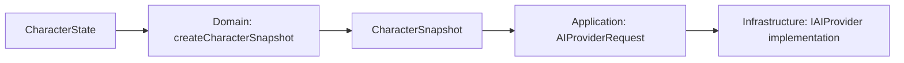

# Контракт AI Provider

`IAIProvider` — boundary между desktop-клиентом Project Wisp и источником semantic responses. Provider отвечает за генерацию текстовых ответов и подсказок поведения, опираясь на богатый психологический контекст персонажа из `CHARACTER_ENGINE.md`, но не принимает финальные behavior decisions и не управляет UI.

Текущая default-реализация: `MockAIProvider`, полностью offline и локальная. Будущий `ExternalAIProviderClient` выполняет прямые вызовы LLM через `IAIProvider` только в Main; backend/proxy/server и внешняя БД не входят в архитектуру desktop-приложения.

## Владение

- Интерфейс `IAIProvider` принадлежит Application layer и живёт в `application/ports/`.
- Реализации provider-а принадлежат Infrastructure layer: текущий `MockAIProvider`, будущий `ExternalAIProviderClient`.
- Renderer, React components и Render Engine не знают конкретный provider и не получают provider-specific payload.
- Domain / Character Engine не видит raw provider DTO. Provider response проходит через `ProviderResponseIntentMapper` в Application layer.
- Application layer формирует `AIProviderRequest`, преобразуя доменное состояние `CharacterState` в сериализуемый снимок психологического контекста (`CharacterSnapshot`).

## Форма интерфейса

- `getStatus()` нужен Application layer для debug/status counters и предсказуемого fallback. Он не должен инициировать network setup, login flow или user-facing provider configuration.
- `generateResponse()` возвращает один semantic response. Streaming допускается позже только как расширение этого контракта после Architect review.

## Request DTO (Форма запроса)

Контракт `IAIProvider` и типы запроса/ответа определены в [src/application/ports/ai-provider.interface.ts](../../src/application/ports/ai-provider.interface.ts).
Канонический `CharacterSnapshot` объявлен в [src/domain/character/types.ts](../../src/domain/character/types.ts).
Порт использует точный alias `AIProviderCharacterSnapshot = CharacterSnapshot`: отдельного provider-specific снимка или словаря traits нет.

`AIProviderRequest` является сериализуемым DTO без ссылок на React, DOM, Electron window handles, Node objects или классы внешних SDK.

### Правила:
- `text` санитизируется на application/domain boundary.
- `characterSnapshot` собирается Application layer через доменную фабрику `createCharacterSnapshot`; после передачи provider читает его без мутаций.
- `recentContext` ограничивается Application layer (скользящее окно); provider не получает полный SQLite dump без отдельного memory contract.
- DTO не содержит токены, названия внешних моделей, API keys, endpoint URLs или auth/billing поля.

### Канонический CharacterSnapshot — P17-A03 (#27)

Application вызывает [createCharacterSnapshot](../../src/domain/character/character-snapshot.ts)
через `CharacterStateService.getSnapshot()` и помещает результат в `AIProviderRequest.characterSnapshot`.
Доменные правила проекции и синтеза тона не дублируются в mapper или provider.



| Поле снимка | Источник и формат | Инвариант |
|---|---|---|
| `needs` | Доменный `Needs`: `energy`, `attention`, `play`, `comfort`, опциональный `boredom` | Конечные числа в `[0, 100]`; отсутствие `boredom` допустимо и не превращается в обязательный ноль. |
| `relationship` | Копия `Relationship`: `friendship`, `love`, `loveUnlocked` | Friendship/love в `[0, 1000]`, флаг boolean; provider не изменяет отношения. |
| `personality.presetId` | `CharacterState.personality.id` | Строковый ID пресета. |
| `personality.aiSelfConcept` | `CharacterState.personality.aiSelfConcept` | Строковое самоописание для психологического контекста. |
| `personality.traits` | Четыре числа: `shyness`, `playfulness`, `sensitivity`, `boldness` | Конечные нормализованные значения в `[0, 1]`, не проценты и не `AxisValue` objects. |
| `intimacy` | `flirtiness`, `romanticCharge`, `userConsentEnabled` | Первые два поля в `[0, 100]`, consent — boolean. |
| `synthesizedTone` | Результат доменного `synthesizeEmotionalTone(state)` | Обязательный `SynthesizedEmotionalTone`: `shy`, `sleepy`, `playful`, `curious`, `neutral`, `affectionate`, `flustered`. |

Traits следуют текущим значениям доменных осей: `playfulness`, `sensitivity` и `boldness`
копируют соответствующие `axes.*.current`. Производный `shyness` вычисляет
[calculateShyness](../../src/domain/character/derived-traits.ts):
`0.45 * sensitivity.current + 0.35 * (1 - boldness.current) + 0.20 * (1 - extraversion.current)`.
При валидных осях в `[0, 1]` формула уже нормализована; provider не масштабирует её повторно.

**Намеренные отличия от CharacterState:**
- `personality.id` проецируется в `presetId`; `displayName`, полная карта осей, `base`,
  hard/soft bounds и `plasticity` не передаются. Provider получает значения traits, а не модель адаптации личности.
- `intimacy.boundariesKnown` остаётся внутри домена; provider получает только три поля указанного `Pick`.
  Проверка допустимости поведения по границам пользователя остаётся в Character Engine.
- `preferences` и `lastUpdated` отсутствуют в снимке. Их нельзя добавлять в запрос через spread полного state;
  история диалога передаётся отдельно через ограниченный `recentContext`.
- `synthesizedTone` вычисляется при создании снимка, а не хранится отдельным изменяемым полем `CharacterState`.
- Отличий между `CharacterSnapshot` и `AIProviderCharacterSnapshot` нет; это одна форма данных.

**Сериализация и владение:** фабрика копирует `needs` и `relationship`, создаёт новые вложенные
`personality`, `traits`, `intimacy`; известные поля содержат только числа, строки и boolean.
Ссылки на изменяемые `CharacterState`, `PersonalityPreset` и `AxisValue` передавать запрещено.
Неизменяемость здесь — правило владения: текущий alias не вводит deep-readonly или runtime freeze.
Явно переданный в dialogue service снимок должен соблюдать те же требования; service не клонирует его повторно.

Типизация сама по себе не гарантирует JSON-безопасность произвольных входов: доменный `Needs`
имеет открытый индексный тип, а фабрика копирует его поверхностно и не валидирует диапазоны traits.
Контракт относится к валидному доменному состоянию. При будущей обработке недоверенных данных
Application boundary обязан проверять известные поля, конечность чисел и диапазоны, исключать
произвольные вложенные значения; type assertion и `JSON.stringify` не заменяют валидацию.
Изменение доменного `Needs` и реализация такого validator не входят в P17-A03.

## Dialogue runtime и IPC — P17-A02 (#19)

Миграция реализована в P17-I01 (#44): `DialogueRuntime` исполняется в Main/Application.
Канонические DTO находятся в
[`ipc-contracts.ts`](../../src/shared/ipc-contracts.ts): `DialogueCommandDTO`,
`DialogueCommandReceiptDTO`, `DialoguePresentationDTO`, `BrainStateDTO`, `WispApiBridge`.

### Единственный владелец и композиция

| Область | Владелец | Обязанности |
|---|---|---|
| Provider instance | Main composition root | Создаёт один MockAIProvider на lifecycle runtime; будущий внешний адаптер также запускается только здесь. |
| Dialogue runtime/use case | Application, исполняется в Main | Admission, один in-flight, deadline, контекст, нормализация результата, передача stimuli/candidates в Brain. |
| Character state | Существующий Main CharacterStateService | Тот же экземпляр, что у остального Brain; dialogue не создаёт копию semantic authority. |
| IPC handlers | Main | Trusted sender, exact validation, вызов runtime, admission receipt; регистрации один раз с симметричным cleanup. |
| State publication | Существующий BrainStatePublisher | Публикует dialogue вместе с character/activity/motion/visualIntent в полном snapshot. |
| Renderer | Body/UI composition | Draft текста, отправка команды, показ reply/status; не хранит provider context и не вызывает Application services. |

Main создаёт runtime после Character/Brain composition, до регистрации dialogue handler,
инъецирует provider, Character service, существующий путь candidate arbitration, publisher callback,
монотонные часы, scheduler и генератор ID. Application не импортирует Electron, Node или Renderer.
Clock/scheduler передаются структурными интерфейсами по существующему проектному образцу;
новые npm-зависимости, singleton внутри Renderer и параллельный Character service не нужны.

[`DialogueRuntime`](../../src/application/services/dialogue-loop.service.ts) разделяет await provider и semantic commit:
ни один continuation не применяет `provider_response`, context или intent до проверки generation/deadline.
`ProviderResponseIntentMapper` создаёт candidate, а Character gating принимает окончательное решение.
Прямой `applyBehaviorIntentToAnimation` из dialogue hook удаляется при миграции.

### Минимальная IPC boundary

`postDialogueCommand(command)` использует фиксированный канал `wisp:dialogue-command`.
Это typed command по модели существующего `requestSleepWake`, отдельно от Body observations.
`BodyEventDTO` не расширяется provider payload, и его sequence не расходуется dialogue-командами.

| Контракт | Смысл |
|---|---|
| `DialogueCommandDTO` | `send(text)` или `reset`, текущие stream/conversation ID и возрастающая sequence. Locale выбирает Main из конфигурации; UI не передаёт snapshot, историю или provider settings. |
| `DialogueCommandReceiptDTO` | Только accepted/rejected: `busy`, `stale`, `invalid_input`, `unavailable`. Accepted reset возвращает новый conversationId. Receipt не содержит ответа, visual intent или состояния персонажа. |
| `DialoguePresentationDTO` | Текущая conversationId, canSubmit и последний turn: idle/thinking/completed/error. Текст ошибки уже пригоден для UI, без stack trace. |
| `BrainStateDTO.dialogue` | Обязательная projection в полном Brain snapshot; отдельного onDialogueState/getDialogueState нет. |

Поле `dialogue` находится в `BrainStateDTO`, а `postDialogueCommand` — в `WispApiBridge`;
временные target wrappers удалены. Validators, publisher, preload и Renderer подключены
атомарно. Optional dialogue и dual publish запрещены; snapshot без dialogue отвергается.

Все payload принимаются как unknown и копируются после exact-shape проверки по правилам
[`UI_SPEC.md §6`](./UI_SPEC.md#6-brain--body-ipc). ID — trimmed непустые строки до 128 символов,
sequence — положительный safe integer. `send.text` после trim содержит 1–240 UTF-16 code units
(текущий лимит ChatInput); контролы, кроме newline/tab, недопустимы. Reply/message — plain text,
не HTML, максимум 2000 code units. Provider reply trim-ится и ограничивается этим пределом.
Неизвестные ключи/enum, пустой текст, non-finite числа отвергаются до вызова provider.
Malformed command получает invalid_input, untrusted sender — транспортный отказ без раскрытия state.

### Ordering, admission и in-flight

1. Main проверяет trusted webContents и current stream. Чужой stream или conversation — stale.
2. Sequence строго возрастает в пределах stream; уже обработанная sequence даёт stale без
   повторного provider call или stimulus. Для валидной envelope sequence потребляется даже при busy;
   UI повторяет попытку только явным действием с новой sequence, никогда автоматически.
3. `send` при занятости немедленно возвращает busy; очереди запросов нет.
   Main генерирует requestId, сохраняет generation, text и deadline, атомарно публикует thinking
   и принимает команду. IPC promise не ждёт provider. Между receipt и snapshot нет гарантированного
   порядка доставки; UI выводит состояние только из возрастающих Brain revisions.
4. На admission применяется ровно один user_message stimulus; thinking — candidate `think`
   через обычные Brain gates. Отклонение визуальной реакции не отменяет допустимый текстовый запрос.
5. Provider result проверяется на форму, совпадение requestId и активные conversation/generation.
   При `now >= deadline` побеждает timeout даже если callback таймера ещё не исполнился.
6. Terminal commit однократен: context, provider stimulus/candidate и dialogue projection
   обновляются в одной Brain transaction. Publisher считает dialogue change semantic,
   не coalesce-ит её как motion-only; одинаковый snapshot не создаёт повторной UI-реплики.

UI временно блокирует повторную отправку до admission receipt; после этого canSubmit определяется
snapshot. Rejected receipt не очищает draft; принятый текст можно очистить, но receipt никогда
не завершает thinking. После транспортного отказа UI снимает локальную блокировку и не делает
автоматический retry: команда могла быть уже принята. Старый receipt после смены stream игнорируется.

### Deadline, fallback и физически незавершённые вызовы

Общий deadline — 15 000 ms от admission на инъецированных Main-monotonic часах, включая
`getStatus()` и `generateResponse()`. Таймер только ставит событие в Application runtime;
physics tick не блокируется await. Native timers изолированы адаптером scheduler.

| Событие | Presentation / поведение |
|---|---|
| ready или degraded | Вызвать generateResponse в оставшееся время. Валидный status=ok даёт completed/success. |
| offline | Не вызывать generateResponse; completed/fallback с reason=offline и локальной репликой. |
| provider status=thinking без собственного активного запроса, error, rejection | completed/fallback с reason=provider_error. |
| Валидный provider status=fallback | completed/fallback; provider_unavailable → offline, timeout → timeout, unexpected_error → provider_error, остальные причины → degraded. |
| Некорректный response / несовпавший requestId | completed/fallback с reason=invalid_response; raw payload не попадает в UI/context/Character. |
| Deadline истёк | completed/fallback с reason=timeout; thinking немедленно завершён, поздний результат игнорируется. |
| Не удалось сформировать безопасный fallback | error с локальным сообщением; thinking завершён, provider behavior и context не коммитятся. |

Fallback формируется локально детерминированным каталогом, без второго provider call.
Валидная fallback-реплика провайдера может отображаться, но его behavior/mood hints для fallback
не применяются. Только success даёт provider_response и candidate в обычную Character arbitration.
Transport rejection отображается локальной UI-ошибкой и не создаёт semantic реакцию персонажа.
На terminal/reset/dispose Brain освобождает только принадлежащую этому requestId thinking Activity;
чужую Activity и forced Motion не отменяет. Переход к reply/idle определяется текущими gates,
поэтому `thinking_loop` не может остаться активным из-за отсутствия Skin completion.

У текущего `IAIProvider` нет cancellation API: timeout/reset логически отменяет запрос,
но не выдаётся за физическую отмену Promise. Runtime сохраняет один execution guard до settlement
старого getStatus/generateResponse, не запускает следующий вызов и публикует canSubmit=false.
После settlement guard снимается и публикуется canSubmit=true без принятия старого результата;
после позднего getStatus generateResponse уже не вызывается. При вечном зависании повторная
отправка недоступна до перезапуска приложения, но UI и Motion работают. Cancellation внешнего
адаптера требует отдельного контракта; бесконечное накопление retired calls запрещено.

### Контекст, reset и lifecycle

- Runtime хранит только последние три завершённые пары user/reply (шесть сообщений), в памяти.
  В новый provider request попадает копия этого bounded context, текущий userMessage передаётся отдельно.
  Пара добавляется атомарно после success или показанного fallback; error/reset/отменённый запрос
  не добавляют половину пары. Reply ограничен 2000 символами, user — 240; контекст не растёт без лимита.
- `reset` допускается и во время thinking: новая conversationId, пустые context/turn=idle,
  отмена deadline, новая generation. Character needs/relationship reset не затрагивает.
  Ранее применённый user_message stimulus не откатывается. Execution guard сохраняется до settlement.
- Reload/замена webContents меняет Brain stream и сбрасывает conversation/context аналогично reset;
  старые commands/receipts/results не переносятся в новый stream. Обычный React remount только
  переподписывается на текущий snapshot и не сбрасывает Main runtime.
- Закрытие окна/app shutdown вызывает dispose: generation инвалидируется, таймеры и подписки
  снимаются, UI publication прекращается. Provider guard принадлежит Main lifecycle, не обнуляется
  при пересоздании окна; новый запрос ждёт settlement старого. После перезапуска приложения всё idle.
- Drag/fall и прочие высокоприоритетные действия не ждут provider. Они могут прервать thinking/talking
  animation через существующие gates, но текстовый запрос продолжается. Ответ не восстанавливает
  старую Activity и не обходит актуальное состояние персонажа. Skin completion не участвует в dialogue.

### Implementation consequences и проверка

Разработчик переносит provider creation из DesktopPet и recentContext из useDialogueLoop в
Main/Application, убирает вызовы dialogue use case/animation dispatch из Renderer. Hook становится
UI-обёрткой typed command и Brain snapshot. В том же изменении подключаются exact validators,
IPC handler, целевые DTO и lifecycle к существующему Brain publisher; сырой provider result
через IPC не передаётся. Сетевой адаптер, streaming, настройки provider и persistence не реализуются.

Регрессионные тесты с fake scheduler/deferred provider: повторная отправка и duplicate sequence;
timeout на обеих await стадиях; поздний success/rejection после reset/reload/dispose; reply ровно
на deadline; malformed response/requestId; bounded context и целостность пар; receipt/snapshot
в обоих порядках; снятие execution guard; отсутствие Renderer provider imports и direct animation
dispatch; единый terminal commit и сохранение forced Motion. Developer запускает typecheck и npm test.

## Response DTO (Форма ответа)

`AIProviderResponse` описывает semantic result provider-а. Он может предложить эмоциональный тон или suggested behavior, но не выбирает окончательное поведение персонажа, animation clip или ассет.

### Обязательные требования:
- `replyText` (`reply.text`) не пустой: текст для отображения в SpeechBubble и передачи в историю диалога.
- `suggestedBehavior` опционален: семантическая подсказка для `CharacterEngine`. `CharacterEngine` решает, допустимо ли действие с учетом `Needs`, `Relationship`, `cooldowns`, `quiet/sleep mode` и приоритета действий пользователя. First-party providers возвращают `suggestedBehavior` только из разрешенного подмножества `BehaviorIntentKind` (см. `BEHAVIOR_INTENTS.md`). Provider не должен предлагать `drag` или `land` (они принадлежат прямому user interaction; mapper отбрасывает их в fallback).
- `reply.tone` использует `AIProviderTone` из порта; это отдельный словарь тона ответа, не входной `CharacterSnapshot.synthesizedTone`. Поля `suggestedTone` в текущем response DTO нет. `CharacterEngine` остаётся источником истины и может проигнорировать provider hint.
- Response не содержит CSS class names, React component names, SVG paths, sprite sheet names, frame indexes, animation fps или asset paths.

## Thinking и latency

Provider contract позволяет Application layer отображать thinking-состояние без знания конкретной реализации provider-а.

```text
idle -> thinking -> ok
idle -> thinking -> fallback
idle -> thinking -> error
```

### Правила:
- `MockAIProvider` симулирует latency локальным таймером, без сети.
- Thinking state provider-нейтрален: UI видит presentation-ready state через Application/IPC.
- Provider не должен блокировать прямой ввод пользователя (drag, click); приоритет прямого ввода всегда выше.

## Errors и offline fallback

Причины fallback (`AIProviderFallbackReason`: `empty_input`, `message_too_long`, `unsupported_input`, `provider_unavailable`, `timeout`, `unexpected_error`) нормализуются в Application layer.

### Правила:
- Для MVP `MockAIProvider` возвращает локальные детерминированные fallback responses для пустого, слишком длинного или непонятного ввода.
- Offline fallback является штатным поведением: Project Wisp полностью работоспособен без интернета.
- Ошибки внешнего адаптера мапятся в нейтральные fallback/error states без утечки технической информации в UI.

## Реализации

### `MockAIProvider`
- Работает полностью локально и оффлайн.
- Возвращает локальные реплики с учетом `CharacterSnapshot` (отвечает стеснительно при высоком shyness, кратко при низкой энергии, теплее при высокой дружбе).
- Симулирует thinking/latency.
- Не делает сетевых вызовов и не требует API-ключей.

### `ExternalAIProviderClient`
- Будущий Infrastructure adapter прямого вызова LLM через `IAIProvider`, исполняемый в Main.
- Не вводит backend/proxy/server или внешнюю БД; Renderer сетевых вызовов не делает.
- Политика credentials не определяется P17-A02; auth/API keys и provider SDK вне его scope.
- Любое подключение требует отдельного Architect review.

## Запрещённые знания provider-а

Provider следует [инвариантам изоляции Clean Architecture](./README.md#5-общие-архитектурные-границы-и-изоляция-clean-architecture) и не имеет доступа к UI-разметке (React/DOM/CSS), путям к ассетам/спрайтам, Electron/OS handles или таблицам SQLite.

## Граница mapper-а

`ProviderResponseIntentMapper` (Application layer):
```text
AIProviderResponse -> ProviderResponseIntentMapper -> BehaviorIntent
```
- Переводит `AIProviderResponse` во внутренний `BehaviorIntent`.
- Не принимает финальных решений о поведении (решение принимает `CharacterEngine`).
- Нормализует подсказки provider-а и отбрасывает неизвестные значения в safe fallback.

## ARCHITECT RESULT — P17-A03 (#27)

- **TASK:** согласование CharacterSnapshot на AI provider boundary.
- **Decision / CHANGES:** canonical type остаётся в Domain; порт уже содержит точный alias.
  Документ фиксирует полный состав снимка, нормализацию traits, обязательный `synthesizedTone`,
  правила владения и намеренные отличия от CharacterState. Code delta не требуется.
- **BOUNDARIES:** Application использует существующую доменную фабрику; нового mapper/IPC DTO
  не требуется. Provider implementations, services, сетевые вызовы и зависимости не изменяются.
- **Implementation consequences:** существующий путь формирования снимка сохраняется;
  provider обязан читать его без мутаций. Ограничения текущей типизации и требования к
  недоверенным входам явно описаны выше; они не являются реализованной runtime-валидацией.
- **SPRITES:** none.
- **VERIFICATION:** сверены доменные типы, фабрика, alias порта и сборка запроса в dialogue service;
  локальные Markdown-ссылки и `git diff --check` проверены; документ укладывается в лимит 450 строк.
  `npm test` / `typecheck` не требуются для docs-only изменения.
- **RECOMMENDED NEXT GATE:** reviewer.

## ARCHITECT RESULT — P17-A02 (#19)

- **TASK / Decision:** единственный dialogue runtime в Main/Application, bounded volatile context,
  single-flight и один Brain state stream. Provider и semantic commit удаляются из Renderer при реализации.
- **CHANGES:** объявлены target command/receipt/presentation DTO и bridge в shared; зафиксированы
  injection, lifecycle, ordering, deadline, fallback, reset и atomic cutover с BrainStateDTO.
- **BOUNDARIES:** только контракты и спецификация; текущий runtime ещё не мигрирован.
  Новых зависимостей, сетевого адаптера, persistence, backend и UI настроек нет.
- **SPRITES:** none.
- **VERIFICATION:** typecheck, локальные ссылки, лимит строк и diff check прошли;
  продуктовые тесты относятся к последующей реализации.
- **RECOMMENDED NEXT GATE:** reviewer контрактов, затем app-developer для runtime cutover.
