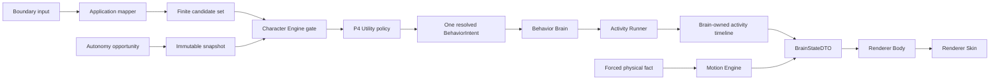

# Контракт Autonomy Engine

`AUTONOMY_ENGINE.md` — source of truth для приоритетов P0–P5, eligibility и Utility arbitration автономных semantic candidates, детерминированной cadence, diagnostic trace и safety-порядка.

Autonomy Engine не является отдельным runtime actor или вторым владельцем поведения. Это контракт внутренней pure policy Character Engine и Application-owned orchestration вокруг неё. Причина отказа от XState зафиксирована в [`ADR-015`](../adr/ADR-015-utility-ai-without-xstate.md).

## 1. Владение

- **Character Engine (Domain):** семантический гейтинг кандидатов, порядок безопасности P0–P5, Utility eligibility, scoring и арбитраж P4, возврат ровно одного resolved `BehaviorIntent`. Не владеет выбором Activity, физикой, кадрами анимации и часами.
- **Brain (Main/Application runtime):** единственный владелец текущего semantic state, Activity timeline, Character needs и агрегированной authoritative motion projection. Brain оркестрирует чистые Domain engines, передаёт им явное монотонное время и публикует цельный `BrainStateDTO`; это архитектурная граница, а не новый Domain engine.
- **Application Orchestrator внутри Brain:** нормализация входов, сборка неизменяемого снапшота, формирование конечного набора кандидатов, монотонный пульс возможностей (`opportunityAtMs`) и сериализация Activity/Motion transitions. Не вычисляет семантические веса.
- **Body и Skin (Renderer):** Body потребляет ordered `BrainStateDTO`, захватывает input и вычисляет только быстрые визуальные рефлексы; Skin отображает renderer-local `BodyVisualState`. Они не выбирают behavior/Activity и не подтверждают Brain progression.
- **Внешние связи:** Полная матрица распределения ответственности смежных движков зафиксирована в [README.md](./README.md#4-матрица-межмодульных-контрактов-кто-от-кого-зависит).

## 2. Единственная цепочка решений



`Candidate` и `Resolved` — стадии одной public формы `BehaviorIntent`, а не новые DTO. Application mapper может собрать candidates из user/system events, локального catalog или provider hint, но не принимает решение. Character Engine возвращает не более одного resolved intent.

Forced physical fact не является semantic candidate: Motion Engine применяет его независимо, отменяет активную Activity через Application transaction и отражает `MotionEvent` в следующем цельном Brain state/visual intent. Если физический lifecycle также представлен public intent, Character Engine разрешает его semantic часть, но не может отменить уже произошедший факт.

### 2.1. Activity timeline не зависит от визуального playback

`ActivityRunner` переключает semantic-фазы только в Brain transaction: по явно переданному Main-monotonic `nowMs`, Brain-owned guard/locomotion result или authoritative interruption. Для time-bounded фазы Runner сохраняет `phaseStartedAtMs` и `phaseEndsAtMs`; при `nowMs >= phaseEndsAtMs` он атомарно выбирает следующий шаг и публикует новую revision.

Фактическое завершение, отказ, fallback или прерывание Skin-клипа не является Activity event. Brain не ожидает Renderer callback, не копирует длительность клипа и не ставит animation watchdog. `BodyEventDTO` может сообщать только пользовательский input/наблюдение; ни один его вариант не подтверждает визуальное completion и не гейтит cadence. Точная IPC-форма и правила времени заданы в [`UI_SPEC.md`](./UI_SPEC.md#6-brain--body-ipc).

## 3. Safety order P0–P5

Порядок ниже — единственная шкала behavior arbitration. `AnimationPriority` — отдельная visual шкала из [`ANIMATION_ENGINE.md`](./ANIMATION_ENGINE.md) и не заменяет P0–P5.

| Rank | Источник | Arbitration и interruption |
|---|---|---|
| P0 forced physics | invalid support, fall, collision, landing | Не участвует в Utility; invariant не отклоняется и отменяет active Activity. |
| P1 direct user / causal continuation | drag, click, pet, explicit command | Отменяет P2–P5; airborne drag начинается после atomic physics step. |
| P2 critical Character state | required sleep/wake | Определяется только Character contract; ждёт P0/P1 и отменяет P3–P5. |
| P3 reactive / provider | admitted AI, затем local spook/cursor reaction | После gating отменяет P4–P5; AI выше local P3, вне Utility. |
| P4 autonomous | Explore, optional Rest, calm, самостоятельная игра/Zoomies, SocialBid | Заменяет P5; local peers не заменяют active P4 по умолчанию. |
| P5 ambient | blink, micro-idle | Прерывается всеми higher ranks. |

Character Engine применяет authoritative sleep/quiet rules из [`CHARACTER_ENGINE.md`](./CHARACTER_ENGINE.md#21-каноническая-семантика-сна-и-пробуждения); этот документ не повторяет их thresholds или значение. Motion ordering и возврат position authority определены в [`MOTION_ENGINE.md`](./MOTION_ENGINE.md#8-авторитет-позиции-кто-двигает-окно).

## 4. P4 opportunity и нормализация

Application создаёт P4 decision opportunity только по явной причине:

- завершение или отмена Activity;
- пересечение semantic threshold, определённого Character Engine;
- изменение quiet/settings boundary;
- поступление candidate;
- редкий configured autonomy pulse.

Application собирает все входы, накопленные до transaction boundary, нормализует их один раз и передаёт:

- возрастающий `decisionSequence`;
- `opportunityAtMs` из monotonic clock;
- immutable Character snapshot;
- active Activity summary с rank;
- bounded cooldown/repetition snapshot из Activity subsystem;
- normalized environment snapshot и свежие reactive signals;
- конечный упорядоченный candidate set;
- versioned tuning configuration.

Domain policy не читает clock самостоятельно. `opportunityAtMs` является аргументом, а не скрытым wall-clock dependency. Candidate order стабилен и задаётся catalog/Application normalization, а не порядком прихода асинхронных callbacks.

Pulse не привязан к physics, animation или render tick, не прерывает peer P4 Activity и не запускает provider request. После shutdown или window destruction новые opportunities не создаются.

## 5. Допустимые и запрещённые inputs

Utility policy читает только нормализованные доменные значения:
- Character snapshot: Needs, synthesized tone, Personality и relationship/intimacy gates;
- готовые quiet/sleep gating facts без повторения их семантики;
- rank активной Activity;
- сводку cooldown/repetition;
- геометрию окружения и свежие реактивные сигналы из [`PERCEPTION_ENGINE.md`](./PERCEPTION_ENGINE.md);
- метаданные кандидата (`source`, `priority`, `requestId`) и identity каталога.

**Запрещено:** согласно [инвариантам изоляции Clean Architecture](./README.md#5-общие-архитектурные-границы-и-изоляция-clean-architecture), Utility policy не получает сырой ответ провайдера, текст памяти, DOM/React/Electron handles, пути ассетов, клипы/фреймы, `Date.now()`, `Math.random()`, тикрейт рендера/физики или мутабельный `CharacterState`.

## 6. Eligibility

Для каждого P4 candidate Character Engine применяет hard gates до scoring:

```text
eligible(c) = catalog(c)
           AND safety(c)
           AND characterGate(c)
           AND cooldown(c)
           AND environment(c)
```

Гейты проверяют только принадлежность существующему `BehaviorIntentKind`, совместимость с текущим semantic состоянием, safety/order, Activity-owned cooldown snapshot и доступность нормализованной среды. Candidate с отрицательным результатом не участвует в score comparison.

Eligibility reason должен быть машинно-стабильным diagnostic code. Он не становится новым IPC DTO, provider response или persisted memory schema. Никакой score не может компенсировать failed hard gate.

## 7. Scoring и arbitration

Для eligible P4 candidate используется утверждённая формула:

```text
U(c) = clamp(
  base(c)
  × need(c)
  × tone(c)
  × personality(c)
  × environment(c)
  × repetition(c),
  0,
  1
)
```

Коэффициенты являются versioned tuning data. Autonomy Engine не переопределяет Character semantics и Activity history: он потребляет соответствующие нормализованные factors. Positive factor меняет относительную полезность, но не отменяет hard gate или P0–P3 order.

Arbitration:

1. Сохранить только eligible P4 candidates.
2. Вычислить bounded `U(c)` для каждого в стабильном catalog order.
3. Выбрать candidate с максимальным score.
4. При равенстве выбрать первый по стабильному catalog order.
5. При пустом eligible set использовать существующий safe `idle` fallback через обычный Character gate.
6. Вернуть не более одного resolved `BehaviorIntent`.

P0–P3 не конкурируют с P4 по score. P5 не является P4 fallback candidate и запускается только после общего safety order.

## 8. Детерминизм

Одинаковые snapshot, ordered candidates, history, tuning и `decisionSequence` дают одинаковые eligibility, scores и winner. Pure policy не мутирует inputs и не планирует следующую оценку.

Неявная случайность запрещена. Если catalog впоследствии потребует вариативности, допустим только явно переданный seeded PRNG; seed входит в test fixture и trace. Это не разрешает wall-clock seed или provider-controlled randomness.

Application сериализует opportunities: одновременно выполняется не более одной decision transaction. Inputs, поступившие во время неё, относятся к следующему sequence. Resolved intent публикуется после завершения всей transaction, поэтому Behavior Brain не видит промежуточный candidate set.

## 9. Diagnostic trace

Каждая P4 transaction формирует внутренний diagnostic trace:

- opportunity reason, monotonic time и decision sequence;
- ordered candidate identities и sources;
- eligibility outcome/reason каждого candidate;
- normalized factors и итоговый bounded score eligible candidates;
- tie-break outcome, winner либо safe fallback;
- tuning version и optional explicit PRNG seed.

Trace не содержит raw provider text, memory content, OS/window identifiers или mutable references. Он не является public IPC/persistence/provider contract. Любая будущая экспозиция trace требует отдельного Architect review и privacy boundary.

## 10. Coexistence и safety invariants

- Character Engine остаётся единственным semantic decision owner.
- Behavior Brain не оценивает candidates между разными intent kinds.
- Activity Runner не ждёт Skin/Renderer lifecycle и не мигрирует в параллельную state machine.
- Motion Engine не принимает behavior decisions; forced facts обходят Utility.
- Application владеет clocks, sequence и boundary normalization, но не score.
- Body/Skin не создают autonomy opportunity и не могут остановить или продолжить Brain cadence.
- Provider необязателен и никогда не запускается фоновым autonomy pulse.
- Shutdown отменяет scheduler lifecycle; catch-up opportunity после shutdown запрещён.
- Новый public intent kind, IPC/port или Character threshold требует отдельного Architect review.

## 11. Проверяемые свойства

- повторяемые eligibility, scores, ties и fallback для одинаковых inputs;
- один resolved intent на decision sequence;
- P0–P3 никогда не понижаются до P4 score competition;
- peer P4 не прерывается обычным pulse;
- Character sleep/quiet gate применяется без локальной копии thresholds;
- provider-offline и provider-present candidates проходят одну policy boundary;
- trace не меняет outcome и не расширяет public contracts;
- ни один render/animation/physics tick не создаёт скрытую autonomy cadence.

## 12. AUTO-A09: admission и владение AI-занятием

Целевое дополнение [#45](https://github.com/zyzycode/project_wisp/issues/45); подключение runtime — #50.
Канонические типы: [`behavior-admission-port.ts`](../../src/application/ports/behavior-admission-port.ts).
Это boundary существующего Brain, а не новый scheduler, provider protocol или Domain dependency на Application.
Domain получает нормализованные значения; provider IDs и generation проверяет Application.

### 12.1. Порядок и актуальность

Обязательный порядок: **P0 → P1 → P2 → admitted provider P3 → local P3 → local P4 → P5**.
Rank задаётся причиной запуска и ownership, не только `ActivityDefinition.priority`.
Одна и та же игра может быть user P1, provider P3 или самостоятельной P4.
Входное `priority: critical` не повышает полномочия provider.
Local cursor reaction, Zoomies, SocialBid и pulse не отменяют provider-owned run.
Физическая опасность становится P0, а не маскируется под local spook.
P1 действует на время прямого взаимодействия/его causal continuation, а не навечно после клика.
Ответ AI на прежнее сообщение не наследует P1.

`ProviderBehaviorOffer` содержит Main-owned request identity, generation и время.
`expiresAtMs = requestedAtMs + offerTtlMs`; deadline не продлевается при получении/откладывании.
Все числа конечны, времена неотрицательны и `requestedAtMs <= receivedAtMs <= nowMs < expiresAtMs`.
Generation — неотрицательное целое, IDs непустые bounded строки (до 128 символов).
Offer проверяется на текущие conversation/generation/request, duplicate и enabled lifecycle.
Request должен соответствовать успешно завершённому текущему turn, не retired timeout/fallback.
Повторная доставка той же identity не создаёт повторного admission даже после завершения run.
Application хранит bounded ledger текущей generation; obsolete generations отклоняются до ledger lookup.
При вытеснении старых IDs принимается только identity текущего завершённого turn;
поэтому удаление ledger entry не разрешает повтор старого request.

Character проверяет sleep/quiet, Needs, intimacy, cooldown и общий initiative budget для навязчивых действий.
Activity selection проверяет совместимость и достижимость по текущему environment snapshot.
Проверки выполняются до отмены local run и повторяются непосредственно перед deferred start.
Raw provider target/координаты не исполняются: локальный planner выбирает доступную цель.
Нет compatible Activity — `no_activity`, local run продолжает жить.
Нет explicit допустимого behavior hint — `no_behavior_command`: reply остаётся в dialogue presentation.
Fallback/unknown hint не создаёт приоритетное занятие и не включает quiet.
Явный `respond` допустим как конечное semantic занятие; текст сам по себе не требует talking interrupt.
Provider не инициирует `drag`, `land`, `wake` и изменение quiet mode.

### 12.2. Request, admission, execution

| Стадия | Значение |
|---|---|
| received | Ответ доставлен, side effects занятия отсутствуют. |
| rejected | Финальный отказ с `BehaviorAdmissionRejection`; retry той же identity запрещён. |
| admitted | Кандидат разрешён сейчас; receipt ещё не доказывает start или completion. |
| started | Создан один `runId` и `OwnedActivityRun`; ownership фиксируется до terminal. |
| not_started | Принятый deferred offer потерял gate/срок; один terminal event без Activity feedback. |
| terminated | Один `ActivityResult` для started run: completed/cancelled/failed. |

На Brain существует максимум один active run и один deferred offer. Второй AI offer получает
`active_provider`, не вытесняет первый и не образует очередь. Ledger идентичности общий для
immediate/deferred пути. Receipt, lifecycle event и diagnostic trace не являются новым IPC.

При grounded добровольном walk, calm phase, игре или optional nap разрешено immediate cancel/start
в одной transaction; visual clip не удерживает ownership. Во время уже начатой directed arc,
climb/hang transition допускается safe deferred до authoritative grounded support + окончания
landing settle/recover. Runner не выпускает следующую добровольную фазу после такой границы.
Срок старта: `startBeforeMs = min(expiresAtMs, admittedAtMs + maxSafeDeferMs)`.
На `nowMs >= startBeforeMs` offer завершается `expired` либо `defer_timeout` без запуска.
Истечение не обрывает физику и не телепортирует персонажа.

Новый P0, P1, P2, quiet/disable/reset/dispose отзывает несовместимый deferred offer.
Уже текущая безопасно завершаемая voluntary arc не считается новым конфликтом P0;
внешняя потеря опоры/collision считается. При уже активной forced physics offer отклоняется.
На общей временной границе порядок: P0/P1 → Character P2/mode gates → deadline invalidation →
safe completion/start → один local opportunity. На deadline start/completion не выигрывает у timeout.

`executionEndsAtMs = min(expiresAtMs, startedAtMs + maxProviderRunMs)` ограничивает AI ownership.
Completion освобождает ownership; user/physics/critical gate отменяет run;
expiry/run timeout использует `ActivityResult.cancelled` с `step_timeout`, а не новый status.
При timeout в воздухе semantic run завершается, Motion доводит forced lifecycle самостоятельно.
Provider sleep после P2 threshold уступает Character-owned vital sleep с новой identity;
AI timeout не будит обязательный сон. Provider не владеет бессрочным full sleep.

Terminal transaction применяет feedback/history/cleanup и создаёт ровно одну coalesced возможность
локального выбора после снятия blockers. Старое занятие и его маршрут никогда не resume.
Если P0/P1/P2, menu или disable ещё блокируют выбор, сохраняется факт необходимости переоценки,
а не очередь намерений; при снятии blocker используется свежий snapshot.

Provider thinking/offline/timeout не останавливает autonomy cadence или Needs.
Thinking — только dialogue presentation, не idle owner. Single-flight из #44 сохраняется:
timeout/reset retires result, но до settlement реального promise busy остаётся true.
Reset/reload/dispose инвалидируют generation и её offer/run; поздний result не допускается.
Periodic provider polling и параллельные запросы этим контрактом не вводятся.

## 13. AUTO-A09: локальная жизнь и ненавязчивость

Utility использует существующие Needs/history/environment/personality, без новых шкал.
`boredom` и openness усиливают Explore; play и playfulness — допустимую игру;
energy/comfort и independence — calm/Rest; attention/extraversion/relationship — SocialBid.
Это направления влияния, не новые thresholds. Hard gates всегда применяются первыми.
P2 thresholds и wake принадлежат Character; необязательный Rest не может отсрочить P2.

Переоценка: terminal feedback, sleep/wake threshold, смена quiet/settings, освобождение P0/P1,
потеря/появление usable environment, eligible свежий cursor episode, provider offer и редкий pulse.
Повтор cursor samples лишь обновляет observation. Cooldown/budget expiry обнаруживается этим же
pulse либо ближайшим уже имеющимся opportunity; отдельный scheduler не создаётся.
Серия событий одной transaction сворачивается в один decisionSequence после Character update.

| Семейство | Existing kind / semantics |
|---|---|
| Calm | `idle`, bounded спокойное занятие с выбранной semantic pose; не P5 blink и не quiet toggle. |
| Explore | `wander`, существующий route/target planner без перепроектирования. |
| Rest | `sleep`, optional nap; P2/full user sleep сохраняют Character rules. |
| Игра | `play`, самостоятельные Zoomies или user/provider game; один executor. |
| Cursor interest | `play`, прежний stationary Observe Cursor; отдельно выбранная bounded approach Activity. |
| SocialBid | `play` как дружелюбное невербальное обращение; отдельная Activity, не LLM reply. |

Новый public kind не нужен. Activity family/catalog identity выбирается внутри kind по
нормализованному контексту; `reason` — только диагностика, не transport semantic variants.
Calm pose передаётся существующим `AnimationIntent.kind` и `BrainVisualIntentDTO.kind` до Skin.
Walk/run/crawl остаётся typed gait до Motion command; run не подменяется wander speed.

SocialBid доступен без cursor event: заметить пользователя → существующий жест/безопасное короткое
сближение → bounded ожидание → terminal. Без свежей безопасной цели используется stationary gesture.
Для сближения действуют те же same-support, 160 DIP и 6000 ms пределы, что для cursor approach;
затем отдельное ожидание не дольше `socialWaitMaxMs`, повтор маршрута внутри эпизода запрещён.
Реальный pet input завершает ожидание и проходит P1; отсутствие ответа не меняет relationship,
не создаёт штрафа, текста упрёка или повторного требования. Сам жест не насыщает attention.
Отсутствие pet input означает только отсутствие контакта; global user idle/return неизвестен.

Общий `InitiativeBudgetSnapshot` расходуется один раз при старте unsolicited cursor gesture/approach
или SocialBid, включая provider-инициативу. Gaze-only, спокойная одиночная игра и ручной P1 бесплатны.
Отказ до старта не расходует budget. Отмена после старта не возвращает token.
Помимо existing Activity cooldown требуется `nowMs >= nextEligibleAtMs` и свободный token
фиксированного окна; граница окна вычисляется по Main time, без interval timer и catch-up эпизодов.
При quiet/menu/disable сохраняются budget/cooldown и сбрасываются pending initiatives/dwell.
Resume допускает один свежий выбор, не накопленные приветствия.

## 14. Обязательные инварианты и tuning AUTO-A09

Порядок источников, once-only, конечность deadlines/budget, отсутствие resume/очереди и единые owners
обязательны. Числа ниже — начальный **versioned tuning** для #46–#50; изменения требуют
детерминированных сценариев, но не нового public kind/threshold. Не заявляют OS smoke.

| Параметр | Начальное значение |
|---|---|
| `offerTtlMs` / `maxSafeDeferMs` / `maxProviderRunMs` | 30000 / 3000 / 20000 ms |
| Initiative window / max episodes / minimum interval | 120000 ms / 2 / 30000 ms |
| Cursor episode / суммарный approach distance | 6000 ms / 160 DIP |
| Social wait | 4000 ms |
| Calm lifetime | 5000–11000 ms, существующая idle tuning range |

Все durations/distances конечны и положительны; counts — положительные целые; tuning version
обязательна в trace. Cursor freshness/dwell остаются Perception-owned, не копируются сюда.
Trace bounded (начально 64 decisions): gates, factors, winner, ownership, receipt, run result;
provider raw text, память, OS IDs и публичный debug IPC не добавляются.
