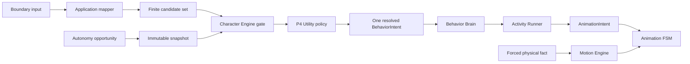

# Контракт Autonomy Engine

`AUTONOMY_ENGINE.md` — source of truth для приоритетов P0–P5, eligibility и Utility arbitration автономных semantic candidates, детерминированной cadence, diagnostic trace и safety-порядка.

Autonomy Engine не является отдельным runtime actor или вторым владельцем поведения. Это контракт внутренней pure policy Character Engine и Application-owned orchestration вокруг неё. Причина отказа от XState зафиксирована в [`ADR-015`](../adr/ADR-015-utility-ai-without-xstate.md).

## 1. Владение

- **Character Engine (Domain):** семантический гейтинг кандидатов, порядок безопасности P0–P5, Utility eligibility, scoring и арбитраж P4, возврат ровно одного resolved `BehaviorIntent`. Не владеет выбором Activity, физикой, кадрами анимации и часами.
- **Application Orchestrator:** нормализация входов, сборка неизменяемого снапшота, формирование конечного набора кандидатов, монотонный пульс возможностей (`opportunityAtMs`). Не вычисляет семантические веса.
- **Внешние связи:** Полная матрица распределения ответственности смежных движков зафиксирована в [README.md](./README.md#4-матрица-межмодульных-контрактов-кто-от-кого-зависит).

## 2. Единственная цепочка решений



`Candidate` и `Resolved` — стадии одной public формы `BehaviorIntent`, а не новые DTO. Application mapper может собрать candidates из user/system events, локального catalog или provider hint, но не принимает решение. Character Engine возвращает не более одного resolved intent.

Forced physical fact не является semantic candidate: Motion Engine применяет его независимо, отменяет активную Activity через Application transaction и направляет `MotionEvent` в тот же Animation FSM. Если физический lifecycle также представлен public intent, Character Engine разрешает его semantic часть, но не может отменить уже произошедший факт.

## 3. Safety order P0–P5

Порядок ниже — единственная шкала behavior arbitration. `AnimationPriority` — отдельная visual шкала из [`ANIMATION_ENGINE.md`](./ANIMATION_ENGINE.md) и не заменяет P0–P5.

| Rank | Источник | Arbitration и interruption |
|---|---|---|
| P0 forced physics | invalid support, fall, collision, landing | Не участвует в Utility; invariant не отклоняется и отменяет active Activity. |
| P1 direct user / causal continuation | drag, click, pet, explicit command | Отменяет P2–P5; airborne drag начинается после atomic physics step. |
| P2 critical Character state | required sleep/wake | Определяется только Character contract; ждёт P0/P1 и отменяет P3–P5. |
| P3 reactive | spook, cursor reaction, Zoomies | После gating отменяет P4–P5 и не участвует в P4 Utility. |
| P4 autonomous | Explore, optional Rest, wander | Заменяет P5; peers не заменяют active P4 по умолчанию. |
| P5 ambient | blink, micro-idle | Прерывается всеми higher ranks. |

Character Engine применяет authoritative sleep/quiet rules из [`CHARACTER_ENGINE.md`](./CHARACTER_ENGINE.md#21-каноническая-семантика-сна-и-пробуждения); этот документ не повторяет их thresholds или значение. Motion ordering и возврат position authority определены в [`MOTION_ENGINE.md`](./MOTION_ENGINE.md#8-forced-motion-и-position-authority).

## 4. P4 opportunity и нормализация

Application создаёт P4 decision opportunity только по явной причине:

- завершение или отмена Activity;
- пересечение semantic threshold, определённого Character Engine;
- изменение quiet/settings boundary;
- поступление candidate;
- редкий configured autonomy pulse.

Application собирает все входы, накопленные до transaction boundary, нормализует их один раз и передаёт:

- возрастающий `decisionSequence`;
- `opportunityAtMs` из monotonic clock;
- immutable Character snapshot;
- active Activity summary с rank;
- bounded cooldown/repetition snapshot из Activity subsystem;
- normalized environment snapshot и свежие reactive signals;
- конечный упорядоченный candidate set;
- versioned tuning configuration.

Domain policy не читает clock самостоятельно. `opportunityAtMs` является аргументом, а не скрытым wall-clock dependency. Candidate order стабилен и задаётся catalog/Application normalization, а не порядком прихода асинхронных callbacks.

Pulse не привязан к physics, animation или render tick, не прерывает peer P4 Activity и не запускает provider request. После shutdown или window destruction новые opportunities не создаются.

## 5. Допустимые и запрещённые inputs

Utility policy читает только нормализованные доменные значения:
- Character snapshot: Needs, synthesized tone, Personality и relationship/intimacy gates;
- готовые quiet/sleep gating facts без повторения их семантики;
- rank активной Activity;
- сводку cooldown/repetition;
- геометрию окружения и свежие реактивные сигналы из [`PERCEPTION_ENGINE.md`](./PERCEPTION_ENGINE.md);
- метаданные кандидата (`source`, `priority`, `requestId`) и identity каталога.

**Запрещено:** согласно [инвариантам изоляции Clean Architecture](./README.md#5-общие-архитектурные-границы-и-изоляция-clean-architecture), Utility policy не получает сырой ответ провайдера, текст памяти, DOM/React/Electron handles, пути ассетов, клипы/фреймы, `Date.now()`, `Math.random()`, тикрейт рендера/физики или мутабельный `CharacterState`.

## 6. Eligibility

Для каждого P4 candidate Character Engine применяет hard gates до scoring:

```text
eligible(c) = catalog(c)
           AND safety(c)
           AND characterGate(c)
           AND cooldown(c)
           AND environment(c)
```

Гейты проверяют только принадлежность существующему `BehaviorIntentKind`, совместимость с текущим semantic состоянием, safety/order, Activity-owned cooldown snapshot и доступность нормализованной среды. Candidate с отрицательным результатом не участвует в score comparison.

Eligibility reason должен быть машинно-стабильным diagnostic code. Он не становится новым IPC DTO, provider response или persisted memory schema. Никакой score не может компенсировать failed hard gate.

## 7. Scoring и arbitration

Для eligible P4 candidate используется утверждённая формула:

```text
U(c) = clamp(
  base(c)
  × need(c)
  × tone(c)
  × personality(c)
  × environment(c)
  × repetition(c),
  0,
  1
)
```

Коэффициенты являются versioned tuning data. Autonomy Engine не переопределяет Character semantics и Activity history: он потребляет соответствующие нормализованные factors. Positive factor меняет относительную полезность, но не отменяет hard gate или P0–P3 order.

Arbitration:

1. Сохранить только eligible P4 candidates.
2. Вычислить bounded `U(c)` для каждого в стабильном catalog order.
3. Выбрать candidate с максимальным score.
4. При равенстве выбрать первый по стабильному catalog order.
5. При пустом eligible set использовать существующий safe `idle` fallback через обычный Character gate.
6. Вернуть не более одного resolved `BehaviorIntent`.

P0–P3 не конкурируют с P4 по score. P5 не является P4 fallback candidate и запускается только после общего safety order.

## 8. Детерминизм

Одинаковые snapshot, ordered candidates, history, tuning и `decisionSequence` дают одинаковые eligibility, scores и winner. Pure policy не мутирует inputs и не планирует следующую оценку.

Неявная случайность запрещена. Если catalog впоследствии потребует вариативности, допустим только явно переданный seeded PRNG; seed входит в test fixture и trace. Это не разрешает wall-clock seed или provider-controlled randomness.

Application сериализует opportunities: одновременно выполняется не более одной decision transaction. Inputs, поступившие во время неё, относятся к следующему sequence. Resolved intent публикуется после завершения всей transaction, поэтому Behavior Brain не видит промежуточный candidate set.

## 9. Diagnostic trace

Каждая P4 transaction формирует внутренний diagnostic trace:

- opportunity reason, monotonic time и decision sequence;
- ordered candidate identities и sources;
- eligibility outcome/reason каждого candidate;
- normalized factors и итоговый bounded score eligible candidates;
- tie-break outcome, winner либо safe fallback;
- tuning version и optional explicit PRNG seed.

Trace не содержит raw provider text, memory content, OS/window identifiers или mutable references. Он не является public IPC/persistence/provider contract. Любая будущая экспозиция trace требует отдельного Architect review и privacy boundary.

## 10. Coexistence и safety invariants

- Character Engine остаётся единственным semantic decision owner.
- Behavior Brain не оценивает candidates между разными intent kinds.
- Activity Runner и Animation FSM не мигрируют в параллельную state machine.
- Motion Engine не принимает behavior decisions; forced facts обходят Utility.
- Application владеет clocks, sequence и boundary normalization, но не score.
- Provider необязателен и никогда не запускается фоновым autonomy pulse.
- Shutdown отменяет scheduler lifecycle; catch-up opportunity после shutdown запрещён.
- Новый public intent kind, IPC/port или Character threshold требует отдельного Architect review.

## 11. Проверяемые свойства

- повторяемые eligibility, scores, ties и fallback для одинаковых inputs;
- один resolved intent на decision sequence;
- P0–P3 никогда не понижаются до P4 score competition;
- peer P4 не прерывается обычным pulse;
- Character sleep/quiet gate применяется без локальной копии thresholds;
- provider-offline и provider-present candidates проходят одну policy boundary;
- trace не меняет outcome и не расширяет public contracts;
- ни один render/animation/physics tick не создаёт скрытую autonomy cadence.
