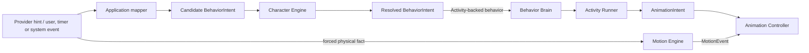

# Контракт BehaviorIntent

`BehaviorIntent` — внутреннее semantic намерение поведения Wisp. Он описывает, что персонаж пытается сделать, но не описывает React UI, DOM, CSS, sprite/SVG asset, animation clip, frame index или render props.

Документ является архитектурным контрактом ядра. Implementer-агенты не меняют этот contract без Architect review.

## Поток ответственности



`Candidate` и `Resolved` обозначают этапы жизни той же формы `BehaviorIntent`, а не новые public DTO или `kind`.

| Этап | Единственный authoritative owner | Результат и граница |
|---|---|---|
| Suggested intent | Источник; provider только предлагает hint | Hint не является решением и не обходит локальные правила. |
| Нормализация | Application mapper, включая `ProviderResponseIntentMapper` | Создаёт candidate `BehaviorIntent` из boundary DTO/event; не принимает behavior decision. |
| Gating / acceptance | Character Engine | Применяет `Needs`, `Relationship`, `Personality`, cooldowns, quiet/sleep и приоритет источника; для P4 opportunity сравнивает нормализованный candidate set через Utility policy; принимает, отклоняет или откладывает candidate. |
| Resolved behavior | Character Engine | Принятый `BehaviorIntent` становится единственным semantic решением. |
| Activity selection | Behavior Brain | Для Activity-backed behavior выбирает eligible Activity в рамках resolved `kind`; не переопределяет и не повторно принимает behavior decision. |
| Activity lifecycle | Activity Runner | Исполняет одну Activity, выпускает её `AnimationIntent` и voluntary locomotion command; не выбирает behavior или физический исход. |
| Forced motion | Motion Engine | Владеет позицией при drag/fall/collision/landing и выдаёт `MotionEvent`; не создаёт resolved behavior. |
| Visual intent | Activity Runner | Выпускает `AnimationIntent` по mapping contract; Animation Controller разрешает visual priority/interrupt/FSM, но не behavior. |

Forced physical facts — отдельная safety-ветка, а не параллельное принятие поведения. Они немедленно отменяют активную Activity и через `MotionEvent` управляют тем же Animation Controller. В той же Application transaction валидный drag input или `landed` event нормализуется в обязательный lifecycle intent `drag`/`land`: Character Engine остаётся owner его semantic resolution, но не может отменить уже произошедший P1/P0 физический факт. Support loss/collision без public intent kind остаётся только `MotionEvent` и не расширяет каталог. Полный forced-motion порядок зафиксирован в [`SHIMEJI_SPEC.md`](./SHIMEJI_SPEC.md#3-forced-motion-fsm-и-приоритеты), visual mapping — в [`ANIMATION_ENGINE.md`](./ANIMATION_ENGINE.md#поток-ответственности).

## Форма intent

```typescript
export interface BehaviorIntent {
  kind: BehaviorIntentKind;
  source: 'user' | 'provider' | 'timer' | 'memory' | 'settings' | 'system';
  priority: 'low' | 'normal' | 'high' | 'critical';
  replyText?: string;
  toneHint?: 'shy' | 'sleepy' | 'playful' | 'curious' | 'neutral' | 'affectionate' | 'flustered';
  reason?: string;
  requestId?: string;
}
```

`priority` здесь является входной подсказкой. Character Engine может повысить, понизить, отклонить или отложить intent; исключение — уже произошедший P0 forced physical fact, который semantic gating не отменяет.

Utility AI не вводит новый `BehaviorIntentKind`: Application формирует конечный набор обычных candidates, а Character Engine возвращает не более одного resolved intent. Provider candidate и timer/autonomy candidate проходят одну boundary; provider никогда не становится вторым decision-maker.

## Начальный каталог

`BehaviorIntentKind` ниже является каноническим списком намерений. Generic `react` не используется как public intent kind: реакции называются конкретно (`react_happy`, `react_confused`, будущие `react_*`). `play` является настоящим behavior intent для игровых/дружелюбных действий.

| `kind` | Ответственность | Типичные источники |
|---|---|---|
| `respond` | Ответить пользователю текстом и перейти в talking/reply behavior. | provider, user |
| `think` | Показать, что Wisp обрабатывает сообщение или задумался. | provider, user, timer |
| `react_happy` | Семантическая позитивная реакция на пользователя или событие. | provider, user |
| `react_confused` | Семантическая реакция непонимания, ошибки или неоднозначного ввода. | provider, user, system |
| `play` | Игровое или дружелюбное взаимодействие без выбора конкретной анимации или prop asset. | provider, user, timer |
| `sleep` | Перейти в sleep/quiet behavior, если Character Engine разрешит. | user, provider, timer |
| `wake` | Выйти из sleep/quiet behavior, если правила разрешают. | user, system |
| `drag` | Зафиксировать прямое перетаскивание пользователем. | user |
| `land` | Завершить drag movement и стабилизировать персонажа. | user, system |
| `wander` | Ненавязчивое автономное перемещение. | timer |
| `idle` | Стабильное спокойное поведение без активной цели. | timer, system |
| `quiet` | Подавить навязчивые автономные действия и реплики. | user, settings, system |

## Обязательные сценарии

| Сценарий | BehaviorIntent | Что остаётся вне intent |
|---|---|---|
| Chat reply | `respond` с `replyText` и optional `toneHint` | Конкретный speech bubble layout, animation clip, duration |
| Thinking | `think` | Визуальный loop, frames, spinner/face details |
| Happy reaction | `react_happy` | Выбор happy animation clip или SVG expression |
| Confused reaction | `react_confused` | Выбор confused animation clip или fallback face |
| Play | `play` | Игровая animation sequence, prop asset или конкретный сценарий |
| Sleep | `sleep` | Pillow asset path, sleep frames, exact pose |
| Wake up | `wake` | Wake animation frames и timing |
| Drag | `drag` с `priority: 'critical'` | Window movement math и dragged animation frames |
| Landing | `land` | Landing clip, easing, exact frame sequence |
| Wander | `wander` | Координаты перемещения, тайминги движения |
| Idle | `idle` | Конкретный микромоушн idle |
| Quiet | `quiet` | Режим окна, подавление фоновых таймеров |

## Правила принятия

- User `drag` и прямые click/input intents имеют больший приоритет, чем provider/timer intents.
- Character Engine может отклонить `sleep`, если пользователь активно взаимодействует с Wisp.
- Character Engine может отклонить `respond`, если включён quiet mode; Application может сохранить ответ для более позднего показа только после отдельного решения.
- Provider hints не обходят cooldowns, no-spam rules и sleep/quiet restrictions.
- Unknown provider hints мапятся в safe fallback intent, обычно `react_confused`, `idle` или `quiet` по ситуации.
- Provider-origin intents не должны создавать `drag` или `land`; эти intents принадлежат прямому user/system interaction flow.

## Запрещено

`BehaviorIntent` не содержит:
- React component names, DOM commands или CSS classes;
- SVG paths, sprite sheet names, frame indexes или asset paths;
- animation fps, frame duration, rows/columns или frame size;
- Electron window handles, IPC channel names или platform details;
- raw provider response DTO.
