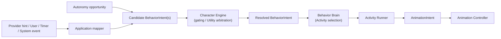
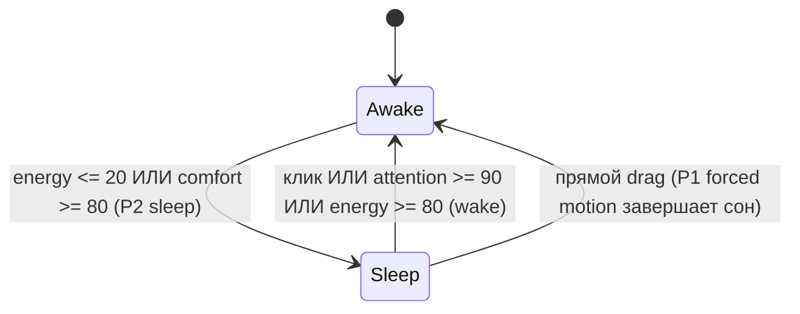
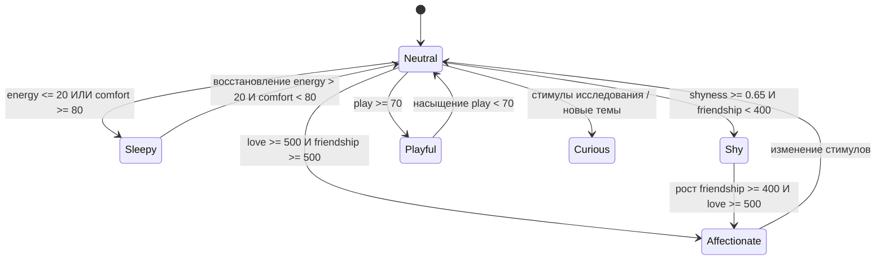

# Контракт Character Engine

`CHARACTER_ENGINE.md` — концептуальный и поведенческий контракт модели персонажа Wisp: витальных потребностей, шкал отношений, личностных осей, пластичности характера, романтического гейтинга и динамического эмоционального тона.

Персонаж управляется чистой доменной логикой (Domain Layer) и служит психологическим контекстом как для выбора автономного поведения (Utility arbitration), так и для AI Provider.

> [!NOTE]
> **TypeScript-код является единственным источником правды для типов и DTO.**
> Все контракты, интерфейсы и фабрики моделей определены в директории [`src/domain/character/`](../../src/domain/character/).

---

## Владение

- **Domain Layer ([`src/domain/character/`](../../src/domain/character/), [`src/domain/behavior/`](../../src/domain/behavior/)):** полностью владеет структурой `CharacterState`, метаболизмом потребностей (`Needs`), шкалами отношений (`Relationship`), осями личности (`Personality`), динамическим синтезом эмоционального тона, гейтингом романтики (`IntimacyState`), семантическим гейтингом и Utility arbitration P4 автономных кандидатов.
- **Внешние связи:** Application Layer нормализует входные стимулы (`StimulusEvent`) и формирует проекцию `CharacterSnapshot`. Renderer и AI Provider не имеют прямого доступа к доменным сущностям. Полная матрица — в [README.md](./README.md#4-матрица-межмодульных-контрактов-кто-от-кого-зависит).

---

## Поток ответственности

Character Engine — единственный владелец семантического гейтинга и разрешения `BehaviorIntent`, но не выбирает Activity, физический исход, спрайты или кадры анимаций:
- Правила Utility arbitration зафиксированы в [`AUTONOMY_ENGINE.md`](./AUTONOMY_ENGINE.md).
- Матрица владения интентами и исключения forced-motion — в [`BEHAVIOR_INTENTS.md`](./BEHAVIOR_INTENTS.md#поток-ответственности).
- Входные стимулы поступают в канонической форме `StimulusEvent` (см. [`src/domain/character/types.ts`](../../src/domain/character/types.ts)); жизненный цикл стимулов и правила дедупликации описаны в [`ACTIVITY_ENGINE.md`](./ACTIVITY_ENGINE.md#13-feedback-boundary).

---

## 1. Главная идея

Wisp должна ощущаться живым существом, а не сухой таблицей статов. Это персонаж со своим характером, настроением, уязвимостями, привязанностью и постепенным раскрытием.

Параметры состояния служат глубоким психологическим контекстом для поведения и генераций AI:
- почему Wisp сейчас молчит или смущается;
- почему держит дистанцию или, наоборот, ищет внимания;
- как меняется её доверие после заботы и откровенных бесед;
- как формируются её личные симпатии и предпочтения к темам.

---

## 2. Needs (Витальные потребности)

> Контракты типов и значения по умолчанию: [`src/domain/character/needs.ts`](../../src/domain/character/needs.ts).

Потребности персонажа представлены шкалами `0–100`:
- **`energy`** (ресурс): `100` = полная бодрость, `0` = крайнее истощение.
- **`attention`** (дефицит): `100` = сильное одиночество, `0` = внимание насыщено.
- **`play`** (дефицит): `100` = острая скука, `0` = интерес удовлетворен.
- **`comfort`** (дефицит): `100` = сенсорный перегруз / стресс, `0` = максимальный уют и покой.
- **`boredom`** (дефицит): `100` = монотонность, отсутствие новых стимулов.

### Поведенческая интерпретация:
- `energy <= 20`: усталость — реплики короче, замедление, стремление сесть или заснуть.
- `attention >= 80`: потребность в контакте — поворот к пользователю, сокращение дистанции, мягкие намеки.
- `play >= 75`: скука — поиск движения, реакция на курсор, игривые анимации.
- `comfort >= 80`: перегруз — стремление к тишине, покою и спокойному idle.

### Метаболизм и формулы дрейфа
> Реализация: [`src/domain/character/metabolism.ts`](../../src/domain/character/metabolism.ts) и [`src/domain/character/stimuli-reducer.ts`](../../src/domain/character/stimuli-reducer.ts).

С течением времени потребности персонажа непрерывно дрейфуют к целевым значениям в зависимости от текущего эмоционального тона (`SynthesizedEmotionalTone`).

Формула асимптотического приближения за интервал $\Delta t$ (в часах):
$$V_{\text{new}} = V_{\text{current}} + (V_{\text{target}} - V_{\text{current}}) \times \left(1 - e^{-\text{ratePerHour} \times \Delta t}\right)$$

Динамические дискретные сдвиги при интеракциях (клики, поглаживания, диалог, кормление) рассчитываются редьюсером стимулов (`stimuli-reducer.ts`).

---

### 2.1. Каноническая семантика сна и пробуждения

Character Engine — единственный источник правды для семантического состояния сна и пробуждения.

| Термин | Семантика и владелец |
|---|---|
| `sleep` | `BehaviorIntentKind`, принимаемый или инициируемый Character Engine для входа в сон. |
| `quiet` | `BehaviorIntentKind`: режим тишины (подавляет навязчивость и реплики), но сам по себе не является сном. |
| `wake` | `BehaviorIntentKind`, разрешаемый Character Engine для выхода из семантического сна. |
| `sleep_start` / `sleep_loop` / `wake_up` | Исключительно визуальные клипы [`ANIMATION_ENGINE.md`](./ANIMATION_ENGINE.md); не принимают решений о поведении. |

**Канонические правила:**
1. `energy <= 20` **или** `comfort >= 80` инициирует детерминированный P2 `sleep` (после P0 физики и P1 прямого взаимодействия).
2. Прямой клик пользователя, `attention >= 90` или восстановление `energy >= 80` разрешает `wake`.
3. Прямой `drag` обладает авторитетом P1: прерывает активный сон через связку `drag -> land -> settle` без ожидания отдельного `wake_up`.
4. Внутренние автономные события (`respond`, `think`, `play`, таймерный `idle` / `wander`) пробуждения сами по себе не вызывают.
5. Если после пробуждения условие сна всё ещё истинно, Character Engine может вновь разрешить `sleep` по завершении приоритетного взаимодействия.

---

## 3. Relationship (Система отношений)

> Контракты типов: [`src/domain/character/types.ts`](../../src/domain/character/types.ts).

Отношения с пользователем моделируются двумя шкалами `0–1000`:
- **`friendship`**: базовое доверие, комфорт, безопасность и привыкание.
- **`love`**: глубокая эмоциональная и романтическая привязанность (изначально заблокирована: `loveUnlocked: false`).

### Правила прогрессии:
- `friendship` растет от регулярного взаимодействия, диалогов, поглаживаний и совместного времени.
- `love` разблокируется только при достижении порога дружбы: **`friendship >= 400`** и явного пользовательского согласия (`userConsentEnabled`). Не накручивается спам-кликами.
- **Принцип отсутствия вины (No-guilt design):** Wisp не наказывает пользователя за долгое отсутствие. Применяется сверхмягкий `soft decay` без драматических штрафов и укоряющих реплик.

---

## 4. Personality (Оси личности)

> Контракты шкал: [`src/domain/character/types.ts`](../../src/domain/character/types.ts).

Личность выражается через 7 нормализованных осей (`0.0–1.0`):
- **`openness`**: любопытство, интерес к новым темам, фантазия.
- **`extraversion`**: социальная энергия, готовность первой проявлять инициативу.
- **`agreeableness`**: мягкость, эмпатия, уступчивость, заботливость.
- **`sensitivity`**: глубина эмоционального отклика на тон и происходящее.
- **`playfulness`**: игривость, склонность к юмору и шалостям.
- **`boldness`**: раскованность, уверенность, смелость в выражении чувств.
- **`independence`**: способность комфортно находиться рядом без постоянного внимания.

### Синтез производных черт
> Реализация: [`src/domain/character/derived-traits.ts`](../../src/domain/character/derived-traits.ts).

Производные черты рассчитываются динамически из осей личности.

Формула застенчивости (`shyness`):
$$\text{shyness} = \text{sensitivity} \times 0.45 + (1 - \text{boldness}) \times 0.35 + (1 - \text{extraversion}) \times 0.2$$

---

## 5. Soft Lock / Hard Lock и пластичность

> Контракты значений и логика адаптации: [`src/domain/character/types.ts`](../../src/domain/character/types.ts) и [`src/domain/character/personality-plasticity.ts`](../../src/domain/character/personality-plasticity.ts).

Каждая ось личности обладает коридором вариативности (`AxisValue`):
- **`base`**: ядро идентичности персонажа.
- **`current`**: текущее динамическое значение.
- **`softMin` / `softMax`**: границы повседневной комфортной зоны.
- **`hardMin` / `hardMax`**: абсолютные пределы, сохраняющие целостность персонажа.
- **`plasticity`**: скорость и глубина адаптации черты под влиянием регулярных стимулов.

**Правила устойчивости:**
- `Soft lock`: персонаж выходит за пределы комфортной зоны лишь кратковременно и под воздействием сильных стимулов.
- `Hard lock`: идентичность защищена — застенчивая Wisp не станет вульгарной или агрессивной даже на пиковых уровнях отношений.

---

## 6. Стартовый архетип: Shy Dream Girl

Базовый образ Wisp: **аниме-девушка-мечта — нежная, застенчивая, медленно привязывающаяся, сохраняющая лёгкое смущение даже при глубокой близости.**

### Динамика раскрытия:
1. **Начало:** осторожность, деликатность, краткие мягкие ответы, частое смущение, тихое созерцание издалека.
2. **Развитая дружба:** сокращение физической дистанции, охотные игры, дружеское поддразнивание, самостоятельная инициатива диалога.
3. **Развитая любовь:** доверительная нежность, забота, тонкий флирт через смущение (*румянец, паузы, отвод взгляда, тихие искренние реплики*).

Конфигурации пресетов определены в [`src/domain/character/personality-presets.ts`](../../src/domain/character/personality-presets.ts).

---

## 7. Intimacy & Romantic Charge

> Типы состояния и логика гейтинга: [`src/domain/character/types.ts`](../../src/domain/character/types.ts) и [`src/domain/character/intimacy-rules.ts`](../../src/domain/character/intimacy-rules.ts).

Романтическое состояние управляется через:
- **`flirtiness`** (0–100): внешнее проявление кокетства / флирта.
- **`romanticCharge`** (0–100): накопленное внутреннее романтическое напряжение.
- **`userConsentEnabled`** / **`boundariesKnown`**: флаги этических границ и явного согласия пользователя.

### Условия разрешения романтического выражения (`canExpressFlirt`):
Флирт и романтический контент активируются **исключительно** при одновременном выполнении условий:
1. `userConsentEnabled === true` (согласие пользователя включено);
2. `relationship.loveUnlocked === true` (шкала любви разблокирована);
3. `relationship.friendship >= 500` (высокий уровень доверия);
4. `needs.energy >= 30` (персонаж не истощён);
5. `needs.comfort <= 60` (отсутствует сенсорный перегруз).

---

## 8. Эмоциональный тон (Синтез настроения)

> Словарь тонов и логика синтеза: [`src/domain/character/types.ts`](../../src/domain/character/types.ts) и [`src/domain/character/emotional-tone.ts`](../../src/domain/character/emotional-tone.ts).

Вместо плоского статического перечисления `mood`, эмоциональный тон (`SynthesizedEmotionalTone`) синтезируется на каждом тике из актуальных потребностей, осей и отношений:

### Приоритетная матрица синтеза:
1. `energy <= 20` или `comfort >= 80` $\to$ `'sleepy'`
2. `shyness >= 0.65` при `friendship < 400` $\to$ `'shy'`
3. `love >= 500` при `friendship >= 500` $\to$ `'affectionate'`
4. `play >= 70` (при достаточной энергии) $\to$ `'playful'`
5. Иначе $\to$ `'neutral'` или `'curious'`

---

## 9. Taste & Preferences (Вкусы и предпочтения)

> Модель предпочтений и алгоритм трекинга: [`src/domain/character/preferences.ts`](../../src/domain/character/preferences.ts).

Предпочтения персонажа к темам и жанрам формируются на основе опыта:
- **`value`** (`-100..100`): отношение к теме (симпатия / антипатия).
- **`confidence`** (`0.0..1.0`): уверенность в оценке на базе повторяющихся контактов.
- **`samples`**: количество зафиксированных диалогов или событий с данной темой.

Wisp способна мягко перенимать интересы пользователя благодаря механизму эмпатии и привязанности.

---

## 10. Сводная модель CharacterState v2

> Полные контракты состояния и проекций: [`src/domain/character/types.ts`](../../src/domain/character/types.ts) и [`src/domain/character/character-snapshot.ts`](../../src/domain/character/character-snapshot.ts).

Итоговый доменный агрегат `CharacterState` объединяет:
- `needs`: витальные потребности;
- `relationship`: шкалы дружбы и любви;
- `personality`: пресет и динамические значения осей;
- `intimacy`: уровень романтического напряжения и флаги границ;
- `preferences`: карту интересов и вкусов;
- `lastUpdated`: временную метку последнего пересчёта.

---

## Архитектурные границы

Character Engine является чистым модулем доменного слоя (`src/domain/character/`). Общие правила изоляции и запрещённые зависимости зафиксированы в [README.md](./README.md#5-общие-архитектурные-границы-и-изоляция-clean-architecture).
