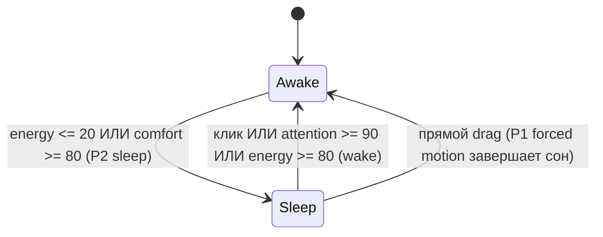
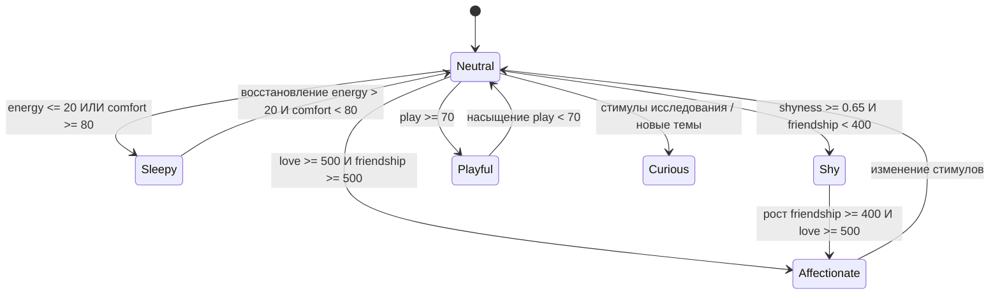

# Контракт Character Engine

Needs, отношения, личность/пластичность, romantic gating и эмоциональный тон. Типы/фабрики — в [src/domain/character/](../../src/domain/character/); этот документ задаёт семантику.

## Владение

Domain ([character](../../src/domain/character/), [behavior](../../src/domain/behavior/)) владеет `CharacterState`, Needs/metabolism, Relationship, Personality, `IntimacyState`, tone, semantic gating и P4 Utility arbitration. Application нормализует `StimulusEvent` и формирует `CharacterSnapshot`; Renderer/provider не получают прямой доступ к Domain entities. [Ownership](README.md#4-матрица-межмодульных-контрактов-кто-от-кого-зависит).

## Поток ответственности

Provider/User/Timer/System → Application mapper; autonomy opportunity → candidates; Character gating/Utility → resolved `BehaviorIntent` → Behavior Brain selection → Runner → `AnimationIntent` → Animation Controller.

Character не выбирает Activity, physical outcome, sprites/frames. Policy: [Autonomy](AUTONOMY_ENGINE.md); intent ownership/forced-motion exceptions: [Behavior Intents](BEHAVIOR_INTENTS.md#поток-ответственности). Stimuli: [types.ts](../../src/domain/character/types.ts), lifecycle/dedupe: [Activity feedback](ACTIVITY_ENGINE.md#13-feedback-boundary).

## 1. Главная идея

Устойчивый характер, текущее настроение и постепенное доверие определяют инициативу, дистанцию, смущение и интересы Wisp; то же состояние служит психологическим контекстом AI.

## 2. Needs (Витальные потребности)

[needs.ts](../../src/domain/character/needs.ts): шкалы `0–100`. `energy` — ресурс (100 бодрость, 0 истощение); остальные — дефициты: `attention` (100 одиночество, 0 насыщение вниманием), `play` (100 скука, 0 удовлетворённый интерес), `comfort` (100 перегруз/стресс, 0 покой), `boredom` (100 монотонность).

### Поведенческая интерпретация:

- `energy <= 20`: короткие реплики, замедление, sit/sleep.
- `attention >= 80`: поиск контакта, меньшая дистанция, мягкие намёки.
- `play >= 75`: движение, cursor reaction, игривость.
- `comfort >= 80`: quiet/calm idle.

### Метаболизм и формулы дрейфа

[metabolism.ts](../../src/domain/character/metabolism.ts): drift к tone-dependent targets за интервал $\Delta t$ в часах:

$$V_{\text{new}} = V_{\text{current}} + (V_{\text{target}} - V_{\text{current}}) \times \left(1 - e^{-\text{ratePerHour} \times \Delta t}\right)$$

Дискретные click/pet/dialogue/feed effects — [stimuli-reducer.ts](../../src/domain/character/stimuli-reducer.ts).

### 2.1. Каноническая семантика сна и пробуждения

Единственный semantic sleep/wake owner — Character.

| Термин | Семантика и владелец |
|---|---|
| `sleep` | `BehaviorIntentKind`, принимаемый или инициируемый Character Engine для входа в сон. |
| `quiet` | `BehaviorIntentKind`: режим тишины (подавляет навязчивость и реплики), но сам по себе не является сном. |
| `wake` | `BehaviorIntentKind`, разрешаемый Character Engine для выхода из семантического сна. |
| `sleep_start` / `sleep_loop` / `wake_up` | Исключительно визуальные клипы [`ANIMATION_ENGINE.md`](./ANIMATION_ENGINE.md); не принимают решений о поведении. |

P2 sleep срабатывает после P0 physics/P1 input. Direct drag (P1) прерывает сон через `drag -> land -> settle`, без ожидания `wake_up`. Внутренние respond/think/play/timer idle/wander сами не будят. Если после wake условие sleep ещё истинно, новый sleep допустим после приоритетного взаимодействия. Пороги и прямой click/wake заданы FSM выше.

### 2.2. Устойчивый quiet (AUTO-A09)

Quiet — session mode Brain/Character gating context, default false. Включается user/settings `quiet`, выключается явной `SetQuietModeDTO`; idle/wake/completion/reply/Activity/provider его не выключают. Это не sleep/menu pause/autonomy disabled; sleep/wake пороги действуют, wake сохраняет quiet.

Разрешены P0/P1/P2, calm, безопасное ненавязчивое Explore/Rest. Подавлены unsolicited SocialBid, cursor gesture/approach, шумная play/Zoomies, talking behavior; gaze-only остаётся reflex. Прямые user play/chat проходят current gates, не обходят critical state и не снимают quiet. Ответ на direct chat доступен в dialogue presentation, unsolicited talking/gesture не обязателен.

Enable отменяет несовместимые active/deferred runs без восстановления. Disable создаёт одну fresh opportunity без очереди; budget/cooldowns сохраняются. Renderer reload получает mode из полного Brain snapshot; Main restart сбрасывает session mode, persistence вне AUTO-A09. [Команда/bridge/DTO](../../src/shared/ipc-contracts.ts), [budget/priority](AUTONOMY_ENGINE.md).

## 3. Relationship (Система отношений)

[types.ts](../../src/domain/character/types.ts): `friendship` — доверие/безопасность/привыкание, `love` — романтическая привязанность; обе шкалы `0–1000`, изначально `loveUnlocked: false`.

### Правила прогрессии:

Friendship растёт от регулярного контакта/dialogue/pet/совместного времени. Love unlock требует **`friendship >= 400` и `userConsentEnabled`**, без накрутки spam clicks. No-guilt: только сверхмягкий soft decay за отсутствие, без наказания/укоряющих реплик.

## 4. Personality (Оси личности)

[types.ts](../../src/domain/character/types.ts): семь осей `0.0–1.0`: `openness` (любопытство/фантазия), `extraversion` (социальная инициатива), `agreeableness` (эмпатия/мягкость), `sensitivity` (глубина отклика), `playfulness` (игра/юмор), `boldness` (уверенность), `independence` (комфорт без постоянного внимания).

### Синтез производных черт

[derived-traits.ts](../../src/domain/character/derived-traits.ts), динамическая `shyness`:

$$\text{shyness} = \text{sensitivity} \times 0.45 + (1 - \text{boldness}) \times 0.35 + (1 - \text{extraversion}) \times 0.2$$

## 5. Soft Lock / Hard Lock и пластичность

[types.ts](../../src/domain/character/types.ts), [personality-plasticity.ts](../../src/domain/character/personality-plasticity.ts): `AxisValue` содержит `base` (identity), `current`, `softMin/softMax` (комфорт), `hardMin/hardMax` (абсолютные пределы), `plasticity` (скорость/глубина адаптации).

Soft lock допускает лишь краткий выход при сильных стимулах. Hard lock сохраняет identity: застенчивая Wisp не становится вульгарной/агрессивной даже при максимальных отношениях.

## 6. Стартовый архетип: Shy Dream Girl

Нежная застенчивая аниме-девушка, медленно привязывается и сохраняет смущение при близости. [personality-presets.ts](../../src/domain/character/personality-presets.ts).

### Динамика раскрытия:

Начало — деликатность, короткие ответы, созерцание издалека; дружба — сближение, игры/поддразнивание/инициатива; любовь — доверие, забота и тонкий флирт через румянец, паузы, отвод взгляда.

## 7. Intimacy & Romantic Charge

[types.ts](../../src/domain/character/types.ts), [intimacy-rules.ts](../../src/domain/character/intimacy-rules.ts): `flirtiness` — внешнее проявление, `romanticCharge` — накопленное напряжение (оба 0–100); `userConsentEnabled`/`boundariesKnown` — consent/boundary flags.

### Условия разрешения романтического выражения (`canExpressFlirt`):

Все условия одновременно:
1. `userConsentEnabled === true`;
2. `relationship.loveUnlocked === true`;
3. `relationship.friendship >= 500`;
4. `needs.energy >= 30`;
5. `needs.comfort <= 60`.

## 8. Эмоциональный тон (Синтез настроения)

[types.ts](../../src/domain/character/types.ts), [emotional-tone.ts](../../src/domain/character/emotional-tone.ts): `SynthesizedEmotionalTone` пересчитывается на каждом tick по текущим Needs/axes/relationship.

### Приоритетная матрица синтеза:

1. `energy <= 20` или `comfort >= 80` → `sleepy`.
2. `shyness >= 0.65` и `friendship < 400` → `shy`.
3. `love >= 500` и `friendship >= 500` → `affectionate`.
4. `play >= 70` при достаточной энергии → `playful`.
5. Иначе `neutral`/`curious`.

## 9. Taste & Preferences (Вкусы и предпочтения)

[preferences.ts](../../src/domain/character/preferences.ts): `value` `-100..100` — отношение к теме, `confidence` `0.0..1.0` — уверенность, `samples` — число тематических dialogues/events. Опыт, эмпатия и привязанность могут мягко сближать интересы с пользователем.

## 10. Сводная модель CharacterState v2

[types.ts](../../src/domain/character/types.ts), [character-snapshot.ts](../../src/domain/character/character-snapshot.ts): `needs`, `relationship`, `personality` (preset/axes), `intimacy`, `preferences`, `lastUpdated` (последний пересчёт).

## 11. AUTO-A09: последствия и восстановление

Play effect требует подтверждённой semantic play phase [Activity](ACTIVITY_ENGINE.md#16-auto-a09-единый-outcome-и-ownership). Request/admission/rejected play не уменьшают дефициты до Character gate; physical facts/direct pet stimuli сохраняются независимо от Activity.

Направления effects, once-only, clamp `[0,100]` обязательны. Deltas — начальный versioned tuning #46, не новые шкалы/пороги; неуказанные deltas нулевые.

| Подтверждённый факт | Начальные deltas |
|---|---|
| Explore completed | energy −1, boredom −8; одиночное исследование не даёт friendship/attention reward. |
| Завершённая игра | energy −3, play −15, boredom −18 (существующие play deltas). |
| Та же игра с `participation=user_engaged` | Дополнительно attention −3 и friendship +3, один раз. |
| Drag start / end | Только semantic lifecycle, нулевой дискретный reward/штраф. |
| Однократный drag hold | comfort +2; без friendship/love/игрового эффекта. |
| stumble / crash_landing | comfort +2 / +6; energy −1 / −2 соответственно. |
| soft landing, calm, SocialBid без ответа | Нулевой дискретный effect. |

Существующие play personality deltas — только за подтверждённую игру. Solitary play/cursor presence не доказывают социального участия. User input во время SocialBid даёт обычный stimulus, без второго reward за answered outcome. Cancel/failure до play phase не начисляет effect; пропорциональная оплата шагов/новый resource timer вне slice.

Reducer #46 обрабатывает metadata `system_event.activityOutcome`, `dragRunId/heldMs`, `landingOutcome`; это не новые public intent kinds.

Единственный Needs clock — Brain/CharacterStateService. Semantic/stable sleep использует `sleepy` metabolism; approach/prepare/calm/quiet не включают его принудительно. Сам tone sleepy не доказывает сон. Defaults [metabolism.ts](../../src/domain/character/metabolism.ts): sleep energy →82, rate 0.3/hour; comfort →12, rate 0.32/hour. Nap 12 секунд не обязан восстановить energy полностью. Full sleep достигает wake threshold за конечное время; ускорение — только versioned tuning с временным сценарием, не скрытая поправка ради теста.

Pulse elapsed от последнего применённого Main-monotonic time: negative/non-finite отклоняется, повторное время не даёт drift. Catch-up максимум 60000 ms/transaction, избыток после stall отбрасывается без очереди. Outcome несёт `deltaMs=0` против двойного drift; тот же scheduler проверяет thresholds после Needs update.

P2 отменяет optional Activity/AI owner; pending intent не блокирует sleep/wake. Nap завершается Brain deadline, full user/vital sleep — Character wake gate. Skin/provider не будят автоматически; quiet после wake сохраняется.

## Архитектурные границы

Чистый Domain `src/domain/character/`; [общая изоляция](README.md#5-общие-архитектурные-границы-и-изоляция-clean-architecture).
