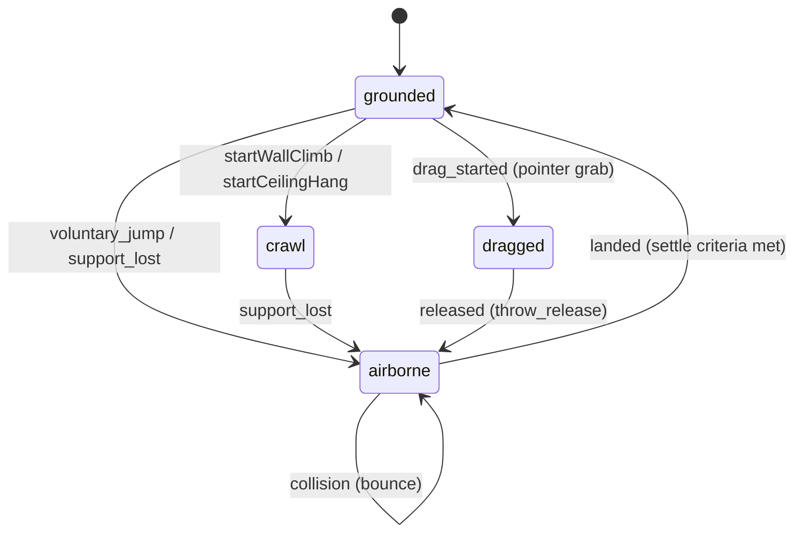

# Контракт Motion Engine

Физические факты drag/throw/fall/collision/crawl и position authority, без выбора автономного поведения. Lightweight native-window solver обоснован в [ADR-014](../adr/ADR-014-native-window-motion.md). Типы: [motion-engine.ts](../../src/domain/behavior/motion-engine.ts), [surface-kinematics.ts](../../src/domain/behavior/surface-kinematics.ts).

## 1. Владение и поток

Renderer pointer + normalized environment + Main monotonic clock → Application orchestrator → pure Motion/Surface Kinematics → PetPositionService → PetPositionPort → Electron adapter. MotionEvent идёт в Brain visual mapping, authoritative projection — в BrainStateDTO.motion.

Domain считает physics/surface kinematics, не timers/OS/behavior. Main/Application владеет aggregate, fixed-step accumulator, drag-session validation и event dispatch. Infrastructure — screens/position adapters. Renderer только input/render. [P0–P5](AUTONOMY_ENGINE.md), [visual rules](ANIMATION_ENGINE.md).

## 2. Координаты и базовые DTO

- **Единицы**: координаты — `WorldPx` (логический пиксель экрана / DIP, origin сверху слева, $x$ вправо, $y$ вниз); скорость — `WorldPx/s`; ускорение — `WorldPx/s²`; время/таймстемпы — monotonic ms.
- **Опорная точка (`rootPosition`)**: базовый контактный pivot персонажа (подошвы/центр опоры). Смещения рендерера и спрайтов вычисляются относительно него и не влияют на физический pivot.
- Типы данных (`Vector2Dto`, `ScreenBoundsDto`, `CollisionInsets`, `MotionState`, `MotionEvent`) импортируются напрямую из [`src/domain/behavior/motion-engine.ts`](../../src/domain/behavior/motion-engine.ts).

## 3. Физические состояния

Физический цикл движения разделяется на четыре базовых состояния:



1. **`drag` (`dragged`)**: Принудительное перемещение курсором пользователя. Персонаж привязан к pivot курсора с постоянным grab offset. Скорость обнулена, гравитация отключена. Немедленно отменяет текущую активность (P1 safety).
2. **`fall` (`airborne`)**: Свободный полёт/падение под действием гравитации и демпфирования. Возникает по трём причинам (`AirborneCause`):
   - `throw_release`: бросок пользователем после отпускания drag;
   - `support_lost`: потеря твердой поверхности (полка/окно исчезли или персонаж выполз за пределы);
   - `voluntary_jump`: санкционированный прыжок системы автономности.
3. **`land` (фаза стабилизации и приземления)**: Контакт с нижней поверхностью (`screen_floor` / границы экрана). Включает отскоки (`bounce`) и тангенциальное трение до выполнения критериев затухания (`settle`). Завершается исходом `soft_landing`, `stumble` или `crash_landing`.
4. **`crawl` (`climbing_wall`, `hanging_ceiling`)**: Кинематика движения по поверхностям ([`surface-kinematics.ts`](../../src/domain/behavior/surface-kinematics.ts)):
   - Движение по вертикальной стене (`climbing_wall`) со скоростью $v_{\text{vertical}}$;
   - Ползание по верхней кромке стороннего окна (`hanging_ceiling`) со скоростью $v_{\text{crawl}}$. При выходе за границу поверхности генерируется `support_lost` и персонаж переходит в `fall`.

## 4. Sliding-window throw vector

Оценка вектора скорости броска при отпускании драга использует взвешенную линейную регрессию выборки последних положений за окно `windowMs` (по умолчанию 100 мс, макс. 8 сэмплов):

```text
τ_i = (t_i - t_(n-1)) / 1000;  w_i = i + 1
τ̄ = Σ(w_i τ_i) / Σw_i;  x̄ = Σ(w_i x_i) / Σw_i;  ȳ = Σ(w_i y_i) / Σw_i
vx_raw = Σ[w_i(τ_i - τ̄)(x_i - x̄)] / Σ[w_i(τ_i - τ̄)²]
vy_raw = Σ[w_i(τ_i - τ̄)(y_i - ȳ)] / Σ[w_i(τ_i - τ̄)²]
s = sqrt(vx_raw² + vy_raw²);  k = min(1, maxThrowSpeed / max(s, ε))
vx = vx_raw × k;  vy = vy_raw × k
```

- Если количество сэмплов $< 2$ или span $< \text{minSpanMs}$ (24 мс), скорость броска принимается равной $(0, 0)$.
- Запрещено использовать мгновенную скорость по двум точкам или сырые дельты мыши (`movementX/Y`).

## 5. Интеграция физики (Fixed-step integration)

Интеграция выполняется фиксированным шагом $h$ (`fixedStepSec = 1/120` с) по схеме полунеявного метода Эйлера с экспоненциальным демпфированием:

```text
vy_accel = vy(t) + gravity × h
vx(t+h) = vx(t) × exp(-linearDampingX × h)
vy(t+h) = vy_accel × exp(-linearDampingY × h)
speed = sqrt(vx(t+h)² + vy(t+h)²)
velocity = velocity × min(1, maxSpeed / max(speed, ε))
x(t+h) = x(t) + vx(t+h) × h
y(t+h) = y(t) + vy(t+h) × h
```

Константы по умолчанию: $g = 1800\text{ px/s}^2$, $d_x = 0.35\text{ s}^{-1}$, $d_y = 0.08\text{ s}^{-1}$, $v_{\text{maxSpeed}} = 2400\text{ px/s}$.
Motion Engine является чистой функцией: при одинаковых входных данных результат строго детерминирован и не зависит от FPS рендера.

## 6. Коллизии, отскок и приземление

Эффективные границы рассчитываются с учётом отступов персонажа (`collisionInsets`):
```text
minX = bounds.x + insets.left;  maxX = bounds.x + bounds.width - insets.right
minY = bounds.y + insets.top;   maxY = bounds.y + bounds.height - insets.bottom
```

Отражение скорости при ударе:
- Стены (left/right): $v_{x,\text{after}} = -\text{wallRestitution} \times v_{x,\text{before}} \quad (\text{restitution} = 0.45)$
- Потолок (top): $v_{y,\text{after}} = -\text{ceilingRestitution} \times v_{y,\text{before}} \quad (\text{restitution} = 0.30)$
- Пол (bottom): $v_{y,\text{after}} = -\text{floorRestitution} \times v_{y,\text{before}}, \quad v_{x,\text{after}} = \text{floorTangentialRetention} \times v_{x,\text{before}} \quad (0.30, \; 0.72)$

Тяжесть удара (Impact severity) и пиковая нагрузка:
```text
normalImpact = max(0, vy_before); tangentialImpact = abs(vx_before)
impactSeverity = sqrt(normalImpact² + 0.25 × tangentialImpact²)
peak = max(previousPeak, impactSeverity)
```

### Критерий перехода в grounded (Settle)
Отскок происходит, если нормальная скорость удара $\text{normalImpact} > \text{minBounceNormalSpeed}$ (160 px/s). Иначе персонаж остаётся на полу, а тангенциальная скорость гасится. Переход в `grounded` наступает при соблюдении всех трёх условий:
```text
normalImpact <= settleNormalSpeed (120 px/s)
AND abs(vx_after) <= settleTangentialSpeed (90 px/s)
AND abs(y - maxY) <= ε
```

После этого скорость обнуляется и единожды генерируется событие приземления:
- $\text{peak} \le 420 \implies \text{soft\_landing}$
- $\text{peak} \le 950 \implies \text{stumble}$
- $\text{peak} > 950 \implies \text{crash\_landing}$

## 7. Кинематика поверхностей (Surfaces и crawl)

Управление движением по поверхностям изолировано в [`surface-kinematics.ts`](../../src/domain/behavior/surface-kinematics.ts). Модуль принимает нормализованный снимок окружения (`EnvironmentSnapshot`), не выполняя прямого обращения к OS API.

- **Стена (`climbing_wall`)**: $x = x_{\text{wall}}, \quad y(t+\Delta t) = y(t) + v_{\text{vertical}} \cdot \Delta t$.
- **Потолок/кромка окна (`hanging_ceiling` / crawl)**: $y = y_{\text{support}}, \quad x(t+\Delta t) = x(t) + v_{\text{crawl}} \cdot \Delta t$.
- **Валидация опоры**: при $x \notin [x_{\min}, x_{\max}]$ опоры, удалении окна или невалидности флага `isValidSupport` немедленно инициируется отрыв: `beginAirborne(..., cause: 'support_lost')`.

### 7.1. Lifecycle внешней опоры — целевой AUTO-A07

[Perception §10](PERCEPTION_ENGINE.md#10-внешние-окна--целевой-контракт-auto-a07) владеет filtering/identity/capability/TTL/DIP. Domain получает выбранный normalized `ExternalWindowSurface`, не выбирает/не tracks native windows. `window_side → climbing_wall`; `window_top → hanging_ceiling` (название не означает нижнюю грань).

| Наблюдение на очередном Main tick | Результат |
|---|---|
| Тот же ID, та же geometry, fresh/valid | Продолжить движение по касательной. |
| Тот же ID, move без resize | Follow: сохранить локальное расстояние от начала кромки, применить новый origin. |
| Тот же ID, resize (включая move+resize) | Recompute: сохранить абсолютное локальное расстояние в DIP, пересчитать normal coordinate; при выходе за новый диапазон — `support_lost`. |
| Другой ID, окно отсутствует, minimize/close/hide/cloak/filter-out | `support_lost`; не выбирать замену в том же шаге. |
| Unavailable, stale > 300 ms, invalid geometry, topology/DPI invalidation | `support_lost`, удалить attachment baseline. |
| Restore/recovery/new window | Только новый кандидат; автоматического reattach нет. |

Top: a=(bounds.x,bounds.y), t=(1,0), L=width. Left/right: a=(bounds.x либо bounds.x+width,bounds.y), t=(0,1), L=height. Сохранённое расстояние s в DIP и voluntary tangential v:
`s' = s + v * dt; root' = a_new + t * s'`, только при `0 <= s' <= L_new`.

Resize не масштабирует/clamp-ит s: это скрытая телепортация. Move+resize применяются атомарно; delta относительно предыдущей geometry применяется однократно, повтор snapshot не сдвигает root.

Application хранит previous accepted snapshot и передаёт с Main time в pure kinematics; алгоритм/step input реализует developer. Выход follow/recompute за screen collision bounds → support_lost, не clamped attachment.

Отрыв начинается с последней принятой root/current locomotion velocity, без наследования window velocity/poll impulse. `support_lost` — один раз attached→airborne, без повторов stale/unavailable. Screen floor — последующий physics fallback, не мгновенная новая опора. Drag отменяет attachment приоритетно, без дополнительного support_lost в том же step.

### 7.2 Traversal и направленные прыжки (AUTO-I04)

Screen wall вверх → верхний предел → Ninja Rebound к центру (`jump -> fall -> land`), не ceiling. Вниз → плавный floor contact → walk/idle.

Activity route направляет jump со стены/пола/окна к floor/window top/cursor. Парабола по (vx,vy)/gravity, target arrival → soft land; interruption (drag/menu/target loss)/miss → safe fall/land на floor.

Sprite fallbacks: `pull_up_edge` только для окон → последний climb_wall → idle/body_sit_edge (на экране rebound); `jump_travel` → jump flight frame → fall; `grab_edge` → climb_wall grab frame.

#### Реализованный screen-only slice

- `traversal-route.ts`: одна finite floor target внутри Explore, без отдельного intent/timer. Energy ≥70, comfort <75, обычная цель ≤300 DIP допускают jump. Interesting surface: approach ≤500 DIP → grab 200 ms → climb 220 DIP/s → rebound → land 500 ms → исходный observe.
- Screen-climb использует `calculateRootCollisionRange`/insets. Верх сохраняет attachment до следующего шага того же run, низ завершает на floor; screen pull-up/ceiling transition нет.
- Apex на 90 DIP выше верхней точки, clamped верхним root-пределом. `vy = -sqrt(2*g*(originY-apexY))`, `T = (-vy+sqrt(vy²+2*g*(targetY-originY)))/g`, `vx = (targetX-originX)/T`; на верхнем пределе vy=0. Нужно 0.1 ≤ T ≤3 s, |vx| ≤900 DIP/s и Motion maxSpeed; невозможные маршруты отбрасываются.
- Принятый arc: `p(t)=p0+v0*t+(0,g*t²/2)`, без damping. Arrival обнуляет velocity и даёт один soft `landed`. Cancel/miss удаляет ballistic target, сохраняя current position/velocity для damped fall/land.
- Application проверяет screen geometry/support каждый substep; completion/rejection коррелирует `runId + stepId`. Pending rejection на floor не создаёт forced-motion lifecycle; drag отменяет attachment без дополнительного support_lost.
- `voluntary_jump` сохраняет Activity; jump показывается минимум 120 ms, затем fall при нисходящей velocity; land phase — Main clock, без Renderer completion.
- `AssetResolver.TRAVERSAL_SPRITE_FALLBACKS`: grab `body_climb_wall[0]`, jump travel `body_jump[0]`, reserve pull-up `body_climb_wall[3]`. Jump[0] выбран как одиночный персонаж (jump[1] motion marks, jump[2] два персонажа). Slice не меняет PNG/manifest; window pull-up/selection/runtime support — последующие slices, фиктивных surfaces нет.

<a id="8-forced-motion-и-position-authority"></a>

## 8. Авторитет позиции: кто двигает окно

Forced Motion или voluntary Behavior/Surface → PetPositionService → `commitRootPosition`/`PetPositionPort` → ElectronPetPositionAdapter → native coordinates → `BrowserWindow.setPosition`.

### Правила авторитета (Authority Rules)

1. Renderer отправляет typed pointer events, не двигает окно и не получает Electron window.
2. Drag/throw release/support loss (P1/P0) монопольно передают position Motion и немедленно отменяют Activity; voluntary commands не применяются до grounded + stable settle.
3. Contact root идёт через [PetPositionPort](../../src/application/ports/pet-position-port.ts). [ElectronPetPositionAdapter](../../src/infrastructure/adapters/electron-pet-position-adapter.ts) делает root→native:
$$x_{\text{native}} = \text{round}(\text{clamp}(x_{\text{root}} - \text{offset}_x, \dots)), \quad y_{\text{native}} = \text{round}(\text{clamp}(y_{\text{root}} - \text{offset}_y, \dots))$$
4. `BrowserWindow.setPosition` — только при изменении integer coordinates, без параллельных владельцев позиции.

### #43: wander в пределах текущей опоры

[WanderTargetPlanner](../../src/application/ports/wander-target-planner.ts) — вызов pure Domain function, не требование класса/DI/new IPC. Application передаёт реальные screenBounds/currentSurface/root/insets/config/PRNG, не синтезирует screen bounds из window_top и не считает walking range. Domain использует собственные structural types, без Application imports.

- `planWanderTarget` рядом с `calculateNextWanderTarget`; direction/distance/duration policy и два PRNG values на random wander сохраняются.
- Window top: `minX = max(screen.x + insets.left, surface.bounds.x)`, `maxX = min(screen.x + screen.width - insets.right, surface.bounds.x + surface.bounds.width)`, `targetY = surface.supportY ?? surface.bounds.y`. Insets применены к screen один раз; support ограничивает contact root, не sprite rectangle.
- Empty intersection/invalid geometry/supportY вне vertical collision range → durationMs=0, прежний root, без movement command.
- Нет valid window_top → прежний screen-floor planner; eligibility/support-loss — Motion/Surface.
- Явный `targetRootPosition` directed route минует random planner/PRNG; проверяется Motion/traversal.

Регрессии `tests/domain/wander-target-planner.test.ts`: window top/часть вне screen/negative monitor origin/empty/invalid support/floor+PRNG parity. Application: отсутствие команды при empty и PRNG для explicit target. Искусственные bounds удалены из AutonomyCoordinator. [Visual native-offset geometry](RENDER_ENGINE.md) Domain не потребляет.

## 9. Оркестрация (ShimejiMotionOrchestrator)

[shimeji-motion-orchestrator.ts](../../src/application/services/shimeji-motion-orchestrator.ts) владеет Main clock, accumulator и drag session. На tick накапливает delta (cap `maxFrameDeltaSec = 0.25`), исполняет fixedStepSec и передаёт результат position port. Brain получает authoritative motion; максимум один цельный snapshot на внешний tick commit.

<a id="10-typed-ipc"></a>

## 10. Граница IPC (Typed IPC Boundary)

[ipc-contracts.ts](../../src/shared/ipc-contracts.ts) — leaf без OS descriptors/renderer classes/Electron refs. `BodyEventDTO`: `drag_started` / `drag_moved` / `drag_ended` несут общий порядок, gestureId/pointer ID/screen coordinates; Main принимает gesture после valid start, отбрасывает stale/foreign. Specialized drag methods до AUTO-I09 — transitional input, не второй presentation protocol.

BrainStateDTO.motion содержит dragged/airborne/grounded, root/velocity, forced/voluntary authority. Exact shape/order/cadence — [UI §6](UI_SPEC.md#6-brain--body-ipc).

## 11. Изоляция и проверяемые свойства

MotionEngine/SurfaceKinematics не зависят от Electron/DOM/Node timers/FS. Одинаковые snapshot/constraints дают одинаковые position/events независимо от Renderer FPS; native window имеет единственный commit path через adapter.

### AUTO-I06: arrival на выбранную внешнюю опору

`TraversalAction.targetSurface` normalized. Brain проверяет reachability до scoring; Motion — identity/geometry/freshness/display bounds перед запуском и каждый step. Target change отменяет arc → fall/land; исходное окно после отрыва не attachment.

Arrival атомарно принимает top attachment, без user-perch Activity: исходный Explore/Rest продолжает timeline. Same-top walk хранит local target coordinate, движение окна не меняет выбранную точку на опоре.
