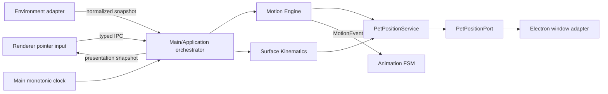

# Контракт Motion Engine

`MOTION_ENGINE.md` — source of truth для drag/throw/fall/collision, support и surface kinematics, world-position authority, Main/Application position orchestration и необходимого typed IPC.

Motion Engine фиксирует physical facts и forced position, но не выбирает поведение. Архитектурное обоснование lightweight solver для native window вынесено в [`ADR-014`](../adr/ADR-014-native-window-motion.md).

## 1. Владение и поток



| Owner | Владеет | Не владеет |
|---|---|---|
| Motion Engine | pure drag/airborne/grounded state, velocity, collision и landing facts | clocks, window, Activity, behavior |
| Surface Kinematics | pure support/surface traversal state и physical transitions | environment discovery, window commits |
| Main/Application | aggregate state, fixed-step accumulator, input order, environment refresh, feedback/FSM dispatch, commit decision | Electron conversion, semantic choice |
| Infrastructure | environment/clock adapters и `PetPositionPort` implementation | motion state или solver |
| Renderer | pointer capture и immutable presentation View | authoritative position/velocity/collision |
| Preload | narrow typed bridge и unsubscribe | validation/physics policy |

P0–P5 определены только в [`AUTONOMY_ENGINE.md`](./AUTONOMY_ENGINE.md); Animation transitions — только в [`ANIMATION_ENGINE.md`](./ANIMATION_ENGINE.md).

## 2. Координаты и базовые DTO

`WorldPx` — logical desktop pixel/DIP; origin сверху слева, `x` вправо, `y` вниз, значения могут быть отрицательными. `SourcePx` — pixel source canvas Render Engine. Скорость измеряется в `WorldPx/s`, ускорение — в `WorldPx/s²`, physics delta — в секундах, timestamps/durations — в monotonic ms.

`MotionState.position` — root/contact pivot. Renderer offsets и sprite anchors не меняют эту координату.

```typescript
export type MonotonicMs = number;
export type WorldPx = number;
export type SourcePx = number;

export interface Vector2Dto {
  readonly x: number;
  readonly y: number;
}

export type MotionPhase = 'dragged' | 'airborne' | 'grounded';
export type AirborneCause = 'throw_release' | 'voluntary_jump' | 'support_lost';

export interface AirborneLaunch {
  readonly cause: AirborneCause;
  readonly position: Vector2Dto;
  readonly velocityPxPerSec: Vector2Dto;
  readonly boundsId: string;
  readonly atMs: MonotonicMs;
}

export interface ThrowVector {
  readonly vxPxPerSec: number;
  readonly vyPxPerSec: number;
  readonly sampledAtMs: MonotonicMs;
  readonly sampleCount: number;
  readonly sampleSpanMs: number;
}

export interface ScreenBoundsDto {
  readonly id: string;
  readonly x: WorldPx;
  readonly y: WorldPx;
  readonly width: WorldPx;
  readonly height: WorldPx;
}

export interface CollisionInsets {
  readonly left: WorldPx;
  readonly right: WorldPx;
  readonly top: WorldPx;
  readonly bottom: WorldPx;
}
```

## 3. Motion state и constraints

```typescript
export interface ThrowSamplingConstraints {
  readonly windowMs: number;
  readonly maxSamples: number;
  readonly minSpanMs: number;
  readonly maxThrowSpeedPxPerSec: number;
}

export interface MotionConstraints {
  readonly gravityPxPerSec2: number;
  readonly linearDampingXPerSec: number;
  readonly linearDampingYPerSec: number;
  readonly fixedStepSec: number;
  readonly maxFrameDeltaSec: number;
  readonly maxSpeedPxPerSec: number;
  readonly wallRestitution: number;
  readonly ceilingRestitution: number;
  readonly floorRestitution: number;
  readonly floorTangentialRetention: number;
  readonly minBounceNormalSpeedPxPerSec: number;
  readonly settleNormalSpeedPxPerSec: number;
  readonly settleTangentialSpeedPxPerSec: number;
  readonly softLandingMaxSeverity: number;
  readonly stumbleMaxSeverity: number;
  readonly collisionInsets: CollisionInsets;
  readonly throwSampling: ThrowSamplingConstraints;
}

export type LandingOutcome = 'soft_landing' | 'stumble' | 'crash_landing';

export interface MotionState {
  readonly phase: MotionPhase;
  readonly position: Vector2Dto;
  readonly velocityPxPerSec: Vector2Dto;
  readonly activeBoundsId: string;
  readonly airborneElapsedSec: number;
  readonly peakGroundImpactSeverity: number;
}

export type MotionEvent =
  | { readonly type: 'drag_started'; readonly atMs: MonotonicMs }
  | { readonly type: 'released'; readonly throwVector: ThrowVector }
  | { readonly type: 'airborne_started'; readonly cause: AirborneCause; readonly atMs: MonotonicMs }
  | { readonly type: 'collision'; readonly side: 'left' | 'right' | 'top' | 'bottom'; readonly normalSpeedPxPerSec: number }
  | { readonly type: 'landed'; readonly outcome: LandingOutcome; readonly impactSeverity: number };

export interface MotionStepResult {
  readonly state: MotionState;
  readonly events: readonly MotionEvent[];
}

export interface PointerMotionSample {
  readonly position: Vector2Dto;
  readonly capturedAtMs: MonotonicMs;
}

export interface MotionStepInput {
  readonly state: MotionState;
  readonly stepSec: number;
  readonly bounds: ScreenBoundsDto;
}

export interface IMotionEngine {
  beginDrag(state: MotionState, pivotPosition: Vector2Dto, boundsId: string, atMs: MonotonicMs): MotionStepResult;
  updateDraggedPosition(state: MotionState, pivotPosition: Vector2Dto): MotionState;
  estimateThrow(samples: readonly PointerMotionSample[], releaseAtMs: MonotonicMs): ThrowVector;
  release(state: MotionState, throwVector: ThrowVector): MotionStepResult;
  beginAirborne(state: MotionState, launch: AirborneLaunch): MotionStepResult;
  step(input: MotionStepInput): MotionStepResult;
}
```

```typescript
export const DEFAULT_MOTION_CONSTRAINTS: MotionConstraints = {
  gravityPxPerSec2: 1800,
  linearDampingXPerSec: 0.35,
  linearDampingYPerSec: 0.08,
  fixedStepSec: 1 / 120,
  maxFrameDeltaSec: 0.25,
  maxSpeedPxPerSec: 2400,
  wallRestitution: 0.45,
  ceilingRestitution: 0.30,
  floorRestitution: 0.30,
  floorTangentialRetention: 0.72,
  minBounceNormalSpeedPxPerSec: 160,
  settleNormalSpeedPxPerSec: 120,
  settleTangentialSpeedPxPerSec: 90,
  softLandingMaxSeverity: 420,
  stumbleMaxSeverity: 950,
  collisionInsets: { left: 50, right: 50, top: 90, bottom: 10 },
  throwSampling: { windowMs: 100, maxSamples: 8, minSpanMs: 24, maxThrowSpeedPxPerSec: 2200 },
};
```

Validation: positive bounds/steps; non-negative damping/speeds; restitution/retention in `[0,1]`; `minBounce >= settleNormal`; `softLandingMax < stumbleMax`; legal inset range non-empty. Sprite packs may override only collision insets; остальной tuning проходит через `MotionConstraints`.

## 4. Sliding-window throw vector

Samples сортируются, duplicate timestamps схлопываются с сохранением последнего, затем берутся не более `maxSamples` с `t_i >= releaseAtMs - windowMs`. Если samples меньше двух или span `< minSpanMs`, velocity равна `(0,0)`.

```text
τ_i = (t_i - t_(n-1)) / 1000;  w_i = i + 1
τ̄ = Σ(w_i τ_i) / Σw_i;  x̄ = Σ(w_i x_i) / Σw_i;  ȳ = Σ(w_i y_i) / Σw_i
vx_raw = Σ[w_i(τ_i - τ̄)(x_i - x̄)] / Σ[w_i(τ_i - τ̄)²]
vy_raw = Σ[w_i(τ_i - τ̄)(y_i - ȳ)] / Σ[w_i(τ_i - τ̄)²]
s = sqrt(vx_raw² + vy_raw²);  k = min(1, maxThrowSpeed / max(s, ε))
vx = vx_raw × k;  vy = vy_raw × k
```

Zero denominator даёт `(0,0)`. Pointer/root samples эквивалентны при constant grab offset; two-last-sample или `movementX/Y` estimation запрещены. `release` создаёт `AirborneLaunch(cause='throw_release')`. Approved jump передаёт explicit `voluntary_jump`; lost/invalid support — explicit `support_lost`. `beginAirborne` сбрасывает airborne counters и emits `airborne_started`.

## 5. Fixed-step integration

```text
Motion.step(input), h = input.stepSec:
  vy_accel = vy(t) + gravity × h
  vx(t+h) = vx(t) × exp(-linearDampingX × h)
  vy(t+h) = vy_accel × exp(-linearDampingY × h)
  speed = sqrt(vx(t+h)² + vy(t+h)²)
  velocity = velocity × min(1, maxSpeed / max(speed, ε))
  x(t+h) = x(t) + vx(t+h) × h
  y(t+h) = y(t) + vy(t+h) × h

Application accumulator:
  frameDelta = clamp(renderDeltaSec, 0, maxFrameDeltaSec)
  accumulator += frameDelta
  while accumulator >= fixedStepSec:
    result = motion.step({ state, stepSec: fixedStepSec, bounds })
    state = result.state
    accumulator -= fixedStepSec
```

Application сохраняет remainder. Motion Engine не хранит accumulator/clock. При одинаковых `MotionStepInput` и constraints result одинаков; render FPS не участвует в Domain math.

## 6. Collision, bounce и landing

```text
minX = bounds.x + insets.left;  maxX = bounds.x + bounds.width - insets.right
minY = bounds.y + insets.top;   maxY = bounds.y + bounds.height - insets.bottom
left/right: vx_after = -wallRestitution × vx_before
top:        vy_after = -ceilingRestitution × vy_before
bottom:     vy_after = -floorRestitution × vy_before
            vx_after = floorTangentialRetention × vx_before
normalImpact = max(0, vy_before); tangentialImpact = abs(vx_before)
impactSeverity = sqrt(normalImpact² + 0.25 × tangentialImpact²)
peak = max(previousPeak, impactSeverity)
```

Penetration clamp-ится; отражается только outward velocity. Bounce происходит при `normalImpact > minBounceNormalSpeed`. Иначе root остаётся на floor, tangential velocity затухает до:

```text
normalImpact <= settleNormalSpeed
AND abs(vx_after) <= settleTangentialSpeed
AND abs(y-maxY) <= ε
```

После этого state становится `grounded`, velocity обнуляется и единожды emits outcome:

```text
peak <= softLandingMaxSeverity -> soft_landing
peak <= stumbleMaxSeverity     -> stumble
peak >  stumbleMaxSeverity     -> crash_landing
```

Side/top collision не определяет landing. Bounds меняются только между steps. Invalid support запускает только явный `beginAirborne(...cause='support_lost')`.

## 7. Surfaces и support

Perception/Application поставляет immutable normalized `EnvironmentSnapshot`; его DTO и отсутствие данных определены в [`PERCEPTION_ENGINE.md`](./PERCEPTION_ENGINE.md#7-normalized-environment-signals). Motion/Surface Kinematics интерпретирует snapshot как physical support, не выполняя OS discovery.

Surface kinds остаются `screen_floor`, `window_top`, `unknown`. `isValidSupport=false`, исчезновение active support или несовместимая geometry создают explicit support-loss transition на step boundary. Отсутствующий surface означает unavailable observation, а не разрешение угадать окно или z-order.

Surface Kinematics может вести wall/ceiling traversal рядом с Motion state, но position commit остаётся единым. Она не получает native handles, PID, platform name или DOM geometry и не меняет semantic intent.

## 8. Forced motion и position authority

Forced motion начинается с drag, throw release или support loss и продолжается через collision/landing до стабильного `settle`. В этот период единственный position owner — Motion Engine/Main aggregate.

Forced physical fact обходит Activity selection, отменяет active Activity и входит через `MotionEvent` в тот же Animation FSM. Application возвращает voluntary authority только когда Motion state уже `grounded` и landing/recover FSM вошёл в stable `settle`.

Begin drag отменяет Activity как `user_interaction`; fall — как `forced_motion`. Release оценивается по Main-stamped samples. `MotionEvent` dispatch происходит до presentation snapshot той же revision.

`falling`/`fall` и `landing`/`land` сохраняются как compatibility aliases на Controller boundary. Их visual mapping и все transitions принадлежат [`ANIMATION_ENGINE.md`](./ANIMATION_ENGINE.md).

## 9. `ShimejiMotionOrchestrator`

Main/Application coordinator владеет mutable aggregate `{ motion, surface, accumulatorSec, dragSession?, lastTickAtMs, presentationRevision }`, scheduler lifecycle и решением commit position. Motion и Surface Kinematics остаются pure services.

`start()` фиксирует Main monotonic time и запускает Main-owned tick. `stop()` отменяет future ticks. На tick Application clamp-ит delta, consumes exact fixed steps, обновляет environment только на step boundary, применяет queued input по возрастающему `sequence`, вызывает pure services, atomically routes events и commit-ит изменившуюся root position.

Catch-up step после shutdown/window destruction запрещён. Renderer получает не более одного immutable presentation snapshot за committed tick, а не stream substeps.

`PetPositionService` валидирует и хранит logical root position. Application-owned port объявлен потребителем:

```typescript
export interface PetPositionPort {
  commitRootPosition(input: {
    readonly rootPosition: Vector2Dto;
    readonly bounds: ScreenBoundsDto;
  }): void;
}
```

Infrastructure adapter переводит root/contact pivot в integer native window coordinates через registered static pivot offset, clamp-ит по выбранным bounds и вызывает `BrowserWindow.setPosition` только при изменившейся integer coordinate. Это единственная Electron boundary.

Main хранит grab offset `rootPosition - pointerScreenPosition`; Renderer никогда не задаёт root position. Invalidated session отменяется; stale, duplicate, out-of-order и foreign-session pointer messages не меняют physics.

## 10. Typed IPC

`src/shared/ipc-contracts.ts` — dependency leaf и не импортирует Domain/Application/Infrastructure types. Shared shapes самостоятельны и serializable; Main mapper переводит их в internal inputs. Environment IPC определён в [`PERCEPTION_ENGINE.md`](./PERCEPTION_ENGINE.md#8-environment-ipc-boundary).

```typescript
export interface PetDragPointerDTO {
  readonly pointerId: number;
  readonly sequence: number;
  readonly screenPosition: PetPositionDTO;
}

export interface BeginPetDragDTO extends PetDragPointerDTO {}
export interface BeginPetDragResultDTO { readonly dragSessionId: string }

export interface MovePetDragDTO extends PetDragPointerDTO {
  readonly dragSessionId: string;
}

export interface ReleasePetDragDTO extends MovePetDragDTO {}

export type PetMotionPhaseDTO = 'dragged' | 'airborne' | 'grounded';

export type PetAnimationStateDTO =
  | 'idle' | 'walk' | 'run' | 'dragged' | 'fall' | 'land' | 'stumble'
  | 'crash_landing' | 'recover' | 'settle'
  | 'sleep_start' | 'sleep_loop' | 'wake_up';

export interface PetPresentationStateDTO {
  readonly revision: number;
  readonly motionPhase: PetMotionPhaseDTO;
  readonly rootScreenPosition: PetPositionDTO;
  readonly velocityPxPerSec: PetPositionDTO;
  readonly positionAuthority: 'forced' | 'voluntary';
  readonly animationState: PetAnimationStateDTO;
  readonly pupilOffsetSourcePx: { readonly x: number; readonly y: number };
}
```

Preload exposes exactly:

```typescript
beginPetDrag(payload: BeginPetDragDTO): Promise<BeginPetDragResultDTO>;
movePetDrag(payload: MovePetDragDTO): Promise<void>;
releasePetDrag(payload: ReleasePetDragDTO): Promise<void>;
onPetPresentationState(listener: (state: PetPresentationStateDTO) => void): () => void;
```

`screenPosition` — Electron screen/DIP coordinate input; `sequence` строго возрастает на `pointerId`. Main назначает authoritative sample time. Begin создаёт fresh session и grab offset; move только queue-ит sample; release finalizes его session и emits release/airborne на следующей Main transaction.

Invalid/non-finite DTO отклоняются handler-ом; delivery race после normal cancellation — no-op. Presentation revisions возрастают, unsubscribe удаляет listener. DTO не содержит OS handles, DOM event, raw timestamps, asset paths, Character state или writable callback.

## 11. Изоляция и проверяемые свойства

- Domain motion/surface math не читает Electron, DOM, Node timers, OS или assets.
- Renderer не владеет world position и не двигает native window напрямую.
- На fixed step существует один authoritative Motion state и один commit path.
- Forced motion отменяет Activity, но не создаёт второго semantic decision-maker.
- Voluntary authority возвращается только после `grounded + settle`.
- Bounds/environment обновляются только на transaction boundary.
- Одинаковые state/input/constraints дают одинаковый Motion result.
- IPC shapes остаются serializable dependency leaf и не расширяются этой миграцией.
