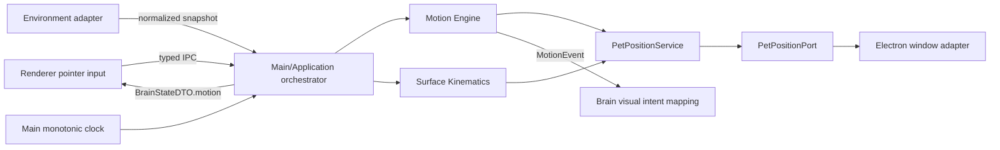
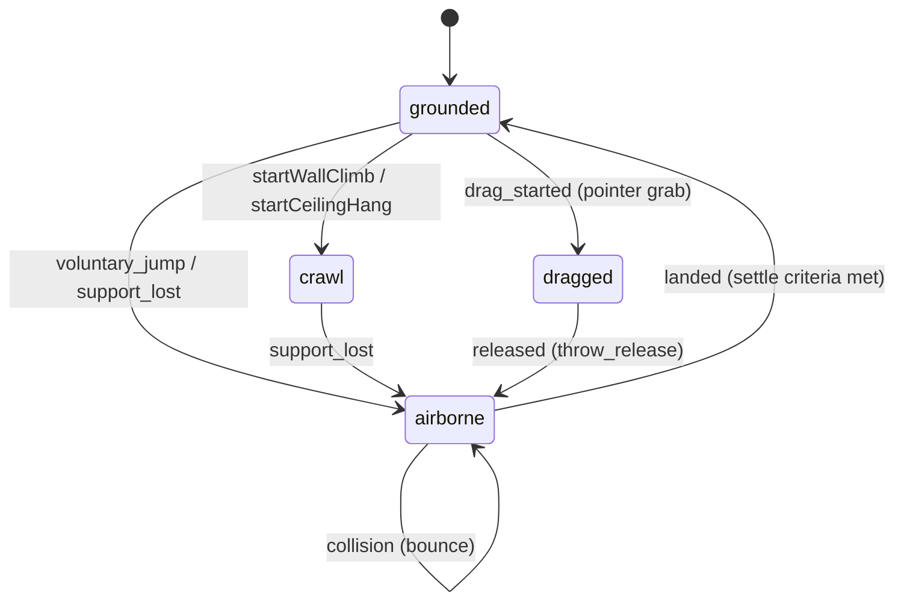
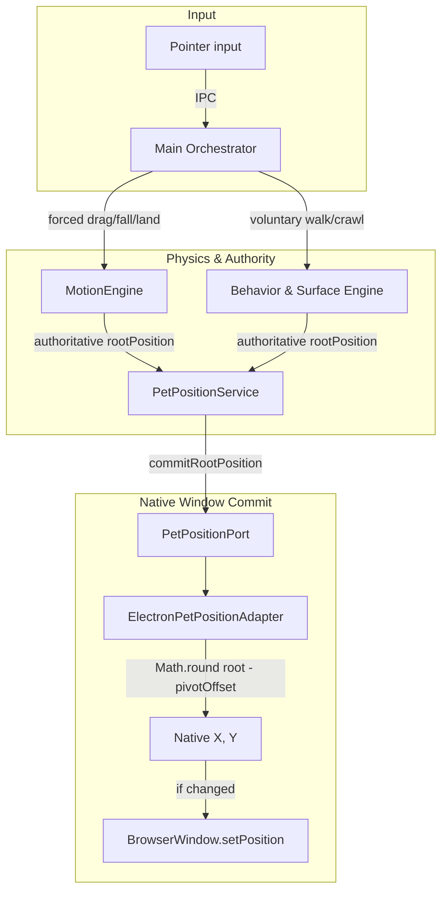

# Контракт Motion Engine

`MOTION_ENGINE.md` — source of truth для физических расчётов (drag, throw, fall, collision, crawl/support kinematics), правил авторитета позиции и границ применения перемещения окна.

Motion Engine фиксирует **физические факты** и принудительную позицию, но не выбирает автономное поведение персонажа. Архитектурное обоснование lightweight solver для native window вынесено в [`ADR-014`](../adr/ADR-014-native-window-motion.md). Доменные типы определены в [`motion-engine.ts`](../../src/domain/behavior/motion-engine.ts) и [`surface-kinematics.ts`](../../src/domain/behavior/surface-kinematics.ts).

## 1. Владение и поток



- **Motion Engine (Domain):** чистый физический солвер (drag, airborne, grounded, crawl/support), расчёт скоростей, коллизий и фактов посадки. Не управляет таймерами, окнами ОС и не принимает решений по поведению.
- **Surface Kinematics (Domain):** кинематика поверхностей опоры (wall climb, ceiling hang/crawl) и отрыв.
- **Main / Application Orchestrator:** агрегат состояния, интеграция по времени (fixed-step accumulator), валидация drag-сессий, диспатчеризация `MotionEvent`.
- **Infrastructure:** платформенные адаптеры экранов и реализация `PetPositionPort` (перемещение BrowserWindow).
- **Renderer:** пассивный рендеринг и захват событий указателя мыши. Не владеет физикой и авторитетной позицией.

Приоритеты P0–P5 определены в [`AUTONOMY_ENGINE.md`](./AUTONOMY_ENGINE.md); визуальные анимации — в [`ANIMATION_ENGINE.md`](./ANIMATION_ENGINE.md).

## 2. Координаты и базовые DTO

- **Единицы**: координаты — `WorldPx` (логический пиксель экрана / DIP, origin сверху слева, $x$ вправо, $y$ вниз); скорость — `WorldPx/s`; ускорение — `WorldPx/s²`; время/таймстемпы — monotonic ms.
- **Опорная точка (`rootPosition`)**: базовый контактный pivot персонажа (подошвы/центр опоры). Смещения рендерера и спрайтов вычисляются относительно него и не влияют на физический pivot.
- Типы данных (`Vector2Dto`, `ScreenBoundsDto`, `CollisionInsets`, `MotionState`, `MotionEvent`) импортируются напрямую из [`src/domain/behavior/motion-engine.ts`](../../src/domain/behavior/motion-engine.ts).

## 3. Физические состояния

Физический цикл движения разделяется на четыре базовых состояния:



1. **`drag` (`dragged`)**: Принудительное перемещение курсором пользователя. Персонаж привязан к pivot курсора с постоянным grab offset. Скорость обнулена, гравитация отключена. Немедленно отменяет текущую активность (P1 safety).
2. **`fall` (`airborne`)**: Свободный полёт/падение под действием гравитации и демпфирования. Возникает по трём причинам (`AirborneCause`):
   - `throw_release`: бросок пользователем после отпускания drag;
   - `support_lost`: потеря твердой поверхности (полка/окно исчезли или персонаж выполз за пределы);
   - `voluntary_jump`: санкционированный прыжок системы автономности.
3. **`land` (фаза стабилизации и приземления)**: Контакт с нижней поверхностью (`screen_floor` / границы экрана). Включает отскоки (`bounce`) и тангенциальное трение до выполнения критериев затухания (`settle`). Завершается исходом `soft_landing`, `stumble` или `crash_landing`.
4. **`crawl` (`climbing_wall`, `hanging_ceiling`)**: Кинематика движения по поверхностям ([`surface-kinematics.ts`](../../src/domain/behavior/surface-kinematics.ts)):
   - Движение по вертикальной стене (`climbing_wall`) со скоростью $v_{\text{vertical}}$;
   - Ползание по верхней кромке стороннего окна (`hanging_ceiling`) со скоростью $v_{\text{crawl}}$. При выходе за границу поверхности генерируется `support_lost` и персонаж переходит в `fall`.

## 4. Sliding-window throw vector

Оценка вектора скорости броска при отпускании драга использует взвешенную линейную регрессию выборки последних положений за окно `windowMs` (по умолчанию 100 мс, макс. 8 сэмплов):

```text
τ_i = (t_i - t_(n-1)) / 1000;  w_i = i + 1
τ̄ = Σ(w_i τ_i) / Σw_i;  x̄ = Σ(w_i x_i) / Σw_i;  ȳ = Σ(w_i y_i) / Σw_i
vx_raw = Σ[w_i(τ_i - τ̄)(x_i - x̄)] / Σ[w_i(τ_i - τ̄)²]
vy_raw = Σ[w_i(τ_i - τ̄)(y_i - ȳ)] / Σ[w_i(τ_i - τ̄)²]
s = sqrt(vx_raw² + vy_raw²);  k = min(1, maxThrowSpeed / max(s, ε))
vx = vx_raw × k;  vy = vy_raw × k
```

- Если количество сэмплов $< 2$ или span $< \text{minSpanMs}$ (24 мс), скорость броска принимается равной $(0, 0)$.
- Запрещено использовать мгновенную скорость по двум точкам или сырые дельты мыши (`movementX/Y`).

## 5. Интеграция физики (Fixed-step integration)

Интеграция выполняется фиксированным шагом $h$ (`fixedStepSec = 1/120` с) по схеме полунеявного метода Эйлера с экспоненциальным демпфированием:

```text
vy_accel = vy(t) + gravity × h
vx(t+h) = vx(t) × exp(-linearDampingX × h)
vy(t+h) = vy_accel × exp(-linearDampingY × h)
speed = sqrt(vx(t+h)² + vy(t+h)²)
velocity = velocity × min(1, maxSpeed / max(speed, ε))
x(t+h) = x(t) + vx(t+h) × h
y(t+h) = y(t) + vy(t+h) × h
```

Константы по умолчанию: $g = 1800\text{ px/s}^2$, $d_x = 0.35\text{ s}^{-1}$, $d_y = 0.08\text{ s}^{-1}$, $v_{\text{maxSpeed}} = 2400\text{ px/s}$.
Motion Engine является чистой функцией: при одинаковых входных данных результат строго детерминирован и не зависит от FPS рендера.

## 6. Коллизии, отскок и приземление

Эффективные границы рассчитываются с учётом отступов персонажа (`collisionInsets`):
```text
minX = bounds.x + insets.left;  maxX = bounds.x + bounds.width - insets.right
minY = bounds.y + insets.top;   maxY = bounds.y + bounds.height - insets.bottom
```

Отражение скорости при ударе:
- Стены (left/right): $v_{x,\text{after}} = -\text{wallRestitution} \times v_{x,\text{before}} \quad (\text{restitution} = 0.45)$
- Потолок (top): $v_{y,\text{after}} = -\text{ceilingRestitution} \times v_{y,\text{before}} \quad (\text{restitution} = 0.30)$
- Пол (bottom): $v_{y,\text{after}} = -\text{floorRestitution} \times v_{y,\text{before}}, \quad v_{x,\text{after}} = \text{floorTangentialRetention} \times v_{x,\text{before}} \quad (0.30, \; 0.72)$

Тяжесть удара (Impact severity) и пиковая нагрузка:
```text
normalImpact = max(0, vy_before); tangentialImpact = abs(vx_before)
impactSeverity = sqrt(normalImpact² + 0.25 × tangentialImpact²)
peak = max(previousPeak, impactSeverity)
```

### Критерий перехода в grounded (Settle)
Отскок происходит, если нормальная скорость удара $\text{normalImpact} > \text{minBounceNormalSpeed}$ (160 px/s). Иначе персонаж остаётся на полу, а тангенциальная скорость гасится. Переход в `grounded` наступает при соблюдении всех трёх условий:
```text
normalImpact <= settleNormalSpeed (120 px/s)
AND abs(vx_after) <= settleTangentialSpeed (90 px/s)
AND abs(y - maxY) <= ε
```

После этого скорость обнуляется и единожды генерируется событие приземления:
- $\text{peak} \le 420 \implies \text{soft\_landing}$
- $\text{peak} \le 950 \implies \text{stumble}$
- $\text{peak} > 950 \implies \text{crash\_landing}$

## 7. Кинематика поверхностей (Surfaces и crawl)

Управление движением по поверхностям изолировано в [`surface-kinematics.ts`](../../src/domain/behavior/surface-kinematics.ts). Модуль принимает нормализованный снимок окружения (`EnvironmentSnapshot`), не выполняя прямого обращения к OS API.

- **Стена (`climbing_wall`)**: $x = x_{\text{wall}}, \quad y(t+\Delta t) = y(t) + v_{\text{vertical}} \cdot \Delta t$.
- **Потолок/кромка окна (`hanging_ceiling` / crawl)**: $y = y_{\text{support}}, \quad x(t+\Delta t) = x(t) + v_{\text{crawl}} \cdot \Delta t$.
- **Валидация опоры**: при $x \notin [x_{\min}, x_{\max}]$ опоры, удалении окна или невалидности флага `isValidSupport` немедленно инициируется отрыв: `beginAirborne(..., cause: 'support_lost')`.

### 7.1. Lifecycle внешней опоры — целевой AUTO-A07

Кандидаты, filtering, identity, capability, TTL и DIP conversion принадлежат [Perception §10](./PERCEPTION_ENGINE.md#10-внешние-окна--целевой-контракт-auto-a07).
Domain принимает только выбранный нормализованный `ExternalWindowSurface`; native tracking и выбор окна здесь отсутствуют.
`window_side` использует `climbing_wall`, `window_top` — существующий `hanging_ceiling`; название фазы не означает нижнюю грань окна.

| Наблюдение на очередном Main tick | Результат |
|---|---|
| Тот же ID, та же geometry, fresh/valid | Продолжить движение по касательной. |
| Тот же ID, move без resize | Follow: сохранить локальное расстояние от начала кромки, применить новый origin. |
| Тот же ID, resize (включая move+resize) | Recompute: сохранить абсолютное локальное расстояние в DIP, пересчитать normal coordinate; при выходе за новый диапазон — `support_lost`. |
| Другой ID, окно отсутствует, minimize/close/hide/cloak/filter-out | `support_lost`; не выбирать замену в том же шаге. |
| Unavailable, stale > 300 ms, invalid geometry, topology/DPI invalidation | `support_lost`, удалить attachment baseline. |
| Restore/recovery/new window | Только новый кандидат; автоматического reattach нет. |

Для top начало кромки a=(bounds.x,bounds.y), касательная t=(1,0), длина L=width.
Для left/right начало a=(bounds.x либо bounds.x+width,bounds.y), t=(0,1), L=height.
Пусть s — сохранённое расстояние от начала предыдущей кромки в DIP, v — voluntary tangential velocity:
` s' = s + v * dt; root' = a_new + t * s' `, только если `0 <= s' <= L_new`.
На resize s не масштабируется пропорционально длине и не clamp-ится: иначе возникнет скрытая телепортация.
При move+resize применяются новый origin и новая длина атомарно. Delta применяется один раз относительно предыдущей geometry; повторный snapshot не прибавляет её снова.

Application хранит предыдущий accepted snapshot и передаёт его в будущую pure кинематику вместе с Main monotonic time. Алгоритм и расширение step input реализует app-developer.
Если follow/recompute выводит root за допустимые screen bounds с collisionInsets, выполняется `support_lost`, а не clamped attachment.
При потере опоры airborne начинается с последней принятой root position и текущей locomotion velocity; скорость перемещения окна не наследуется, импульс не оценивается по poll delta.
`support_lost` генерируется один раз при attached → airborne; дальнейшие stale/unavailable не повторяют событие. Экранный floor остаётся fallback для физики после отрыва, не мгновенной заменой опоры.
Drag имеет приоритет и отменяет attachment без дополнительного `support_lost` в том же шаге.

### 7.2 Traversal и направленные прыжки (AUTO-I04)

1. **Screen-Edge Traversal и отскок (Ninja Rebound):**
   - При карабкании по вертикальной стене экрана (`screen wall`) вверх Wisp поднимается до верхнего предела кромки экрана.
   - Вместо перехода на потолок Wisp выполняет **отскок ниндзя (Ninja Rebound)**: отталкивается от стены горизонтальным импульсом в сторону центра экрана и переходит в направленный прыжок/свободное падение (`jump -> fall -> land`).
   - При карабкании вниз до нижнего предела — Wisp плавно встаёт на пол (`floor`) и переходит в `walk` или `idle`.

2. **Направленные прыжки (Directed Jumps):**
   - Прыжок запускается как целевое действие Activity route: со стены, пола или кромки окна в сторону целевой опоры (пол, шапка окна) либо в направлении позиции курсора.
   - Траектория вычисляется параболически с начальным горизонтальным и вертикальным импульсом `(vx, vy)` и гравитацией.
   - При достижении целевой опоры выполняется мягкое приземление (`land`).
   - При прерывании (drag, menu, потеря цели) или промахе — переход в безопасный `fall -> land` на экранный пол (`floor`).

3. **Fallback-анимации для отсутствующих спрайтов:**
   - `pull_up_edge`: для экранов не используется (заменён на Ninja Rebound); для кромок окон fallback на `climb_wall` (последний кадр) -> `idle` / `body_sit_edge`.
   - `jump_travel`: использовать существующий кадр `jump` (фаза полёта) с последующим переходом в `fall`.
   - `grab_edge`: использовать существующий кадр зацепа `climb_wall`.


#### Реализованный screen-only slice

- `traversal-route.ts` строит маршрут внутри выбранного Explore: одна конечная floor-цель, без отдельного intent/timer. При energy ≥ 70 и comfort < 75 обычная цель до 300 DIP допускает jump; interesting-surface цель допускает approach до 500 DIP → grab (200 ms) → climb (220 DIP/s) → rebound → land (500 ms) → исходный осмотр.
- Screen-climb использует `calculateRootCollisionRange` с collisionInsets, а не физическую границу дисплея. Верхний предел сохраняет attachment до следующего шага того же run; нижний завершает шаг на полу. Screen pull-up/ceiling transition не создаётся.
- Directed arc: apex на 90 DIP выше более высокой точки, ограниченный верхним root-пределом; `vy = -sqrt(2*g*(originY-apexY))`, `T = (-vy+sqrt(vy²+2*g*(targetY-originY)))/g`, `vx = (targetX-originX)/T`. На верхнем пределе `vy=0`. Ограничения: 0.1 ≤ T ≤ 3 s, |vx| ≤ 900 DIP/s и Motion maxSpeed. Невыполнимые маршруты отбрасываются.
- Во время принятого arc Motion вычисляет `p(t)=p0+v0*t+(0,g*t²/2)` без damping, при посадке обнуляет скорость и выдаёт один soft `landed`. Отмена/промах удаляет ballistic target, сохраняя текущие позицию/скорость; далее действует обычный damped fall/land solver.
- Application проверяет неизменность screen geometry и валидность опоры каждый substep; completion/rejection связаны с `runId` + `stepId`. Pending rejection на полу не создаёт ложный forced-motion lifecycle. Drag удаляет attachment без дополнительного support_lost.
- Brain сохраняет Activity при `voluntary_jump`, показывает jump минимум 120 ms, затем fall по факту нисходящей скорости; land phase завершается по Main clock. Renderer completion не участвует.
- `AssetResolver.TRAVERSAL_SPRITE_FALLBACKS`: grab — `body_climb_wall[0]`, jump travel — `body_jump[0]`, резерв pull-up — последний `body_climb_wall[3]`. Кадр jump[1] содержит только motion marks, jump[2] — двух персонажей; для fallback выбран одиночный персонаж jump[0]. PNG и manifest не изменены. Window pull-up, target selection внешних окон и runtime внешних опор остаются в последующих window slices; фиктивные window surfaces не создаются.

## 8. Авторитет позиции: кто двигает окно



### Правила авторитета (Authority Rules)
1. **Renderer никогда не двигает окно**: окно не перемещается из Renderer-процесса и не имеет прямого доступа к окну Electron. Renderer лишь захватывает pointer events и отправляет их в Main через типизированный IPC.
2. **Forced vs Voluntary Motion**:
   - **Forced motion (P1/P0)**: при возникновении drag, throw release или support loss управление позицией монопольно захватывается Motion Engine. Текущие Activity немедленно отменяются. Никакие автономные команды перемещения не применяются.
   - **Voluntary motion**: возвращается персонажу **только** после полного завершения приземления, когда состояние стало `grounded` и FSM вошёл в стабильное состояние `settle`.
3. **Единая точка коммита позиции окна**:
   - Логический центр контакта `rootPosition` передаётся через интерфейс [`PetPositionPort`](../../src/application/ports/pet-position-port.ts).
   - Инфраструктурный адаптер [`ElectronPetPositionAdapter`](../../src/infrastructure/adapters/electron-pet-position-adapter.ts) переводит контактный pivot в верхний левый угол окна:
     $$x_{\text{native}} = \text{round}(\text{clamp}(x_{\text{root}} - \text{offset}_x, \dots)), \quad y_{\text{native}} = \text{round}(\text{clamp}(y_{\text{root}} - \text{offset}_y, \dots))$$
   - `BrowserWindow.setPosition` вызывается **строго при изменении целочисленных координат**, исключая спам IPC и дергание окна.

## 9. Оркестрация (ShimejiMotionOrchestrator)

Главный координатор в Application-слое ([`shimeji-motion-orchestrator.ts`](../../src/application/services/shimeji-motion-orchestrator.ts)) управляет жизненным циклом физического цикла:
- Владеет монотонными часами Main-процесса, аккумулятором времени и текущей drag-сессией.
- На каждом такте накапливает $\Delta t$ кадра (с отсечкой `maxFrameDeltaSec = 0.25`), исполняет дискретные шаги `fixedStepSec` и передаёт результат в [`PetPositionPort`](../../src/application/ports/pet-position-port.ts).
- Передаёт агрегатору Brain authoritative motion projection; Brain публикует не более одного цельного `BrainStateDTO` на внешний commit одного тика.

## 10. Граница IPC (Typed IPC Boundary)

Взаимодействие между процессами строится через контракт [`ipc-contracts.ts`](../../src/shared/ipc-contracts.ts):
- **События Drag**: целевой Body посылает варианты `drag_started` / `drag_moved` / `drag_ended` единого `BodyEventDTO` с общим порядком, `gestureId`, pointer ID и экранными координатами. Main регистрирует gesture только после valid start и отбрасывает stale/foreign события. Текущие отдельные drag methods являются migration input до AUTO-I09, а не вторым presentation protocol.
- **Состояние Brain**: Main рассылает `BrainStateDTO`; его поле `motion` содержит текущую фазу (`dragged` / `airborne` / `grounded`), authoritative root position, velocity и тип авторитета (`forced` / `voluntary`). Порядок, cadence и точная форма определены в [`UI_SPEC.md`](./UI_SPEC.md#6-brain--body-ipc).
- Контракты IPC являются независимым листом зависимостей и не содержат дескрипторов ОС, классов рендеринга или прямых ссылок на Electron.

## 11. Изоляция и проверяемые свойства

- **Независимость домена**: математика движения в [`MotionEngine`](../../src/domain/behavior/motion-engine.ts) и [`SurfaceKinematics`](../../src/domain/behavior/surface-kinematics.ts) не зависит от Electron, DOM, таймеров Node.js и файловой системы.
- **Детерминизм**: одинаковый входной снимок и констрейнты дают строго идентичное положение и события независимо от FPS рендера.
- **Безопасность авторитета**: окно Electron двигается только через адаптер [`PetPositionPort`](../../src/application/ports/pet-position-port.ts); race conditions и параллельное перемещение окна несколькими источниками исключены.
