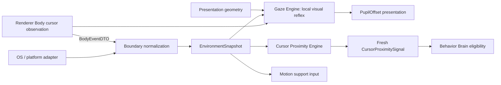

# Контракт Perception Engine

`PERCEPTION_ENGINE.md` — source of truth для gaze, cursor proximity, freshness и normalized environment signals. Perception вычисляет наблюдение и presentation offset, но не запускает Activity и не принимает semantic или motion decisions.

Координатные primitives `MonotonicMs`, `WorldPx`, `SourcePx`, `Vector2Dto` и `ScreenBoundsDto` определены в [`MOTION_ENGINE.md`](./MOTION_ENGINE.md#2-координаты-и-базовые-dto) и здесь не дублируются.

## 1. Владение

- **Gaze Engine (pure):** расчёт смещения зрачков (`PupilOffset`), состояний слежения/нейтрали и локальной visual freshness. Renderer Body может вызывать эту чистую функцию на RAF; она не управляет локомоцией и семантическими реакциями.
- **Cursor Proximity Engine (Domain):** расчёт нормализованного сигнала дистанции, диапазона и dwell курсора.
- **Environment Adapter (Infrastructure):** снятие геометрии дисплеев ОС и нормализация в `EnvironmentSnapshot`.
- **Внешние связи:** Body показывает быстрый gaze локально и refresh-ит доступный `cursor_observed` с bounded cadence 10 Hz по [Brain → Body cadence](./UI_SPEC.md#63-cadence-и-coalescing), независимо от RAF. Application ставит Main-monotonic receive time; Behavior Brain использует только нормализованный proximity signal для eligibility реактивных P3-активностей. Матрица контрактов — в [README.md](./README.md#4-матрица-межмодульных-контрактов-кто-от-кого-зависит).

## 2. Поток perception



EnvironmentSnapshot — наблюдение, а не команда. Gaze output — presentation component, proximity output — normalized signal. Ни один из них не является `BehaviorIntent` или `AnimationIntent`.

## 3. Gaze DTO и контракт взгляда

Типы и конфигурация Gaze Engine определены в [src/domain/behavior/gaze-engine.ts](../../src/domain/behavior/gaze-engine.ts).

- **Допустимые диапазоны смещения зрачка**: $dx, dy \in [-1.0, 1.0]$.
- **Deadzone и clamped circle**: в deadzone desired offset равен $(0, 0)$; вне deadzone результирующий вектор смещения зрачка ограничивается кругом единичного радиуса ($r = \sqrt{(dx/maxOffsetX)^2 + (dy/maxOffsetY)^2} \le 1.0$).
- **Валидация**: `scale`, max offsets и smoothing time $> 0$; остальные значения неотрицательны; `attentionRadiusWorldPx > deadZoneSourcePx × scale`.

## 4. Gaze normalization

Для cursor target используется `sample.globalPosition`, для world point — его `globalPosition`:

```text
dx_world = targetGlobal.x - rootGlobal.x
dy_world = targetGlobal.y - rootGlobal.y
dx_source = dx_world / scale
dy_source = dy_world / scale
dx_local = (flipX ? -dx_source : dx_source) - gazeOriginSourcePx.x
dy_local = dy_source - gazeOriginSourcePx.y
d = sqrt(dx_local² + dy_local²)
strength = clamp(
  (d - deadZoneSourcePx)
  / max(attentionRadiusWorldPx / scale - deadZoneSourcePx, ε),
  0,
  1
)
```

В dead zone desired offset равен `(0,0)`. Иначе:

```text
desired.x = (dx_local / d) × maxOffsetX × strength
desired.y = (dy_local / d) × maxOffsetY × strength
r = sqrt((desired.x/maxOffsetX)² + (desired.y/maxOffsetY)²)
if r > 1: desired = desired / r
alpha = 1 - exp(-max(deltaSec, 0) / smoothingTimeSec)
offset(t+dt) = offset(t) + alpha × (desired - offset(t))
```

`flipX` применяется ровно один раз. Missing, stale (`nowMs - capturedAtMs > maxCursorAgeMs`) или out-of-radius cursor задаёт desired `(0,0)` и smooth return to neutral.

Gaze не emits Activity/AnimationIntent. При baked-in face Body может не показывать pupil layer, не подавляя отдельный bounded-refresh `cursor_observed` для Brain proximity.

## 5. Cursor proximity DTO (Близость курсора)

Типы и контракт сигналов близости курсора определены в [src/domain/behavior/gaze-engine.ts](../../src/domain/behavior/gaze-engine.ts).

### Зоны близости курсора

| Зона | Дистанция | Назначение |
|---|---|---|
| `contact` | $\le 48\text{ px}$ | Непосредственный физический контакт / реакция swat |
| `near` | $\le 160\text{ px}$ | Близкое присутствие курсора |
| `ambient` | $\le 360\text{ px}$ | Фоновое наблюдение и внимание |
| `far` | $> 360\text{ px}$ | Вне зоны внимания / нейтральное состояние |

- **TTL свежести**: `300 мс` (сигналы старше TTL считаются устаревшими и сбрасывают dwell).

Body refresh interval `100 мс` строго меньше TTL и повторно подтверждает даже неподвижный доступный cursor sample. Поэтому непрерывное присутствие внутри зоны может накопить `swatDwellMs=450`; после остановки refresh Brain сбрасывает dwell, как только Main age последнего sample превысит 300 мс. Timer stall не компенсируется catch-up событиями: если age уже превысил TTL, обычное stale rule сбрасывает dwell до обработки следующего fresh interval.

## 6. Freshness, dwell и reaction signal

Initial state: `{ withinSwatRange: false, dwellWithinSwatRangeMs: 0, updatedAtMs: nowMs }`.

```text
fresh = cursor exists
    AND 0 <= nowMs - capturedAtMs <= signalMaxAgeMs
distance = world distance(rootGlobalPosition, cursor.globalPosition)
within = compatible AND fresh AND distance <= swatRadiusWorldPx
elapsed = max(0, nowMs - previous.updatedAtMs)
dwell' = within
  ? (previous.withinSwatRange ? previous.dwellWithinSwatRangeMs + elapsed : 0)
  : 0
```

Missing cursor возвращает no signal. Stale, out-of-range или incompatible input сбрасывает dwell. Engine не хранит timer или иной hidden state.

Существующий reaction gate:

```text
withinSwatRange
AND dwell >= swatDwellMs
AND signalAge <= signalMaxAgeMs
AND cooldown expired
AND context/personality/needs allow
AND state compatible
```

Starting thresholds сохраняются: `swatRadiusWorldPx=64`, `swatDwellMs=450`. Cooldown semantics определены только в Activity contract; Character values — только в Character contract.

Dwell сбрасывается при exit/stale/missing/incompatible state. Perception подавляет сигнал при `dragged`, fall lifecycle, land lifecycle, crash/recover и sleep visual lifecycle. Названия visual states здесь являются consumer compatibility list, а их transitions принадлежат Animation Engine.

Look-at остаётся gaze. Swat/chase/avoid — P3 Activity decisions и не стартуют внутри Perception.

## 7. Normalized environment signals

Доменные типы снимка окружения и поверхностей определены в [src/domain/behavior/surface-kinematics.ts](../../src/domain/behavior/surface-kinematics.ts).

Snapshot immutable. Adapter выбирает usable work area и нормализует OS limitations. Отсутствующий cursor/surface означает unavailable observation.

Snapshot не содержит native handles, PID, z-order, platform/source names, DOM objects или callbacks. Test и production snapshots эквивалентны. Future window-awareness может добавить только serializable geometry/capability DTO после Architect review.

Perception сообщает observed `isValidSupport`; решение начать `support_lost` и дальнейшая physics принадлежат Motion Engine. Environment data не создаёт behavior intent самостоятельно.

## 8. Environment IPC boundary

Shared IPC shapes остаются самостоятельными serializable DTO и не импортируют Domain types. Контракты IPC определены в [src/shared/ipc-contracts.ts](../../src/shared/ipc-contracts.ts). Main boundary mapper выполняет `EnvironmentSnapshotDTO <-> EnvironmentSnapshot`.

Текущий Domain import `EnvironmentSnapshot` в shared IPC является transitional debt и удаляется до публичной экспозиции stream. Эта миграция документации не меняет реализацию или DTO.

## 9. Изоляция и проверяемые свойства

- Gaze/proximity update — pure и полностью определяется explicit inputs/constraints.
- Freshness использует переданный monotonic `nowMs`, не `Date.now()`.
- Missing/stale input никогда не продолжает dwell.
- `flipX` применяется ровно один раз.
- Gaze offset не запускает Activity; proximity signal не является resolved behavior.
- Platform adapter отдаёт только normalized immutable snapshot.
- Body может вычислять только локальную visual freshness для gaze; authoritative semantic freshness/proximity вычисляется Brain по Main receive time.
- Motion получает observation и сам владеет support/physics transition.
