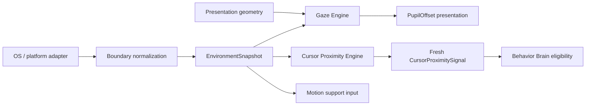

# Контракт Perception Engine

`PERCEPTION_ENGINE.md` — source of truth для gaze, cursor proximity, freshness и normalized environment signals. Perception вычисляет наблюдение и presentation offset, но не запускает Activity и не принимает semantic или motion decisions.

Координатные primitives `MonotonicMs`, `WorldPx`, `SourcePx`, `Vector2Dto` и `ScreenBoundsDto` определены в [`MOTION_ENGINE.md`](./MOTION_ENGINE.md#2-координаты-и-базовые-dto) и здесь не дублируются.

## 1. Владение

| Owner | Владеет | Не владеет |
|---|---|---|
| Gaze Engine | pupil offset, tracking/neutral state, freshness target | Activity, locomotion, semantic reaction |
| Cursor Proximity Engine | normalized distance/range/dwell signal | Swat/chase/avoid decision |
| Environment adapter | OS observation и normalization в immutable snapshot | physics/support decision |
| Application | capture time, snapshot boundary, compatibility input | gaze math или behavior choice |
| Behavior Brain | eligibility P3 Activity по свежему signal после resolved flow | perception thresholds/state |
| Renderer | отображение готового pupil offset либо no-op | freshness, proximity или environment discovery |

Cooldown/repetition принадлежат [`ACTIVITY_ENGINE.md`](./ACTIVITY_ENGINE.md); P3/P4 ordering — [`AUTONOMY_ENGINE.md`](./AUTONOMY_ENGINE.md); support interpretation — [`MOTION_ENGINE.md`](./MOTION_ENGINE.md#7-surfaces-и-support).

## 2. Поток perception



EnvironmentSnapshot — наблюдение, а не команда. Gaze output — presentation component, proximity output — normalized signal. Ни один из них не является `BehaviorIntent` или `AnimationIntent`.

## 3. Gaze DTO

```typescript
export interface CursorSample {
  readonly globalPosition: Vector2Dto;
  readonly capturedAtMs: MonotonicMs;
}

export type GazeTarget =
  | { readonly type: 'cursor'; readonly sample: CursorSample }
  | { readonly type: 'world_point'; readonly globalPosition: Vector2Dto }
  | { readonly type: 'neutral' };

export interface GazeGeometry {
  readonly rootGlobalPosition: Vector2Dto;
  readonly gazeOriginSourcePx: Vector2Dto;
  readonly scale: number;
  readonly flipX: boolean;
}

export interface GazeInput {
  readonly nowMs: MonotonicMs;
  readonly deltaSec: number;
  readonly target: GazeTarget;
  readonly geometry: GazeGeometry;
}

export interface PupilOffset {
  readonly xSourcePx: SourcePx;
  readonly ySourcePx: SourcePx;
}

export interface GazeConstraints {
  readonly attentionRadiusWorldPx: number;
  readonly deadZoneSourcePx: number;
  readonly maxPupilOffsetXSourcePx: number;
  readonly maxPupilOffsetYSourcePx: number;
  readonly smoothingTimeSec: number;
  readonly maxCursorAgeMs: number;
}

export interface GazeState {
  readonly mode: 'tracking' | 'returning_to_neutral' | 'neutral';
  readonly target?: GazeTarget;
  readonly pupilOffset: PupilOffset;
  readonly updatedAtMs: MonotonicMs;
}

export interface IGazeEngine {
  update(previous: GazeState, input: GazeInput, constraints: GazeConstraints): GazeState;
}
```

Validation требует `scale`, max offsets и smoothing time `> 0`; остальные значения неотрицательны; `attentionRadiusWorldPx > deadZoneSourcePx × scale`.

## 4. Gaze normalization

Для cursor target используется `sample.globalPosition`, для world point — его `globalPosition`:

```text
dx_world = targetGlobal.x - rootGlobal.x
dy_world = targetGlobal.y - rootGlobal.y
dx_source = dx_world / scale
dy_source = dy_world / scale
dx_local = (flipX ? -dx_source : dx_source) - gazeOriginSourcePx.x
dy_local = dy_source - gazeOriginSourcePx.y
d = sqrt(dx_local² + dy_local²)
strength = clamp(
  (d - deadZoneSourcePx)
  / max(attentionRadiusWorldPx / scale - deadZoneSourcePx, ε),
  0,
  1
)
```

В dead zone desired offset равен `(0,0)`. Иначе:

```text
desired.x = (dx_local / d) × maxOffsetX × strength
desired.y = (dy_local / d) × maxOffsetY × strength
r = sqrt((desired.x/maxOffsetX)² + (desired.y/maxOffsetY)²)
if r > 1: desired = desired / r
alpha = 1 - exp(-max(deltaSec, 0) / smoothingTimeSec)
offset(t+dt) = offset(t) + alpha × (desired - offset(t))
```

`flipX` применяется ровно один раз. Missing, stale (`nowMs - capturedAtMs > maxCursorAgeMs`) или out-of-radius cursor задаёт desired `(0,0)` и smooth return to neutral.

Gaze не emits Activity/AnimationIntent. При baked-in face Renderer может не показывать pupil layer, не подавляя proximity signal.

## 5. Cursor proximity DTO

```typescript
export interface CursorReactionConstraints {
  readonly attentionRadiusWorldPx: number;
  readonly swatRadiusWorldPx: number;
  readonly swatDwellMs: number;
  readonly signalMaxAgeMs: number;
  readonly swatCooldownKey: CooldownKey;
}

export interface CursorProximitySignal {
  readonly cursor: CursorSample;
  readonly distanceToRootWorldPx: number;
  readonly withinAttentionRange: boolean;
  readonly withinSwatRange: boolean;
  readonly dwellWithinSwatRangeMs: number;
  readonly emittedAtMs: MonotonicMs;
}

export interface CursorProximityState {
  readonly withinSwatRange: boolean;
  readonly dwellWithinSwatRangeMs: number;
  readonly updatedAtMs: MonotonicMs;
}

export interface CursorProximityInput {
  readonly nowMs: MonotonicMs;
  readonly rootGlobalPosition: Vector2Dto;
  readonly cursor?: CursorSample;
  readonly compatible: boolean;
}

export interface CursorProximityUpdate {
  readonly state: CursorProximityState;
  readonly signal?: CursorProximitySignal;
}

export interface ICursorProximityEngine {
  update(
    previous: CursorProximityState,
    input: CursorProximityInput,
    constraints: CursorReactionConstraints,
  ): CursorProximityUpdate;
}
```

## 6. Freshness, dwell и reaction signal

Initial state: `{ withinSwatRange: false, dwellWithinSwatRangeMs: 0, updatedAtMs: nowMs }`.

```text
fresh = cursor exists
    AND 0 <= nowMs - capturedAtMs <= signalMaxAgeMs
distance = world distance(rootGlobalPosition, cursor.globalPosition)
within = compatible AND fresh AND distance <= swatRadiusWorldPx
elapsed = max(0, nowMs - previous.updatedAtMs)
dwell' = within
  ? (previous.withinSwatRange ? previous.dwellWithinSwatRangeMs + elapsed : 0)
  : 0
```

Missing cursor возвращает no signal. Stale, out-of-range или incompatible input сбрасывает dwell. Engine не хранит timer или иной hidden state.

Существующий reaction gate:

```text
withinSwatRange
AND dwell >= swatDwellMs
AND signalAge <= signalMaxAgeMs
AND cooldown expired
AND context/personality/needs allow
AND state compatible
```

Starting thresholds сохраняются: `swatRadiusWorldPx=64`, `swatDwellMs=450`. Cooldown semantics определены только в Activity contract; Character values — только в Character contract.

Dwell сбрасывается при exit/stale/missing/incompatible state. Perception подавляет сигнал при `dragged`, fall lifecycle, land lifecycle, crash/recover и sleep visual lifecycle. Названия visual states здесь являются consumer compatibility list, а их transitions принадлежат Animation Engine.

Look-at остаётся gaze. Swat/chase/avoid — P3 Activity decisions и не стартуют внутри Perception.

## 7. Normalized environment signals

```typescript
export type SurfaceKind = 'screen_floor' | 'window_top' | 'unknown';

export interface SurfaceSnapshotDto {
  readonly id: string;
  readonly kind: SurfaceKind;
  readonly bounds: {
    readonly x: WorldPx;
    readonly y: WorldPx;
    readonly width: WorldPx;
    readonly height: WorldPx;
  };
  readonly supportY?: WorldPx;
  readonly isValidSupport: boolean;
}

export interface EnvironmentSnapshot {
  readonly capturedAtMs: MonotonicMs;
  readonly screenBounds: ScreenBoundsDto;
  readonly cursor?: CursorSample;
  readonly currentSurface?: SurfaceSnapshotDto;
}
```

Snapshot immutable. Adapter выбирает usable work area и нормализует OS limitations. Отсутствующий cursor/surface означает unavailable observation.

Snapshot не содержит native handles, PID, z-order, platform/source names, DOM objects или callbacks. Test и production snapshots эквивалентны. Future window-awareness может добавить только serializable geometry/capability DTO после Architect review.

Perception сообщает observed `isValidSupport`; решение начать `support_lost` и дальнейшая physics принадлежат Motion Engine. Environment data не создаёт behavior intent самостоятельно.

## 8. Environment IPC boundary

Shared IPC shapes остаются самостоятельными serializable DTO и не импортируют Domain types. Main boundary mapper выполняет `EnvironmentSnapshotDTO <-> EnvironmentSnapshot`.

```typescript
export interface EnvironmentScreenBoundsDTO extends ScreenBoundsDTO {
  readonly id: string;
}

export interface EnvironmentSurfaceDTO {
  readonly id: string;
  readonly kind: 'screen_floor' | 'window_top' | 'unknown';
  readonly bounds: ScreenBoundsDTO;
  readonly supportY?: number;
  readonly isValidSupport: boolean;
}

export interface EnvironmentSnapshotDTO {
  readonly capturedAtMs: number;
  readonly screenBounds: EnvironmentScreenBoundsDTO;
  readonly currentSurface?: EnvironmentSurfaceDTO;
}
```

Текущий Domain import `EnvironmentSnapshot` в shared IPC является transitional debt и удаляется до публичной экспозиции stream. Эта миграция документации не меняет реализацию или DTO.

## 9. Изоляция и проверяемые свойства

- Gaze/proximity update — pure и полностью определяется explicit inputs/constraints.
- Freshness использует переданный monotonic `nowMs`, не `Date.now()`.
- Missing/stale input никогда не продолжает dwell.
- `flipX` применяется ровно один раз.
- Gaze offset не запускает Activity; proximity signal не является resolved behavior.
- Platform adapter отдаёт только normalized immutable snapshot.
- Renderer не вычисляет authoritative freshness/proximity.
- Motion получает observation и сам владеет support/physics transition.
