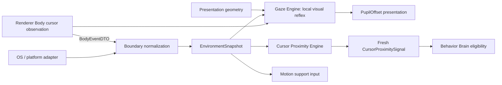

# Контракт Perception Engine

`PERCEPTION_ENGINE.md` — source of truth для gaze, cursor proximity, freshness и normalized environment signals. Perception вычисляет наблюдение и presentation offset, но не запускает Activity и не принимает semantic или motion decisions.

Координатные primitives `MonotonicMs`, `WorldPx`, `SourcePx`, `Vector2Dto` и `ScreenBoundsDto` определены в [`MOTION_ENGINE.md`](./MOTION_ENGINE.md#2-координаты-и-базовые-dto) и здесь не дублируются.

## 1. Владение

- **Gaze Engine (pure):** расчёт смещения зрачков (`PupilOffset`), состояний слежения/нейтрали и локальной visual freshness. Renderer Body может вызывать эту чистую функцию на RAF; она не управляет локомоцией и семантическими реакциями.
- **Cursor Proximity Engine (Domain):** расчёт нормализованного сигнала дистанции, диапазона и dwell курсора.
- **Environment Adapter (Infrastructure):** снятие геометрии дисплеев ОС и нормализация в `EnvironmentSnapshot`.
- **Внешние связи:** Body показывает быстрый gaze локально и refresh-ит доступный `cursor_observed` с bounded cadence 10 Hz по [Brain → Body cadence](./UI_SPEC.md#63-cadence-и-coalescing), независимо от RAF. Application ставит Main-monotonic receive time; Behavior Brain использует только нормализованный proximity signal для eligibility реактивных P3-активностей. Матрица контрактов — в [README.md](./README.md#4-матрица-межмодульных-контрактов-кто-от-кого-зависит).

## 2. Поток perception



EnvironmentSnapshot — наблюдение, а не команда. Gaze output — presentation component, proximity output — normalized signal. Ни один из них не является `BehaviorIntent` или `AnimationIntent`.

## 3. Gaze DTO и контракт взгляда

Типы и конфигурация Gaze Engine определены в [src/domain/behavior/gaze-engine.ts](../../src/domain/behavior/gaze-engine.ts).

- **Допустимые диапазоны смещения зрачка**: $dx, dy \in [-1.0, 1.0]$.
- **Deadzone и clamped circle**: в deadzone desired offset равен $(0, 0)$; вне deadzone результирующий вектор смещения зрачка ограничивается кругом единичного радиуса ($r = \sqrt{(dx/maxOffsetX)^2 + (dy/maxOffsetY)^2} \le 1.0$).
- **Валидация**: `scale`, max offsets и smoothing time $> 0$; остальные значения неотрицательны; `attentionRadiusWorldPx > deadZoneSourcePx × scale`.

## 4. Gaze normalization

Для cursor target используется `sample.globalPosition`, для world point — его `globalPosition`:

```text
dx_world = targetGlobal.x - rootGlobal.x
dy_world = targetGlobal.y - rootGlobal.y
dx_source = dx_world / scale
dy_source = dy_world / scale
dx_local = (flipX ? -dx_source : dx_source) - gazeOriginSourcePx.x
dy_local = dy_source - gazeOriginSourcePx.y
d = sqrt(dx_local² + dy_local²)
strength = clamp(
  (d - deadZoneSourcePx)
  / max(attentionRadiusWorldPx / scale - deadZoneSourcePx, ε),
  0,
  1
)
```

В dead zone desired offset равен `(0,0)`. Иначе:

```text
desired.x = (dx_local / d) × maxOffsetX × strength
desired.y = (dy_local / d) × maxOffsetY × strength
r = sqrt((desired.x/maxOffsetX)² + (desired.y/maxOffsetY)²)
if r > 1: desired = desired / r
alpha = 1 - exp(-max(deltaSec, 0) / smoothingTimeSec)
offset(t+dt) = offset(t) + alpha × (desired - offset(t))
```

`flipX` применяется ровно один раз. Missing, stale (`nowMs - capturedAtMs > maxCursorAgeMs`) или out-of-radius cursor задаёт desired `(0,0)` и smooth return to neutral.

Gaze не emits Activity/AnimationIntent. При baked-in face Body может не показывать pupil layer, не подавляя отдельный bounded-refresh `cursor_observed` для Brain proximity.

## 5. Cursor proximity DTO (Близость курсора)

Типы и контракт сигналов близости курсора определены в [src/domain/behavior/gaze-engine.ts](../../src/domain/behavior/gaze-engine.ts).

### Зоны близости курсора

| Зона | Дистанция | Назначение |
|---|---|---|
| `contact` | $\le 48\text{ px}$ | Непосредственный физический контакт / реакция swat |
| `near` | $\le 160\text{ px}$ | Близкое присутствие курсора |
| `ambient` | $\le 360\text{ px}$ | Фоновое наблюдение и внимание |
| `far` | $> 360\text{ px}$ | Вне зоны внимания / нейтральное состояние |

- **TTL свежести**: `300 мс` (сигналы старше TTL считаются устаревшими и сбрасывают dwell).

Body refresh interval `100 мс` строго меньше TTL и повторно подтверждает даже неподвижный доступный cursor sample. Поэтому непрерывное присутствие внутри зоны может накопить `swatDwellMs=450`; после остановки refresh Brain сбрасывает dwell, как только Main age последнего sample превысит 300 мс. Timer stall не компенсируется catch-up событиями: если age уже превысил TTL, обычное stale rule сбрасывает dwell до обработки следующего fresh interval.

## 6. Freshness, dwell и reaction signal

Initial state: `{ withinSwatRange: false, dwellWithinSwatRangeMs: 0, updatedAtMs: nowMs }`.

```text
fresh = cursor exists
    AND 0 <= nowMs - capturedAtMs <= signalMaxAgeMs
distance = world distance(rootGlobalPosition, cursor.globalPosition)
within = compatible AND fresh AND distance <= swatRadiusWorldPx
elapsed = max(0, nowMs - previous.updatedAtMs)
dwell' = within
  ? (previous.withinSwatRange ? previous.dwellWithinSwatRangeMs + elapsed : 0)
  : 0
```

Missing cursor возвращает no signal. Stale, out-of-range или incompatible input сбрасывает dwell. Engine не хранит timer или иной hidden state.

Существующий reaction gate:

```text
withinSwatRange
AND dwell >= swatDwellMs
AND signalAge <= signalMaxAgeMs
AND cooldown expired
AND context/personality/needs allow
AND state compatible
```

Starting thresholds сохраняются: `swatRadiusWorldPx=64`, `swatDwellMs=450`. Cooldown semantics определены только в Activity contract; Character values — только в Character contract.

Dwell сбрасывается при exit/stale/missing/incompatible state. Perception подавляет сигнал при `dragged`, fall lifecycle, land lifecycle, crash/recover и sleep visual lifecycle. Названия visual states здесь являются consumer compatibility list, а их transitions принадлежат Animation Engine.

Look-at остаётся gaze. Swat/avoid — local P3 Activity decisions и не стартуют внутри Perception.
AUTO-A09 не вводит постоянную chase: ограниченный cursor interest подчинён
[общему admission/budget](./AUTONOMY_ENGINE.md#13-auto-a09-локальная-жизнь-и-ненавязчивость).

### 6.1. AUTO-A09: bounded cursor interest

Stationary Observe Cursor из #23 сохраняется: gaze, существующий доступный gesture,
без locomotion по умолчанию. Новая approach Activity внутри `play` выбирается явно в #48
только после freshness/dwell, Character Needs/friendship, cooldown и общего budget gate.
Усталость может оставить только gaze; P2 и AI ownership запрещают новую local Activity.
Один эпизод использует один run, deadline и максимум одну фиксированную цель на той же
достижимой опоре; новые samples обновляют gaze/валидность, но не retarget и не продлевают run.
Approach — существующий walk с ограничением суммарной дистанции из `InitiativeTuning`;
новые прыжки/traversal primitives и переход между опорами для погони не допускаются.
Потеря freshness, уход курсора за область интереса, исчезновение/недостижимость цели,
user/physics interruption или deadline завершают эпизод с обычным cleanup и свежим local выбором.
Движение курсора не перезапускает эпизод. Gaze-only не расходует budget и не даёт play reward;
подтверждённая игровая фаза использует once-only [Activity outcome](./ACTIVITY_ENGINE.md#16-auto-a09-единый-outcome-и-ownership).

## 7. Normalized environment signals

Доменные типы снимка окружения и поверхностей определены в [src/domain/behavior/surface-kinematics.ts](../../src/domain/behavior/surface-kinematics.ts).

Snapshot immutable. Adapter выбирает usable work area и нормализует OS limitations. Отсутствующий cursor/surface означает unavailable observation.

Snapshot не содержит native handles, PID, z-order, platform/source names, DOM objects или callbacks. Test и production snapshots эквивалентны. Целевой контракт внешних окон AUTO-A07 определён ниже; native metadata не пересекают Infrastructure boundary.

Perception сообщает observed `isValidSupport`; решение начать `support_lost` и дальнейшая physics принадлежат Motion Engine. Environment data не создаёт behavior intent самостоятельно.

## 8. Environment IPC boundary

Shared IPC shapes остаются самостоятельными serializable DTO и не импортируют Domain types. Контракты IPC определены в [src/shared/ipc-contracts.ts](../../src/shared/ipc-contracts.ts). Main boundary mapper выполняет `EnvironmentSnapshotDTO <-> EnvironmentSnapshot`.

Shared IPC уже не импортирует Domain. AUTO-A07 объявляет целевое поле `side`; обновление mapper и подключение stream выполняет app-developer одновременно с реализацией. Текущий runtime остаётся screen-only.

## 9. Изоляция и проверяемые свойства

- Gaze/proximity update — pure и полностью определяется explicit inputs/constraints.
- Freshness использует переданный monotonic `nowMs`, не `Date.now()`.
- Missing/stale input никогда не продолжает dwell.
- `flipX` применяется ровно один раз.
- Gaze offset не запускает Activity; proximity signal не является resolved behavior.
- Platform adapter отдаёт только normalized immutable snapshot.
- Body может вычислять только локальную visual freshness для gaze; authoritative semantic freshness/proximity вычисляется Brain по Main receive time.
- Motion получает observation и сам владеет support/physics transition.

## 10. Внешние окна — целевой контракт AUTO-A07

Это спецификация следующего implementation slice, а не утверждение о готовности runtime.
Порт [ExternalWindowSurfacesPort](../../src/application/ports/external-window-surfaces.port.ts) отделён от существующего Electron-aware `IPlatformAdapter`.
Infrastructure публикует полный набор кандидатов; Application выбирает `currentSurface` и передаёт его Motion. Renderer не выбирает опору.

### Модель и capability

Нормализованный [ExternalWindowSurface](../../src/domain/behavior/surface-kinematics.ts) — discriminated union поверх существующего snapshot.

| Поле | Инвариант |
|---|---|
| `id` | Непрозрачный ID конкретной кромки, уникальный на срок жизни приложения; не HWND/PID, не их строка или hash. |
| `kind` | `window_top` либо `window_side`. Нижняя грань окна не поддерживается. |
| `bounds` | Видимый frame rectangle в глобальных DIP: конечные x/y, width/height > 0. Отрицательные x/y допустимы. |
| `supportY` | Только для `window_top`, обязательно равно `bounds.y`. Верх от x до x + width. |
| `side` | Только для `window_side`, обязательно `left` или `right`; x равен bounds.x либо bounds.x + width, y от bounds.y до bounds.y + height. |
| `isValidSupport` | true только для прошедшей все проверки кромки; false никогда не становится опорой. |

Верх окна и пол используют общий выбор поведения и поз: прогулка, наблюдение,
сидение, отдых и сон. Тип опоры не даёт бонуса при выборе цели и не запускает
отдельную Activity после посадки. Геометрия влияет на доступный маршрут и границы
ходьбы; движение окна переносит персонажа, потеря опоры запускает падение.

Окно даёт до трёх кромок, с различными ID. Все наблюдения immutable; набор — полная замена, не delta.
`revision` строго возрастает на каждый новый снимок в экземпляре порта, включая unavailable/recovery; меньшие/повторные revision игнорируются.
`capturedAtMs` — Main monotonic request-start time, не время доставки и не часы helper. Чтение cache не освежает timestamp.

- Windows: `available` только после успешной полной выборки и нормализации; пустой массив означает отсутствие подходящих окон.
- Windows startup: `unavailable/initializing`; timeout, parse/API failure или запрещённый bridge: `unavailable/bridge_failed`; TTL: `unavailable/stale`.
- Linux (Wayland/X11) и macOS: `unavailable/unsupported`, пустой набор внешних поверхностей; существующий screen-floor/work-area продолжает работать. Вызовов Win32 на этих платформах нет.
- `unavailable` всегда несёт пустой массив. Нельзя подменять им screen capability или придумывать window geometry. Возврат `available` не прикрепляет персонажа автоматически.
- Порт отдаёт cache синхронно, subscribe — полные ordered snapshots; dispose останавливает helper, sampling и callbacks. Main владеет lifecycle.

### Filtering и приватность

Первый slice допускает только обычные прямоугольные desktop top-level окна текущего интерактивного desktop.
Внутри bridge: `EnumWindows`, `GetAncestor(GA_ROOT)`, `GetWindow(GW_OWNER)`, styles, `IsWindowVisible`, `IsIconic`, DWM attributes.
Исключаются child/owned окна; `WS_POPUP`, `WS_EX_TOOLWINDOW`, `WS_EX_NOACTIVATE`, `WS_EX_TRANSPARENT`, `WS_EX_LAYERED`; отключённые окна и окна с нестандартным region.
Это намеренно консервативный набор: borderless/translucent приложения могут не стать поверхностью.
Исключаются все процессы/окна Wisp (включая helper, меню и devtools), desktop/shell (`GetDesktopWindow`, `GetShellWindow`, классы `Progman`, `WorkerW`, `Shell_TrayWnd`, `Shell_SecondaryTrayWnd`), меню, tooltip и диалоги (`#32768`, `tooltips_class32`, `#32770`).
Невидимые, minimized, `DWMWA_CLOAKED != 0`, окна вне work area и недоступные для проверки объекты не дают опор.
Titles не запрашиваются вообще; PID/handles/classes/styles нужны только внутри Infrastructure и не попадают в Domain, Renderer, trace, persistence или тексты ошибок.

`IsWindowVisible` не доказывает отсутствие перекрытия. Bridge консервативно исключает всю кромку, если её пересекает прямоугольник любого более высокого видимого не-cloaked окна (включая transient; исключая Wisp).
Частичные открытые сегменты в этом slice не строятся. При неизвестной геометрии возможного occluder выборка считается неуспешной.
Z-order используется только внутри bridge и наружу не передаётся. Результат не обещает pixel-perfect occlusion или поддержку secure desktop.

### Identity, sampling и geometry

Bridge хранит приватное соответствие native window lifetime → opaque token; три ID кромок производны только от этого token.
Move/resize не меняют ID. При destroy, пропуске окна в полной выборке, minimize/hide/filter-out или перезапуске bridge token безвозвратно удаляется; возвращённое окно получает новый.
HWND может переиспользоваться даже между poll: для сохранения ID обязательна доставка lifecycle create/destroy через `SetWinEventHook` с message loop; при потере непрерывности helper сбрасывает всю identity epoch. Poll-only reuse HWND как identity запрещён.
Callbacks — только сигнал повторной выборки; не authoritative geometry. Трекинг и его реализация в AUTO-A07 не входят.

Целевая частота полной выборки — не чаще 10 Hz, один запрос in flight, без catch-up очереди. Event invalidation может немедленно снять опору; положительная geometry публикуется только полной выборкой.
TTL = 300 ms: `0 <= nowMs - capturedAtMs <= 300`. После TTL Application не использует старую опору даже при зависшем helper; recovery требует новой выборки.
Бюджет одного запроса 250 ms; отрицательный age, неполный/повреждённый ответ, разрыв последовательности или изменение topology во время выборки инвалидируют её.

Источник frame — `DwmGetWindowAttribute(DWMWA_EXTENDED_FRAME_BOUNDS)` (physical px). `GetWindowRect` не подставляется как равнозначный: он DPI-virtualized и может включать невидимые resize borders.
Frame должен пересекать ровно один физический дисплей; пересечение двух дисплеев (spanning) исключается. AUTO-V01 допускает выход тела окна за внешний край desktop, если публикуемая кромка целиком внутри workArea; исходные bounds сохраняются без clipping.
Infrastructure конвертирует rectangle ровно один раз через Electron `screen.screenToDipRect(null, rect)`; нельзя делить global x/y на scaleFactor или использовать дисплей Wisp вместо дисплея frame.
Кромка принимается только если полностью внутри workArea соответствующего дисплея; clipping, создающий ложную кромку, запрещён.
Разные окна могут находиться на разных DPI-дисплеях. Глобальные DIP согласованы с `ScreenBoundsDto`; перед коммитом Application выбирает bounds того же дисплея и проверяет допустимость root с collisionInsets.
При `display-added/removed/metrics-changed` все внешние опоры инвалидируются до новой полной выборки; предыдущий geometry baseline для follow удаляется. Невозможность нормализации означает unavailable.

### Dependency Review: Win32 bridge (2026-09-06)

**Решение: approved — системный Windows PowerShell 5.1 + собственный C# P/Invoke helper, новая npm-зависимость не нужна.**
Это одобрение архитектуры Windows-first наблюдателя с fallback, а не подтверждение производительности готовой реализации.
`Add-Type` объявляет только нужные read-only User32/Dwmapi вызовы и lifecycle hook; helper живёт одним дочерним процессом, а не запускается на каждый poll.
Node `child_process.spawn` уже доступен в Electron Main; bridge/paths/OS branches целиком в `src/infrastructure/platform/`.
Путь executable определяется системным каталогом и `path.join`, shell=false, фиксированный bundled script, `-NoProfile -NonInteractive`, скрытое окно; нет динамического кода из titles/IPC, elevation, ExecutionPolicy bypass, downloads или сторонних PowerShell modules.
Запрет Add-Type политикой, отсутствие executable или неподдерживаемая среда дают unavailable, без обхода политики. На shutdown helper завершается.
Helper выводит ограниченный newline JSON с token/physical geometry; handles/PID не сериализуются. Infrastructure валидирует schema, число записей (не более 512), размер ответа (не более 256 KiB) и deadline до публикации; превышение даёт unavailable, не частичный набор.

| Критерий AGENTS.md | Оценка |
|---|---|
| 1. Лицензия | Собственный helper под лицензией проекта MIT. PowerShell 5.1/.NET/Win32 используются как компоненты установленной Windows, не распространяются с приложением; permissive npm license gate не применим. |
| 2. Размер/transitives | Добавлено 0 npm packages и 0 transitives, bundlephobia/npm trends неприменимы. Helper source будет bundled в реализации; цена отдельного PowerShell процесса и startup ненулевая и требует Windows измерения. |
| 3. Активность/CVE | npm release-last-year/CVE gate неприменим: нового пакета нет. Windows PowerShell обслуживается в lifecycle ОС, новых features не получает. Нулевые CVE установленной ОС не заявляются; нужны поддерживаемая обновлённая Windows и её security servicing. |
| 4. Native bindings | Нет Node C++ addon/node-gyp или Electron ABI rebuild; P/Invoke остаётся native interop в отдельном системном процессе. Pure JS/WASM не предоставляет User32 enumeration/hooks. |
| 5. Альтернатива 50–100 строк | Узкие P/Invoke declarations возможны без общего FFI package; полный безопасный observer с lifetime/timeout/filtering больше 100 строк. Это не причина тащить универсальный addon: выбирается собственный ограниченный helper с явным runtime fallback. |

`package.json` и lockfile остаются без изменений. Koffi/ffi-napi не одобряются этим решением и не добавляются; их выбор потребует отдельного Dependency Review.
Для implementation verification обязательны Windows smoke: packaged helper discovery, shutdown, Add-Type denied, timeout, HWND reuse, mixed DPI (100/150/200%), spanning exclusion, occlusion и move/resize/minimize/close. Linux screen-only regression обязателен.
Если наблюдатель не укладывается в cadence/TTL, он остаётся unavailable; менять bridge или ослаблять freshness без review нельзя.

### Primary documentation, сверено 2026-09-06

- [Electron screen](https://www.electronjs.org/docs/latest/api/screen): physical/DIP conversion и display events.
- [EnumWindows](https://learn.microsoft.com/en-us/windows/win32/api/winuser/nf-winuser-enumwindows): desktop top-level enumeration, без обещания всех видов окон.
- [GetWindowRect](https://learn.microsoft.com/en-us/windows/win32/api/winuser/nf-winuser-getwindowrect) и [DWM attributes](https://learn.microsoft.com/en-us/windows/win32/api/dwmapi/ne-dwmapi-dwmwindowattribute): frame bounds, DPI и cloaking.
- [Window features](https://learn.microsoft.com/en-us/windows/win32/winmsg/window-features): ownership, styles и visibility.
- [SetWinEventHook](https://learn.microsoft.com/en-us/windows/win32/api/winuser/nf-winuser-setwineventhook): out-of-context callbacks и обязательный message loop.
- [Add-Type 5.1](https://github.com/MicrosoftDocs/PowerShell-Docs/blob/main/reference/5.1/Microsoft.PowerShell.Utility/Add-Type.md): вызовы native Windows API из C#.
- [PowerShell support lifecycle](https://learn.microsoft.com/en-us/powershell/scripting/install/powershell-support-lifecycle): обслуживание Windows PowerShell как компонента ОС.
