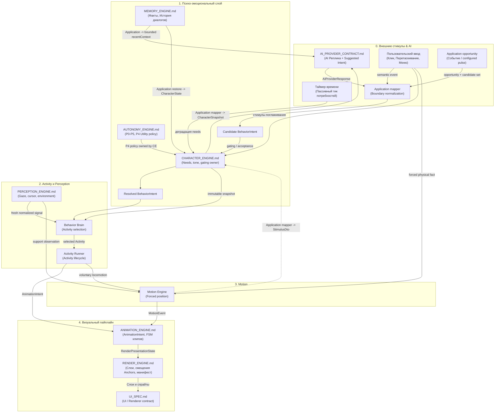

# Индекс engine contracts

`docs/engine/` является source of truth для engine contracts Project Wisp. Эти документы фиксируют границы между provider output, поведением персонажа, выбором анимации, рендером и памятью до начала implementation-задач.

Все authoritative contracts в реестре приняты; незавершённых architect gates среди них нет. Статус product implementation ведётся отдельно и не делает принятый contract черновиком. `UI_SPEC.md` принят как архитектурный контракт UI/Renderer в `DOC-A04`.

---

## 1. Реестр контрактов

| Документ | Назначение |
|---|---|
| [`CHARACTER_ENGINE.md`](./CHARACTER_ENGINE.md) | Модель личности: потребности (`Needs`), отношения (`Relationship`), оси характера (`PersonalityAxis`), романтика (`IntimacyState`), эмоции. |
| [`BEHAVIOR_INTENTS.md`](./BEHAVIOR_INTENTS.md) | Семантические намерения: *что* персонаж решил сделать (`wander`, `play`, `sleep`, `drag`, `land`, `react_happy`). |
| [`AUTONOMY_ENGINE.md`](./AUTONOMY_ENGINE.md) | P0–P5, P4 Utility eligibility/scoring/arbitration, Application cadence, trace и safety. |
| [`ACTIVITY_ENGINE.md`](./ACTIVITY_ENGINE.md) | Activity definitions, выбор внутри resolved intent, lifecycle, chains, guards, cooldown и repetition. |
| [`MOTION_ENGINE.md`](./MOTION_ENGINE.md) | Drag/throw/fall/collision/surfaces, position authority, Main/Application orchestration и typed IPC. |
| [`PERCEPTION_ENGINE.md`](./PERCEPTION_ENGINE.md) | Gaze, cursor proximity/freshness и normalized environment signals. |
| [`ANIMATION_ENGINE.md`](./ANIMATION_ENGINE.md) | Визуальные намерения: `AnimationIntent`, FSM анимаций, приоритеты, прерывания, тайминги клипов. |
| [`RENDER_ENGINE.md`](./RENDER_ENGINE.md) | Визуализация: схема `manifest.json`, слои (`RenderLayerId`), смещения `anchors`/`pivot`, fallback, presentation projection. |
| [`UI_SPEC.md`](./UI_SPEC.md) | UI/Renderer boundaries: presentation state, typed user intents, local UI state, cleanup и privacy. |
| [`MEMORY_ENGINE.md`](./MEMORY_ENGINE.md) | Оффлайн-память: сообщения, факты пользователя, эпизодическая память, JSON-снапшоты состояния. |
| [`AI_PROVIDER_CONTRACT.md`](./AI_PROVIDER_CONTRACT.md) | AI-диалог: контракт `IAIProvider`, DTO реплик и Suggested Intent на основе `CharacterSnapshot`. |

---

## 2. Канонические shared definitions

| Общее определение | Единственный authoritative contract | Consumer boundary |
|---|---|---|
| Needs, tone, sleep/wake thresholds и quiet semantics | [`CHARACTER_ENGINE.md`](./CHARACTER_ENGINE.md) | Autonomy и Activity потребляют готовый Character snapshot/gates без локальных thresholds. |
| Public `BehaviorIntent` DTO и kinds | [`BEHAVIOR_INTENTS.md`](./BEHAVIOR_INTENTS.md#форма-intent) | Provider mapper, Autonomy и Activity не расширяют public catalog локально. |
| Utility scoring и P0–P5 | [`AUTONOMY_ENGINE.md`](./AUTONOMY_ENGINE.md) | Character Engine исполняет policy; остальные движки только соблюдают resolved order. |
| Activity lifecycle, cooldown и repetition | [`ACTIVITY_ENGINE.md`](./ACTIVITY_ENGINE.md) | Behavior Brain/Runner не принимают semantic решения. |
| Physics, support и position orchestration | [`MOTION_ENGINE.md`](./MOTION_ENGINE.md) | Renderer и Perception не владеют world position. |
| Environment, cursor и gaze signals | [`PERCEPTION_ENGINE.md`](./PERCEPTION_ENGINE.md) | Motion/Behavior используют normalized observations без OS discovery. |
| Visual lifecycle `sleep_start` / `sleep_loop` / `wake_up` | [`ANIMATION_ENGINE.md`](./ANIMATION_ENGINE.md#витальный-сон-и-пробуждение) | Render отображает resolved presentation и не принимает sleep/wake decisions. |

`sleep`, `quiet` и `wake` — semantic behavior terms. `sleep_start`, `sleep_loop` и `wake_up` — animation-only presentation terms; совпадение слов не переносит ownership между Character и Animation engines.

`RenderPresentationState` ниже — conceptual имя внутренней presentation projection Animation Player → Renderer, а не определённый этим индексом public DTO. Его публичная форма потребует отдельного contract review.

---

## 3. Граф зависимостей и поток данных между движками

Единственный порядок behavior decision: boundary input → candidate `BehaviorIntent` → Character Engine gating/P4 Utility → resolved `BehaviorIntent` → Activity selection → Activity execution → `AnimationIntent`. Application сериализует cadence и boundary normalization. Forced physical facts не являются behavior decision: Motion Engine применяет их независимо, отменяет Activity и направляет `MotionEvent` в тот же Animation FSM. Подробная ownership-матрица — в [`BEHAVIOR_INTENTS.md`](./BEHAVIOR_INTENTS.md#поток-ответственности).

---

## 4. Матрица межмодульных контрактов (Кто от кого зависит)

| Модуль (Движок) | Входящие зависимости (От кого получает данные) | Исходящие данные (Кому передаёт) | Контракт обмена (DTO / Events) |
|---|---|---|---|
| **`AI_PROVIDER`** | `CharacterSnapshot` и bounded `recentContext` через Application | Реплика + Suggested Behavior | `AIProviderResponse` → `ProviderResponseIntentMapper` |
| **`CHARACTER_ENGINE`** | Candidate `BehaviorIntent`/P4 set, внешние stimuli и Application opportunities | Один resolved `BehaviorIntent`, Character state/tone | `BehaviorIntent`, `CharacterState`, `Needs`, `StimulusDto` |
| **`BEHAVIOR_INTENTS`** | Boundary suggestion/event через Application mapper | Candidate → resolved semantic decision | `BehaviorIntent` (`wander`, `play`, `sleep`, `drag`, `land`...) |
| **`AUTONOMY_ENGINE`** | Application-owned opportunity/snapshot и finite P4 candidate set | Eligibility, score trace, один winner через Character Engine | Internal pure Utility policy; public intent shape не расширяется |
| **`ACTIVITY_ENGINE`** | Resolved `BehaviorIntent`, immutable Character/environment/history context | Selected Activity, `AnimationIntent`, voluntary locomotion, feedback | `ActivityDefinition`, `runId`, `CooldownEntry`, bounded repetition history |
| **`MOTION_ENGINE`** | Drag/support input, normalized environment, fixed Application step | Authoritative position, `MotionEvent`, presentation snapshot | `MotionState`, `MotionEvent`, `PetPositionPort`, motion IPC DTO |
| **`PERCEPTION_ENGINE`** | Cursor/environment observations и presentation geometry | `PupilOffset`, fresh proximity signal, normalized environment snapshot | `GazeState`, `CursorProximitySignal`, `EnvironmentSnapshot` |
| **`ANIMATION_ENGINE`** | `AnimationIntent` из Activity или direct behavior; `MotionEvent` | Conceptual `RenderPresentationState` после Animation Player | `AnimationIntent`, `MotionEvent`, visual priorities и transitions |
| **`RENDER_ENGINE`** | Conceptual `RenderPresentationState`, `PupilOffset`, `manifest.json` | Итоговый рендер в окне (React/Canvas) | `RenderLayerId`, `VisibleRenderLayerDef`, `anchors[face]`, `pivot` |
| **`UI_SPEC`** | Presentation DTO/capabilities из Main и `RenderPresentationState` | Semantic user intents через typed Preload boundary | Local UI state + существующие serializable IPC DTO |
| **`MEMORY_ENGINE`** | `ChatMessage`, `UserFactDraft`, `PersistedCharacterStateSnapshot` через Application | Bounded `recentContext`, `UserFact`, восстановленный state snapshot | `ChatMessage`, `UserFact`, `PersistedCharacterStateSnapshot` |

---

## 5. Общие архитектурные границы и изоляция (Clean Architecture)

Во всех движках Wisp соблюдаются фундаментальные правила изоляции слоёв:

1. **Domain Layer (`src/domain/`):**
   - Чистая бизнес-логика. Полностью изолирован от побочных эффектов и платформы.
   - **Запрещено:** импорты React, JSX, DOM, CSS, Electron (`BrowserWindow`, `ipcRenderer`, `ipcMain`), Node.js (`fs`), системных таймеров (`setTimeout`), неявного времени (`Date.now()`), неявной случайности (`Math.random()`), внешних LLM SDK и прямого SQL.
   - **Инвариант детерминизма:** монотонное время передаётся аргументом (`opportunityAtMs: number`), случайность — через seeded PRNG (`randomUnit: number`). При одинаковых входах результат всегда идентичен.

2. **Application Layer (`src/application/`):**
   - Use cases, оркестрация, порты репозиториев (`application/ports`), boundary normalization, сборка снапшотов.
   - Не принимает художественных и семантических решений за персонажа; не содержит сырых SQL-запросов и UI-разметки.

3. **Infrastructure Layer (`src/infrastructure/`):**
   - Реализация портов: адаптеры SQLite (`better-sqlite3`), Electron windows, таймеры ОС, AI-провайдеры.

4. **Renderer / UI Layer (`src/renderer/`):**
   - React, Canvas, CSS, Zustand UI-stores.
   - Пассивно отображает презентационный срез, передаваемый из Main по IPC. Не выполняет доменных расчётов и не меняет стейт в обход typed IPC.
