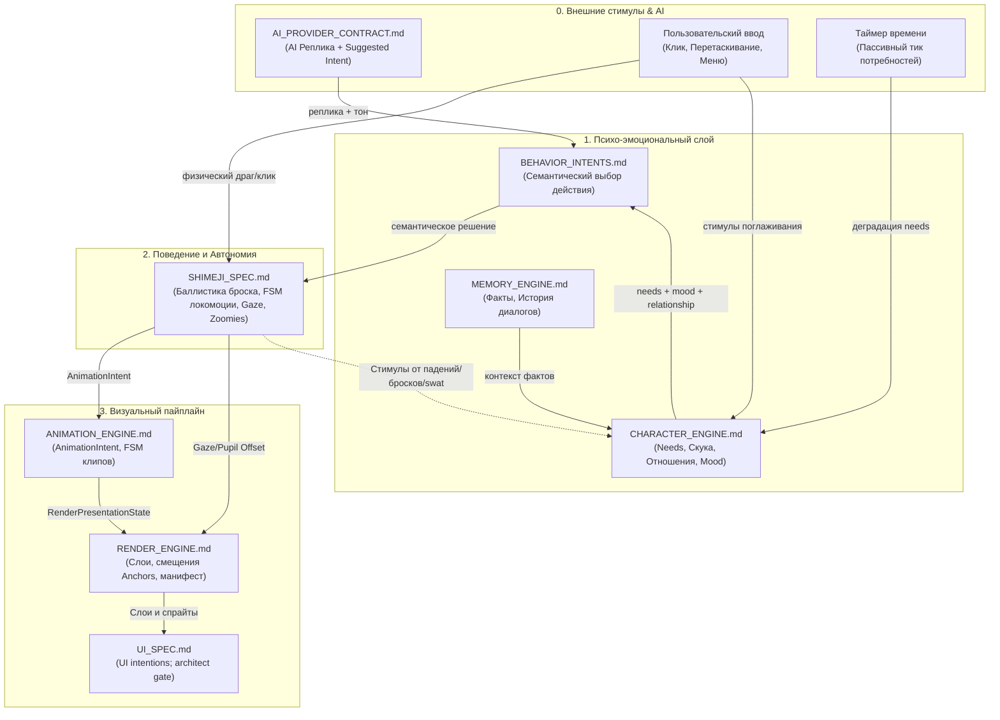

# Индекс engine contracts

`docs/engine/` является source of truth для engine contracts Project Wisp. Эти документы фиксируют границы между provider output, поведением персонажа, выбором анимации, рендером и памятью до начала implementation-задач.

Исключение: `UI_SPEC.md` пока содержит только продуктовые намерения и станет контрактом после architect gate.

---

## 1. Реестр контрактов

| Документ | Назначение |
|---|---|
| [`CHARACTER_ENGINE.md`](./CHARACTER_ENGINE.md) | Модель личности: потребности (`Needs`), отношения (`Relationship`), оси характера (`PersonalityAxis`), романтика (`IntimacyState`), эмоции. |
| [`BEHAVIOR_INTENTS.md`](./BEHAVIOR_INTENTS.md) | Семантические намерения: *что* персонаж решил сделать (`wander`, `play`, `sleep`, `drag`, `land`, `react_happy`). |
| [`SHIMEJI_SPEC.md`](./SHIMEJI_SPEC.md) | Автономия и физика: локомоция (сидеть/лежать/бег/прыжки), баллистика бросков, слежение зрачками, цепочки активностей, Zoomies. |
| [`ANIMATION_ENGINE.md`](./ANIMATION_ENGINE.md) | Визуальные намерения: `AnimationIntent`, FSM анимаций, приоритеты, прерывания, тайминги клипов. |
| [`RENDER_ENGINE.md`](./RENDER_ENGINE.md) | Визуализация: схема `manifest.json`, слои (`RenderSlot`), смещения `anchors`/`pivot`, fallback, презентационный DTO. |
| [`UI_SPEC.md`](./UI_SPEC.md) | Намерения UI/Renderer; архитектурный контракт должен подготовить `architect`. |
| [`MEMORY_ENGINE.md`](./MEMORY_ENGINE.md) | Оффлайн-память: сообщения, факты пользователя, эпизодическая память, JSON-снапшоты состояния. |
| [`AI_PROVIDER_CONTRACT.md`](./AI_PROVIDER_CONTRACT.md) | AI-диалог: контракт `IAIProvider`, DTO реплик и Suggested Intent на основе `CharacterSnapshot`. |

---

## 2. Граф зависимостей и поток данных между движками

---

## 3. Матрица межмодульных контрактов (Кто от кого зависит)

| Модуль (Движок) | Входящие зависимости (От кого получает данные) | Исходящие данные (Кому передаёт) | Контракт обмена (DTO / Events) |
|---|---|---|---|
| **`AI_PROVIDER`** | `CharacterSnapshot` (из Character Engine) | Реплика + Suggested Behavior | `ProviderResponseDto` → `ProviderResponseIntentMapper` |
| **`CHARACTER_ENGINE`** | Внешние стимулы, таймеры, события из `SHIMEJI` | Текущее эмоциональное состояние, доступность действий | `CharacterState`, `Needs` (включая `boredom`), `StimulusDto` |
| **`BEHAVIOR_INTENTS`** | `CharacterState` + Suggested Behavior | Выбранное намерение действия | `BehaviorIntent` (`wander`, `play`, `sleep`, `drag`, `land`...) |
| **`SHIMEJI_SPEC`** | `BehaviorIntent`, `CharacterState` (Needs/Mood), ввод мыши | Запросы на анимацию, смещение зрачков, стимулы падений | `AnimationIntent`, `GazeOffsetDto`, `StimulusDto` |
| **`ANIMATION_ENGINE`** | `AnimationIntent` (из Behavior/Shimeji) | Презентационный стейт клипа | `ActiveAnimationState`, приоритеты, прерывания |
| **`RENDER_ENGINE`** | `ActiveAnimationState`, `GazeOffsetDto`, `manifest.json` | Итоговый рендер в окне (React/Canvas) | `RenderPresentationState`, `anchors[face]`, `pivot` |
| **`UI_SPEC`** | Пока не определено | Пока не определено | Intent brief; требуется architect gate |
| **`MEMORY_ENGINE`** | Сообщения чата, `CharacterSnapshot`, факты | Исторический контекст для AI и восстановления | `EpisodeDto`, `UserFactDto`, `MemoryQuery` |
