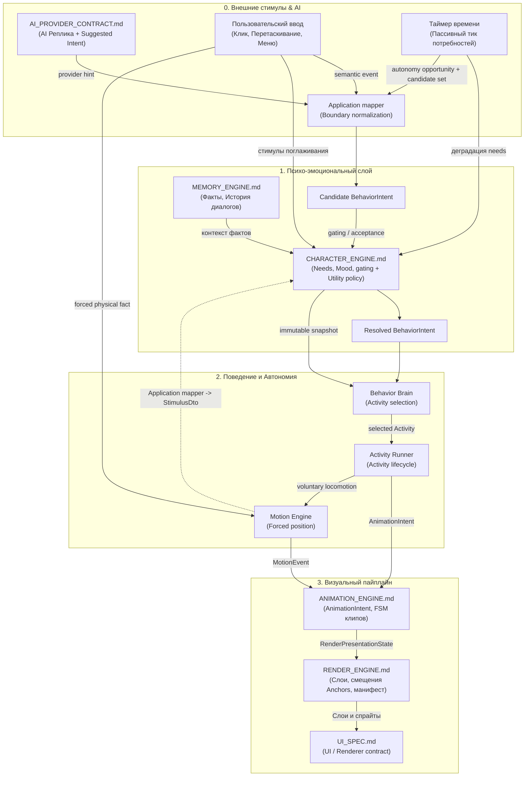

# Индекс engine contracts

`docs/engine/` является source of truth для engine contracts Project Wisp. Эти документы фиксируют границы между provider output, поведением персонажа, выбором анимации, рендером и памятью до начала implementation-задач.

`UI_SPEC.md` принят как архитектурный контракт UI/Renderer в `DOC-A04`.

---

## 1. Реестр контрактов

| Документ | Назначение |
|---|---|
| [`CHARACTER_ENGINE.md`](./CHARACTER_ENGINE.md) | Модель личности: потребности (`Needs`), отношения (`Relationship`), оси характера (`PersonalityAxis`), романтика (`IntimacyState`), эмоции. |
| [`BEHAVIOR_INTENTS.md`](./BEHAVIOR_INTENTS.md) | Семантические намерения: *что* персонаж решил сделать (`wander`, `play`, `sleep`, `drag`, `land`, `react_happy`). |
| [`SHIMEJI_SPEC.md`](./SHIMEJI_SPEC.md) | Автономия и физика: локомоция (сидеть/лежать/бег/прыжки), баллистика бросков, слежение зрачками, цепочки активностей, Zoomies. |
| [`ANIMATION_ENGINE.md`](./ANIMATION_ENGINE.md) | Визуальные намерения: `AnimationIntent`, FSM анимаций, приоритеты, прерывания, тайминги клипов. |
| [`RENDER_ENGINE.md`](./RENDER_ENGINE.md) | Визуализация: схема `manifest.json`, слои (`RenderSlot`), смещения `anchors`/`pivot`, fallback, презентационный DTO. |
| [`UI_SPEC.md`](./UI_SPEC.md) | UI/Renderer boundaries: presentation state, typed user intents, local UI state, cleanup и privacy. |
| [`MEMORY_ENGINE.md`](./MEMORY_ENGINE.md) | Оффлайн-память: сообщения, факты пользователя, эпизодическая память, JSON-снапшоты состояния. |
| [`AI_PROVIDER_CONTRACT.md`](./AI_PROVIDER_CONTRACT.md) | AI-диалог: контракт `IAIProvider`, DTO реплик и Suggested Intent на основе `CharacterSnapshot`. |

---

## 2. Канонические shared definitions

| Общее определение | Единственный authoritative contract | Consumer boundary |
|---|---|---|
| Словарь и синтез `SynthesizedEmotionalTone` | [`CHARACTER_ENGINE.md`](./CHARACTER_ENGINE.md#8-эмоциональный-тон-синтез-настроения) | Animation, Shimeji и Render только потребляют готовый tone и не повторяют union/формулы. |
| Семантика и пороги `sleep` / `wake`; отличие `quiet` | [`CHARACTER_ENGINE.md`](./CHARACTER_ENGINE.md#21-каноническая-семантика-сна-и-пробуждения) | Behavior catalog сохраняет semantic names; Shimeji исполняет resolved behavior без повторной проверки thresholds. |
| Visual lifecycle `sleep_start` / `sleep_loop` / `wake_up` | [`ANIMATION_ENGINE.md`](./ANIMATION_ENGINE.md#витальный-сон-и-пробуждение) | Render отображает resolved presentation и не принимает sleep/wake decisions. |

`sleep`, `quiet` и `wake` — semantic behavior terms. `sleep_start`, `sleep_loop` и `wake_up` — animation-only presentation terms; совпадение слов не переносит ownership между Character и Animation engines.

---

## 3. Граф зависимостей и поток данных между движками

Единственный порядок behavior decision: boundary input → candidate `BehaviorIntent` → Character Engine gating → resolved `BehaviorIntent` → Activity selection → Activity execution → `AnimationIntent`. Forced physical facts не являются behavior decision: Motion Engine применяет их независимо, отменяет Activity и направляет `MotionEvent` в тот же Animation FSM. Подробная ownership-матрица — в [`BEHAVIOR_INTENTS.md`](./BEHAVIOR_INTENTS.md#поток-ответственности).

---

## 4. Матрица межмодульных контрактов (Кто от кого зависит)

| Модуль (Движок) | Входящие зависимости (От кого получает данные) | Исходящие данные (Кому передаёт) | Контракт обмена (DTO / Events) |
|---|---|---|---|
| **`AI_PROVIDER`** | `CharacterSnapshot` (из Character Engine) | Реплика + Suggested Behavior | `ProviderResponseDto` → `ProviderResponseIntentMapper` |
| **`CHARACTER_ENGINE`** | Candidate `BehaviorIntent`/P4 candidate set, внешние стимулы и autonomy opportunities | Один resolved `BehaviorIntent`, текущее эмоциональное состояние | `BehaviorIntent`, `CharacterState`, `Needs`, `StimulusDto`; Utility policy остаётся внутренней Domain strategy |
| **`BEHAVIOR_INTENTS`** | Boundary suggestion/event через Application mapper | Candidate → resolved semantic decision | `BehaviorIntent` (`wander`, `play`, `sleep`, `drag`, `land`...) |
| **`SHIMEJI_SPEC`** | Resolved `BehaviorIntent`, `CharacterSnapshot`, environment/user physical events | Selected Activity, `AnimationIntent`, `MotionEvent`, gaze и feedback | `AnimationIntent`, `MotionEvent`, `GazeOffsetDto`, `StimulusDto` |
| **`ANIMATION_ENGINE`** | `AnimationIntent` (из Behavior/Shimeji) | Презентационный стейт клипа | `ActiveAnimationState`, приоритеты, прерывания |
| **`RENDER_ENGINE`** | `ActiveAnimationState`, `GazeOffsetDto`, `manifest.json` | Итоговый рендер в окне (React/Canvas) | `RenderPresentationState`, `anchors[face]`, `pivot` |
| **`UI_SPEC`** | Presentation DTO/capabilities из Main и `RenderPresentationState` | Semantic user intents через typed Preload boundary | Local UI state + существующие serializable IPC DTO |
| **`MEMORY_ENGINE`** | Сообщения чата, `CharacterSnapshot`, факты | Исторический контекст для AI и восстановления | `EpisodeDto`, `UserFactDto`, `MemoryQuery` |
