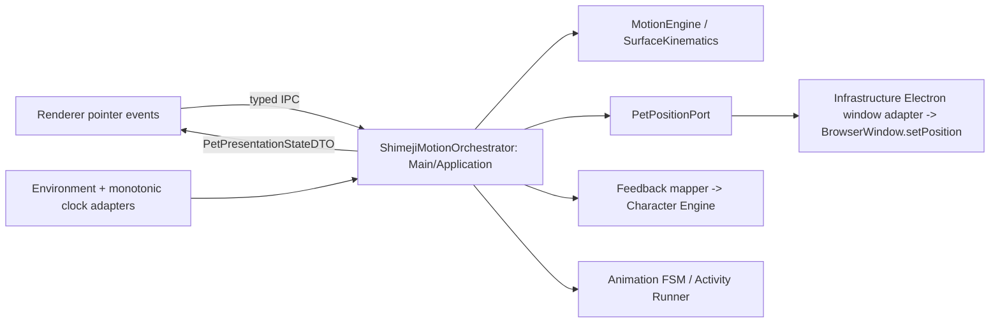

# Контракт Shimeji Engine

Source of truth для Phase 14: Activity, drag/throw physics, gaze/cursor reactions и environment boundary. Дополняет [`CHARACTER_ENGINE.md`](./CHARACTER_ENGINE.md), [`BEHAVIOR_INTENTS.md`](./BEHAVIOR_INTENTS.md), [`ANIMATION_ENGINE.md`](./ANIMATION_ENGINE.md) и [`RENDER_ENGINE.md`](./RENDER_ENGINE.md).

## 1. Границы и поток данных

```text
Environment adapters -> EnvironmentSnapshot --------------------------+
Character Engine -> Behavior Brain -> Activity Runner -> AnimationIntent -> FSM -> Render
                                      -> voluntary locomotion ---------+
Drag/release/support -> Motion Engine -> MotionEvent -> FSM -----------+-> world transform
Environment + presentation geometry -> Gaze Engine -------------------+-> gaze presentation
Gaze Engine -> CursorProximitySignal -> Behavior Brain
Motion/Activity/user event -> ShimejiFeedbackEvent -> Application mapper -> StimulusDto -> Character Engine
```

| Модуль | Владеет | Не владеет |
|---|---|---|
| Behavior Brain | eligibility и weighted Activity selection | physics, frames |
| Activity Runner | lifecycle одной Activity, `AnimationIntent`, voluntary command | Render Engine |
| Animation FSM | pose/locomotion transitions и visual interrupt policy | behavior choice |
| Motion Engine | forced position при drag/fall/collision | autonomous choice |
| Gaze Engine | pupil presentation и proximity signal | Activity/locomotion launch |
| Character Engine | Needs, Relationship, Personality, Intimacy, tone, stimulus reduction | physics/render |
| Application/adapters | snapshots, clocks, mapping, OS data | domain decisions |

В forced-motion run ровно один position owner — Motion Engine. Application возвращает authority voluntary locomotion только когда physics уже `grounded` **и** landing/recover FSM вошёл в стабильный `settle`; Renderer не владеет world-position.

## 2. Координаты и Motion Engine

`WorldPx` — logical desktop pixel/DIP; world origin top-left, `x` вправо, `y` вниз, координаты могут быть отрицательными. `SourcePx` — source-canvas pixel Render Engine. Скорость — `WorldPx/s`, ускорение — `WorldPx/s²`, physics delta — секунды; timestamps/durations — monotonic ms. `MotionState.position` — root/contact pivot.

```typescript
export type MonotonicMs = number;
export type WorldPx = number;
export type SourcePx = number;
export interface Vector2Dto { readonly x: number; readonly y: number }
export type MotionPhase = 'dragged' | 'airborne' | 'grounded';
export type AirborneCause = 'throw_release' | 'voluntary_jump' | 'support_lost';
export interface AirborneLaunch { readonly cause: AirborneCause; readonly position: Vector2Dto; readonly velocityPxPerSec: Vector2Dto; readonly boundsId: string; readonly atMs: MonotonicMs }
export interface ThrowVector { readonly vxPxPerSec: number; readonly vyPxPerSec: number; readonly sampledAtMs: MonotonicMs; readonly sampleCount: number; readonly sampleSpanMs: number }
export interface ScreenBoundsDto { readonly id: string; readonly x: WorldPx; readonly y: WorldPx; readonly width: WorldPx; readonly height: WorldPx }
export interface CollisionInsets { readonly left: WorldPx; readonly right: WorldPx; readonly top: WorldPx; readonly bottom: WorldPx }
export interface ThrowSamplingConstraints { readonly windowMs: number; readonly maxSamples: number; readonly minSpanMs: number; readonly maxThrowSpeedPxPerSec: number }
export interface MotionConstraints {
  readonly gravityPxPerSec2: number; readonly linearDampingXPerSec: number; readonly linearDampingYPerSec: number; readonly fixedStepSec: number; readonly maxFrameDeltaSec: number; readonly maxSpeedPxPerSec: number;
  readonly wallRestitution: number; readonly ceilingRestitution: number; readonly floorRestitution: number; readonly floorTangentialRetention: number;
  readonly minBounceNormalSpeedPxPerSec: number; readonly settleNormalSpeedPxPerSec: number; readonly settleTangentialSpeedPxPerSec: number;
  readonly softLandingMaxSeverity: number; readonly stumbleMaxSeverity: number;
  readonly collisionInsets: CollisionInsets; readonly throwSampling: ThrowSamplingConstraints;
}
export type LandingOutcome = 'soft_landing' | 'stumble' | 'crash_landing';
export interface MotionState { readonly phase: MotionPhase; readonly position: Vector2Dto; readonly velocityPxPerSec: Vector2Dto; readonly activeBoundsId: string; readonly airborneElapsedSec: number; readonly peakGroundImpactSeverity: number }
export type MotionEvent =
  | { readonly type: 'drag_started'; readonly atMs: MonotonicMs } | { readonly type: 'released'; readonly throwVector: ThrowVector } | { readonly type: 'airborne_started'; readonly cause: AirborneCause; readonly atMs: MonotonicMs }
  | { readonly type: 'collision'; readonly side: 'left' | 'right' | 'top' | 'bottom'; readonly normalSpeedPxPerSec: number }
  | { readonly type: 'landed'; readonly outcome: LandingOutcome; readonly impactSeverity: number };
export interface MotionStepResult { readonly state: MotionState; readonly events: readonly MotionEvent[] }
export interface PointerMotionSample { readonly position: Vector2Dto; readonly capturedAtMs: MonotonicMs }
export interface MotionStepInput { readonly state: MotionState; readonly stepSec: number; readonly bounds: ScreenBoundsDto }
export interface IMotionEngine {
  beginDrag(state: MotionState, pivotPosition: Vector2Dto, boundsId: string, atMs: MonotonicMs): MotionStepResult; updateDraggedPosition(state: MotionState, pivotPosition: Vector2Dto): MotionState;
  estimateThrow(samples: readonly PointerMotionSample[], releaseAtMs: MonotonicMs): ThrowVector; release(state: MotionState, throwVector: ThrowVector): MotionStepResult; beginAirborne(state: MotionState, launch: AirborneLaunch): MotionStepResult;
  step(input: MotionStepInput): MotionStepResult;
}
export const DEFAULT_MOTION_CONSTRAINTS: MotionConstraints = {
  gravityPxPerSec2: 1800, linearDampingXPerSec: 0.35, linearDampingYPerSec: 0.08,
  fixedStepSec: 1 / 120, maxFrameDeltaSec: 0.25, maxSpeedPxPerSec: 2400,
  wallRestitution: 0.45, ceilingRestitution: 0.30, floorRestitution: 0.30, floorTangentialRetention: 0.72,
  minBounceNormalSpeedPxPerSec: 160, settleNormalSpeedPxPerSec: 120, settleTangentialSpeedPxPerSec: 90,
  softLandingMaxSeverity: 420, stumbleMaxSeverity: 950, collisionInsets: { left: 50, right: 50, top: 90, bottom: 10 },
  throwSampling: { windowMs: 100, maxSamples: 8, minSpanMs: 24, maxThrowSpeedPxPerSec: 2200 },
};
```

Validation: positive bounds/steps; non-negative damping/speeds; restitution/retention in `[0,1]`; `minBounce >= settleNormal`; `softLandingMax < stumbleMax`; legal inset range non-empty. Sprite packs may override only collision insets; other tuning goes through `MotionConstraints`.

### 2.1. Sliding-window throw vector

Sort samples, collapse duplicate timestamps keeping the last, then take at most `maxSamples` where `t_i >= releaseAtMs - windowMs`. If fewer than two or span `< minSpanMs`, velocity is `(0,0)`. Otherwise weighted least squares:
```text
τ_i = (t_i - t_(n-1)) / 1000;  w_i = i + 1
τ̄ = Σ(w_i τ_i) / Σw_i;  x̄ = Σ(w_i x_i) / Σw_i;  ȳ = Σ(w_i y_i) / Σw_i
vx_raw = Σ[w_i(τ_i - τ̄)(x_i - x̄)] / Σ[w_i(τ_i - τ̄)²]
vy_raw = Σ[w_i(τ_i - τ̄)(y_i - ȳ)] / Σ[w_i(τ_i - τ̄)²]
s = sqrt(vx_raw² + vy_raw²);  k = min(1, maxThrowSpeed / max(s, ε))
vx = vx_raw × k;  vy = vy_raw × k
```
Zero denominator gives `(0,0)`. Pointer/root samples are equivalent under constant grab offset; two-last-sample or `movementX/Y` estimation is invalid. `release` converts `ThrowVector` to `AirborneLaunch(cause='throw_release')`. Approved jump supplies `voluntary_jump` position/impulse; lost or invalid support supplies `support_lost` current position/velocity. `beginAirborne` resets airborne counters and emits `airborne_started`; every value is explicit.

### 2.2. Fixed-step semi-implicit Euler

```text
Motion.step(input), h = input.stepSec:
  vy_accel = vy(t) + gravity × h
  vx(t+h) = vx(t) × exp(-linearDampingX × h)
  vy(t+h) = vy_accel × exp(-linearDampingY × h)
  speed = sqrt(vx(t+h)² + vy(t+h)²)
  velocity = velocity × min(1, maxSpeed / max(speed, ε))
  x(t+h) = x(t) + vx(t+h) × h
  y(t+h) = y(t) + vy(t+h) × h
// Application/orchestrator; accumulator is not Domain/Motion state
frameDelta = clamp(renderDeltaSec, 0, maxFrameDeltaSec); applicationAccumulator += frameDelta
while applicationAccumulator >= h, h = fixedStepSec:
  result = motion.step({ state, stepSec: h, bounds }); state = result.state
  applicationAccumulator -= h
```
Application сохраняет remainder. Motion не хранит accumulator/clock и при одинаковых `MotionStepInput` + `MotionConstraints` возвращает одинаковый result; render FPS не участвует в Domain math.

### 2.3. Collision, bounce, landing

```text
minX = bounds.x + insets.left;  maxX = bounds.x + bounds.width - insets.right
minY = bounds.y + insets.top;   maxY = bounds.y + bounds.height - insets.bottom
left/right: vx_after = -wallRestitution × vx_before
top:        vy_after = -ceilingRestitution × vy_before
bottom bounce: vy_after = -floorRestitution × vy_before
               vx_after = floorTangentialRetention × vx_before
normalImpact = max(0, vy_before);  tangentialImpact = abs(vx_before)
impactSeverity = sqrt(normalImpact² + 0.25 × tangentialImpact²)
peak = max(previousPeak, impactSeverity)
```
Clamp penetration; reflect only outward velocity. Bounce when `normalImpact > minBounceNormalSpeed`. Otherwise `y=maxY`, `vy=0`, and each step `vx *= floorTangentialRetention` until:
```text
normalImpact <= settleNormalSpeed AND abs(vx_after) <= settleTangentialSpeed AND abs(y-maxY) <= ε
```
Then grounded: `y=maxY; vx=vy=0`; emit once:
```text
peak <= softLandingMaxSeverity -> soft_landing
peak <= stumbleMaxSeverity     -> stumble
peak >  stumbleMaxSeverity     -> crash_landing
```
Side/top collisions do not determine landing. Bounds update only between steps; invalid support запускается только явным `beginAirborne(...cause='support_lost')`. Domain physics receives DTO/config/delta and never calls Electron, DOM, Node, timers, `screen` or OS APIs.

## 3. Forced motion, FSM и приоритеты

```text
Voluntary: Behavior Brain -> Activity -> AnimationIntent/FSM + voluntary locomotion
Forced: Drag/support/release/collision -> Motion Engine -> MotionEvent -> same FSM
```
Behavior Brain never decides whether Wisp falls, collides or lands. Application converts approved `jump` and adapter-reported lost/invalid support into explicit `beginAirborne` launches. Forced motion suspends voluntary commands and cancels (never pauses) active Activity; `grounded` alone не возвращает position authority — требуется также стабильный `settle` после landing/recover.

| Motion event | FSM request | Policy |
|---|---|---|
| `drag_started` | `START_DRAG` / `dragged` | critical, non-interruptible |
| `airborne_started: throw_release/support_lost/voluntary_jump` | `RELEASE_DRAG` or `FALL` -> `fall` | resolved at least high |
| `landed: soft_landing` | `LAND` / `land` -> `settle` | high |
| `landed: stumble` | `stumble` -> `settle` | high, bounded |
| `landed: crash_landing` | `crash_landing` -> `recover` -> `settle` | high, bounded |

`falling/fall` and `landing/land` are compatibility aliases at Controller boundary. `stumble`, `crash_landing`, `recover` are additive kinds/states in the same Animation contract/FSM. Combined states such as `walk_look_left` are forbidden.

| Rank | Source | Interruption |
|---|---|---|
| P0 forced physics | invalid support/fall/collision/landing | cancels active Activity; invariant cannot be rejected |
| P1 user | drag/click/pet/explicit command | cancels P2–P5; airborne drag starts after atomic physics step |
| P2 critical need | required sleep/wake | cancels P3–P5; waits for P0/P1 |
| P3 reactive | spook/cursor/Zoomies | cancels P4–P5 |
| P4 autonomous | Explore/optional Rest/wander | replaces P5; peers do not replace by default |
| P5 ambient | blink/micro-idle | interrupted by all higher ranks |

`START_DRAG` cancels Activity as `user_interaction`; fall as `forced_motion`. Click may wake/cancel Rest. Zoomies may replace Explore only after gates/cooldown. Critical Need cannot override drag/fall. Every interruption is cancel+new `runId`, never pause/resume. Activity rank is distinct from `AnimationPriority`.

## 4. Activity Runner, repetition и cooldown

`ActivityDefinition` is an ordered chain of typed animation, locomotion, delay or guarded branch steps. Steps reference only unique `ActivityStepId`; positive finite weights/timeouts are required and unconditional branch cycles are invalid. One run owns a `runId`, emits `AnimationIntent`/voluntary commands, and never calls Render or Electron. Interruption is always cancel+new run.

```text
Explore: walk(target) -> observe -> sit -> look_around -> stand_up
Rest: yawn -> lie_down -> sleep_start -> sleep_loop (complete on stable state)
finalWeight = baseWeight × environment × need × tone × personality × repetition
P(candidate) = finalWeight(candidate) / Σ finalWeight(eligible candidates)
```

Repetition history is bounded (initially Activity 8, action 16) and decays exponentially; its multiplier has a positive configured floor, so it never bans the sole eligible candidate. `CooldownEntry { key, nextEligibleAtMs }` is a hard gate, separate from the probability penalty. Zoomies/rare/Stretch/Swat use separate keys; `sleep_after_wake` may be bypassed only by P2. All durations and thresholds are tuning data.

## 5. Gaze, cursor и environment

```typescript
export interface CursorSample { readonly globalPosition: Vector2Dto; readonly capturedAtMs: MonotonicMs }
export type GazeTarget = { readonly type: 'cursor'; readonly sample: CursorSample } | { readonly type: 'world_point'; readonly globalPosition: Vector2Dto } | { readonly type: 'neutral' };
export interface GazeGeometry { readonly rootGlobalPosition: Vector2Dto; readonly gazeOriginSourcePx: Vector2Dto; readonly scale: number; readonly flipX: boolean }
export interface GazeInput { readonly nowMs: MonotonicMs; readonly deltaSec: number; readonly target: GazeTarget; readonly geometry: GazeGeometry }
export interface PupilOffset { readonly xSourcePx: SourcePx; readonly ySourcePx: SourcePx }
export interface GazeConstraints { readonly attentionRadiusWorldPx: number; readonly deadZoneSourcePx: number; readonly maxPupilOffsetXSourcePx: number; readonly maxPupilOffsetYSourcePx: number; readonly smoothingTimeSec: number; readonly maxCursorAgeMs: number }
export interface GazeState { readonly mode: 'tracking' | 'returning_to_neutral' | 'neutral'; readonly target?: GazeTarget; readonly pupilOffset: PupilOffset; readonly updatedAtMs: MonotonicMs }
export interface IGazeEngine { update(previous: GazeState, input: GazeInput, constraints: GazeConstraints): GazeState }
export interface CursorReactionConstraints { readonly attentionRadiusWorldPx: number; readonly swatRadiusWorldPx: number; readonly swatDwellMs: number; readonly signalMaxAgeMs: number; readonly swatCooldownKey: CooldownKey }
export interface CursorProximitySignal { readonly cursor: CursorSample; readonly distanceToRootWorldPx: number; readonly withinAttentionRange: boolean; readonly withinSwatRange: boolean; readonly dwellWithinSwatRangeMs: number; readonly emittedAtMs: MonotonicMs }
export interface CursorProximityState { readonly withinSwatRange: boolean; readonly dwellWithinSwatRangeMs: number; readonly updatedAtMs: MonotonicMs }
export interface CursorProximityInput { readonly nowMs: MonotonicMs; readonly rootGlobalPosition: Vector2Dto; readonly cursor?: CursorSample; readonly compatible: boolean }
export interface CursorProximityUpdate { readonly state: CursorProximityState; readonly signal?: CursorProximitySignal }
export interface ICursorProximityEngine { update(previous: CursorProximityState, input: CursorProximityInput, constraints: CursorReactionConstraints): CursorProximityUpdate }
```

Require `scale,max offsets,smoothingTime > 0`, other values non-negative, and `attentionRadiusWorldPx > deadZoneSourcePx × scale`. For cursor, `targetGlobal=sample.globalPosition`; for world point, its `globalPosition`:

```text
dx_world = targetGlobal.x-rootGlobal.x;  dy_world = targetGlobal.y-rootGlobal.y
dx_source = dx_world/scale;  dy_source = dy_world/scale;  dx_local = (flipX ? -dx_source : dx_source)-gazeOriginSourcePx.x
dy_local = dy_source-gazeOriginSourcePx.y
d = sqrt(dx_local²+dy_local²)
strength = clamp((d-deadZoneSourcePx) / max(attentionRadiusWorldPx/scale-deadZoneSourcePx, ε), 0, 1)
if d <= deadZone: desired=(0,0)
else desired.x=(dx_local/d)×maxOffsetX×strength; desired.y=(dy_local/d)×maxOffsetY×strength
r = sqrt((desired.x/maxOffsetX)²+(desired.y/maxOffsetY)²); if r>1: desired=desired/r; alpha = 1-exp(-max(deltaSec,0)/smoothingTimeSec)
offset(t+dt) = offset(t)+alpha×(desired-offset(t))
```

Missing/stale (`now-sampleAt > maxCursorAge`) or out-of-radius cursor sets desired `(0,0)` and returns smoothly to neutral. `flipX` applies once. Gaze emits no Activity/AnimationIntent. Baked-in faces may no-op pupil presentation without suppressing proximity signal.

Cursor update is pure; initial state is `{withinSwatRange:false,dwellWithinSwatRangeMs:0,updatedAtMs:nowMs}`. Then `fresh = cursor exists AND 0<=nowMs-capturedAtMs<=signalMaxAgeMs`; compute world distance when present, `within = compatible AND fresh AND distance<=swatRadius`; `elapsed=max(0,nowMs-previous.updatedAtMs)`; `dwell'=within ? (previous.withinSwatRange ? previous.dwellWithinSwatRangeMs+elapsed : 0) : 0`. Missing cursor returns no signal; stale/out/incompatible resets dwell; no timer/hidden state exists.

Swat eligibility:

```text
withinSwatRange AND dwell >= swatDwellMs AND signalAge <= signalMaxAgeMs
AND cooldown expired AND context/personality/needs allow AND state compatible
```

Starting thresholds: `swatRadiusWorldPx=64`, `swatDwellMs=450`. Reset dwell on exit/stale/missing/incompatible state. Suppress during dragged, fall/falling, land/landing, crash/recover, sleep_start/sleep_loop/wake_up. Look-at is gaze; swat/chase/avoid are P3 Activity decisions.

```typescript
export type SurfaceKind = 'screen_floor' | 'window_top' | 'unknown';
export interface SurfaceSnapshotDto { readonly id: string; readonly kind: SurfaceKind; readonly bounds: { readonly x: WorldPx; readonly y: WorldPx; readonly width: WorldPx; readonly height: WorldPx }; readonly supportY?: WorldPx; readonly isValidSupport: boolean }
export interface EnvironmentSnapshot { readonly capturedAtMs: MonotonicMs; readonly screenBounds: ScreenBoundsDto; readonly cursor?: CursorSample; readonly currentSurface?: SurfaceSnapshotDto }
```

Snapshot is immutable. Adapter selects usable work area and normalizes OS limitations; absent cursor/surface means unavailable. No handles, PID, z-order, platform/source names. Test and production snapshots are equivalent; future window-awareness only adds serializable geometry/capability DTO.

## 6. Character Engine: Needs, Mood, Stimuli

`Mood` is derived `SynthesizedEmotionalTone`, never mutable state. Shimeji reads a Character snapshot; Character Engine alone clamps/metabolizes Needs, changes Relationship/Personality/Intimacy and resynthesizes tone. Needs/tone/personality coefficients are configured tuning, not hard-coded selector rules: their positive modifiers affect probability only, never P0/P1 safety gates.

`energy <= 20 OR comfort >= 80` selects deterministic P2 Sleep after P0/P1; otherwise Explore, Run, Sit, Rest and Zoomies are weighted candidates. Zoomies requires sufficient energy/stimulation, low overload and an expired cooldown. Brain maps Explore/Run to `wander`, Sit to `idle`, Rest/Sleep to `sleep`, Zoomies/Swat to P3 `play`; direct drag and landing map to `drag`/`land`. New public intent kinds require the coordinated `BEHAVIOR_INTENTS.md` change.

### 6.1. Feedback stimuli

```typescript
export type StimulusDto = StimulusEvent;
export type ShimejiFeedbackEvent =
  | { readonly type: 'drag_started'; readonly eventId: string; readonly atMs: MonotonicMs } | { readonly type: 'drag_hold'; readonly eventId: string; readonly dragRunId: string; readonly heldMs: number; readonly atMs: MonotonicMs }
  | { readonly type: 'drag_ended'; readonly eventId: string; readonly dragRunId: string; readonly heldMs: number; readonly atMs: MonotonicMs }
  | { readonly type: 'landing'; readonly eventId: string; readonly outcome: LandingOutcome; readonly impactSeverity: number; readonly atMs: MonotonicMs }
  | { readonly type: 'petting'; readonly eventId: string; readonly intensity: number; readonly atMs: MonotonicMs } | { readonly type: 'swat_cursor_completed'; readonly eventId: string; readonly activityRunId: string; readonly atMs: MonotonicMs };
export interface ShimejiStimulusMappingContext { readonly createdAtIso: string; readonly landingThresholds: Pick<MotionConstraints, 'stumbleMaxSeverity'> }
export interface IShimejiStimulusMapper { map(event: ShimejiFeedbackEvent, context: ShimejiStimulusMappingContext): StimulusDto | null }
```

Application maps semantic events once (deduplicate `StimulusDto.id`): drag start/hold/end are user stimuli; `stumble`/`crash_landing` are system stimuli; petting and completed Swat apply their configured deltas. Soft landing creates no extra stimulus. `drag_hold` occurs once per run after the configured hold; raw pointer/DOM/OS data never enters Character Engine. It clamps Needs `[0,100]` and Relationship `[0,1000]`, derives tone itself, and exposes a new selection snapshot only after landing `settle`/`recover`. Frames, substeps and bounces never multiply a stimulus.

## 7. ADR-014: выбор движка для системного окна

**Статус: accepted (P14-A02).** Для движения Wisp сохраняется чистая TypeScript дискретная кинематика (`MotionEngine` + `SurfaceKinematics`), а не game/physics engine. Объект движения — позиция системного окна, применяемая `BrowserWindow.setPosition`, а не тело сцены или DOM/canvas node.

| Вариант | Решение | Архитектурная причина |
|---|---|---|
| Текущая fixed-step кинематика | принять | O(1) state/step, детерминирована входами, не создаёт render loop, scene graph, body registry или runtime-зависимость |
| Game/physics engine | отклонить | добавляет отдельные clock, spatial ownership и collision model, которые не управляют native window; bridge всё равно обязан вызвать `setPosition` |
| PixiJS / WebGL | условно допустим | решает только compositor/View задачу, не physics или window management |

Таким образом, для данной задачи лёгкий solver имеет на порядок меньшую операционную поверхность: один state и несколько чисел на тик вместо render runtime, мира тел, синхронизации scene graph и ещё одного цикла. Это архитектурная оценка, не benchmark; измерения требуются, если появится новый workload. Фиксированный шаг также сохраняет воспроизводимость при нестабильном FPS Renderer и фоновых окнах.

PixiJS допускается только после подтверждённой потребности: React/CSS renderer не выдерживает целевой visual frame budget при профилировании, либо нужны GPU-композиция многих слоёв, частицы, маски/фильтры или high-DPI sprite batching. Он должен быть optional Renderer View-adapter: получает `PetPresentationStateDTO`, может иметь свой visual ticker и canvas, но не импортирует domain motion, не вызывает IPC, не читает OS/BrowserWindow и не меняет world/window position. Его добавление требует отдельного ADR, измерений и не меняет этот ownership contract.

## 8. `ShimejiMotionOrchestrator` — Main/Application contract



`ShimejiMotionOrchestrator` is the sole Main/Application coordinator. It owns the mutable aggregate `{ motion: MotionState, surface: SurfaceKinematicsState, accumulatorSec, dragSession?, lastTickAtMs, presentationRevision }`, scheduler lifecycle and the decision to commit a position. `MotionEngine` and `SurfaceKinematics` remain pure services; the accumulator and timer never enter Domain state.

| Owner | Must own | Must not own |
|---|---|---|
| Main/Application | motion/surface state, Main monotonic clock, fixed step, drag samples, environment refresh, `PetPositionService`, `PetPositionPort`, feedback/FSM dispatch | Electron `BrowserWindow`, platform conversion or `setPosition` |
| Infrastructure | `PetPositionPort` implementation, native coordinate conversion and `BrowserWindow.setPosition` | motion, fixed-step clock, drag/physics state |
| Renderer | input capture and View of presentation DTO: sprites, chat bubbles, gaze/animation layers | timers for physics, authoritative coordinates, velocity, collision, direct window movement |
| Preload | typed narrow bridge and event unsubscribe | validation policy or state |

Lifecycle: `start()` records the Main monotonic time and schedules a Main-owned tick; `stop()` cancels future ticks and emits no later work. For a tick, read `now`, clamp `deltaSec` by `MotionConstraints.maxFrameDeltaSec`, add to accumulator and consume exact `fixedStepSec` iterations. Per iteration: refresh a normalized `EnvironmentSnapshot` only at the step boundary; apply queued input in increasing `sequence`; call surface/motion services; route Motion/Surface events atomically to Activity/FSM and feedback; then request a changed root-position commit through `PetPositionPort`. Never run a catch-up step after shutdown/window destruction. The renderer receives at most one immutable presentation snapshot for a committed tick, not a substep stream.

`PetPositionService` is Application state/service: it validates and retains the logical root position. The Application-owned port is declared by its consumer:

```typescript
export interface PetPositionPort {
  commitRootPosition(input: { readonly rootPosition: Vector2Dto; readonly bounds: ScreenBoundsDto }): void;
}
```

An Infrastructure `ElectronPetPositionAdapter` implements this port: it converts the root/contact pivot to integer native window coordinates using the registered static pivot offset, clamps through the selected bounds and calls `BrowserWindow.setPosition` only when the integer coordinate changed. It is the only Electron boundary. Main maintains the grab offset `rootPosition - pointerScreenPosition`; Renderer never supplies a root position. If focus/window state invalidates the session, Main cancels it; stale, duplicate, out-of-order or foreign-session pointer messages are ignored without changing physics.

Position authority is `forced` for `dragged`/`airborne` and through landing animation until stable `settle`; only then may voluntary locomotion regain authority. Begin drag cancels the active Activity as `user_interaction`; release estimates throw from Main-stamped samples; support loss calls explicit `beginAirborne`. `MotionEvent` is dispatched before the corresponding presentation snapshot, so the visual FSM and `MotionState` cannot disagree for a revision.

## 9. Typed IPC contract

`src/shared/ipc-contracts.ts` is a dependency leaf: it **must not import or re-export Domain/Application/Infrastructure types**. The current `EnvironmentSnapshot` Domain import is transitional debt and must be removed in the P14 implementation before exposing this stream. Shared IPC shapes are standalone serializable forms; a Main boundary mapper converts `EnvironmentSnapshotDTO <-> EnvironmentSnapshot` and drag/presentation DTOs <-> domain/application inputs. Renderer imports only shared DTOs and never a Domain type.

```typescript
export interface EnvironmentScreenBoundsDTO extends ScreenBoundsDTO {
  readonly id: string;
}
export interface EnvironmentSurfaceDTO {
  readonly id: string;
  readonly kind: 'screen_floor' | 'window_top' | 'unknown';
  readonly bounds: ScreenBoundsDTO;
  readonly supportY?: number;
  readonly isValidSupport: boolean;
}
export interface EnvironmentSnapshotDTO {
  readonly capturedAtMs: number;
  readonly screenBounds: EnvironmentScreenBoundsDTO;
  readonly currentSurface?: EnvironmentSurfaceDTO;
}
```

All following serializable DTOs also belong in `src/shared/ipc-contracts.ts`; their names are deliberately separate from domain types. `screenPosition` is Electron screen/DIP coordinates from the pointer event. `sequence` is a strictly increasing non-negative integer per `pointerId`; Main, not Renderer, supplies authoritative `receivedAtMs` for sampling.

```typescript
export interface PetDragPointerDTO {
  readonly pointerId: number;
  readonly sequence: number;
  readonly screenPosition: PetPositionDTO;
}
export interface BeginPetDragDTO extends PetDragPointerDTO {}
export interface BeginPetDragResultDTO { readonly dragSessionId: string }
export interface MovePetDragDTO extends PetDragPointerDTO {
  readonly dragSessionId: string;
}
export interface ReleasePetDragDTO extends MovePetDragDTO {}
export type PetMotionPhaseDTO = 'dragged' | 'airborne' | 'grounded';
export type PetAnimationStateDTO =
  | 'idle' | 'walk' | 'run' | 'dragged' | 'fall' | 'land' | 'stumble'
  | 'crash_landing' | 'recover' | 'settle' | 'sleep_start' | 'sleep_loop' | 'wake_up';
export interface PetPresentationStateDTO {
  readonly revision: number;
  readonly motionPhase: PetMotionPhaseDTO;
  readonly rootScreenPosition: PetPositionDTO;
  readonly velocityPxPerSec: PetPositionDTO;
  readonly positionAuthority: 'forced' | 'voluntary';
  readonly animationState: PetAnimationStateDTO;
  readonly pupilOffsetSourcePx: { readonly x: number; readonly y: number };
}
```

Preload exposes exactly:

```typescript
beginPetDrag(payload: BeginPetDragDTO): Promise<BeginPetDragResultDTO>;
movePetDrag(payload: MovePetDragDTO): Promise<void>;
releasePetDrag(payload: ReleasePetDragDTO): Promise<void>;
onPetPresentationState(listener: (state: PetPresentationStateDTO) => void): () => void;
```

`beginPetDrag` may only start a fresh valid pointer session; it snapshots the grab offset, clears previous samples and returns an opaque session id. `movePetDrag` queues a valid sample and does not synchronously move a window. `releasePetDrag` queues the final sample, finalizes only its session, and emits release/airborne during the next Main transaction. Invalid DTOs (non-finite coordinates, invalid pointer/sequence/session) are rejected at the IPC handler; delivery race after a normal cancellation is a no-op. `onPetPresentationState` is Main-to-Renderer only, sends snapshots in increasing `revision`, and its unsubscribe must remove the Electron listener. The DTO contains no OS handles, DOM event, raw timestamps, asset paths, Character state or writable callback.

## 10. Animation, Render и изоляция

```text
Behavior/Activity -> AnimationIntent -> one Animation FSM -> Resolver/Player -> RenderPresentationState
MotionEvent -> same FSM; MotionState.position -> host/world placement
GazeState -> Presentation Composer -> compatible pupil layer (or no-op)
body + face/expression + gaze + props/effects + overlays + scale/flip + world placement = presentation
```

No Cartesian states (`walk_look_left`, `sit_look_left`). `RenderPresentationState.layers`, `proceduralBlush`, `rootPivot`, `transform.flipX/scale` remain Render authority; missing assets cannot block Activity/physics/sleep completion.

Motion/Activity/Gaze/Character math contains no Electron/BrowserWindow/screen/IPC, React/DOM/CSS/devicePixelRatio, Node timers/filesystem, OS/window handles, asset paths/frames, provider/backend DTO, mutable CharacterState or direct Needs/Relationship mutations. Platform data enters only normalized immutable DTO through Application/adapters.
