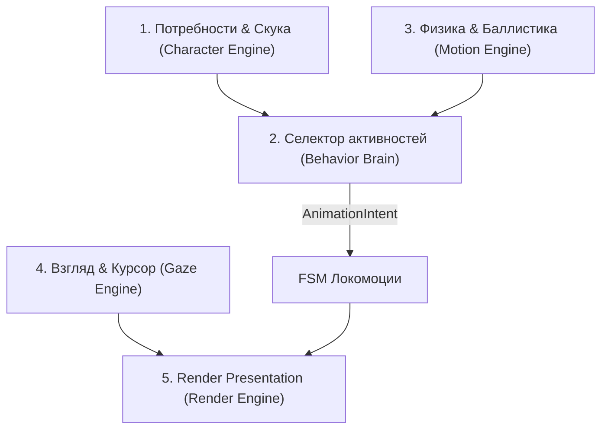

# Спецификация и Роудмап: Shimeji & Advanced Autonomy

`docs/engine/SHIMEJI_SPEC.md` — архитектурная спецификация и детальный план Shimeji-поведения персонажа Project Wisp.

---

## 1. Как это работает (Архитектурный обзор)

Shimeji-поведение строится на 5 независимых модулях, взаимодействующих через чистые события и `AnimationIntent`:

### 1.1. Локомоция и позы (FSM)
Персонаж обладает расширенным набором поз:
- **Базовые:** `idle`, `walk`, `run`, `sit`, `stand_up`, `lie_down`, `get_up`, `crawl`.
- **Вертикальные:** `jump`, `fall`, `land`, `stumble`, `crash_landing`, `recover`.
- **Переходы:** строго детерминированы (например, `lie_down` не может сразу перейти в `run` без `get_up`).

### 1.2. Физика перетаскивания и броска (Drag & Ballistics)
- При зажатии персонажа курсором активируется состояние `dragged` (персонаж свисает).
- История последних позиций мыши (sliding window) рассчитывает вектор импульса `(vx, vy)`.
- При отпускании мыши включается баллистический полёт: `gravity` тянет вниз, `drag` гасит скорость, границы экрана дают упругий `bounce`.
- **Исходы приземления:**
  - Низкая скорость приземления $\to$ `soft_landing` (плавно встаёт на лапки).
  - Средняя скорость $\to$ `stumble` (спотыкается и выравнивается).
  - Высокая скорость $\to$ `crash_landing` (плюхается плашмя, спиральки в глазах) $\to$ `recover` (отряхивается и встаёт).

### 1.3. Слежение за курсором (Gaze & Cursor Interaction)
- Если мышь находится в зоне видимости персонажа:
  - Вычисляется угол к курсору.
  - Позиция зрачков (`pupils`) плавно сдвигается с помощью `lerp` с учётом `dead_zone` (чтобы избежать дрожания).
- При приближении курсора в упор персонаж может активировать реакцию `swat_cursor` (попытка поймать мышь лапкой).

### 1.4. Цепочки активностей и защита от спама (Activity Chains & Penalty)
- Персонаж не выбирает случайные действия хаотично, а запускает цепочки:
  - *Исследование:* подойти к краю экрана $\to$ сесть $\to$ смотреть по сторонам.
  - *Отдых:* зевнуть $\to$ лечь $\to$ поджать лапки $\to$ уснуть.
- `RepetitionPenalty` (кольцевой буфер недавних действий) блокирует выбор повторяющихся поз.
- **Редкие события:** при накоплении энергии/скуки может сработать `Zoomies` (безумный спринт с дрифтом туда-обратно).

---

## 2. Декомпозиция задач (Shimeji Backlog)

| ID | Задача | Статус | Исполнитель | Описание |
|---|---|---|---|---|
| **P14-S01** | FSM Locomotion & Boredom Need | `done` | `domain-behavior` | 9 новых состояний локомоции (`sit`, `lie`, `run`, `fall` и др.) и шкала `Needs.boredom`. |
| **P14-S01-REV** | Review Gate: Locomotion & Boredom | `done` | `reviewer` | Аудит чистоты слоя domain и FSM-переходов. |
| **P14-S02** | Drag & Throw Ballistics Physics | `ready` | `domain-behavior` | Физика броска курсором, вектор `(vx, vy)`, гравитация, отскоки и 3 исхода посадки (`land`/`stumble`/`crash`). |
| **P14-S03** | Procedural Gaze & Cursor Reactions | `planned` | `domain-behavior` + `app-developer` | Слежение зрачками за мышью (`lerp`, `dead_zone`), реакция на клики и ловля курсора (`swat`). |
| **P14-S04** | Activity Chains, Penalty & Zoomies | `planned` | `domain-behavior` | Иерархические цепочки поведения, `RepetitionPenalty` от зацикливания и редкий ивент `Zoomies`. |
| **P14-S05** | Desktop & Window Edge Awareness | `planned` | `app-developer` + `domain-behavior` | Лазание по границам окон и хождение по таскбару. |
| **P14-G01** | Shimeji Integration Review Gate | `planned` | `reviewer` | Финальный аудит стабильности и интеграции всей Phase 14. |
