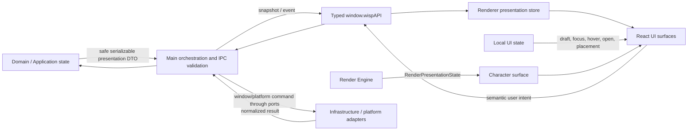

# Контракт UI / Renderer

`UI_SPEC.md` — принятый архитектурный контракт UI/Renderer Project Wisp. Он определяет ownership, поток presentation state и user intents, но не фиксирует дерево React-компонентов, CSS, визуальный стиль или конкретные IPC channels.

**Статус: accepted (`DOC-A04`).** Этот contract является обязательным architect gate для P14-P04 «Редизайн контекстного меню»: **yes**, потому что меню затрагивает границы Renderer ↔ Preload ↔ Main, window surface и debug/settings affordances.

Public IPC DTO и Application ports этой задачей не меняются. Новая capability требует отдельного планирования Project Manager и Architect review соответствующего public contract.

## 1. Поток данных

Направление зависимости: Renderer → typed Preload/IPC → Main/Application → Domain. В обратную сторону идут только serializable presentation DTO и безопасные результаты use cases. UI не импортирует Main/Infrastructure и не получает raw provider, persistence или OS objects.

## 2. Authoritative ownership

| Область | Authoritative owner | Renderer получает / делает | Renderer не делает |
|---|---|---|---|
| Domain и behavior | Domain/Application | presentation-ready snapshot, status, allowed capabilities | Не вычисляет `Needs`, не выбирает behavior/Activity/FSM transition. |
| Dialogue/provider | Application | chat status и безопасный display text; отправляет submit/cancel intent | Не вызывает provider, не хранит provider context и не парсит response DTO. |
| Persistence/settings | Application repositories | подтверждённые display values/capabilities; отправляет change intent | Не читает SQLite/filesystem и не считает local draft сохранённой настройкой. |
| Window и OS | Main + Infrastructure adapters | сообщает semantic window intent или bounded pointer input | Не двигает native window напрямую и не ветвится по OS/session type. |
| Typed bridge | Preload | вызывает точечные методы `window.wispAPI`, подписывается на DTO events | Не знает channel names и не получает `ipcRenderer`/generic `send/on/invoke`. |
| Character visual | Render Engine | отображает `RenderPresentationState` через `ICharacterRenderer` | Не выбирает asset, layer, frame, anchor, hitbox или fallback. |
| Shared presentation | Один Renderer store на snapshot family | хранит последнюю immutable projection для нескольких visual branches | Не копирует одну projection в конкурирующие stores и не мутирует Main state. |
| Ephemeral UI | React surface/component | владеет draft, focus, hover, open tab, selection и measured placement | Не превращает временное состояние в domain/persistent authority. |
| Debug telemetry | Main/Application, только debug capability | показывает bounded redacted telemetry и локальные inspector controls | Не показывает private memory facts, provider payloads или secrets. |

`Renderer store` — архитектурная роль, а не требование создать новый store или библиотеку. Если snapshot нужен одной surface, он остаётся локальным React state. Если нужен нескольким независимым веткам, допускается один общий store с одним source subscription.

## 3. Минимальные inputs и outputs

Имена ниже обозначают категории данных и действий, а не новые DTO, IPC channels или ports.

| Surface | Минимальные inputs | Допустимые outputs | Local-only state |
|---|---|---|---|
| Character | `RenderPresentationState`, motion/presentation snapshot, safe interaction capabilities | click/double-click/right-click, bounded drag pointer lifecycle, pet/play semantic intent | hover/pressed, pointer capture bookkeeping, transient visual focus |
| Context menu | available actions/capabilities, confirmed setting summaries, safe anchor/viewport data | select action, open chat/settings, request window preference, close application | open/closed, active tab, keyboard focus, measured menu placement |
| Chat | dialogue status, bounded display message/reply, validation/error presentation | submit sanitized text, cancel/dismiss, retry when capability exists | draft text, focus, composing flag, open/closed |
| Settings surface | safe setting presentation and capability flags | request validated change/reset; wait for confirmed result | unsaved controls/draft and validation hints |
| Debug surface | debug-enabled capability, redacted bounded telemetry | refresh, clear diagnostic logs, local visual inspection controls | panel visibility, paused view, selected inspector item |

User output is semantic: «погладить», «открыть чат», «изменить подтверждаемую настройку», «закрыть приложение». Renderer не формирует domain commands, persistence writes, provider prompts, Electron channels или animation decisions.

Pointer data — исключение только по форме, не по ownership: Renderer захватывает browser pointer event и передаёт минимальный serializable drag input. Main/Application валидирует session/order/payload и остаётся owner motion/window position.

## 4. Character presentation boundary

Character UI размещает готовую visual projection и интерактивную поверхность вокруг неё.

- [`RENDER_ENGINE.md`](./RENDER_ENGINE.md) единолично определяет layers, frames, pivots, anchors, visual bounds, hitbox, fallback и scaling.
- UI может использовать предоставленные bounds для pointer targeting и размещения соседних surfaces, но не пересчитывает sprite geometry из manifest/asset paths.
- `RenderPresentationState` immutable для UI render pass. UI не исправляет отсутствующий слой и не подменяет animation state.
- World/window position приходит как Main-owned presentation data. CSS transform допустим только для отображения подтверждённой projection, не как authoritative movement.
- Character events превращаются в user intents; наличие DOM event не означает разрешение выполнить domain action.

Render Engine может быть реализован чистым Renderer-side service, но React components зависят от его presentation output, а не от manifest resolver internals. Framework hooks и component state не входят в Render Engine contract.

## 5. Context menu boundary

Меню — временная UI surface, а не owner действий персонажа или native window.

- Open/close, active tab, focus и измеренный placement — local UI state.
- Список видимых действий строится из presentation capabilities; скрытая/disabled action не должна становиться отдельным domain rule.
- Выбор пункта отправляет один semantic intent через существующий typed bridge или вызывает локальное presentation-only действие.
- Always-on-top, window expansion, close app и другие system actions подтверждает Main; UI показывает результат, но не предполагает успех.
- Расширение/сжатие native window, сохранение позиции и screen clamping принадлежат Main/platform boundary.
- Меню не смешивает production actions с debug controls. Debug tab/section существует только при явной debug capability.

P14-P04 может менять layout, grouping, labels, CSS и component decomposition после этого gate, сохраняя указанные owners и не добавляя public IPC без отдельного решения.

## 6. Chat boundary

- Draft сообщения живёт только в UI до submit; его очистка, focus и IME composition — local state.
- Submit передаёт минимальный user text/input DTO в Application use case. Renderer не вызывает `IAIProvider` и не собирает provider context.
- Thinking/sending/reply/error приходят как presentation state. UI не переводит Animation FSM и не создаёт `BehaviorIntent` из provider response.
- Speech bubble получает bounded display content; внутренние memory records, prompt, model metadata и raw error не показываются.
- Cancel закрывает local input и, только если bridge предоставляет capability, отправляет semantic cancellation intent; UI не имитирует отмену внешней операции.
- История, если появится, остаётся Main-owned projection над repository, а не Renderer persistence/localStorage.

Текущий offline-first продукт не требует от пользователя provider account, API key, token/model knowledge или server administration; такие controls не входят в UI.

## 7. Settings и debug surfaces

### Settings

- Authoritative settings живут в Application/repository boundary; UI хранит только draft и подтверждённую projection.
- Save/reset — semantic intents с валидируемым serializable payload. Ответ Main определяет отображаемое confirmed value.
- OS-specific availability приходит capability flag; UI не читает `process.platform`, environment variables или native APIs.
- Отсутствующая capability означает отсутствие/disabled control, а не generic IPC fallback.

Этот contract не вводит Settings IPC или repository. Полноценная Settings surface относится к Phase 16; для P14 меню допустимы только уже доступные capabilities.

### Debug

- Debug API и surface отсутствуют в production capability set; CSS hiding не является security boundary.
- Telemetry ограничена диагностическими агрегатами, разрешёнными DTO, и bounded log buffer.
- Запрещены private memory facts, chat/provider payloads, secrets, filesystem paths, OS handles и unredacted exception data.
- Inspector selection, pause, filters и panel visibility остаются local state и не меняют production FSM/domain state.
- Diagnostic command требует отдельного точечного bridge method; generic evaluator/channel запрещён.

## 8. Typed Preload/IPC boundary

Действуют [`30-electron.md`](../../.agents/rules/30-electron.md) и следующие UI-level invariants:

- Renderer видит только `window.wispAPI`; Electron/Node globals недоступны.
- Renderer imports ограничены UI/Render modules и shared serializable DTO; Domain/Application/Infrastructure modules и их types через границу не импортируются.
- Каждый bridge method соответствует одному use case или одной typed subscription, принимает и возвращает serializable DTO.
- Main валидирует sender, payload и result до публикации в Renderer; UI validation улучшает UX, но не заменяет boundary validation.
- Ошибка переводится в безопасный presentation result; raw stack/provider/OS error не попадает в UI.
- Новый channel, DTO или port не выводится из названия React callback и не добавляется скрытно в UI implementation.
- Renderer не определяет IPC ordering как domain policy; revision/session identifiers обрабатываются только согласно профильному contract.

Состав текущего `WispApiBridge` не копируется сюда. `src/shared/ipc-contracts.ts` остаётся source of truth для реализованной typed surface, а изменение её public shape требует отдельного Architect review.

## 9. State consistency и cleanup

Правила состояния согласованы с [`40-react-ui.md`](../../.agents/rules/40-react-ui.md) и [`50-state-and-data.md`](../../.agents/rules/50-state-and-data.md):

- Snapshot from Main заменяет предыдущую projection атомарно; Renderer не merge-ит domain fields по собственным правилам.
- Confirmed Main state при конфликте побеждает optimistic/local draft. Ошибка сохраняет безопасный draft только как UI convenience.
- Одна subscription family имеет одного owner. Дочерние surfaces получают props/selectors, а не создают дублирующие listeners.
- Каждый Preload subscription возвращает exact unsubscribe; React effect вызывает его при unmount, capability change и resubscribe.
- Browser listeners, timers, intervals, `requestAnimationFrame` и observers удаляются тем же lifecycle owner.
- Async completion после cleanup не обновляет UI; используется cancellation/active guard, когда underlying request нельзя отменить.
- Cleanup идемпотентен: late/duplicate event после unsubscribe не восстанавливает закрытую surface или stale state.

## 10. Placement и window surface

- Character, menu, chat bubble/input и transient panels не должны быть обрезаны доступным viewport/window bounds.
- Renderer измеряет DOM surface и предлагает local placement внутри предоставленного viewport; он не читает OS work area напрямую.
- Если surface требует изменения native window bounds/position, UI отправляет semantic expansion intent. Main/platform adapter выбирает допустимые bounds и возвращает подтверждённую projection.
- Menu/chat/debug не изменяют character world position как побочный эффект local CSS layout.
- Hit testing опирается на Render Engine bounds плюс явно интерактивные UI surfaces; прозрачная область не становится неявной native window policy.
- Cross-platform различия выражаются capabilities/normalized DTO, а не React branches по Linux/Windows/macOS.

## 11. Privacy и запрещённые знания Renderer

Renderer не хранит, импортирует и не отображает:

- raw provider request/response, system prompt, API credentials или model internals;
- raw memory facts, episodes, summaries, complete character snapshot или repository rows;
- SQLite, SQL, filesystem paths, `safeStorage`, shell, Electron objects или OS handles;
- Domain/Application/Infrastructure modules, включая их entities, services, use cases и boundary-inappropriate types;
- authoritative physics/FSM/domain state или platform detection;
- concrete IPC channel names, generic bridge functions и unvalidated external URLs;
- sensitive payloads в DOM attributes, logs, `localStorage`, session caches или debug telemetry.

Допустимы минимальные presentation projections: display text, aggregate status, enabled capabilities, redacted diagnostics и serializable geometry, необходимая для render/interaction.

## 12. Разрешение intent brief

| Ранее открытый вопрос | Решение contract |
|---|---|
| React tree/hooks/catalogs | Implementation detail; contract задаёт owners и surfaces, не имена компонентов. |
| Точный `window.wispAPI` | Текущая typed surface остаётся без изменений; новые capabilities планируются отдельно. |
| Menu/settings/chat actions | Зафиксированы semantic categories и ownership; точный product set/layout остаётся профильной implementation task. |
| Placement у краёв | Local measurement + normalized bounds; native resize/reposition подтверждает Main/platform adapter. |
| Visual style/timing/accessibility | Не engine boundary; implementation обязана сохранять keyboard/focus semantics и проверяемый доступ к actions. |
| Debug UI | Только explicit debug capability и redacted DTO; production API отсутствует. |
| UI tests/smoke | Implementation должна проверять intent emission, state projection, cleanup и native-window smoke отдельно от этого docs gate. |

## 13. Contract gate

Contract принят, когда:

- Renderer отображает presentation-ready state и отправляет semantic intents только через typed bridge;
- Main/Application остаётся единственным owner domain/provider/persistence/window decisions;
- Render Engine и UI не делят ownership layers/frames/hitbox/placement;
- subscriptions и browser resources имеют полный cleanup;
- production/debug и public/private data разделены;
- новые IPC/ports не появляются без отдельного Architect review.

P14-P04 разблокируется архитектурно после публикации `DOC-A04` architect result и review этого docs diff. Сам contract не утверждает, что текущая product implementation уже соответствует всем пунктам.
