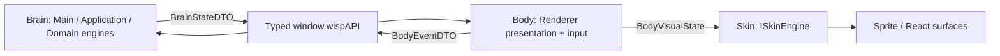

# Архитектурный бриф UI / Renderer

`UI_SPEC.md` — архитектурный бриф UI-слоя Project Wisp. Документ фиксирует UX-принципы приложения-компаньона, правила взаимодействия окна с операционной системой, границы ответственности (ownership) и поток данных между процессами.

> [!NOTE]
> **Источник правды (Single Source of Truth):**  
> Спецификация не дублирует стили, точные пиксельные размеры, цветовую палитру и DOM-структуру компонентов. Источником правды для разметки, стилизации и композиции является React-код и CSS в каталоге [`src/renderer/`](../../src/renderer/).

---

## 1. Поток данных и границы ответственности (Ownership)

UI функционирует по модели однонаправленного потока данных (Unidirectional Data Flow):



| Область | Авторитетный владелец | Зона ответственности Renderer | Запрещено в Renderer |
|---|---|---|---|
| **Brain: поведение и состояние** | Main/Application + чистые Domain engines | Потребление ordered `BrainStateDTO`; отображение activity/mood/motion projection. | Вычисление `Needs`, планирование behavior/Activity, semantic FSM-переходы или ожидание Skin completion. |
| **Body: presentation и input** | Renderer `PetBodyController` | Локальный `BodyVisualState`, input capture, gaze и squash/stretch на RAF, cleanup. | Изменение Brain state, physics/position authority, frame-driven visual/reflex IPC и создание autonomy cadence. |
| **Skin: визуальный adapter** | Renderer-local `ISkinEngine` | Asset/fallback resolution, clip/frame timing и render resources. | IPC, semantic decisions, stimuli и доступ к Main/Application/Domain services. |
| **Окно и ОС** | Main + Platform Adapters | Отправка семантических намерений окна (изменение размера, режима). | Прямое управление нативным окном Electron, чтение переменных среды ОС или платформы. |
| **Позиция персонажа** | Motion Engine / Main | Отображение персонажа по координатам проекции. | Авторитетный расчёт физики движения, гравитации и кинематики. |
| **Типизированный мост** | Preload (`window.wispAPI`) | Вызов строго типизированных методов API и подписка на события. | Использование `ipcRenderer`, доступ к Node.js API, знание имён каналов IPC. |
| **Локальный UI-контекст** | React Surfaces | Черновик ввода чата, фокус, открытость меню/табов, ховер. | Превращение временного UI-состояния в персистентное без подтверждения Main. |

---

## 2. UX-принцип: Прозрачное окно-оверлей (Transparent Overlay)

1. **Бесшовное присутствие на рабочем столе:**
   - Окно персонажа работает в режиме прозрачного безрамочного оверлея (`frameless`, `transparent`, без теней окна и без отображения в панели задач).
   - Персонаж визуально существует прямо на рабочем столе поверх окон других приложений (`always-on-top`).
2. **Динамическая поверхность окна:**
   - В базовом режиме размер окна минимизирован до компактных границ самого персонажа и всплывающих мыслей.
   - При открытии расширенных интерфейсов (контекстное меню, диалоговый чат, HUD) размер нативного окна динамически адаптируется под габариты открытой поверхности через координацию с Main-процессом, предотвращая обрезку контента.
3. **Безопасность границ экрана (Clamping & Viewport Awareness):**
   - Все всплывающие элементы (облака диалога, меню) позиционируются относительно персонажа с обязательным учётом экранных границ (`workArea`), чтобы элементы интерфейса никогда не выходили за пределы видимости дисплея.

---

## 3. UX-принцип: Клик сквозь окно (Ignore Mouse Events)

Главная цель — **ненавязчивость (non-intrusive presence)**: оверлей не должен блокировать взаимодействие пользователя с его рабочим окружением и окнами сторонних приложений.

1. **Сквозной клик по умолчанию:**
   - Любая область окна, где отсутствует активный UI-элемент (полностью прозрачные пиксели холста), пропускает клики и события мыши насквозь к окнам под оверлеем (`window.setIgnoreMouseEvents(true, { forward: true })`).
2. **Интерактивные зоны (Hit-testing):**
   - События мыши перехватываются (`setIgnoreMouseEvents(false)`) исключительно при наведении курсора на интерактивные поверхности:
     - Сам спрайт/хитбокс персонажа;
     - Всплывающие диалоговые облака (Speech/Thought bubbles);
     - Поле ввода чата;
     - Контекстное меню и элементы панели отладки.
3. **Перетаскивание персонажа (Pointer Drag Lifecycle):**
   - Зажатие левой кнопки мыши на персонаже с преодолением порога смещения переводит систему в режим перетаскивания (Drag).
   - Renderer захватывает события указателя и передаёт нормализованный поток координат в Main-процесс. Авторитетное перемещение окна и физику броска/падения рассчитывает Motion Engine.

---

## 4. UX-принцип: Поведение контекстного меню (Context Menu)

Контекстное меню предоставляет доступ к управлению персонажем, настройкам и режимам взаимодействия.

1. **Жизненный цикл открытия и закрытия:**
   - **Открытие:** по правому клику (контекстному нажатию) на персонаже.
   - **Закрытие:** по клику вне области меню (outside click / backdrop click), по нажатию клавиши `Escape` или после выбора терминального действия (например, "Выйти").
   - При открытии меню окно автоматически переводится в интерактивный режим и расширяет рабочую область; при закрытии — возвращается в компактное состояние.
2. **Иерархия действий:**
   - **Взаимодействие (Interactions):** прямые семантические стимулы (погладить, покормить, поиграть, подумать).
   - **Жизненный цикл (Vitality):** явные команды перехода в сон и пробуждения (`sleep` / `wake`).
   - **Автономия (Autonomy):** включение/выключение свободного перемещения персонажа по экрану (прогулка).
   - **Персонализация:** выбор визуальной темы, ручная смена выражений и масштаба персонажа.
   - **Системные контролы:** сброс позиции персонажа в центр рабочего стола, закрепление поверх окон, выход из приложения.
3. **Изоляция Debug-интерфейса:**
   - Вкладка/панель телеметрии (`Debug HUD`) доступна исключительно при наличии явного флага/возможности `debugEnabled`.
   - В production-режиме отладочные элементы полностью исключаются из рендера, а не маскируются через CSS.

---

## 5. Инварианты безопасности и приватности

1. **Изоляция окружения:** Renderer функционирует в режиме строгой изоляции (`contextIsolation: true`, `sandbox: true`).
2. **Отсутствие доступа к приватным данным:** Renderer не имеет доступа к локальной файловой системе, SQLite, системным промптам нейросетей, API-ключам и полным слепкам памяти персонажа.
3. **Семантические намерения:** Любое действие пользователя из UI формирует высокоуровневый семантический интент (User Intent DTO), отправляемый через `window.wispAPI`. UI не имеет права напрямую мутировать внутреннее состояние движков ядра.

---

## 6. Brain → Body IPC

`BrainStateDTO` — единственный полный state stream Main → Renderer. `BodyEventDTO` — ограниченный input/observation stream Renderer → Main. Канонические target declarations находятся в [`src/shared/ipc-contracts.ts`](../../src/shared/ipc-contracts.ts); shared не импортирует Domain, React, DOM/canvas, Electron или Skin types. Само наличие типов не активирует новые каналы до атомарного runtime-cutover AUTO-I07.

### 6.1. Shared DTO

| Контракт / поле | Назначение | Инвариант |
|---|---|---|
| `BrainEmotionalToneDTO` | Синтезированный эмоциональный тон | Только literal variants, объявленные в canonical `.ts` файле. |
| `BrainVisualIntentKindDTO` | Семантический visual kind без asset key | Только kinds Animation Engine; manifest/clip names запрещены. |
| `BrainNeedsDTO.energy`, `attention`, `play`, `comfort`, `boredom` | Снимок шкал Character Engine | Каждое значение конечно и находится в `[0, 100]`. |
| `BrainActivityTimelineDTO.runId`, `activityId`, `phaseId`, `stage` | Идентичность run и текущей semantic-фазы | ID непустые; `stage` — `entering`, `looping` или `exiting`. |
| `BrainActivityTimelineDTO.startedAtMs`, `phaseStartedAtMs`, `phaseEndsAtMs` | Main-monotonic timeline Activity | Порядок времени задан в §6.2; `phaseEndsAtMs = null` только для causal phase. |
| `BrainMotionStateDTO.phase` | Authoritative physical phase | Только `dragged`, `airborne`, `grounded`. |
| `BrainMotionStateDTO.rootScreenPosition`, `velocityPxPerSec` | Authoritative root и velocity | Обе координаты конечны; Body их только отображает. |
| `BrainMotionStateDTO.positionAuthority` | Причина владения позицией | Только `forced` или `voluntary`; Skin не меняет authority. |

| `BrainStateDTO` поле | Назначение | Инвариант |
|---|---|---|
| `streamId` | Идентичность trusted subscription stream | Непустой ID до 128 символов; меняется при reload/replacement. |
| `revision` | Порядок полных snapshots | Положительный safe integer, строго возрастает внутри stream. |
| `sampledAtMs` | Main-monotonic момент снимка | Конечный, неотрицательный. |
| `character` | Needs и synthesized tone | Полная immutable Character projection. |
| `activity` | Текущая Activity timeline | `null` означает отсутствие active Activity. |
| `motion` | Authoritative motion projection | Полный `BrainMotionStateDTO`, не Renderer physics state. |
| `visualIntent` | Идентичность и семантика visual episode | Полный immutable `BrainVisualIntentDTO`; не содержит asset keys. |

| `BrainVisualIntentDTO` поле | Назначение | Инвариант |
|---|---|---|
| `episodeId`, `episodeStartedAtMs` | Идентичность и старт visual episode | ID уникален внутри stream; время использует Main-monotonic шкалу. |
| `kind`, `category` | Семантика и класс визуального намерения | Значения ограничены literal unions из canonical `.ts` файла. |
| `priority`, `interrupt`, `loop` | Visual arbitration policy | Body разрешает policy в renderer-local projection; Skin только отображает результат и не возвращает outcome в Brain. |
| `emotionalTone` | Тон Character Engine | Принадлежит `BrainEmotionalToneDTO`. |
| `expressionHint?`, `gazeDirection?`, `propHint?` | Необязательные presentation hints | Отсутствие или literal variant; не являются manifest keys. |

| `BodyEventDTO` поле / variant | Назначение | Инвариант |
|---|---|---|
| `streamId`, `sequence`, `basedOnRevision`, `observedAtMs` | Общая metadata каждого события | Current stream; возрастающая sequence; принятая Brain revision; Renderer-monotonic observation time. |
| `cursor_observed.screenPosition` | Текущая глобальная позиция курсора | Конечные координаты; cadence ограничен §6.3. |
| `interaction.interaction`, `intensity?` | Семантический user input | Допустимы `click`, `double_click`, `right_click`, `pet`, `play`, `feed`, `think`; intensity при наличии конечна в `[0, 1]`. |
| `drag_started` / `drag_moved`: `gestureId`, `pointerId`, `screenPosition` | Начало и latest drag sample | Gesture регистрируется только после valid start; pointer ID неотрицательный safe integer. |
| `drag_ended`: те же поля + `cancelled` | Терминальное событие gesture | Ровно один terminal event для active пары gesture/pointer. |
| `menu_visibility_changed.expanded` | Наблюдение состояния меню | Boolean; не является visual completion или behavior decision. |

`activity: null` означает отсутствие active Activity. `phaseEndsAtMs: null` допустим только для фазы, ожидающей Brain-owned causal event или явного interruption; Skin completion таким событием не является. `visualIntent.kind` — semantic animation kind из [`ANIMATION_ENGINE.md`](./ANIMATION_ENGINE.md), не `manifest.json` key или имя клипа.

`visualIntent.episodeId` — Brain-generated identity одного visual episode, уникальная и не переиспользуемая внутри `streamId`. Brain создаёт новый ID и фиксирует `episodeStartedAtMs` при каждом намеренном старте/replay, даже если `kind` и остальные visual fields совпадают: новая Activity visual phase, повторный click/direct reaction, landing или forced visual transition. Поэтому episode однозначен и при `activity: null`.

Для одного `(streamId, episodeId)` `episodeStartedAtMs` и все остальные поля `visualIntent` неизменны во всех snapshots. Motion/Needs-only revision сохраняет episode. Body начинает или перезапускает base Skin playback только при новой паре `(streamId, episodeId)`; новая `revision` с прежним episode не перезапускает его. Brain завершает episode только публикацией следующего episode/state и не ждёт обратного visual outcome.

`gestureId` создаётся Body один раз на pointer gesture (trimmed non-empty, до 128 символов) и служит только корреляцией input; Main делает его active лишь после valid `drag_started`. Он не даёт Body position authority и не заменяет общий `sequence`.

### 6.2. Время, revision и order

- `streamId` — Main-generated непустой opaque ID (до 128 символов) текущего trusted document stream. При reload/replacement Main создаёт новый ID; snapshot этого stream начинается с revision `1`.
- `revision` — положительный safe integer, строго возрастающий на каждую опубликованную полную snapshot в одном stream. Пропуски допустимы из-за coalescing; равная или меньшая revision stale.
- `sampledAtMs`, activity `startedAtMs` / `phaseStartedAtMs` / `phaseEndsAtMs` и `visualIntent.episodeStartedAtMs` используют одну Main-monotonic шкалу, конечны и неотрицательны. Для Activity выполняется `startedAtMs <= phaseStartedAtMs <= sampledAtMs`; для опубликованной bounded active phase — `sampledAtMs < phaseEndsAtMs`, иначе Brain сначала совершает transition. Для visual episode всегда `episodeStartedAtMs <= sampledAtMs`.
- `observedAtMs` использует Renderer-monotonic `performance.now()` и упорядочивает/диагностирует только события одного Body stream. Main не вычитает его из своих timestamps и ставит собственный monotonic receive time перед Domain/Application mapping.
- Body не emits до первого принятого snapshot. Каждый event копирует active `streamId`, последнюю принятую `basedOnRevision` и следующий положительный safe-integer `sequence`; sequence gaps разрешены, повтор или уменьшение stale.

Body принимает первый полный snapshot текущей subscription, затем только matching `streamId` и `revision > lastAcceptedRevision`. Snapshot заменяет presentation projection атомарно; частичных patches нет. Если уже принятый `episodeId` пришёл с другим `episodeStartedAtMs` или любым другим полем `visualIntent`, Body отклоняет всю snapshot, сохраняет последний valid state и пишет bounded protocol diagnostic. Смена stream допустима только после нового subscribe lifecycle, который сбрасывает локальные revision/sequence и visual resources.

Body вычисляет `BodyVisualState.visualAgeMs = sampledAtMs - visualIntent.episodeStartedAtMs`. Skin использует этот same-clock duration как baseline при инициализации нового `(streamId, episodeId)`, затем продвигает кадры Renderer-monotonic delta; обновление прежнего episode не перезапускает playback. Ни Body, ни Skin не сравнивают Main timestamps с `performance.now()`, не используют Activity presence для correlation и не переключают semantic phase при достижении `phaseEndsAtMs`.

### 6.3. Cadence и coalescing

- Brain публикует snapshot после committed semantic/Activity/Motion change и сразу после создания нового subscription. Неизменённый heartbeat запрещён; semantic/Activity/position-authority transitions между разными transactions не отбрасываются.
- Все mutations одной Application transaction сливаются в одну snapshot. Physics fixed substeps одного внешнего Motion tick также сливаются; наружу уходит не более одного состояния за этот tick.
- При IPC backpressure только pending motion-only snapshots coalesce по latest-wins; pending semantic/Activity/position-authority transition сохраняет порядок. Поэтому revision gaps допустимы, а semantic phase не скрывается coalescing-ом.
- `cursor_observed` не привязан к RAF: один Body-owned refresh loop использует `CURSOR_OBSERVATION_INTERVAL_MS = 100` (не более 10 событий/с). Первый valid local cursor sample после subscribe отправляется сразу; пока sample остаётся доступным, каждый следующий 100-ms tick отправляет текущую latest position, включая неизменную, с новым `observedAtMs`/`sequence`. Pointer moves внутри интервала только заменяют pending position; задержанный tick отправляет один current sample без catch-up burst.
- Cursor refresh останавливается и pending sample очищается при `pointerleave`/`pointercancel`, hidden document/window teardown, active drag, unsubscribe/unmount или stream replacement. После остановки Brain TTL естественно делает observation stale; отдельный unavailable event не нужен. Это единственный допустимый unchanged Body refresh: прочие Body events и Brain snapshots не имеют heartbeat.
- `drag_moved` coalesce-ится latest-wins не чаще одного события за Renderer animation frame. `drag_started`, `drag_ended`, `interaction` и `menu_visibility_changed` отправляются немедленно и не coalesce между собой. Общий `sequence` назначается в момент фактической отправки любого Body event.
- Skin RAF/frame callbacks локальны. Clip completion/rejection/interruption не создают `BodyEventDTO` и не влияют на Brain cadence.

### 6.4. Channels и Preload

```text
Main --wisp:brain-state(BrainStateDTO)--> onBrainState(listener) --> Body
Body --postBodyEvent(BodyEventDTO)--> wisp:body-event --> Main
```

`window.wispAPI` предоставляет только `onBrainState(listener): () => void` и `postBodyEvent(event): Promise<void>` для этой пары потоков. `Promise<void>` подтверждает validation/delivery в Main handler, но не semantic acceptance. Raw `ipcRenderer`, generic `send/on/invoke`, dynamic channel names и Skin API через Preload запрещены.

### 6.5. Validation и stale-event policy

Обе стороны сначала принимают `unknown`, проверяют plain non-null exact-shape object и копируют его в новый DTO. Extra keys, prototype-bearing objects, методы, классы, cyclic values, `NaN`/`Infinity` и неизвестные enum variants отклоняются; optional fields либо отсутствуют, либо содержат валидное значение. Для `interaction` значение `think` валидируется как отдельный exact literal и маппится Application boundary в candidate `BehaviorIntent<'think'>`, который проходит обычный Character gating; оно не запускает visual state напрямую. Needs/intensity должны быть конечными в `[0, 100]`/`[0, 1]`; revision, sequence и `basedOnRevision` — положительными safe integers; pointer ID — неотрицательным safe integer; координаты/скорости и все timestamps — конечными. Все ID, включая `episodeId`, — trimmed non-empty строки до 128 символов. Body дополнительно проверяет неизменность payload для повторного `episodeId`; Main проверяет current trusted `webContents`.

Main обрабатывает Body event в таком порядке:

1. malformed payload, untrusted sender или foreign `streamId` отклоняется до Application;
2. `sequence <= lastAcceptedSequence` — идемпотентный no-op; gap принимается;
3. `basedOnRevision > currentRevision` отклоняется как impossible future event;
4. event на старой revision не восстанавливает старый state: Main повторно проверяет current Character/Activity/Motion/menu/autonomy gates и принимает либо no-op/reject;
5. drag event дополнительно сверяется с active `gestureId`/`pointerId`; semantic stimulus дедуплицируется ключом `(streamId, sequence)`.

Даже валидный Body event является только input/observation. Brain может прервать или выбрать behavior по своим текущим правилам, но никогда не ждёт Body event, не трактует отсутствие события как failure и не принимает visual outcome.

### 6.6. Атомарная миграция с legacy protocol

[AUTO-A06 #31](https://github.com/zyzycode/project_wisp/issues/31) **superseded** в части animation-completion handshake. AUTO-I07 выполняет один атомарный runtime cutover без compatibility bridge или feature flag:

1. использовать объявленные shared types и добавить exact validators/mappers, `wisp:brain-state`, `wisp:body-event` и точечные Preload methods;
2. в той же AUTO-I07 change-set переключить Main publisher и Renderer consumer с `PetPresentationStateDTO` на полный `BrainStateDTO`;
3. удалить `AnimationLifecycleOutcomeDTO`, `AnimationLifecycleResultDTO`, `PetPresentationStateDTO.animationRequestId`, `notifyAnimationLifecycleResult`, lifecycle IPC channel/handler, pending request/context и `ANIMATION_LIFECYCLE_WATCHDOG_MS`;
4. не оставлять dual publish, dual subscribe, DTO adapter или Renderer-to-Main terminal outcomes; первый snapshot после reload полностью восстанавливает Body/Skin projection;
5. AUTO-I09 переводит перечисленные input producers на `BodyEventDTO` и в той же change-set удаляет заменённые specialized drag/interaction/menu channels; до этого они остаются только transitional input, не presentation/lifecycle protocol;
6. сохранить отдельные typed commands, которые не являются Body observation (например, sleep/wake, autonomy setting и system/window controls), без расширения generic IPC.

До implementation merge [`src/shared/ipc-contracts.ts`](../../src/shared/ipc-contracts.ts) содержит target declarations рядом с legacy runtime DTO. Это не dual protocol: publishers, channels и consumers остаются legacy до единого cutover AUTO-I07.

### 6.7. Последствия для Phase 14 slices

- [AUTO-I07 #39](https://github.com/zyzycode/project_wisp/issues/39): вводит exact DTO/validators/channels и атомарно удаляет legacy presentation/lifecycle handshake.
- [AUTO-I08 #41](https://github.com/zyzycode/project_wisp/issues/41): переводит `ActivityRunner`, needs и stimuli на единый Main-monotonic Brain loop без Skin completion.
- [AUTO-I09 #40](https://github.com/zyzycode/project_wisp/issues/40): создаёт Body Controller, мигрирует input producers и оставляет `DesktopPet` composition root.
- [AUTO-I10 #42](https://github.com/zyzycode/project_wisp/issues/42): вводит только renderer-local `ISkinEngine` / `SpriteSkinAdapter` и revision-based render update.
- [AUTO-I02 #33](https://github.com/zyzycode/project_wisp/issues/33): Body может показать локальный gaze сразу; только Brain использует bounded-refresh до 10 Hz `cursor_observed` для semantic gesture eligibility.
- [AUTO-I03 #34](https://github.com/zyzycode/project_wisp/issues/34): Explore route/phase/history живут в Brain; отсутствие или длительность осмотрового клипа не задерживает routine.
- [AUTO-I04 #35](https://github.com/zyzycode/project_wisp/issues/35): climb/jump остаются Brain Activity + authoritative Motion route; Body/Skin только отображают phases.
- [AUTO-I05 #36](https://github.com/zyzycode/project_wisp/issues/36): внешняя window geometry нормализуется Infrastructure/Main и не передаёт native handles или platform types в Body/Skin.
- [AUTO-I06 #37](https://github.com/zyzycode/project_wisp/issues/37): Explore/Rest arbitration, route и sleep kind принадлежат Brain timeline; Skin fallback не меняет outcome.
