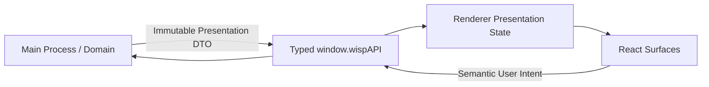

# Архитектурный бриф UI / Renderer

`UI_SPEC.md` — архитектурный бриф UI-слоя Project Wisp. Документ фиксирует UX-принципы приложения-компаньона, правила взаимодействия окна с операционной системой, границы ответственности (ownership) и поток данных между процессами.

> [!NOTE]
> **Источник правды (Single Source of Truth):**  
> Спецификация не дублирует стили, точные пиксельные размеры, цветовую палитру и DOM-структуру компонентов. Источником правды для разметки, стилизации и композиции является React-код и CSS в каталоге [`src/renderer/`](../../src/renderer/).

---

## 1. Поток данных и границы ответственности (Ownership)

UI функционирует по модели однонаправленного потока данных (Unidirectional Data Flow):

| Область | Авторитетный владелец | Зона ответственности Renderer | Запрещено в Renderer |
|---|---|---|---|
| **Поведение и состояние** | Domain / Character Engine | Отображение проекции (`presentation-ready snapshot`, статус, эмоция). | Вычисление потребностей (`Needs`), принятие решений о поведении или FSM-переходах. |
| **Окно и ОС** | Main + Platform Adapters | Отправка семантических намерений окна (изменение размера, режима). | Прямое управление нативным окном Electron, чтение переменных среды ОС или платформы. |
| **Позиция персонажа** | Motion Engine / Main | Отображение персонажа по координатам проекции. | Авторитетный расчёт физики движения, гравитации и кинематики. |
| **Типизированный мост** | Preload (`window.wispAPI`) | Вызов строго типизированных методов API и подписка на события. | Использование `ipcRenderer`, доступ к Node.js API, знание имён каналов IPC. |
| **Локальный UI-контекст** | React Surfaces | Черновик ввода чата, фокус, открытость меню/табов, ховер. | Превращение временного UI-состояния в персистентное без подтверждения Main. |

---

## 2. UX-принцип: Прозрачное окно-оверлей (Transparent Overlay)

1. **Бесшовное присутствие на рабочем столе:**
   - Окно персонажа работает в режиме прозрачного безрамочного оверлея (`frameless`, `transparent`, без теней окна и без отображения в панели задач).
   - Персонаж визуально существует прямо на рабочем столе поверх окон других приложений (`always-on-top`).
2. **Динамическая поверхность окна:**
   - В базовом режиме размер окна минимизирован до компактных границ самого персонажа и всплывающих мыслей.
   - При открытии расширенных интерфейсов (контекстное меню, диалоговый чат, HUD) размер нативного окна динамически адаптируется под габариты открытой поверхности через координацию с Main-процессом, предотвращая обрезку контента.
3. **Безопасность границ экрана (Clamping & Viewport Awareness):**
   - Все всплывающие элементы (облака диалога, меню) позиционируются относительно персонажа с обязательным учётом экранных границ (`workArea`), чтобы элементы интерфейса никогда не выходили за пределы видимости дисплея.

---

## 3. UX-принцип: Клик сквозь окно (Ignore Mouse Events)

Главная цель — **ненавязчивость (non-intrusive presence)**: оверлей не должен блокировать взаимодействие пользователя с его рабочим окружением и окнами сторонних приложений.

1. **Сквозной клик по умолчанию:**
   - Любая область окна, где отсутствует активный UI-элемент (полностью прозрачные пиксели холста), пропускает клики и события мыши насквозь к окнам под оверлеем (`window.setIgnoreMouseEvents(true, { forward: true })`).
2. **Интерактивные зоны (Hit-testing):**
   - События мыши перехватываются (`setIgnoreMouseEvents(false)`) исключительно при наведении курсора на интерактивные поверхности:
     - Сам спрайт/хитбокс персонажа;
     - Всплывающие диалоговые облака (Speech/Thought bubbles);
     - Поле ввода чата;
     - Контекстное меню и элементы панели отладки.
3. **Перетаскивание персонажа (Pointer Drag Lifecycle):**
   - Зажатие левой кнопки мыши на персонаже с преодолением порога смещения переводит систему в режим перетаскивания (Drag).
   - Renderer захватывает события указателя и передаёт нормализованный поток координат в Main-процесс. Авторитетное перемещение окна и физику броска/падения рассчитывает Motion Engine.

---

## 4. UX-принцип: Поведение контекстного меню (Context Menu)

Контекстное меню предоставляет доступ к управлению персонажем, настройкам и режимам взаимодействия.

1. **Жизненный цикл открытия и закрытия:**
   - **Открытие:** по правому клику (контекстному нажатию) на персонаже.
   - **Закрытие:** по клику вне области меню (outside click / backdrop click), по нажатию клавиши `Escape` или после выбора терминального действия (например, "Выйти").
   - При открытии меню окно автоматически переводится в интерактивный режим и расширяет рабочую область; при закрытии — возвращается в компактное состояние.
2. **Иерархия действий:**
   - **Взаимодействие (Interactions):** прямые семантические стимулы (погладить, покормить, поиграть, подумать).
   - **Жизненный цикл (Vitality):** явные команды перехода в сон и пробуждения (`sleep` / `wake`).
   - **Автономия (Autonomy):** включение/выключение свободного перемещения персонажа по экрану (прогулка).
   - **Персонализация:** выбор визуальной темы, ручная смена выражений и масштаба персонажа.
   - **Системные контролы:** сброс позиции персонажа в центр рабочего стола, закрепление поверх окон, выход из приложения.
3. **Изоляция Debug-интерфейса:**
   - Вкладка/панель телеметрии (`Debug HUD`) доступна исключительно при наличии явного флага/возможности `debugEnabled`.
   - В production-режиме отладочные элементы полностью исключаются из рендера, а не маскируются через CSS.

---

## 5. Инварианты безопасности и приватности

1. **Изоляция окружения:** Renderer функционирует в режиме строгой изоляции (`contextIsolation: true`, `sandbox: true`).
2. **Отсутствие доступа к приватным данным:** Renderer не имеет доступа к локальной файловой системе, SQLite, системным промптам нейросетей, API-ключам и полным слепкам памяти персонажа.
3. **Семантические намерения:** Любое действие пользователя из UI формирует высокоуровневый семантический интент (User Intent DTO), отправляемый через `window.wispAPI`. UI не имеет права напрямую мутировать внутреннее состояние движков ядра.
