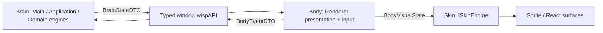

# Архитектурный бриф UI / Renderer

UX, ownership и межпроцессный обмен. Разметка, стили, размеры и композиция определены в [src/renderer/](../../src/renderer/), а не в этом контракте.

## 1. Поток данных и границы ответственности (Ownership)



| Область | Авторитетный владелец | Зона ответственности Renderer | Запрещено в Renderer |
|---|---|---|---|
| **Brain: поведение и состояние** | Main/Application + чистые Domain engines | Потребление ordered `BrainStateDTO`; отображение activity/mood/motion projection. | Вычисление `Needs`, планирование behavior/Activity, semantic FSM-переходы или ожидание Skin completion. |
| **Body: presentation и input** | Renderer `PetBodyController` | Локальный `BodyVisualState`, input capture, gaze и squash/stretch на RAF, cleanup. | Изменение Brain state, physics/position authority, frame-driven visual/reflex IPC и создание autonomy cadence. |
| **Skin: визуальный adapter** | Renderer-local `ISkinEngine` | Asset/fallback resolution, clip/frame timing и render resources. | IPC, semantic decisions, stimuli и доступ к Main/Application/Domain services. |
| **Окно и ОС** | Main + Platform Adapters | Отправка семантических намерений окна (изменение размера, режима). | Прямое управление нативным окном Electron, чтение переменных среды ОС или платформы. |
| **Позиция персонажа** | Motion Engine / Main | Отображение персонажа по координатам проекции. | Авторитетный расчёт физики движения, гравитации и кинематики. |
| **Типизированный мост** | Preload (`window.wispAPI`) | Вызов строго типизированных методов API и подписка на события. | Использование `ipcRenderer`, доступ к Node.js API, знание имён каналов IPC. |
| **Локальный UI-контекст** | React Surfaces | Черновик ввода чата, фокус, открытость меню/табов, ховер. | Превращение временного UI-состояния в персистентное без подтверждения Main. |

## 2. UX-принцип: Прозрачное окно-оверлей (Transparent Overlay)

Окно — transparent/frameless, без теней и taskbar, always-on-top. Базовые границы компактны: персонаж и мысли. Меню/chat/HUD расширяют нативную поверхность через Main без обрезки; всплывающие элементы привязаны к персонажу и clamped в `workArea`.

## 3. UX-принцип: Клик сквозь окно (Ignore Mouse Events)

Прозрачная неактивная область пропускает ввод: `window.setIgnoreMouseEvents(true, { forward: true })`. Захват (`setIgnoreMouseEvents(false)`) разрешён только над sprite/hitbox, Speech/Thought bubbles, chat input, menu/debug controls.

Левая кнопка на персонаже + порог смещения начинают Drag. Renderer захватывает pointer и передаёт normalized coordinates; перемещение окна, throw/fall physics принадлежат Motion Engine.

## 4. UX-принцип: Поведение контекстного меню (Context Menu)

Правый клик открывает меню и расширяет окно/включает interactive mode. Outside/backdrop click, `Escape` или terminal action закрывают его и возвращают компактное окно.

Группы действий: interactions (погладить/кормить/играть/думать), `sleep`/`wake`, autonomy movement, theme/expression/scale, reset position/always-on-top/quit. Debug HUD требует явного `debugEnabled`; в production исключён из render, не скрыт CSS.

## 5. Инварианты безопасности и приватности

Общие Electron/security правила — [AGENTS.md](../../AGENTS.md#3-безопасность-electron-и-ipc). Renderer не получает файлы, SQLite, system prompts, API-ключи или полный memory snapshot. User actions идут semantic DTO через `window.wispAPI`, без прямой мутации engines.

## 6. Brain → Body IPC

`BrainStateDTO` — единственный полный Main → Renderer state stream; `BodyEventDTO` — ограниченный input/observation stream обратно. Типы: [ipc-contracts.ts](../../src/shared/ipc-contracts.ts). Shared не импортирует Domain, React, DOM/canvas, Electron или Skin. Target declarations сами не включают runtime-каналы; cutover — §6.6.

### 6.1. Shared DTO

| Контракт / поле | Назначение | Инвариант |
|---|---|---|
| `BrainEmotionalToneDTO` | Синтезированный эмоциональный тон | Только literal variants, объявленные в canonical `.ts` файле. |
| `BrainVisualIntentKindDTO` | Семантический visual kind без asset key | Только kinds Animation Engine; manifest/clip names запрещены. |
| `BrainNeedsDTO.energy`, `attention`, `play`, `comfort`, `boredom` | Снимок шкал Character Engine | Каждое значение конечно и находится в `[0, 100]`. |
| `BrainActivityTimelineDTO.runId`, `activityId`, `phaseId`, `stage` | Идентичность run и текущей semantic-фазы | ID непустые; `stage` — `entering`, `looping` или `exiting`. |
| `BrainActivityTimelineDTO.startedAtMs`, `phaseStartedAtMs`, `phaseEndsAtMs` | Main-monotonic timeline Activity | Порядок времени задан в §6.2; `phaseEndsAtMs = null` только для causal phase. |
| `BrainMotionStateDTO.phase` | Authoritative physical phase | Только `dragged`, `airborne`, `grounded`. |
| `BrainMotionStateDTO.rootScreenPosition`, `velocityPxPerSec` | Authoritative root и velocity | Обе координаты конечны; Body их только отображает. |
| `BrainMotionStateDTO.positionAuthority` | Причина владения позицией | Только `forced` или `voluntary`; Skin не меняет authority. |

| `BrainStateDTO` поле | Назначение | Инвариант |
|---|---|---|
| `streamId` | Идентичность trusted subscription stream | Непустой ID до 128 символов; меняется при reload/replacement. |
| `revision` | Порядок полных snapshots | Положительный safe integer, строго возрастает внутри stream. |
| `sampledAtMs` | Main-monotonic момент снимка | Конечный, неотрицательный. |
| `character` | Needs и synthesized tone | Полная immutable Character projection. |
| `activity` | Текущая Activity timeline | `null` означает отсутствие active Activity. |
| `motion` | Authoritative motion projection | Полный `BrainMotionStateDTO`, не Renderer physics state. |
| `visualIntent` | Идентичность и семантика visual episode | Полный immutable `BrainVisualIntentDTO`; не содержит asset keys. |

| `BrainVisualIntentDTO` поле | Назначение | Инвариант |
|---|---|---|
| `episodeId`, `episodeStartedAtMs` | Идентичность и старт visual episode | ID уникален внутри stream; время использует Main-monotonic шкалу. |
| `kind`, `category` | Семантика и класс визуального намерения | Значения ограничены literal unions из canonical `.ts` файла. |
| `priority`, `interrupt`, `loop` | Visual arbitration policy | Body разрешает policy в renderer-local projection; Skin только отображает результат и не возвращает outcome в Brain. |
| `emotionalTone` | Тон Character Engine | Принадлежит `BrainEmotionalToneDTO`. |
| `expressionHint?`, `gazeDirection?`, `propHint?` | Необязательные presentation hints | Отсутствие или literal variant; не являются manifest keys. |

| `BodyEventDTO` поле / variant | Назначение | Инвариант |
|---|---|---|
| `streamId`, `sequence`, `basedOnRevision`, `observedAtMs` | Общая metadata каждого события | Current stream; возрастающая sequence; принятая Brain revision; Renderer-monotonic observation time. |
| `cursor_observed.screenPosition` | Текущая глобальная позиция курсора | Конечные координаты; cadence ограничен §6.3. |
| `interaction.interaction`, `intensity?` | Семантический user input | Допустимы `click`, `double_click`, `right_click`, `pet`, `play`, `feed`, `think`; intensity при наличии конечна в `[0, 1]`. |
| `drag_started` / `drag_moved`: `gestureId`, `pointerId`, `screenPosition` | Начало и latest drag sample | Gesture регистрируется только после valid start; pointer ID неотрицательный safe integer. |
| `drag_ended`: те же поля + `cancelled` | Терминальное событие gesture | Ровно один terminal event для active пары gesture/pointer. |
| `menu_visibility_changed.expanded` | Наблюдение состояния меню | Boolean; не является visual completion или behavior decision. |

`phaseEndsAtMs: null` допускает только Brain-owned causal event/interruption, не Skin completion. `visualIntent.kind` — семантика [Animation](ANIMATION_ENGINE.md), не manifest/clip key.

Brain создаёт непереиспользуемый внутри stream `episodeId` и фиксирует `episodeStartedAtMs` на каждом намеренном старте/replay: Activity visual phase, повторной direct/click reaction, landing, forced transition — даже при прежних visual fields и `activity: null`. Все поля одного `(streamId, episodeId)` immutable; Motion/Needs-only revision сохраняет episode. Только новая пара перезапускает base Skin playback. Brain завершает episode публикацией следующего episode/state, без visual outcome.

Body создаёт один `gestureId` на gesture (trimmed non-empty, до 128 символов). Main активирует его после valid `drag_started`; ID служит корреляции ввода, не даёт position authority и не заменяет `sequence`.

### 6.2. Время, revision и order

- Main генерирует opaque `streamId` (до 128 символов) для trusted document; reload/replacement создаёт новый stream с revision `1`.
- `revision` строго возрастает на каждую полную snapshot: положительный safe integer, gaps допустимы; равная/меньшая stale.
- Все Main timestamps конечны, неотрицательны, на одной monotonic шкале: `sampledAtMs`, `startedAtMs`, `phaseStartedAtMs`, `phaseEndsAtMs`, `episodeStartedAtMs`. Требуется `startedAtMs <= phaseStartedAtMs <= sampledAtMs`, для bounded active phase `sampledAtMs < phaseEndsAtMs` (иначе сначала transition), для episode `episodeStartedAtMs <= sampledAtMs`.
- `observedAtMs` — Renderer-monotonic `performance.now()`, только для порядка/диагностики внутри Body stream. Main ставит собственный receive time до mapping, не вычитает часы Renderer.
- До первого принятого snapshot Body не emits. Event несёт active stream, последнюю принятую `basedOnRevision`, следующий положительный safe-integer `sequence`; gaps допустимы, повторы/уменьшение stale.

Body принимает первый полный snapshot текущей subscription, далее только matching stream с `revision > lastAcceptedRevision`, атомарно и без partial patches. Изменённые поля уже принятого episode отклоняют **весь** snapshot: сохранить valid state и bounded protocol diagnostic. Новый stream допустим лишь через новый subscribe lifecycle со сбросом revision/sequence/resources.

`BodyVisualState.visualAgeMs = sampledAtMs - visualIntent.episodeStartedAtMs` — same-clock baseline нового episode. Далее Skin продвигает кадры по Renderer-monotonic delta; прежний episode не рестартует. Body/Skin не сравнивают Main time с `performance.now()`, не коррелируют по наличию Activity и не переключают semantic phase по `phaseEndsAtMs`.

### 6.3. Cadence и coalescing

- Brain публикует после committed semantic/Activity/Motion change и сразу при subscribe. Unchanged heartbeat запрещён; semantic/Activity/position-authority transitions разных transactions не теряются.
- Одна Application transaction → одна snapshot; physics substeps одного внешнего Motion tick также дают максимум одну snapshot.
- При backpressure только pending motion-only snapshots coalesce latest-wins; semantic/Activity/authority transitions сохраняют порядок. Revision gaps не скрывают semantic phase.
- `cursor_observed`: один Body refresh loop, независимо от RAF, `CURSOR_OBSERVATION_INTERVAL_MS = 100` (до 10 событий/с). Первый valid local sample после subscribe сразу; далее каждый 100-ms tick — latest position, даже неизменная, с новыми `observedAtMs`/`sequence`. Pointer moves заменяют pending position; delayed tick не делает catch-up burst.
- Остановить cursor refresh и очистить pending при `pointerleave`/`pointercancel`, hidden document/window teardown, drag, unsubscribe/unmount, stream replacement. Brain TTL делает sample stale без unavailable event. Это единственный допустимый unchanged Body refresh.
- `drag_moved` coalesce latest-wins максимум раз за Renderer frame. `drag_started`, `drag_ended`, `interaction`, `menu_visibility_changed` немедленны и не coalesce; sequence присваивается при фактической отправке.
- Skin RAF/clip completion/rejection/interruption локальны, не создают Body events и не задают Brain cadence.

### 6.4. Channels и Preload

```text
Main --wisp:brain-state(BrainStateDTO)--> onBrainState(listener) --> Body
Body --postBodyEvent(BodyEventDTO)--> wisp:body-event --> Main
```

Для этих потоков bridge предоставляет только `onBrainState(listener): () => void` и `postBodyEvent(event): Promise<void>`. Promise подтверждает validation/delivery, не semantic acceptance. Raw `ipcRenderer`, generic `send/on/invoke`, dynamic channels и Skin API через Preload запрещены.

### 6.5. Validation и stale-event policy

Обе стороны принимают `unknown`, валидируют plain non-null exact-shape object, копируют в новый DTO. Запрещены extra keys, prototype-bearing objects, methods/classes, cycles, `NaN`/`Infinity`, unknown enums; optional fields отсутствуют либо валидны. Needs/intensity: finite `[0, 100]`/`[0, 1]`; revision/sequence/`basedOnRevision`: positive safe integers; pointer ID: nonnegative safe integer; coordinates/velocity/timestamps: finite. Все ID, включая episode: trimmed non-empty до 128 символов.

Body проверяет immutable episode payload; Main — trusted current `webContents`. `think` — exact interaction literal, который Application маппит в candidate `BehaviorIntent<'think'>` через Character gating, не прямо в visual state.

Порядок Main validation:

1. Malformed/untrusted/foreign stream отклонить до Application.
2. `sequence <= lastAcceptedSequence` → idempotent no-op; gap допустим.
3. `basedOnRevision > currentRevision` → reject impossible future.
4. Старую revision перепроверить по **текущим** Character/Activity/Motion/menu/autonomy gates: accept/no-op/reject без восстановления старого state.
5. Drag сверить с active `gestureId`/`pointerId`; stimulus dedupe по `(streamId, sequence)`.

Валидный event остаётся input/observation. Brain принимает свои решения, не ждёт Body, не считает отсутствие event failure и не принимает visual outcome.

### 6.6. Атомарная миграция с legacy protocol

[AUTO-A06 #31](https://github.com/zyzycode/project_wisp/issues/31) superseded для animation-completion handshake. AUTO-I07 — единый runtime cutover, без compatibility bridge/feature flag:

1. Shared exact validators/mappers + `wisp:brain-state`/`wisp:body-event` + точечные Preload methods; в том же change-set Main publisher/Renderer consumer переходят с `PetPresentationStateDTO` на полный Brain state.
2. Удалить `AnimationLifecycleOutcomeDTO`, `AnimationLifecycleResultDTO`, `PetPresentationStateDTO.animationRequestId`, `notifyAnimationLifecycleResult`, lifecycle channel/handler, pending request/context и `ANIMATION_LIFECYCLE_WATCHDOG_MS`.
3. Без dual publish/subscribe, DTO adapter и Renderer-to-Main terminal outcomes. Первый snapshot после reload полностью восстанавливает Body/Skin.
4. AUTO-I09 одновременно переводит input producers на Body events и удаляет specialized drag/interaction/menu channels; до этого они только transitional input, не presentation/lifecycle protocol.
5. Отдельные typed sleep/wake, autonomy setting, system/window commands сохраняются; generic IPC не расширять.

Соседство target/legacy типов в shared до implementation merge не означает dual runtime protocol: переключение publishers/channels/consumers атомарно.

### 6.7. Последствия для Phase 14 slices

| Задача | Обязательное последствие |
|---|---|
| [AUTO-I07 #39](https://github.com/zyzycode/project_wisp/issues/39) | Exact DTO/validators/channels, удаление legacy handshake (§6.6). |
| [AUTO-I08 #41](https://github.com/zyzycode/project_wisp/issues/41) | ActivityRunner/Needs/stimuli — Main-monotonic loop, без Skin completion. |
| [AUTO-I09 #40](https://github.com/zyzycode/project_wisp/issues/40) | Body Controller/input migration; DesktopPet — composition root. |
| [AUTO-I10 #42](https://github.com/zyzycode/project_wisp/issues/42) | Renderer-local ISkinEngine/SpriteSkinAdapter, revision-based render update. |
| [AUTO-I02 #33](https://github.com/zyzycode/project_wisp/issues/33) | Local gaze сразу; semantic eligibility — только Brain по cursor refresh до 10 Hz. |
| [AUTO-I03 #34](https://github.com/zyzycode/project_wisp/issues/34) | Explore route/phase/history — Brain; клип не задерживает routine. |
| [AUTO-I04 #35](https://github.com/zyzycode/project_wisp/issues/35) | Climb/jump — Brain Activity + Motion route; Body/Skin отображают. |
| [AUTO-I05 #36](https://github.com/zyzycode/project_wisp/issues/36) | Geometry — Infrastructure/Main normalization, без native handles/platform types в Body/Skin. |
| [AUTO-I06 #37](https://github.com/zyzycode/project_wisp/issues/37) | Explore/Rest arbitration/route/sleep kind — Brain; fallback не меняет outcome. |

## AUTO-A09: quiet command и presentation

[SetQuietModeDTO, AutonomyModeDTO, QuietModeBridge, QuietModeBrainStateDTO](../../src/shared/ipc-contracts.ts) — target #49. При реализации `setQuietMode` становится обязательным в `WispApiBridge`, `autonomy.quiet` — в полном `BrainStateDTO`; временные interfaces сворачиваются в том же change-set. До #49 declarations не означают runtime capability.

Один Main invoke `wisp:set-quiet-mode` через typed Preload: trusted sender, exact `{ enabled: boolean }` без coercion/extra keys, применение в Brain transaction. Response — authoritative mode; UI читает quiet из ordered snapshot, включая первый/reload. Отдельных mode-event очередей/renderer-owned state нет; повтор boolean идемпотентен, без новой opportunity; invalid payload не мутирует state.

Toggle в существующем меню не включает sleep и не меняет autonomy enabled. Семантика/cancel — [Character §2.2](CHARACTER_ENGINE.md#22-устойчивый-quiet-auto-a09). Renderer не считает budget/cooldown/admission. Disable/menu pause — отдельные blockers, закрытие меню не снимает quiet. `dialogue.turn` отображает provider thinking без заморозки locomotion/Activity; AI ownership/trace внутренние, Renderer не меняет Brain lifecycle.
